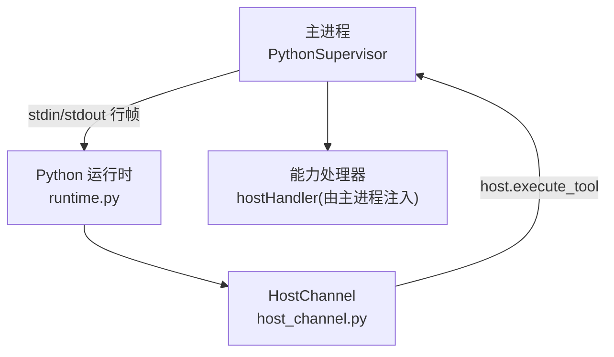
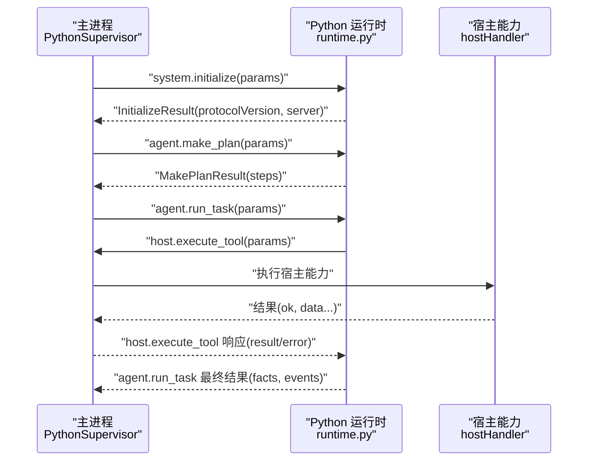
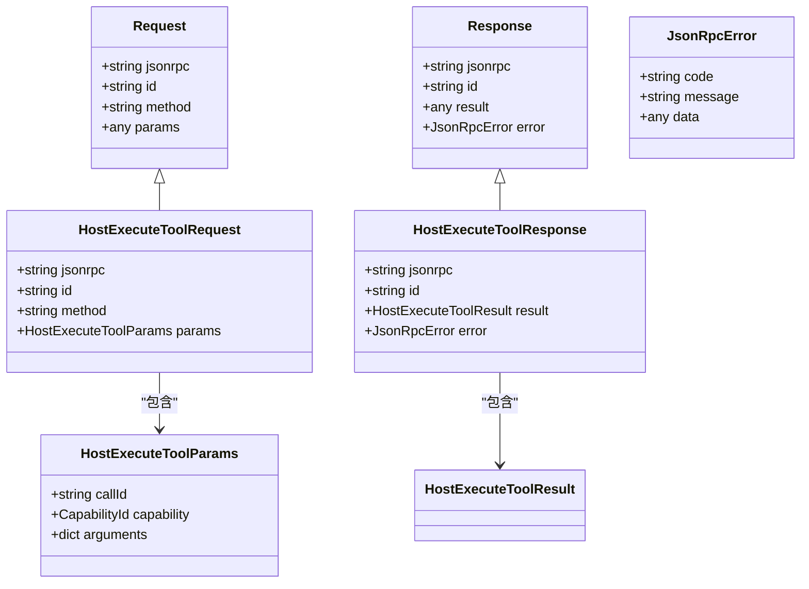

# JSON-RPC 协议

<cite>
**本文引用的文件**
- [envelope.ts](file://packages/protocol/schemas/envelope.ts)
- [host.ts](file://packages/protocol/schemas/host.ts)
- [agent.ts](file://packages/protocol/schemas/agent.ts)
- [models.py](file://services/agent-runtime/src/personal_agent/protocol/models.py)
- [runtime.py](file://services/agent-runtime/src/personal_agent/runtime.py)
- [host_channel.py](file://services/agent-runtime/src/personal_agent/host_channel.py)
- [python-supervisor.ts](file://apps/desktop/src/main/runtime/python-supervisor.ts)
- [initialize.request.json](file://packages/protocol/fixtures/initialize.request.json)
- [agent-run-task.request.json](file://packages/protocol/fixtures/agent-run-task.request.json)
- [host-execute-tool.request.json](file://packages/protocol/fixtures/host-execute-tool.request.json)
- [agent-run-task.completed.response.json](file://packages/protocol/fixtures/agent-run-task.completed.response.json)
- [host-execute-tool.response.json](file://packages/protocol/fixtures/host-execute-tool.response.json)
</cite>

## 目录
1. [简介](#简介)
2. [项目结构](#项目结构)
3. [核心组件](#核心组件)
4. [架构总览](#架构总览)
5. [详细组件分析](#详细组件分析)
6. [依赖关系分析](#依赖关系分析)
7. [性能与可靠性](#性能与可靠性)
8. [故障排查指南](#故障排查指南)
9. [结论](#结论)
10. [附录：消息格式示例](#附录消息格式示例)

## 简介
本文件定义主进程（Electron Main）与 Python 运行时服务之间的 JSON-RPC 通信规范。协议基于 JSON-RPC 2.0，采用“行帧”传输（每行一个 JSON 对象），通过标准输入/输出进行双向通信。文档涵盖消息信封、方法集合、请求-响应模式、流式事件处理、版本管理与兼容性策略，以及客户端与服务端实现要点（连接建立、错误处理、重连机制）。

## 项目结构
- 协议类型定义（TypeScript）位于 packages/protocol/schemas，使用 Zod 校验请求、响应、通知及具体方法载荷。
- 协议类型定义（Python）位于 services/agent-runtime/src/personal_agent/protocol/models.py，使用 Pydantic 模型。
- Python 运行时入口与调度逻辑在 runtime.py，负责解析请求、分发到具体处理器并写回响应。
- Python 侧对宿主能力调用封装在 host_channel.py，用于向 TS 反向发起 host.execute_tool。
- 主进程侧的 Python 进程管理、请求路由与超时控制在 python-supervisor.ts。

图表来源
- [python-supervisor.ts:96-120](file://apps/desktop/src/main/runtime/python-supervisor.ts#L96-L120)
- [runtime.py:185-244](file://services/agent-runtime/src/personal_agent/runtime.py#L185-L244)
- [host_channel.py:36-91](file://services/agent-runtime/src/personal_agent/host_channel.py#L36-L91)

章节来源
- [envelope.ts:1-41](file://packages/protocol/schemas/envelope.ts#L1-L41)
- [models.py:1-368](file://services/agent-runtime/src/personal_agent/protocol/models.py#L1-L368)
- [runtime.py:67-182](file://services/agent-runtime/src/personal_agent/runtime.py#L67-L182)
- [python-supervisor.ts:122-194](file://apps/desktop/src/main/runtime/python-supervisor.ts#L122-L194)

## 核心组件
- 消息信封：jsonrpc、id、method、params；响应包含 result 或 error（二者互斥）。
- 系统方法：system.initialize、system.ping。
- Agent 方法：agent.make_plan、agent.run_task。
- 宿主能力调用：host.execute_tool（Python → TS 的反向 RPC）。
- 流式事件：agent.run_task 的结果中包含 events 数组，承载执行过程中的中间事件。

章节来源
- [envelope.ts:5-40](file://packages/protocol/schemas/envelope.ts#L5-L40)
- [agent.ts:4-138](file://packages/protocol/schemas/agent.ts#L4-L138)
- [host.ts:3-76](file://packages/protocol/schemas/host.ts#L3-L76)
- [models.py:64-368](file://services/agent-runtime/src/personal_agent/protocol/models.py#L64-L368)

## 架构总览
主进程通过子进程方式启动 Python 运行时，双方以“行帧”JSON-RPC 通信。握手阶段由主进程发送 system.initialize，携带协议版本与能力清单；Python 返回 InitializeResult 确认协议版本与服务器信息。随后主进程可调用 agent.make_plan 生成计划，再调用 agent.run_task 触发任务执行。任务执行过程中，Python 可能通过 host.execute_tool 反向请求主进程执行宿主能力（如文件系统操作、PDF 提取等），主进程将结果回传给 Python。最终，agent.run_task 返回包含 facts 与 events 的最终结果。

图表来源
- [python-supervisor.ts:122-194](file://apps/desktop/src/main/runtime/python-supervisor.ts#L122-L194)
- [runtime.py:107-182](file://services/agent-runtime/src/personal_agent/runtime.py#L107-L182)
- [host_channel.py:45-85](file://services/agent-runtime/src/personal_agent/host_channel.py#L45-L85)

## 详细组件分析

### 消息信封与版本
- 所有消息必须包含 jsonrpc: "2.0"。
- 请求必须包含 id（字符串且非空）、method（符合命名规范）、params（任意）。
- 响应必须包含 id，且 result 与 error 二选一。
- 通知不包含 id，仅包含 method 和 params。
- 协议版本在 initialize 中协商，当前为 "0.1"。

章节来源
- [envelope.ts:5-40](file://packages/protocol/schemas/envelope.ts#L5-L40)
- [models.py:14-38](file://services/agent-runtime/src/personal_agent/protocol/models.py#L14-L38)
- [runtime.py:107-123](file://services/agent-runtime/src/personal_agent/runtime.py#L107-L123)

### 系统方法
- system.initialize：主进程向 Python 发送初始化参数（协议版本、能力清单、客户端信息），Python 返回 InitializeResult（协议版本、服务器信息）。
- system.ping：健康检查，返回空结果。

章节来源
- [initialize.request.json:1-22](file://packages/protocol/fixtures/initialize.request.json#L1-L22)
- [runtime.py:75-123](file://services/agent-runtime/src/personal_agent/runtime.py#L75-L123)
- [models.py:64-162](file://services/agent-runtime/src/personal_agent/protocol/models.py#L64-L162)

### Agent 方法
- agent.make_plan：根据目标 goal 与可见能力清单生成步骤计划。返回 MakePlanResult（steps 至少一项）。
- agent.run_task：触发任务执行。返回 RunTaskResult，包含 status（completed/failed）、facts（摘要事实）、events（执行事件）。

章节来源
- [agent.ts:4-138](file://packages/protocol/schemas/agent.ts#L4-L138)
- [runtime.py:126-182](file://services/agent-runtime/src/personal_agent/runtime.py#L126-L182)
- [models.py:264-320](file://services/agent-runtime/src/personal_agent/protocol/models.py#L264-L320)

### 宿主能力调用（host.execute_tool）
- 方向：Python → 主进程。
- 请求字段：callId（唯一标识）、capability（能力名）、arguments（键值参数）。
- 响应：result.ok 表示是否成功；若失败，error.code/message 描述系统级错误；业务失败通过 ok:false 的 result 表达。
- 主进程通过注入的 hostHandler 执行具体能力（如 filesystem.list、document.extract_pdf 等）。

章节来源
- [host.ts:3-76](file://packages/protocol/schemas/host.ts#L3-L76)
- [host_channel.py:45-85](file://services/agent-runtime/src/personal_agent/host_channel.py#L45-L85)
- [python-supervisor.ts:244-300](file://apps/desktop/src/main/runtime/python-supervisor.ts#L244-L300)
- [models.py:75-126](file://services/agent-runtime/src/personal_agent/protocol/models.py#L75-L126)

### 流式响应与事件
- agent.run_task 的返回结果包含 events 数组，每个事件包含 type、payload、occurredAt（ISO 时间戳）。
- 典型事件包括 tool_called、tool_result、task_completed 等，用于记录工具调用与任务完成过程。
- 事件作为最终结果的一部分一次性返回，并非逐条推送；如需实时展示，可在上层消费时按 occurredAt 排序渲染。

章节来源
- [agent.ts:68-98](file://packages/protocol/schemas/agent.ts#L68-L98)
- [agent-run-task.completed.response.json:1-35](file://packages/protocol/fixtures/agent-run-task.completed.response.json#L1-L35)
- [models.py:264-295](file://services/agent-runtime/src/personal_agent/protocol/models.py#L264-L295)

### 错误处理
- 请求不合法：返回 error.code="PROTOCOL_INVALID_REQUEST" 或 "PROTOCOL_INVALID_JSON"。
- 未知方法：返回 error.code="METHOD_NOT_FOUND"。
- 运行时内部错误：返回 error.code="RUNTIME_INTERNAL"。
- 未配置模型：返回 error.code="RUNTIME_MODEL_NOT_CONFIGURED"。
- 计划不可构建：返回 error.code="PLAN_NOT_BUILDABLE"。
- 宿主能力超时：返回 error.code="HOST_TIMEOUT"。
- 宿主处理器异常：返回 error.code="HOST_HANDLER_FAILED"。
- 子进程崩溃：主进程拒绝后续请求并上报 runtime.crashed 事件。

章节来源
- [runtime.py:63-91](file://services/agent-runtime/src/personal_agent/runtime.py#L63-L91)
- [runtime.py:156-182](file://services/agent-runtime/src/personal_agent/runtime.py#L156-L182)
- [python-supervisor.ts:150-194](file://apps/desktop/src/main/runtime/python-supervisor.ts#L150-L194)
- [python-supervisor.ts:244-300](file://apps/desktop/src/main/runtime/python-supervisor.ts#L244-L300)
- [python-supervisor.ts:318-331](file://apps/desktop/src/main/runtime/python-supervisor.ts#L318-L331)

## 依赖关系分析
- TypeScript 协议层（Zod）与 Python 协议层（Pydantic）保持字段一致，确保两端校验行为对齐。
- 主进程通过 PythonSupervisor 管理子进程生命周期、请求路由、超时与错误传播。
- Python 运行时通过 HostChannel 封装对宿主能力的反向调用，严格匹配 callId 并处理 EOF、非法 JSON、协议校验失败等边界情况。

图表来源
- [models.py:8-38](file://services/agent-runtime/src/personal_agent/protocol/models.py#L8-L38)
- [models.py:75-126](file://services/agent-runtime/src/personal_agent/protocol/models.py#L75-L126)

章节来源
- [models.py:1-368](file://services/agent-runtime/src/personal_agent/protocol/models.py#L1-L368)
- [python-supervisor.ts:66-120](file://apps/desktop/src/main/runtime/python-supervisor.ts#L66-L120)
- [host_channel.py:36-91](file://services/agent-runtime/src/personal_agent/host_channel.py#L36-L91)

## 性能与可靠性
- 传输效率：行帧 JSON 结构简单，易于流式处理；避免大对象频繁序列化开销。
- 超时控制：主进程为每次请求设置默认超时，宿主能力调用有独立超时；防止阻塞。
- 健壮性：两端均进行严格的协议校验；Python 侧对非法 JSON 丢弃并继续等待；EOF 时优雅退出。
- 可扩展性：能力清单通过 initialize 下发，便于按需启用功能；新增能力只需扩展 CapabilityId 与 hostHandler。

[本节为通用指导，无需特定文件引用]

## 故障排查指南
- 握手失败：检查 initialize 参数是否符合契约（协议版本、能力清单、客户端信息）。
- 未知方法：确认 method 名称正确且已实现。
- 请求无效：检查 id、method、params 是否符合 schema。
- 运行时内部错误：查看 Python 日志定位异常堆栈。
- 未配置模型：设置环境变量 PERSONAL_AGENT_SCRIPT 指向脚本路径。
- 计划不可构建：检查能力清单是否覆盖计划所需能力。
- 宿主能力超时：调整 hostTimeoutMs 或优化宿主处理器性能。
- 子进程崩溃：监听 runtime.crashed 事件，重启子进程并重试。

章节来源
- [runtime.py:107-182](file://services/agent-runtime/src/personal_agent/runtime.py#L107-L182)
- [python-supervisor.ts:122-194](file://apps/desktop/src/main/runtime/python-supervisor.ts#L122-L194)
- [python-supervisor.ts:318-331](file://apps/desktop/src/main/runtime/python-supervisor.ts#L318-L331)

## 结论
本协议以 JSON-RPC 2.0 为基础，通过行帧传输实现主进程与 Python 运行时的可靠通信。协议明确了消息信封、方法集合、错误码与版本管理，支持宿主能力反向调用与任务执行事件。实现上，两端均提供严格的校验与完善的错误处理，确保稳定性与可维护性。建议在实际使用中遵循本规范，结合超时、重试与监控策略，构建健壮的自动化代理系统。

[本节为总结，无需特定文件引用]

## 附录：消息格式示例
- 初始化请求：参见 [initialize.request.json:1-22](file://packages/protocol/fixtures/initialize.request.json#L1-L22)。
- 任务执行请求：参见 [agent-run-task.request.json:1-10](file://packages/protocol/fixtures/agent-run-task.request.json#L1-L10)。
- 宿主能力调用请求：参见 [host-execute-tool.request.json:1-13](file://packages/protocol/fixtures/host-execute-tool.request.json#L1-L13)。
- 任务完成响应：参见 [agent-run-task.completed.response.json:1-35](file://packages/protocol/fixtures/agent-run-task.completed.response.json#L1-L35)。
- 宿主能力调用响应：参见 [host-execute-tool.response.json:1-18](file://packages/protocol/fixtures/host-execute-tool.response.json#L1-L18)。

章节来源
- [initialize.request.json:1-22](file://packages/protocol/fixtures/initialize.request.json#L1-L22)
- [agent-run-task.request.json:1-10](file://packages/protocol/fixtures/agent-run-task.request.json#L1-L10)
- [host-execute-tool.request.json:1-13](file://packages/protocol/fixtures/host-execute-tool.request.json#L1-L13)
- [agent-run-task.completed.response.json:1-35](file://packages/protocol/fixtures/agent-run-task.completed.response.json#L1-L35)
- [host-execute-tool.response.json:1-18](file://packages/protocol/fixtures/host-execute-tool.response.json#L1-L18)