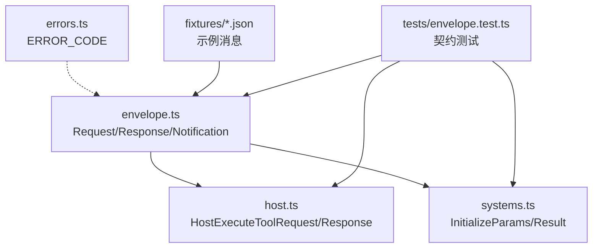
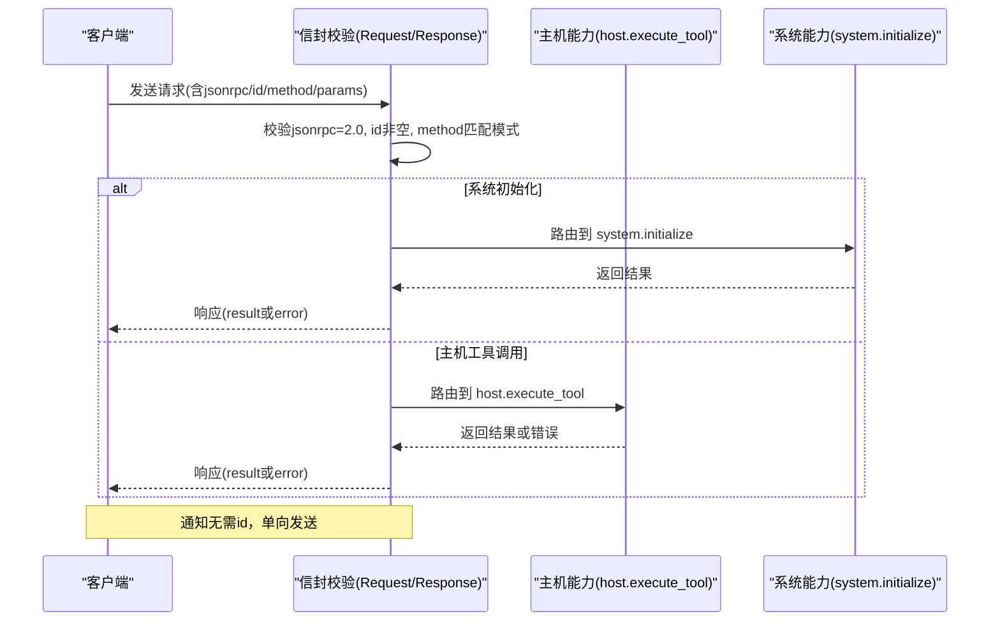
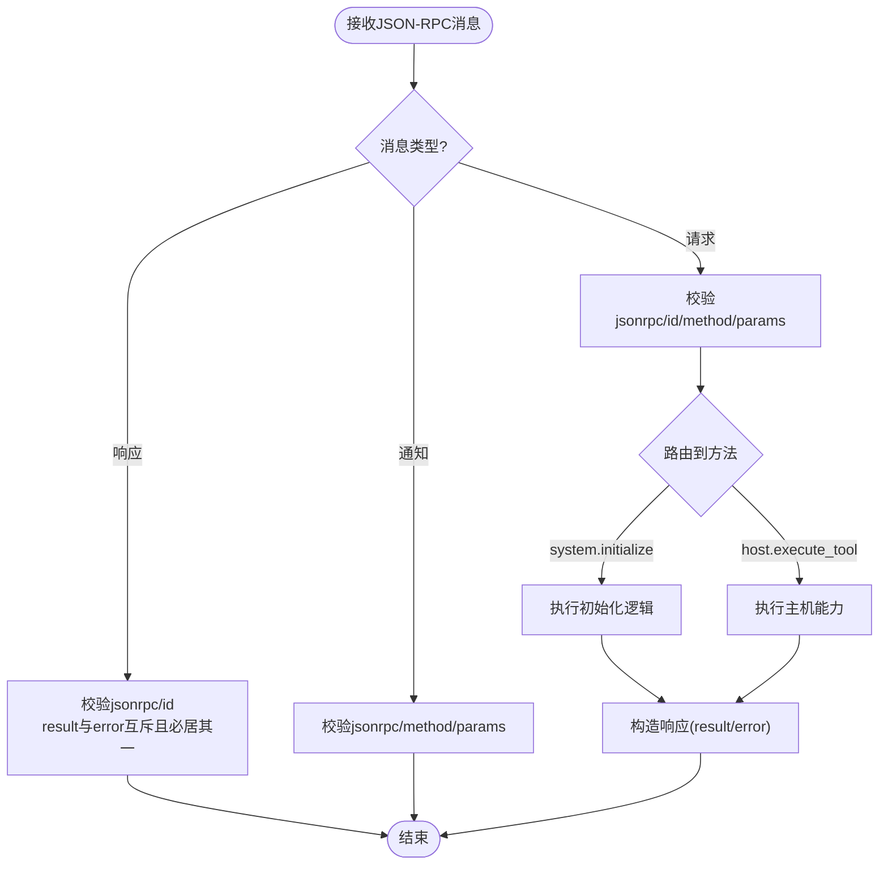
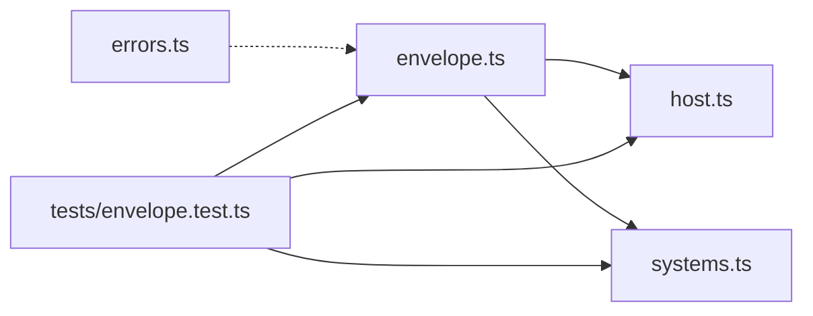

# 消息信封结构

<cite>
**本文引用的文件**
- [packages/protocol/schemas/envelope.ts](file://packages/protocol/schemas/envelope.ts)
- [packages/protocol/schemas/host.ts](file://packages/protocol/schemas/host.ts)
- [packages/protocol/schemas/systems.ts](file://packages/protocol/schemas/systems.ts)
- [packages/protocol/schemas/errors.ts](file://packages/protocol/schemas/errors.ts)
- [packages/protocol/fixtures/ping.request.json](file://packages/protocol/fixtures/ping.request.json)
- [packages/protocol/fixtures/ping.response.json](file://packages/protocol/fixtures/ping.response.json)
- [packages/protocol/fixtures/host-execute-tool.request.json](file://packages/protocol/fixtures/host-execute-tool.request.json)
- [packages/protocol/fixtures/host-execute-tool.response.json](file://packages/protocol/fixtures/host-execute-tool.response.json)
- [packages/protocol/fixtures/host-execute-tool.failure.response.json](file://packages/protocol/fixtures/host-execute-tool.failure.response.json)
- [packages/protocol/fixtures/initialize.request.json](file://packages/protocol/fixtures/initialize.request.json)
- [packages/protocol/fixtures/agent-make-plan.request.json](file://packages/protocol/fixtures/agent-make-plan.request.json)
- [packages/protocol/fixtures/host-filesystem-list.request.json](file://packages/protocol/fixtures/host-filesystem-list.request.json)
- [packages/protocol/fixtures/host-filesystem-list.response.json](file://packages/protocol/fixtures/host-filesystem-list.response.json)
- [packages/protocol/fixtures/invalid/response-both-result-and-error.json](file://packages/protocol/fixtures/invalid/response-both-result-and-error.json)
- [packages/protocol/fixtures/invalid/request-bad-method.json](file://packages/protocol/fixtures/invalid/request-bad-method.json)
- [packages/protocol/tests/envelope.test.ts](file://packages/protocol/tests/envelope.test.ts)
</cite>

## 目录
1. [简介](#简介)
2. [项目结构](#项目结构)
3. [核心组件](#核心组件)
4. [架构总览](#架构总览)
5. [详细组件分析](#详细组件分析)
6. [依赖关系分析](#依赖关系分析)
7. [性能考虑](#性能考虑)
8. [故障排查指南](#故障排查指南)
9. [结论](#结论)
10. [附录](#附录)

## 简介
本文件围绕 JSON-RPC 消息“信封”结构，系统化说明请求、响应与通知三种消息类型的字段定义、校验规则与使用方式。重点覆盖：
- jsonrpc 版本标识
- id 唯一标识符
- method 方法名模式与命名规范
- params 参数传递机制
- 响应中 result 与 error 的互斥约束
- 错误对象结构（code、message、data）
- 完整消息格式示例与场景化展示
- 序列化与反序列化的最佳实践

## 项目结构
协议层以 TypeScript + Zod 的形式定义并验证消息信封与业务载荷，配合 fixtures 中的 JSON 样例进行契约测试。关键位置：
- 信封与通用规则：schemas/envelope.ts
- 主机能力调用封装：schemas/host.ts
- 系统初始化相关：schemas/systems.ts
- 错误码常量：schemas/errors.ts
- 示例消息：fixtures/*.json
- 契约测试：tests/envelope.test.ts

图表来源
- [packages/protocol/schemas/envelope.ts:1-41](file://packages/protocol/schemas/envelope.ts#L1-L41)
- [packages/protocol/schemas/host.ts:1-76](file://packages/protocol/schemas/host.ts#L1-L76)
- [packages/protocol/schemas/systems.ts:1-22](file://packages/protocol/schemas/systems.ts#L1-L22)
- [packages/protocol/schemas/errors.ts:1-30](file://packages/protocol/schemas/errors.ts#L1-L30)
- [packages/protocol/tests/envelope.test.ts:1-591](file://packages/protocol/tests/envelope.test.ts#L1-L591)

章节来源
- [packages/protocol/schemas/envelope.ts:1-41](file://packages/protocol/schemas/envelope.ts#L1-L41)
- [packages/protocol/schemas/host.ts:1-76](file://packages/protocol/schemas/host.ts#L1-L76)
- [packages/protocol/schemas/systems.ts:1-22](file://packages/protocol/schemas/systems.ts#L1-L22)
- [packages/protocol/schemas/errors.ts:1-30](file://packages/protocol/schemas/errors.ts#L1-L30)
- [packages/protocol/tests/envelope.test.ts:1-591](file://packages/protocol/tests/envelope.test.ts#L1-L591)

## 核心组件
- 请求（Request）
  - 固定字段：jsonrpc="2.0"、id（非空字符串）、method（符合命名模式）、params（任意类型）
- 响应（Response）
  - 固定字段：jsonrpc="2.0"、id（非空字符串）
  - 结果或错误二选一：result（可选）、error（可选），二者不可同时出现，也不可同时缺失
  - 错误对象：code（字符串）、message（字符串）、data（可选）
- 通知（Notification）
  - 无 id；包含 jsonrpc="2.0"、method（符合命名模式）、params（任意类型）

章节来源
- [packages/protocol/schemas/envelope.ts:1-41](file://packages/protocol/schemas/envelope.ts#L1-L41)

## 架构总览
下图展示了从客户端发起请求到服务端返回响应的端到端流程，以及通知的单向广播路径。

图表来源
- [packages/protocol/schemas/envelope.ts:1-41](file://packages/protocol/schemas/envelope.ts#L1-L41)
- [packages/protocol/schemas/host.ts:1-76](file://packages/protocol/schemas/host.ts#L1-L76)
- [packages/protocol/schemas/systems.ts:1-22](file://packages/protocol/schemas/systems.ts#L1-L22)

## 详细组件分析

### 请求消息（Request）
- 字段
  - jsonrpc: 固定为 "2.0"
  - id: 非空字符串，用于关联请求与响应
  - method: 必须匹配命名模式
  - params: 任意类型，承载具体参数
- 方法名模式
  - 由正则约束：以小写字母开头，后续可包含小写字母、数字和下划线，并以点号分隔的多段组成（至少两段）
  - 示例：system.initialize、host.execute_tool、agent.make_plan
- 典型示例
  - 系统初始化请求：参见 initialize.request.json
  - Ping 请求：参见 ping.request.json
  - 主机工具调用请求：参见 host-execute-tool.request.json、host-filesystem-list.request.json
  - Agent 计划请求：参见 agent-make-plan.request.json

章节来源
- [packages/protocol/schemas/envelope.ts:1-41](file://packages/protocol/schemas/envelope.ts#L1-L41)
- [packages/protocol/fixtures/initialize.request.json:1-22](file://packages/protocol/fixtures/initialize.request.json#L1-L22)
- [packages/protocol/fixtures/ping.request.json:1-7](file://packages/protocol/fixtures/ping.request.json#L1-L7)
- [packages/protocol/fixtures/host-execute-tool.request.json:1-13](file://packages/protocol/fixtures/host-execute-tool.request.json#L1-L13)
- [packages/protocol/fixtures/host-filesystem-list.request.json:1-13](file://packages/protocol/fixtures/host-filesystem-list.request.json#L1-L13)
- [packages/protocol/fixtures/agent-make-plan.request.json:1-10](file://packages/protocol/fixtures/agent-make-plan.request.json#L1-L10)

### 响应消息（Response）
- 字段
  - jsonrpc: 固定为 "2.0"
  - id: 与请求对应的非空字符串
  - result 与 error 互斥且必居其一
- 成功响应
  - 携带 result，内容取决于具体方法
  - 示例：ping.response.json、host-execute-tool.response.json
- 失败响应
  - 携带 error，包含 code、message、data（可选）
  - 注意：某些业务失败通过 result.ok=false 表达（如 host-execute-tool.failure.response.json），并非走 error 字段
- 非法示例
  - 同时包含 result 和 error：参见 invalid/response-both-result-and-error.json

章节来源
- [packages/protocol/schemas/envelope.ts:1-41](file://packages/protocol/schemas/envelope.ts#L1-L41)
- [packages/protocol/fixtures/ping.response.json:1-6](file://packages/protocol/fixtures/ping.response.json#L1-L6)
- [packages/protocol/fixtures/host-execute-tool.response.json:1-18](file://packages/protocol/fixtures/host-execute-tool.response.json#L1-L18)
- [packages/protocol/fixtures/host-execute-tool.failure.response.json:1-10](file://packages/protocol/fixtures/host-execute-tool.failure.response.json#L1-L10)
- [packages/protocol/fixtures/invalid/response-both-result-and-error.json:1-7](file://packages/protocol/fixtures/invalid/response-both-result-and-error.json#L1-L7)

### 通知消息（Notification）
- 无 id 字段
- 包含 jsonrpc="2.0"、method（符合命名模式）、params（任意类型）
- 适用于单向事件上报等场景

章节来源
- [packages/protocol/schemas/envelope.ts:1-41](file://packages/protocol/schemas/envelope.ts#L1-L41)

### 主机能力调用封装（host.execute_tool）
- 请求
  - method 字面量为 "host.execute_tool"
  - id 需匹配特定模式（call-数字）
  - params 包含 callId、capability（枚举白名单）、arguments（键值对）
- 响应
  - 同样要求 result 与 error 互斥
  - 成功时 result 包含 ok 布尔位；业务失败可通过 result.ok=false 表达
- 能力白名单
  - filesystem.list、document.extract_pdf、filesystem.create_dir、filesystem.move、scheduler.create、notification.send

章节来源
- [packages/protocol/schemas/host.ts:1-76](file://packages/protocol/schemas/host.ts#L1-L76)
- [packages/protocol/fixtures/host-execute-tool.request.json:1-13](file://packages/protocol/fixtures/host-execute-tool.request.json#L1-L13)
- [packages/protocol/fixtures/host-execute-tool.response.json:1-18](file://packages/protocol/fixtures/host-execute-tool.response.json#L1-L18)
- [packages/protocol/fixtures/host-execute-tool.failure.response.json:1-10](file://packages/protocol/fixtures/host-execute-tool.failure.response.json#L1-L10)
- [packages/protocol/fixtures/host-filesystem-list.request.json:1-13](file://packages/protocol/fixtures/host-filesystem-list.request.json#L1-L13)
- [packages/protocol/fixtures/host-filesystem-list.response.json:1-22](file://packages/protocol/fixtures/host-filesystem-list.response.json#L1-L22)

### 系统初始化（system.initialize）
- 请求参数 InitializeParams
  - protocolVersion 固定为 "0.1"
  - capabilities 数组，每项包含 name（能力ID）、kind（READ/WRITE）、description（非空）
  - client 包含 name、version
- 响应 InitializeResult
  - protocolVersion 固定为 "0.1"
  - server 包含 name、version

章节来源
- [packages/protocol/schemas/systems.ts:1-22](file://packages/protocol/schemas/systems.ts#L1-L22)
- [packages/protocol/fixtures/initialize.request.json:1-22](file://packages/protocol/fixtures/initialize.request.json#L1-L22)

### 方法名命名规范与验证
- 通用模式
  - 以小写字母开头，后续允许小写字母、数字、下划线，并以点号分隔的多段（至少两段）
  - 示例：system.initialize、host.execute_tool、agent.make_plan
- 特殊限制
  - host.execute_tool 的 method 为字面量固定值
  - id 在 host 侧需匹配 call-数字 的模式
- 非法示例
  - 大小写不合规的方法名将被拒绝：参见 invalid/request-bad-method.json

章节来源
- [packages/protocol/schemas/envelope.ts:1-41](file://packages/protocol/schemas/envelope.ts#L1-L41)
- [packages/protocol/schemas/host.ts:1-76](file://packages/protocol/schemas/host.ts#L1-L76)
- [packages/protocol/fixtures/invalid/request-bad-method.json:1-7](file://packages/protocol/fixtures/invalid/request-bad-method.json#L1-L7)

### 参数与结果的数据流
- 请求参数
  - 通用 Request.params 为任意类型，具体语义由各方法的 payload schema 约束
  - 主机能力调用的 arguments 为键值对，承载具体能力入参
- 响应结果
  - 通用 Response.result 为任意类型，具体语义由各方法的 payload schema 约束
  - 主机能力调用通过 result.ok 表达成功/失败，失败时可附带 code、reason 等业务信息

图表来源
- [packages/protocol/schemas/envelope.ts:1-41](file://packages/protocol/schemas/envelope.ts#L1-L41)
- [packages/protocol/schemas/host.ts:1-76](file://packages/protocol/schemas/host.ts#L1-L76)
- [packages/protocol/schemas/systems.ts:1-22](file://packages/protocol/schemas/systems.ts#L1-L22)

## 依赖关系分析
- envelope.ts 定义了通用的 Request/Response/Notification 及方法名模式
- host.ts 基于通用规则扩展出 host.execute_tool 的请求/响应，并定义能力白名单
- systems.ts 定义初始化相关的参数与结果
- errors.ts 集中管理错误码常量，便于上层统一处理
- tests/envelope.test.ts 通过 fixtures 验证合法/非法消息的接受与拒绝行为

图表来源
- [packages/protocol/schemas/envelope.ts:1-41](file://packages/protocol/schemas/envelope.ts#L1-L41)
- [packages/protocol/schemas/host.ts:1-76](file://packages/protocol/schemas/host.ts#L1-L76)
- [packages/protocol/schemas/systems.ts:1-22](file://packages/protocol/schemas/systems.ts#L1-L22)
- [packages/protocol/schemas/errors.ts:1-30](file://packages/protocol/schemas/errors.ts#L1-L30)
- [packages/protocol/tests/envelope.test.ts:1-591](file://packages/protocol/tests/envelope.test.ts#L1-L591)

章节来源
- [packages/protocol/schemas/envelope.ts:1-41](file://packages/protocol/schemas/envelope.ts#L1-L41)
- [packages/protocol/schemas/host.ts:1-76](file://packages/protocol/schemas/host.ts#L1-L76)
- [packages/protocol/schemas/systems.ts:1-22](file://packages/protocol/schemas/systems.ts#L1-L22)
- [packages/protocol/schemas/errors.ts:1-30](file://packages/protocol/schemas/errors.ts#L1-L30)
- [packages/protocol/tests/envelope.test.ts:1-591](file://packages/protocol/tests/envelope.test.ts#L1-L591)

## 性能考虑
- 使用轻量级 schema 校验（Zod）在边界处快速失败，减少无效数据进入业务层
- 将复杂 payload 的校验下沉到各方法的专用 schema，避免在 envelope 层重复校验
- 合理拆分请求/响应，避免过大的 params/result 导致序列化开销增大
- 对高频短消息（如 ping）保持最小负载

## 故障排查指南
- 常见错误与定位
  - 方法名不合法：检查是否满足“小写字母开头、多段点分”的模式；参考 invalid/request-bad-method.json
  - 响应同时包含 result 与 error：违反互斥规则；参考 invalid/response-both-result-and-error.json
  - host 侧 id 不符合 call-数字 模式：检查 id 生成规则
  - 能力不在白名单：检查 capability 是否在 host.execute_tool 的枚举中
- 调试建议
  - 使用 tests/envelope.test.ts 中的用例思路，对本地 fixture 进行解析断言
  - 逐步缩小问题范围：先校验 envelope，再校验 payload

章节来源
- [packages/protocol/fixtures/invalid/request-bad-method.json:1-7](file://packages/protocol/fixtures/invalid/request-bad-method.json#L1-L7)
- [packages/protocol/fixtures/invalid/response-both-result-and-error.json:1-7](file://packages/protocol/fixtures/invalid/response-both-result-and-error.json#L1-L7)
- [packages/protocol/schemas/host.ts:1-76](file://packages/protocol/schemas/host.ts#L1-L76)
- [packages/protocol/tests/envelope.test.ts:1-591](file://packages/protocol/tests/envelope.test.ts#L1-L591)

## 结论
本项目通过 Zod schema 严格定义了 JSON-RPC 信封结构与业务载荷，确保跨语言、跨进程通信的一致性与可维护性。遵循方法名规范、id 唯一性、result/error 互斥等规则，并结合 fixtures 与自动化测试，可有效降低协议漂移风险。

## 附录

### 完整消息示例索引
- 系统初始化请求：initialize.request.json
- Ping 请求/响应：ping.request.json、ping.response.json
- 主机工具调用请求/响应：host-execute-tool.request.json、host-execute-tool.response.json
- 主机工具调用业务失败响应：host-execute-tool.failure.response.json
- 文件系统列表请求/响应：host-filesystem-list.request.json、host-filesystem-list.response.json
- Agent 计划请求：agent-make-plan.request.json

章节来源
- [packages/protocol/fixtures/initialize.request.json:1-22](file://packages/protocol/fixtures/initialize.request.json#L1-L22)
- [packages/protocol/fixtures/ping.request.json:1-7](file://packages/protocol/fixtures/ping.request.json#L1-L7)
- [packages/protocol/fixtures/ping.response.json:1-6](file://packages/protocol/fixtures/ping.response.json#L1-L6)
- [packages/protocol/fixtures/host-execute-tool.request.json:1-13](file://packages/protocol/fixtures/host-execute-tool.request.json#L1-L13)
- [packages/protocol/fixtures/host-execute-tool.response.json:1-18](file://packages/protocol/fixtures/host-execute-tool.response.json#L1-L18)
- [packages/protocol/fixtures/host-execute-tool.failure.response.json:1-10](file://packages/protocol/fixtures/host-execute-tool.failure.response.json#L1-L10)
- [packages/protocol/fixtures/host-filesystem-list.request.json:1-13](file://packages/protocol/fixtures/host-filesystem-list.request.json#L1-L13)
- [packages/protocol/fixtures/host-filesystem-list.response.json:1-22](file://packages/protocol/fixtures/host-filesystem-list.response.json#L1-L22)
- [packages/protocol/fixtures/agent-make-plan.request.json:1-10](file://packages/protocol/fixtures/agent-make-plan.request.json#L1-L10)

### 序列化与反序列化最佳实践
- 序列化
  - 始终包含 jsonrpc="2.0"
  - 请求必须提供非空 id；通知不提供 id
  - method 严格遵循命名模式；host.execute_tool 使用字面量
  - params 按对应方法的 payload schema 构造，避免多余字段
- 反序列化
  - 先解析 envelope，再解析 payload，逐层校验
  - 对响应优先判断是否存在 error，否则取 result
  - 对 host.execute_tool 响应，结合 result.ok 与业务字段综合判断
- 错误处理
  - 使用 errors.ts 中的错误码常量，保证一致性
  - 对于业务失败（如 PDF 损坏），按约定通过 result.ok=false 表达，而非 error

章节来源
- [packages/protocol/schemas/envelope.ts:1-41](file://packages/protocol/schemas/envelope.ts#L1-L41)
- [packages/protocol/schemas/host.ts:1-76](file://packages/protocol/schemas/host.ts#L1-L76)
- [packages/protocol/schemas/errors.ts:1-30](file://packages/protocol/schemas/errors.ts#L1-L30)
- [packages/protocol/fixtures/host-execute-tool.failure.response.json:1-10](file://packages/protocol/fixtures/host-execute-tool.failure.response.json#L1-L10)
- [packages/protocol/tests/envelope.test.ts:1-591](file://packages/protocol/tests/envelope.test.ts#L1-L591)