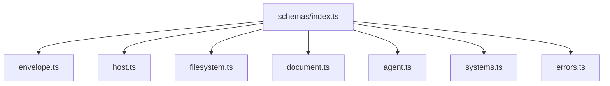
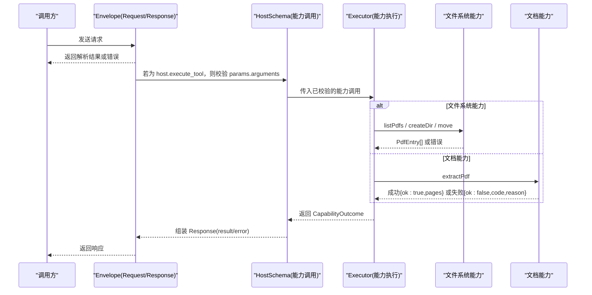
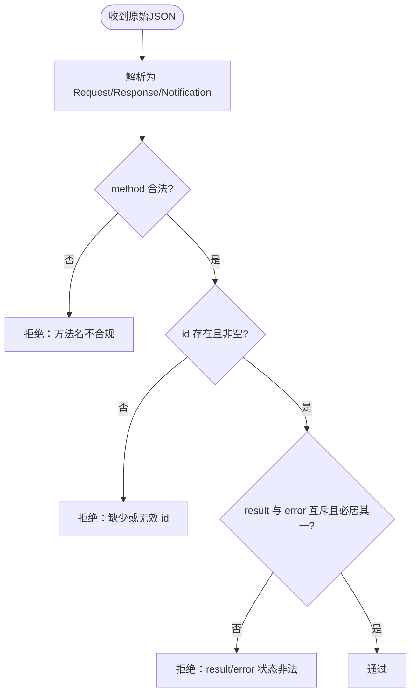
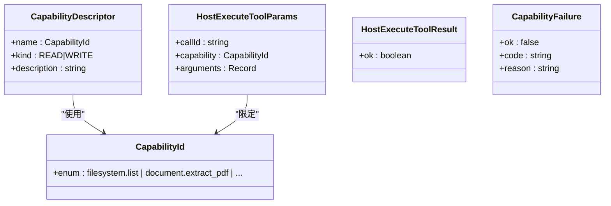
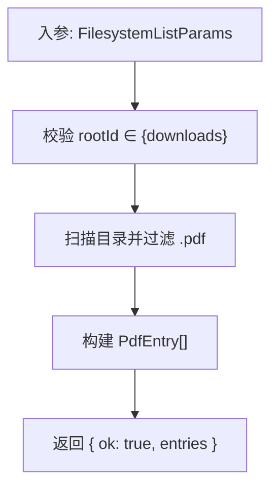
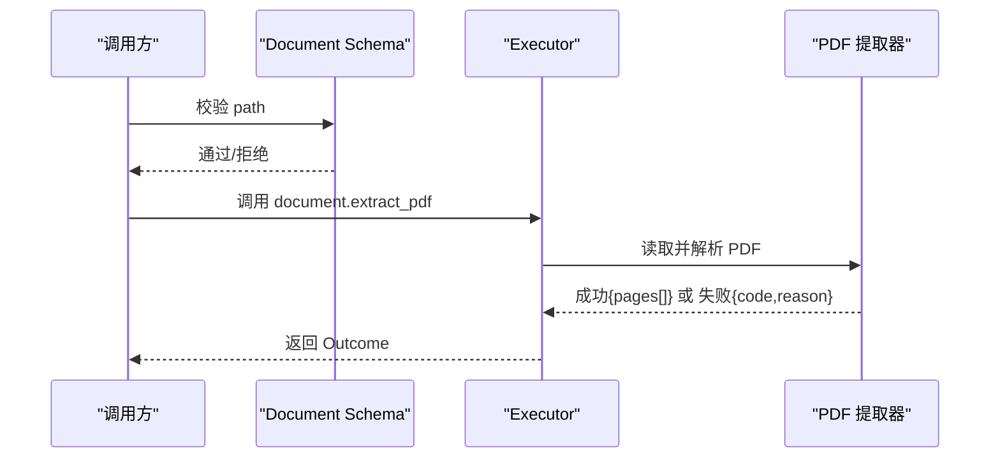
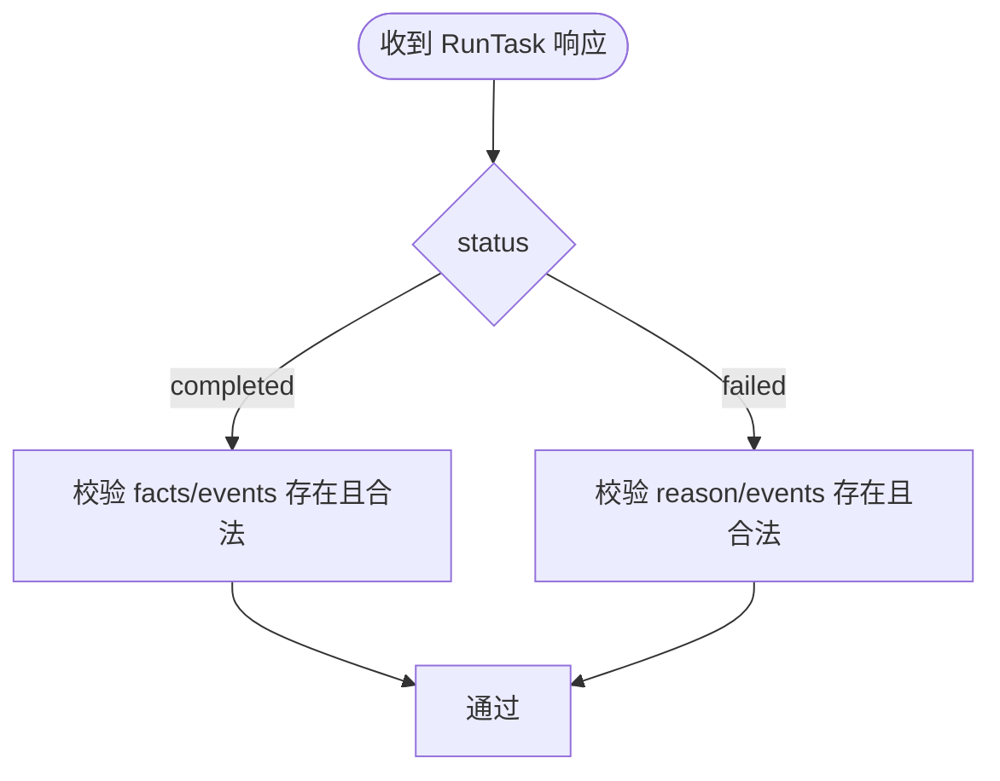
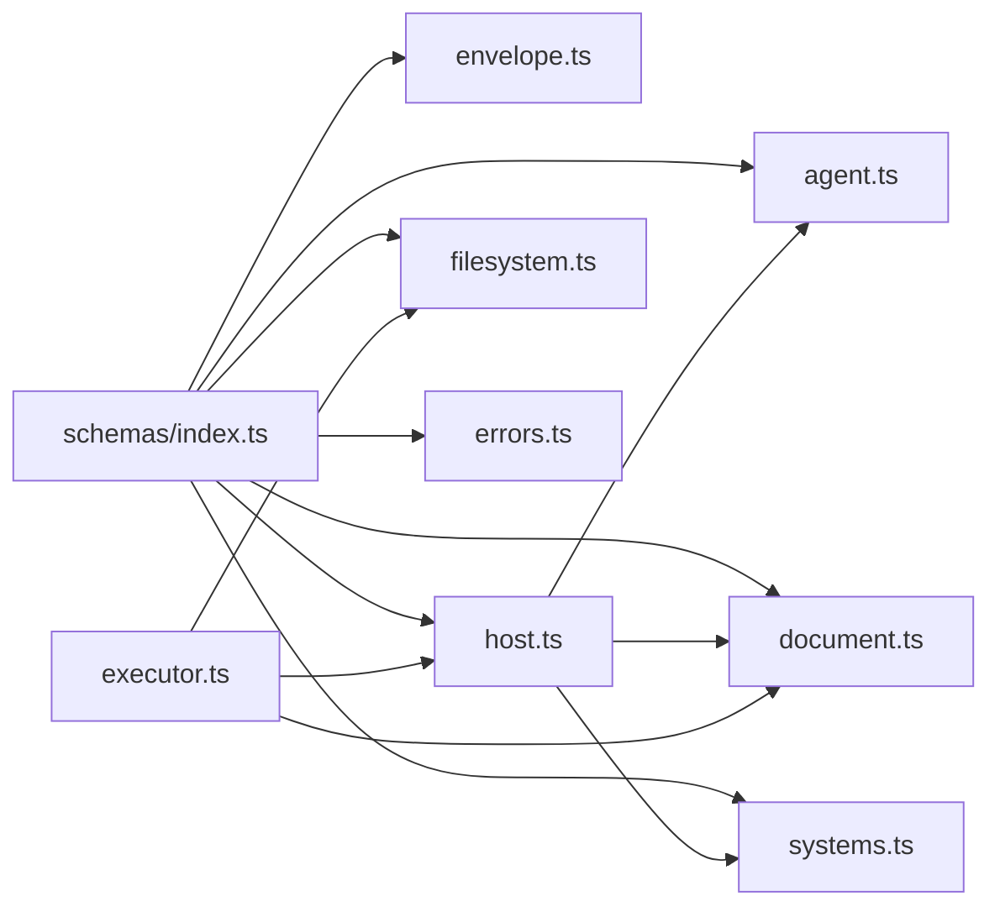

# 数据验证机制

<cite>
**本文引用的文件**
- [packages/protocol/schemas/index.ts](file://packages/protocol/schemas/index.ts)
- [packages/protocol/schemas/envelope.ts](file://packages/protocol/schemas/envelope.ts)
- [packages/protocol/schemas/host.ts](file://packages/protocol/schemas/host.ts)
- [packages/protocol/schemas/filesystem.ts](file://packages/protocol/schemas/filesystem.ts)
- [packages/protocol/schemas/document.ts](file://packages/protocol/schemas/document.ts)
- [packages/protocol/schemas/agent.ts](file://packages/protocol/schemas/agent.ts)
- [packages/protocol/schemas/systems.ts](file://packages/protocol/schemas/systems.ts)
- [packages/protocol/schemas/errors.ts](file://packages/protocol/schemas/errors.ts)
- [packages/protocol/tests/envelope.test.ts](file://packages/protocol/tests/envelope.test.ts)
- [packages/protocol/tests/document.test.ts](file://packages/protocol/tests/document.test.ts)
- [apps/desktop/src/main/capabilities/executor.ts](file://apps/desktop/src/main/capabilities/executor.ts)
- [apps/desktop/src/main/capabilities/filesystem-list.ts](file://apps/desktop/src/main/capabilities/filesystem-list.ts)
</cite>

## 目录
1. [简介](#简介)
2. [项目结构](#项目结构)
3. [核心组件](#核心组件)
4. [架构总览](#架构总览)
5. [详细组件分析](#详细组件分析)
6. [依赖关系分析](#依赖关系分析)
7. [性能考量](#性能考量)
8. [故障排查指南](#故障排查指南)
9. [结论](#结论)
10. [附录：扩展新数据类型指南](#附录：扩展新数据类型指南)

## 简介
本文件系统性说明本项目基于 Zod 的数据验证体系，覆盖运行时类型检查与数据完整性校验。重点包括：
- 协议信封（Request/Response/Notification）与能力调用（host.execute_tool）的强约束
- 文件系统、文档处理、Agent 任务等核心数据模型的定义与校验规则
- 必填字段、类型约束、自定义校验逻辑的配置与使用
- 验证失败时的错误处理策略与数据修复建议
- 如何扩展新数据类型（schema 定义、验证规则、测试用例）
- 复杂嵌套结构与数组数据的实际验证示例

## 项目结构
验证相关代码集中在 packages/protocol/schemas 下，按领域拆分：
- envelope：通用 JSON-RPC 请求/响应/通知信封
- host：能力注册、能力描述、能力执行参数与结果
- filesystem：文件系统操作参数与条目结构
- document：PDF 提取参数、页文本、成功/失败联合结果
- agent：计划生成、任务运行、事件与摘要事实
- systems：初始化参数与结果
- errors：统一错误码常量

所有 schema 通过 index.ts 统一导出，便于上层模块按需引用。

**图表来源**
- [packages/protocol/schemas/index.ts:1-8](file://packages/protocol/schemas/index.ts#L1-L8)

**章节来源**
- [packages/protocol/schemas/index.ts:1-8](file://packages/protocol/schemas/index.ts#L1-L8)

## 核心组件
- 协议信封层
  - Request/Response/Notification：强制 jsonrpc="2.0"、id 非空、method 符合命名规范；Response 通过 superRefine 确保 result 与 error 互斥且必居其一
- 能力执行层
  - CapabilityId/CapabilityDescriptor：能力白名单与读写分类
  - HostExecuteToolParams/Request/Response：能力调用入参、方法名、ID 格式、结果 ok 标志与失败分支 CapabilityFailure
- 文件系统
  - RootId 枚举限制为 downloads；FilesystemListParams/FilesystemListResult/PdfEntry；创建目录与移动路径参数
- 文档处理
  - DocumentExtractPdfParams/PageText/DocumentExtractPdfResult/Outcome（判别联合 ok）
- Agent 任务
  - MakePlan/RunTask 的请求、响应、事件、摘要事实；时间戳严格匹配 ISO 8601 毫秒+Z；判别联合 RunTaskResult(status: completed|failed)
- 系统初始化
  - InitializeParams/InitializeResult 固定协议版本与客户端/服务端信息
- 错误码
  - ERROR_CODE 集中管理跨端一致的错误标识

**章节来源**
- [packages/protocol/schemas/envelope.ts:1-41](file://packages/protocol/schemas/envelope.ts#L1-L41)
- [packages/protocol/schemas/host.ts:1-76](file://packages/protocol/schemas/host.ts#L1-L76)
- [packages/protocol/schemas/filesystem.ts:1-37](file://packages/protocol/schemas/filesystem.ts#L1-L37)
- [packages/protocol/schemas/document.ts:1-31](file://packages/protocol/schemas/document.ts#L1-L31)
- [packages/protocol/schemas/agent.ts:1-138](file://packages/protocol/schemas/agent.ts#L1-L138)
- [packages/protocol/schemas/systems.ts:1-22](file://packages/protocol/schemas/systems.ts#L1-L22)
- [packages/protocol/schemas/errors.ts:1-30](file://packages/protocol/schemas/errors.ts#L1-L30)

## 架构总览
数据从外部进入后，先经 envelope 层做基础契约校验，再根据 method 路由到具体能力 schema（如 host.execute_tool），随后在 executor 中依据已绑定的参数执行能力并产出结构化结果。

**图表来源**
- [packages/protocol/schemas/envelope.ts:1-41](file://packages/protocol/schemas/envelope.ts#L1-L41)
- [packages/protocol/schemas/host.ts:1-76](file://packages/protocol/schemas/host.ts#L1-L76)
- [apps/desktop/src/main/capabilities/executor.ts:73-172](file://apps/desktop/src/main/capabilities/executor.ts#L73-L172)
- [apps/desktop/src/main/capabilities/filesystem-list.ts:6-31](file://apps/desktop/src/main/capabilities/filesystem-list.ts#L6-L31)

## 详细组件分析

### 协议信封（Request/Response/Notification）
- 方法名必须匹配命名规范（小写字母开头、分段命名）
- id 必填且非空
- Response 通过 superRefine 保证 result 与 error 有且仅有一个存在
- Notification 无 id，仅包含 method 与 params

**图表来源**
- [packages/protocol/schemas/envelope.ts:1-41](file://packages/protocol/schemas/envelope.ts#L1-L41)

**章节来源**
- [packages/protocol/schemas/envelope.ts:1-41](file://packages/protocol/schemas/envelope.ts#L1-L41)
- [packages/protocol/tests/envelope.test.ts:194-260](file://packages/protocol/tests/envelope.test.ts#L194-L260)

### 能力执行（host.execute_tool）
- CapabilityId 白名单控制可用能力集合
- HostExecuteToolParams.arguments 承载能力特定入参
- HostExecuteToolResult.ok 表示能力是否成功；失败走 CapabilityFailure（ok=false, code, reason）
- 请求/响应的 id 需匹配 call-\d+ 模式

**图表来源**
- [packages/protocol/schemas/host.ts:1-76](file://packages/protocol/schemas/host.ts#L1-L76)

**章节来源**
- [packages/protocol/schemas/host.ts:1-76](file://packages/protocol/schemas/host.ts#L1-L76)
- [packages/protocol/tests/envelope.test.ts:83-157](file://packages/protocol/tests/envelope.test.ts#L83-L157)

### 文件系统操作
- RootId 限制为 downloads，避免越权根目录
- FilesystemListParams 指定 rootId
- FilesystemListResult.entries 为 PdfEntry 数组，包含 name、absolutePath、modifiedAt、sizeBytes
- 创建目录与移动路径参数要求非空字符串

**图表来源**
- [packages/protocol/schemas/filesystem.ts:1-37](file://packages/protocol/schemas/filesystem.ts#L1-L37)
- [apps/desktop/src/main/capabilities/filesystem-list.ts:6-31](file://apps/desktop/src/main/capabilities/filesystem-list.ts#L6-L31)

**章节来源**
- [packages/protocol/schemas/filesystem.ts:1-37](file://packages/protocol/schemas/filesystem.ts#L1-L37)
- [apps/desktop/src/main/capabilities/filesystem-list.ts:1-32](file://apps/desktop/src/main/capabilities/filesystem-list.ts#L1-L32)

### 文档处理（PDF 提取）
- DocumentExtractPdfParams.path 为非空字符串
- PageText.pageNumber 为正整数，text 可为空（扫描件场景）
- DocumentExtractPdfOutcome 为判别联合：成功(ok=true, pages[]) 或 失败(ok=false, code, reason)

**图表来源**
- [packages/protocol/schemas/document.ts:1-31](file://packages/protocol/schemas/document.ts#L1-L31)
- [apps/desktop/src/main/capabilities/executor.ts:157-172](file://apps/desktop/src/main/capabilities/executor.ts#L157-L172)

**章节来源**
- [packages/protocol/schemas/document.ts:1-31](file://packages/protocol/schemas/document.ts#L1-L31)
- [packages/protocol/tests/document.test.ts:1-162](file://packages/protocol/tests/document.test.ts#L1-L162)

### Agent 任务（计划与执行）
- MakePlan：步骤至少一个；capability 可选（摘要步骤无需工具）
- RunTaskEvent：type 非空；occurredAt 严格匹配 ISO 8601 毫秒+Z
- SummaryFact：text 非空；pageRefs 为 ≥1 的整数数组（允许为空）
- RunTaskResult：status 为 completed 或 failed 的判别联合；completed 必须有 facts/events；failed 必须有 reason/events

**图表来源**
- [packages/protocol/schemas/agent.ts:1-138](file://packages/protocol/schemas/agent.ts#L1-L138)

**章节来源**
- [packages/protocol/schemas/agent.ts:1-138](file://packages/protocol/schemas/agent.ts#L1-L138)
- [packages/protocol/tests/envelope.test.ts:262-455](file://packages/protocol/tests/envelope.test.ts#L262-L455)

### 系统初始化
- InitializeParams 强制 protocolVersion 与 capabilities 数组；client 信息必填
- InitializeResult 返回 server 信息

**章节来源**
- [packages/protocol/schemas/systems.ts:1-22](file://packages/protocol/schemas/systems.ts#L1-L22)
- [packages/protocol/tests/envelope.test.ts:457-516](file://packages/protocol/tests/envelope.test.ts#L457-L516)

## 依赖关系分析
- schemas 之间通过相对导入形成清晰边界：host 被 agent、document、systems 引用；index.ts 统一聚合导出
- 运行时 executor 依赖 host schema 进行能力分发，并复用 filesystem/document 的结构类型
- 测试覆盖 envelope、document 等关键路径，确保契约稳定

**图表来源**
- [packages/protocol/schemas/index.ts:1-8](file://packages/protocol/schemas/index.ts#L1-L8)
- [apps/desktop/src/main/capabilities/executor.ts:1-36](file://apps/desktop/src/main/capabilities/executor.ts#L1-L36)

**章节来源**
- [packages/protocol/schemas/index.ts:1-8](file://packages/protocol/schemas/index.ts#L1-L8)
- [apps/desktop/src/main/capabilities/executor.ts:1-325](file://apps/desktop/src/main/capabilities/executor.ts#L1-L325)

## 性能考量
- 使用 Zod 的 strict/loose 对象策略：Response 使用 looseObject 减少多余字段导致的误拒，提高兼容性
- 对高频路径（如 PDF 列表）尽量只做必要校验，避免重复 parse
- 使用 discriminatedUnion 提升联合类型分支判断效率
- 将耗时 I/O 与校验解耦：executor 仅在权限与绑定通过后执行 I/O

[本节为通用指导，不直接分析具体文件]

## 故障排查指南
- 常见拒绝原因
  - 方法名不合法：检查是否符合命名规范
  - id 缺失或格式不符：确保 id 非空且满足对应模式
  - result 与 error 同时或缺失：确保二者有且仅有一个存在
  - capability 不在白名单：核对 CapabilityId
  - 时间戳格式不符：确保 occurredAt 为 ISO 8601 毫秒+Z
  - 页码为 0 或非整数：确保 pageNumber 为正整数
- 定位方法
  - 使用 safeParse 获取错误详情，关注 issues 中的 path 与 message
  - 对照测试用例快速复现与验证修复效果
- 修复建议
  - 上游构造数据时遵循 schema 约束
  - 对业务失败使用 CapabilityFailure（ok=false）而非 envelope 的 error
  - 对路径安全校验放在 executor 的 path-guard 层，不在契约层承担

**章节来源**
- [packages/protocol/schemas/envelope.ts:12-34](file://packages/protocol/schemas/envelope.ts#L12-L34)
- [packages/protocol/schemas/host.ts:47-67](file://packages/protocol/schemas/host.ts#L47-L67)
- [packages/protocol/schemas/agent.ts:68-76](file://packages/protocol/schemas/agent.ts#L68-L76)
- [packages/protocol/tests/document.test.ts:18-53](file://packages/protocol/tests/document.test.ts#L18-L53)
- [packages/protocol/tests/envelope.test.ts:208-260](file://packages/protocol/tests/envelope.test.ts#L208-L260)

## 结论
本项目以 Zod schema 为核心构建了严格的运行时数据验证体系，覆盖协议信封、能力调用、文件系统、文档处理与 Agent 任务等关键领域。通过白名单、判别联合、正则与自定义校验，确保跨端数据的一致性与安全性。测试驱动的开发方式保障了契约稳定性，便于后续扩展与维护。

[本节为总结性内容，不直接分析具体文件]

## 附录：扩展新数据类型指南
- 新增 schema 步骤
  - 在对应领域文件中定义 Zod schema（如新增 document 能力则在 document.ts）
  - 如需加入能力白名单，更新 CapabilityId 枚举
  - 在 index.ts 中导出新 schema
- 编写验证规则
  - 必填字段：使用 .min(1) 或 required
  - 类型约束：string/number/int/boolean 等
  - 自定义逻辑：使用 .superRefine 或 .refine
  - 联合类型：使用 discriminatedUnion 表达多态结果
- 编写测试用例
  - 参考 envelope.test.ts 的 fixture 驱动方式，覆盖合法与非法输入
  - 针对联合类型与时间戳等复杂约束，补充边界用例
- 集成到执行流程
  - 在 executor 中增加能力分支，复用已校验的参数
  - 对异常使用 ERROR_CODE 与 CapabilityFailure 返回

**章节来源**
- [packages/protocol/schemas/host.ts:7-14](file://packages/protocol/schemas/host.ts#L7-L14)
- [packages/protocol/schemas/index.ts:1-8](file://packages/protocol/schemas/index.ts#L1-L8)
- [packages/protocol/tests/envelope.test.ts:58-192](file://packages/protocol/tests/envelope.test.ts#L58-L192)
- [packages/protocol/tests/document.test.ts:1-162](file://packages/protocol/tests/document.test.ts#L1-L162)
- [apps/desktop/src/main/capabilities/executor.ts:121-143](file://apps/desktop/src/main/capabilities/executor.ts#L121-L143)