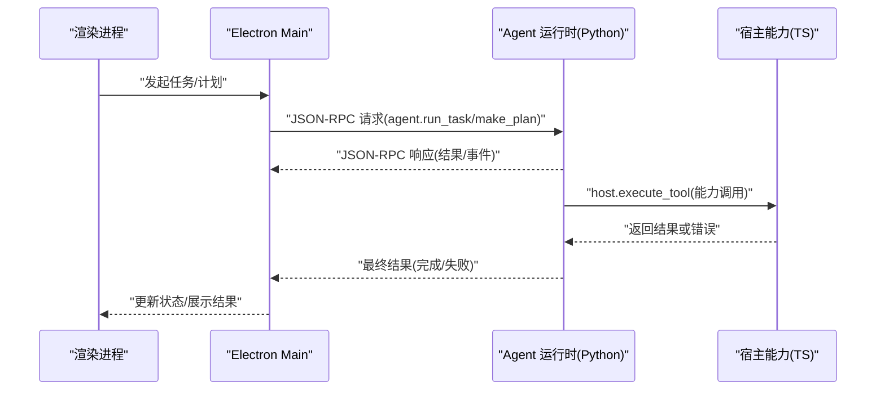
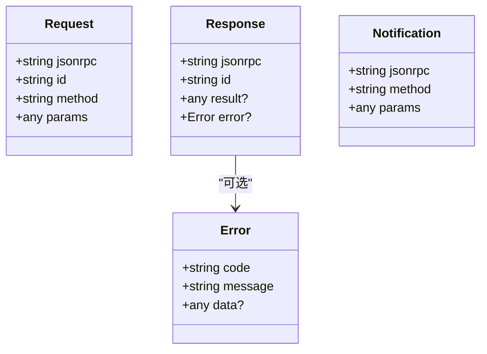
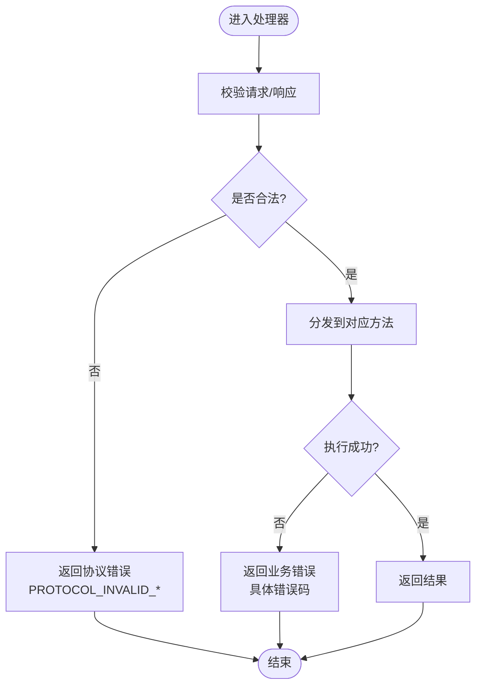
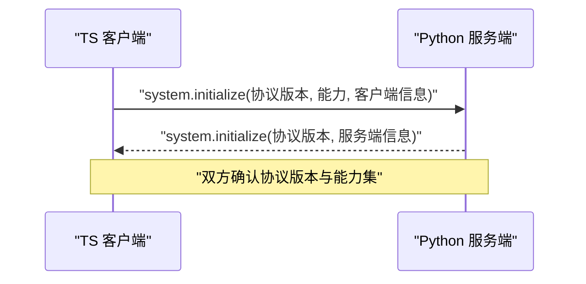
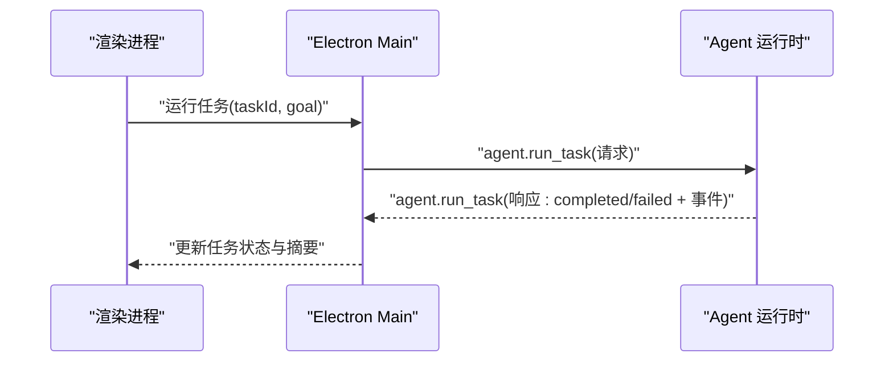
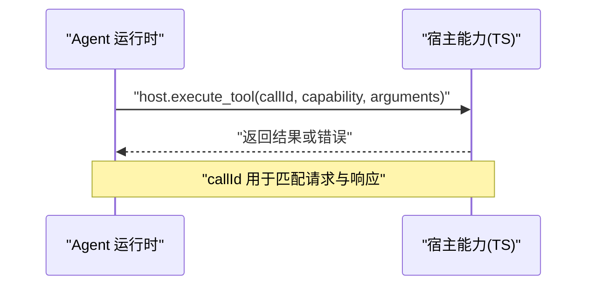
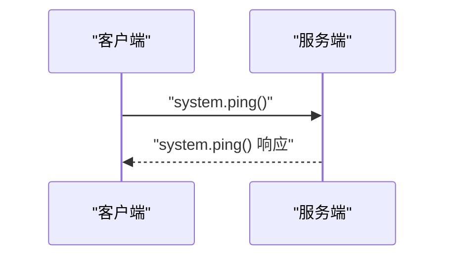
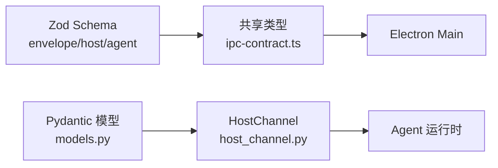

# 通信协议设计

<cite>
**本文引用的文件**
- [packages/protocol/schemas/envelope.ts](file://packages/protocol/schemas/envelope.ts)
- [packages/protocol/schemas/errors.ts](file://packages/protocol/schemas/errors.ts)
- [packages/protocol/schemas/host.ts](file://packages/protocol/schemas/host.ts)
- [packages/protocol/schemas/agent.ts](file://packages/protocol/schemas/agent.ts)
- [services/agent-runtime/src/personal_agent/protocol/models.py](file://services/agent-runtime/src/personal_agent/protocol/models.py)
- [services/agent-runtime/src/personal_agent/host_channel.py](file://services/agent-runtime/src/personal_agent/host_channel.py)
- [apps/desktop/src/shared/ipc-contract.ts](file://apps/desktop/src/shared/ipc-contract.ts)
- [apps/desktop/src/main/runtime/error-code.ts](file://apps/desktop/src/main/runtime/error-code.ts)
- [packages/protocol/fixtures/initialize.request.json](file://packages/protocol/fixtures/initialize.request.json)
- [packages/protocol/fixtures/agent-run-task.request.json](file://packages/protocol/fixtures/agent-run-task.request.json)
- [packages/protocol/fixtures/host-execute-tool.request.json](file://packages/protocol/fixtures/host-execute-tool.request.json)
- [packages/protocol/fixtures/ping.request.json](file://packages/protocol/fixtures/ping.request.json)
- [packages/protocol/fixtures/invalid/request-missing-id.json](file://packages/protocol/fixtures/invalid/request-missing-id.json)
</cite>

## 目录
1. [简介](#简介)
2. [项目结构](#项目结构)
3. [核心组件](#核心组件)
4. [架构总览](#架构总览)
5. [详细组件分析](#详细组件分析)
6. [依赖关系分析](#依赖关系分析)
7. [性能考虑](#性能考虑)
8. [故障排查指南](#故障排查指南)
9. [结论](#结论)
10. [附录](#附录)

## 简介
本设计文档面向个人代理系统中的跨进程通信协议，涵盖 IPC 与 JSON-RPC 两种通信方式。系统通过 JSON-RPC 2.0 在 Electron Main、渲染进程与 Python Agent 运行时之间传递消息，使用 Zod（TS）与 Pydantic（Python）进行运行时类型校验，确保两端契约一致。文档重点说明：
- 协议版本管理与向后兼容策略
- 消息信封格式（元数据、请求标识、错误信息）
- 数据类型定义与验证机制
- 错误处理协议（错误码与传播）
- 序列化/反序列化的性能考量
- 典型交互流程图
- 协议扩展指南（新增方法与数据类型）

## 项目结构
协议相关代码主要分布在以下位置：
- TS 侧协议 Schema 与固定用例：packages/protocol/schemas、packages/protocol/fixtures
- Python 侧协议模型与通道：services/agent-runtime/src/personal_agent/protocol/models.py、host_channel.py
- Electron 主进程与共享类型：apps/desktop/src/shared/ipc-contract.ts、apps/desktop/src/main/runtime/error-code.ts

```mermaid
graph TB
subgraph "Electron 应用"
A["Main 进程"]
B["渲染进程"]
C["共享类型 ipc-contract.ts"]
end
subgraph "协议包"
D["Zod Schema<br/>envelope.ts / host.ts / agent.ts"]
E["错误码 errors.ts"]
F["固定用例 fixtures/*"]
end
subgraph "Agent 运行时"
G["Pydantic 模型 models.py"]
H["HostChannel host_channel.py"]
end
A --- D
A --- E
A --- C
B --- C
A < --> |JSON-RPC over IPC| G
G < --> H
D < --> G
F --> D
```

图表来源
- [packages/protocol/schemas/envelope.ts:1-41](file://packages/protocol/schemas/envelope.ts#L1-L41)
- [packages/protocol/schemas/host.ts:1-76](file://packages/protocol/schemas/host.ts#L1-L76)
- [packages/protocol/schemas/agent.ts:1-138](file://packages/protocol/schemas/agent.ts#L1-L138)
- [services/agent-runtime/src/personal_agent/protocol/models.py:1-368](file://services/agent-runtime/src/personal_agent/protocol/models.py#L1-L368)
- [services/agent-runtime/src/personal_agent/host_channel.py:1-91](file://services/agent-runtime/src/personal_agent/host_channel.py#L1-L91)
- [apps/desktop/src/shared/ipc-contract.ts:1-75](file://apps/desktop/src/shared/ipc-contract.ts#L1-L75)
- [apps/desktop/src/main/runtime/error-code.ts:1-18](file://apps/desktop/src/main/runtime/error-code.ts#L1-L18)

章节来源
- [packages/protocol/schemas/index.ts:1-8](file://packages/protocol/schemas/index.ts#L1-L8)
- [packages/protocol/fixtures/initialize.request.json:1-22](file://packages/protocol/fixtures/initialize.request.json#L1-L22)
- [packages/protocol/fixtures/agent-run-task.request.json:1-10](file://packages/protocol/fixtures/agent-run-task.request.json#L1-L10)
- [packages/protocol/fixtures/host-execute-tool.request.json:1-13](file://packages/protocol/fixtures/host-execute-tool.request.json#L1-L13)
- [packages/protocol/fixtures/ping.request.json:1-7](file://packages/protocol/fixtures/ping.request.json#L1-L7)

## 核心组件
- 消息信封（Request/Response/Notification）：遵循 JSON-RPC 2.0，包含 jsonrpc、id、method、params/result/error 等字段；响应必须仅含 result 或 error 之一。
- 能力与方法：
  - host.execute_tool：Agent 运行时向宿主（TS）发起工具调用，如文件系统、PDF 提取等。
  - agent.run_task、agent.make_plan：TS 向 Agent 运行时发起任务执行与计划生成。
  - system.initialize/system.ping：初始化与心跳探测。
- 错误码体系：集中定义协议级与运行时级错误码，用于统一错误传播。
- 类型校验：TS 使用 Zod，Python 使用 Pydantic，保证入参与出参的强约束与一致性。

章节来源
- [packages/protocol/schemas/envelope.ts:1-41](file://packages/protocol/schemas/envelope.ts#L1-L41)
- [packages/protocol/schemas/host.ts:1-76](file://packages/protocol/schemas/host.ts#L1-L76)
- [packages/protocol/schemas/agent.ts:1-138](file://packages/protocol/schemas/agent.ts#L1-L138)
- [packages/protocol/schemas/errors.ts:1-30](file://packages/protocol/schemas/errors.ts#L1-L30)
- [services/agent-runtime/src/personal_agent/protocol/models.py:1-368](file://services/agent-runtime/src/personal_agent/protocol/models.py#L1-L368)

## 架构总览
系统采用“TS 作为编排与 UI 层，Python 作为 Agent 运行时”的双端架构，通过 JSON-RPC 2.0 在进程间通信。关键路径包括：
- TS → Python：启动任务、生成计划
- Python → TS：反向调用宿主能力（文件系统、通知等）
- 双向：初始化握手、心跳检测



图表来源
- [packages/protocol/schemas/agent.ts:1-138](file://packages/protocol/schemas/agent.ts#L1-L138)
- [packages/protocol/schemas/host.ts:1-76](file://packages/protocol/schemas/host.ts#L1-L76)
- [services/agent-runtime/src/personal_agent/host_channel.py:1-91](file://services/agent-runtime/src/personal_agent/host_channel.py#L1-L91)

## 详细组件分析

### 消息信封与 JSON-RPC 2.0
- 请求/通知/响应均包含 jsonrpc 字面量 "2.0"。
- 请求需包含 id（非空字符串），方法名遵循命名规范（小写字母开头，段分隔）。
- 响应必须满足互斥约束：result 与 error 不能同时存在。
- 通知无 id，用于单向事件推送。



图表来源
- [packages/protocol/schemas/envelope.ts:1-41](file://packages/protocol/schemas/envelope.ts#L1-L41)
- [services/agent-runtime/src/personal_agent/protocol/models.py:8-38](file://services/agent-runtime/src/personal_agent/protocol/models.py#L8-L38)

章节来源
- [packages/protocol/schemas/envelope.ts:1-41](file://packages/protocol/schemas/envelope.ts#L1-L41)
- [services/agent-runtime/src/personal_agent/protocol/models.py:8-38](file://services/agent-runtime/src/personal_agent/protocol/models.py#L8-L38)

### 协议版本管理
- 初始化阶段通过 system.initialize 交换协议版本与能力集。
- 当前协议版本为 "0.1"，客户端与服务端均需声明并匹配该版本。
- 向后兼容建议：
  - 新增字段应默认可忽略（服务端对未知字段宽容，客户端对缺失字段提供默认值）。
  - 新增方法不应破坏旧客户端解析逻辑。
  - 版本升级时保留旧字段至少一个版本周期。

章节来源
- [packages/protocol/fixtures/initialize.request.json:1-22](file://packages/protocol/fixtures/initialize.request.json#L1-L22)
- [services/agent-runtime/src/personal_agent/protocol/models.py:253-262](file://services/agent-runtime/src/personal_agent/protocol/models.py#L253-L262)

### 能力与方法定义
- 能力集合 CapabilityId：filesystem.list、document.extract_pdf、filesystem.create_dir、filesystem.move、scheduler.create、notification.send。
- 能力描述 CapabilityDescriptor：name、kind（READ/WRITE）、description。
- 方法：
  - host.execute_tool：参数包含 callId、capability、arguments。
  - agent.run_task：参数 taskId、goal；返回结果包含状态、事实与事件。
  - agent.make_plan：参数 taskId、goal；返回步骤列表（至少一步）。

章节来源
- [packages/protocol/schemas/host.ts:1-76](file://packages/protocol/schemas/host.ts#L1-L76)
- [packages/protocol/schemas/agent.ts:1-138](file://packages/protocol/schemas/agent.ts#L1-L138)
- [services/agent-runtime/src/personal_agent/protocol/models.py:75-151](file://services/agent-runtime/src/personal_agent/protocol/models.py#L75-L151)

### 错误处理协议
- 错误码集中定义，覆盖协议、主机能力、权限、文件系统等场景。
- 运行时错误码独立于协议错误码，用于 Electron 主进程内部状态。
- 错误传播：
  - 响应中的 error.code/message/data 携带错误上下文。
  - Python 侧在收到非法响应或业务失败时抛出异常并转换为协议错误。
  - TS 侧将协议错误映射到 IpcErrorCode，供上层 UI 展示。



图表来源
- [packages/protocol/schemas/errors.ts:1-30](file://packages/protocol/schemas/errors.ts#L1-L30)
- [apps/desktop/src/main/runtime/error-code.ts:1-18](file://apps/desktop/src/main/runtime/error-code.ts#L1-L18)
- [services/agent-runtime/src/personal_agent/host_channel.py:18-85](file://services/agent-runtime/src/personal_agent/host_channel.py#L18-L85)

章节来源
- [packages/protocol/schemas/errors.ts:1-30](file://packages/protocol/schemas/errors.ts#L1-L30)
- [apps/desktop/src/main/runtime/error-code.ts:1-18](file://apps/desktop/src/main/runtime/error-code.ts#L1-L18)
- [services/agent-runtime/src/personal_agent/host_channel.py:18-85](file://services/agent-runtime/src/personal_agent/host_channel.py#L18-L85)

### 数据类型与验证机制
- TS 侧使用 Zod Schema 严格校验请求/响应/通知，确保字段类型、范围与格式正确。
- Python 侧使用 Pydantic Model 与 Field 约束，实现相同语义的强类型校验。
- 关键字段：
  - occurredAt 时间戳格式严格匹配 ISO 8601 毫秒精度。
  - pageRefs 页码为正整数数组。
  - steps 至少一项，避免空计划导致对齐失败。

章节来源
- [packages/protocol/schemas/agent.ts:62-138](file://packages/protocol/schemas/agent.ts#L62-L138)
- [services/agent-runtime/src/personal_agent/protocol/models.py:264-320](file://services/agent-runtime/src/personal_agent/protocol/models.py#L264-L320)

### IPC 与 JSON-RPC 交互流程

#### 初始化握手


图表来源
- [packages/protocol/fixtures/initialize.request.json:1-22](file://packages/protocol/fixtures/initialize.request.json#L1-L22)
- [services/agent-runtime/src/personal_agent/protocol/models.py:253-262](file://services/agent-runtime/src/personal_agent/protocol/models.py#L253-L262)

#### 任务执行（TS → Python）


图表来源
- [packages/protocol/fixtures/agent-run-task.request.json:1-10](file://packages/protocol/fixtures/agent-run-task.request.json#L1-L10)
- [packages/protocol/schemas/agent.ts:62-138](file://packages/protocol/schemas/agent.ts#L62-L138)

#### 宿主能力调用（Python → TS）


图表来源
- [packages/protocol/fixtures/host-execute-tool.request.json:1-13](file://packages/protocol/fixtures/host-execute-tool.request.json#L1-L13)
- [packages/protocol/schemas/host.ts:1-76](file://packages/protocol/schemas/host.ts#L1-L76)
- [services/agent-runtime/src/personal_agent/host_channel.py:45-85](file://services/agent-runtime/src/personal_agent/host_channel.py#L45-L85)

#### 心跳检测


图表来源
- [packages/protocol/fixtures/ping.request.json:1-7](file://packages/protocol/fixtures/ping.request.json#L1-L7)

## 依赖关系分析
- TS 协议 Schema 与 Python 模型保持语义一致，形成契约中心。
- Electron Main 通过共享类型 ipc-contract.ts 暴露给渲染进程，统一错误码与数据结构。
- Python HostChannel 负责与 TS 宿主能力的双向 RPC，维护请求 ID 与收件箱队列。



图表来源
- [packages/protocol/schemas/envelope.ts:1-41](file://packages/protocol/schemas/envelope.ts#L1-L41)
- [packages/protocol/schemas/host.ts:1-76](file://packages/protocol/schemas/host.ts#L1-L76)
- [packages/protocol/schemas/agent.ts:1-138](file://packages/protocol/schemas/agent.ts#L1-L138)
- [apps/desktop/src/shared/ipc-contract.ts:1-75](file://apps/desktop/src/shared/ipc-contract.ts#L1-L75)
- [services/agent-runtime/src/personal_agent/protocol/models.py:1-368](file://services/agent-runtime/src/personal_agent/protocol/models.py#L1-L368)
- [services/agent-runtime/src/personal_agent/host_channel.py:1-91](file://services/agent-runtime/src/personal_agent/host_channel.py#L1-L91)

章节来源
- [apps/desktop/src/shared/ipc-contract.ts:1-75](file://apps/desktop/src/shared/ipc-contract.ts#L1-L75)
- [services/agent-runtime/src/personal_agent/host_channel.py:1-91](file://services/agent-runtime/src/personal_agent/host_channel.py#L1-L91)

## 性能考虑
- 序列化/反序列化：
  - 使用轻量 JSON 传输，避免冗余字段；Python 侧 model_dump(exclude_none=True) 减少载荷大小。
  - 批量事件聚合：将多个 RunTaskEvent 合并发送，降低 IPC 开销。
- 连接与超时：
  - 心跳检测（system.ping）维持连接活性，及时检测断连。
  - 设置合理的超时与重试策略，避免阻塞主线程。
- 内存与队列：
  - HostChannel 使用队列暂存未匹配的响应，防止丢失。
  - 限制队列长度，避免内存泄漏。
- 校验成本：
  - 在边界处进行严格校验，内部路径可使用宽松模式以提升吞吐。
  - 缓存热点 Schema 实例，减少重复构建开销。

[本节为通用性能指导，不直接分析具体文件]

## 故障排查指南
- 常见错误定位：
  - 协议无效 JSON：检查网络/管道传输完整性与编码。
  - 请求缺少 id：确保所有请求包含唯一且非空的 id。
  - 响应既无 result 也无 error：检查处理器是否正确填充响应体。
  - 能力未注册/越权：核对能力清单与权限策略。
  - 运行时错误：区分协议错误与运行时错误，查看 RUNTIME_ERROR_CODE。
- 调试建议：
  - 启用日志记录，捕获原始消息与异常堆栈。
  - 使用固定用例 fixtures 对比实际消息结构。
  - 逐步缩小问题范围：先 ping，再 initialize，最后业务方法。

章节来源
- [packages/protocol/fixtures/invalid/request-missing-id.json:1-6](file://packages/protocol/fixtures/invalid/request-missing-id.json#L1-L6)
- [apps/desktop/src/main/runtime/error-code.ts:1-18](file://apps/desktop/src/main/runtime/error-code.ts#L1-L18)
- [services/agent-runtime/src/personal_agent/host_channel.py:18-85](file://services/agent-runtime/src/personal_agent/host_channel.py#L18-L85)

## 结论
本通信协议以 JSON-RPC 2.0 为基础，结合 Zod 与 Pydantic 的强类型校验，实现了 TS 与 Python 之间的稳定、可扩展的 IPC 通信。通过统一的错误码、清晰的信封格式与严格的版本管理，系统在功能扩展与维护方面具备良好的可演进性。建议在后续迭代中持续完善能力清单、优化序列化性能，并加强监控与诊断能力。

[本节为总结性内容，不直接分析具体文件]

## 附录

### 协议扩展指南
- 新增方法：
  - 在 TS Schema 中定义 Request/Response/Notification 及方法名常量。
  - 在 Python 模型中同步定义对应的 Pydantic 模型与校验规则。
  - 在能力清单中登记新方法（如需宿主能力）。
- 新增数据类型：
  - 在 TS 与 Python 两端分别定义类型与约束，确保语义一致。
  - 在响应/请求中引用新类型，并在测试用例中覆盖边界情况。
- 向后兼容：
  - 新增字段应可忽略，旧客户端能继续工作。
  - 废弃字段保留至少一个版本周期，并提供迁移指引。
- 测试与验证：
  - 使用 fixtures 编写正向与负向用例。
  - 在 CI 中运行端到端校验，确保两端契约一致。

[本节为概念性指导，不直接分析具体文件]