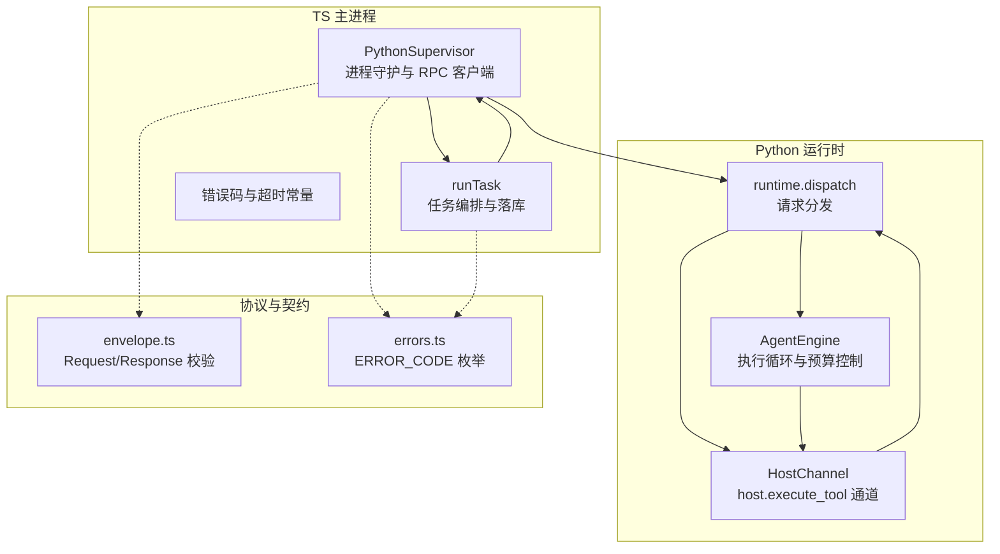
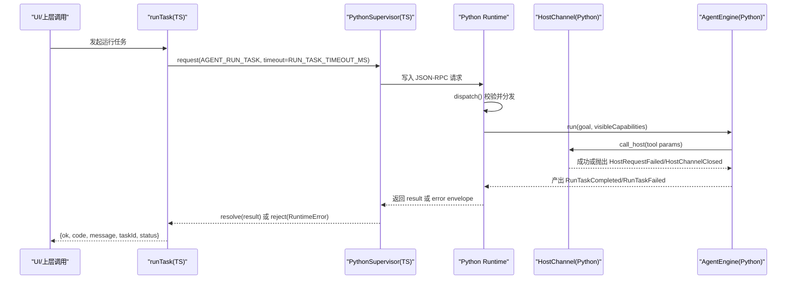
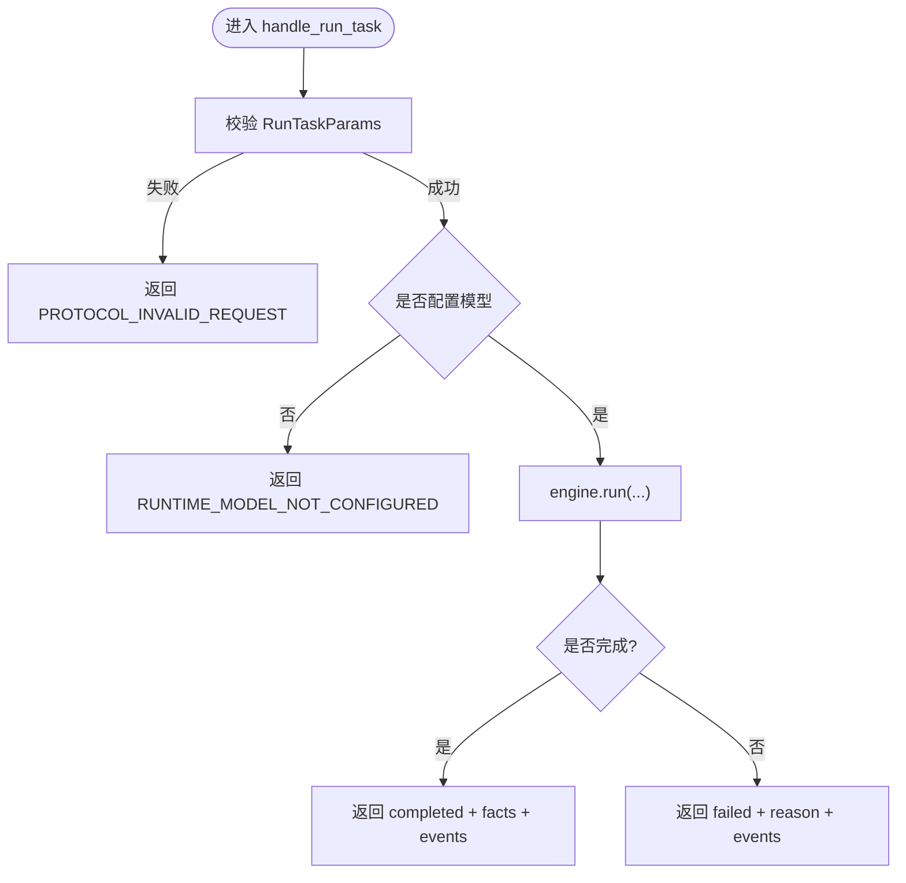
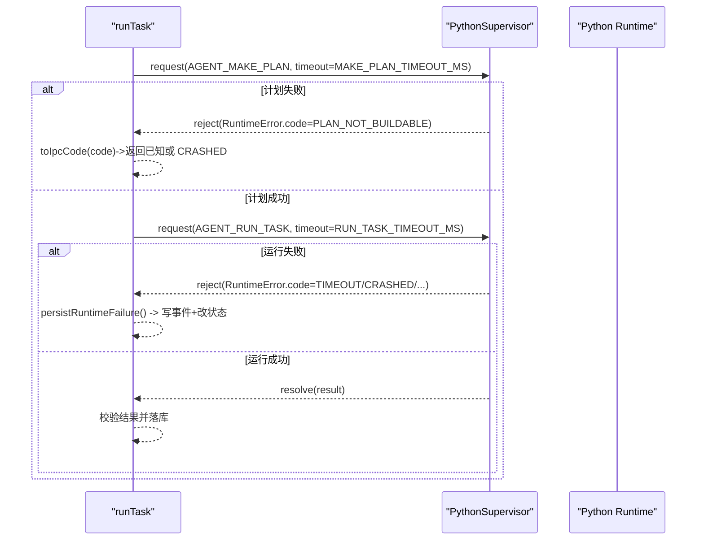
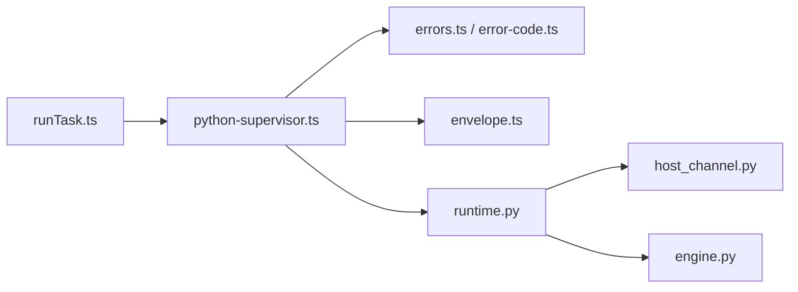

# 错误处理机制

<cite>
**本文引用的文件**
- [apps/desktop/src/main/runtime/error-code.ts](file://apps/desktop/src/main/runtime/error-code.ts)
- [packages/protocol/schemas/errors.ts](file://packages/protocol/schemas/errors.ts)
- [packages/protocol/schemas/envelope.ts](file://packages/protocol/schemas/envelope.ts)
- [apps/desktop/src/main/runtime/python-supervisor.ts](file://apps/desktop/src/main/runtime/python-supervisor.ts)
- [apps/desktop/src/main/runtime/timeouts.ts](file://apps/desktop/src/main/runtime/timeouts.ts)
- [apps/desktop/src/main/tasks/run-task.ts](file://apps/desktop/src/main/tasks/run-task.ts)
- [services/agent-runtime/src/personal_agent/host_channel.py](file://services/agent-runtime/src/personal_agent/host_channel.py)
- [services/agent-runtime/src/personal_agent/runtime.py](file://services/agent-runtime/src/personal_agent/runtime.py)
- [services/agent-runtime/src/personal_agent/engine.py](file://services/agent-runtime/src/personal_agent/engine.py)
- [apps/desktop/src/renderer/src/components/DiagnosticsDialog.tsx](file://apps/desktop/src/renderer/src/components/DiagnosticsDialog.tsx)
</cite>

## 目录
1. [引言](#引言)
2. [项目结构](#项目结构)
3. [核心组件](#核心组件)
4. [架构总览](#架构总览)
5. [详细组件分析](#详细组件分析)
6. [依赖关系分析](#依赖关系分析)
7. [性能与超时策略](#性能与超时策略)
8. [故障排查指南](#故障排查指南)
9. [结论](#结论)
10. [附录](#附录)

## 引言
本文件系统化梳理 Personal Agent 的错误处理机制，覆盖统一错误码定义、错误分类、跨层传播、重试与降级策略、日志记录规范以及常见错误场景的处理示例。目标是让读者在不深入源码的情况下，也能理解从 IPC、JSON-RPC 到业务逻辑各层的错误如何被捕获、标准化、上报与恢复。

## 项目结构
错误处理贯穿以下层次：
- 协议与契约层：JSON-RPC 信封、错误对象结构、方法命名约束等。
- 运行时（Python）：请求分发、工具调用通道、引擎循环与事件产出。
- 宿主侧（TypeScript/Electron）：进程守护、RPC 客户端、任务编排、持久化与 UI 展示。

**图表来源**
- [apps/desktop/src/main/runtime/python-supervisor.ts:66-207](file://apps/desktop/src/main/runtime/python-supervisor.ts#L66-L207)
- [apps/desktop/src/main/tasks/run-task.ts:105-341](file://apps/desktop/src/main/tasks/run-task.ts#L105-L341)
- [services/agent-runtime/src/personal_agent/runtime.py:69-184](file://services/agent-runtime/src/personal_agent/runtime.py#L69-L184)
- [services/agent-runtime/src/personal_agent/host_channel.py:36-85](file://services/agent-runtime/src/personal_agent/host_channel.py#L36-L85)
- [services/agent-runtime/src/personal_agent/engine.py:91-244](file://services/agent-runtime/src/personal_agent/engine.py#L91-L244)
- [packages/protocol/schemas/envelope.ts:5-34](file://packages/protocol/schemas/envelope.ts#L5-L34)
- [packages/protocol/schemas/errors.ts:1-30](file://packages/protocol/schemas/errors.ts#L1-L30)

**章节来源**
- [apps/desktop/src/main/runtime/python-supervisor.ts:66-207](file://apps/desktop/src/main/runtime/python-supervisor.ts#L66-L207)
- [apps/desktop/src/main/tasks/run-task.ts:105-341](file://apps/desktop/src/main/tasks/run-task.ts#L105-L341)
- [services/agent-runtime/src/personal_agent/runtime.py:69-184](file://services/agent-runtime/src/personal_agent/runtime.py#L69-L184)
- [services/agent-runtime/src/personal_agent/host_channel.py:36-85](file://services/agent-runtime/src/personal_agent/host_channel.py#L36-L85)
- [services/agent-runtime/src/personal_agent/engine.py:91-244](file://services/agent-runtime/src/personal_agent/engine.py#L91-L244)
- [packages/protocol/schemas/envelope.ts:5-34](file://packages/protocol/schemas/envelope.ts#L5-L34)
- [packages/protocol/schemas/errors.ts:1-30](file://packages/protocol/schemas/errors.ts#L1-L30)

## 核心组件
- 错误码集中管理
  - TS 运行时错误码：用于进程内运行时异常、握手失败、崩溃、响应无效等。
  - 协议层错误码：用于 JSON-RPC 层、能力范围、权限、文件系统、PDF 提取等业务相关错误。
- 运行时守护与 RPC 客户端
  - 负责子进程生命周期、请求/响应路由、超时、取消、崩溃广播、反向 host 请求处理。
- 任务编排
  - 负责计划获取、任务状态机推进、结果落库、错误归一化为 IPC 返回码。
- Python 运行时
  - 负责协议解析、参数校验、方法分发、引擎执行、错误转标准 JSON-RPC error。
- 工具通道
  - 封装 host.execute_tool 的发送与接收，将协议错误与系统级错误转换为异常。
- 引擎循环
  - 驱动模型决策、工具调用、观察记录、预算控制与失败路径。

**章节来源**
- [apps/desktop/src/main/runtime/error-code.ts:1-17](file://apps/desktop/src/main/runtime/error-code.ts#L1-L17)
- [packages/protocol/schemas/errors.ts:1-30](file://packages/protocol/schemas/errors.ts#L1-L30)
- [apps/desktop/src/main/runtime/python-supervisor.ts:41-207](file://apps/desktop/src/main/runtime/python-supervisor.ts#L41-L207)
- [apps/desktop/src/main/tasks/run-task.ts:25-37](file://apps/desktop/src/main/tasks/run-task.ts#L25-L37)
- [services/agent-runtime/src/personal_agent/runtime.py:65-93](file://services/agent-runtime/src/personal_agent/runtime.py#L65-L93)
- [services/agent-runtime/src/personal_agent/host_channel.py:18-85](file://services/agent-runtime/src/personal_agent/host_channel.py#L18-L85)
- [services/agent-runtime/src/personal_agent/engine.py:91-244](file://services/agent-runtime/src/personal_agent/engine.py#L91-L244)

## 架构总览
下图展示了错误在系统中的流转路径：从 Python 运行时到 TS 守护进程，再到任务编排与 UI。

**图表来源**
- [apps/desktop/src/main/tasks/run-task.ts:105-341](file://apps/desktop/src/main/tasks/run-task.ts#L105-L341)
- [apps/desktop/src/main/runtime/python-supervisor.ts:163-207](file://apps/desktop/src/main/runtime/python-supervisor.ts#L163-L207)
- [services/agent-runtime/src/personal_agent/runtime.py:69-184](file://services/agent-runtime/src/personal_agent/runtime.py#L69-L184)
- [services/agent-runtime/src/personal_agent/host_channel.py:45-85](file://services/agent-runtime/src/personal_agent/host_channel.py#L45-L85)
- [services/agent-runtime/src/personal_agent/engine.py:104-177](file://services/agent-runtime/src/personal_agent/engine.py#L104-L177)

## 详细组件分析

### 错误码体系与分类
- 运行时错误码（TS）
  - 覆盖启动、超时、取消、停止、崩溃、握手失败、响应无效、计划无效、数据库失败、任务忙、孤儿等。
- 协议错误码（全局）
  - 覆盖 JSON 无效、请求无效、方法未找到、未实现、文件系统根不可用、处理器失败、主机超时、参数无效、能力越界/未注册、路径越界/链接逃逸/UNC 不允许、动作未对齐、无活跃任务、权限相关、文件不可读、PDF 提取失败等，现共 28 个。
  - 文件系统写入类（filesystem.create_dir / filesystem.move 执行体）：CREATE_DIR_FAILED、MOVE_SOURCE_MISSING、MOVE_TARGET_EXISTS、MOVE_FAILED。
  - Reminder 调度类（scheduler.create）：REMINDER_TIME_IN_PAST（binder 判定提醒时刻不晚于当前时间）、REMINDER_ALREADY_EXISTS（同任务异参重复创建）、SCHEDULER_CREATE_FAILED（落库失败）。
- 用途区分
  - 协议层错误用于跨进程通信与能力边界；运行时错误用于进程内状态与生命周期；业务错误通过协议错误码表达。

**章节来源**
- [apps/desktop/src/main/runtime/error-code.ts:1-17](file://apps/desktop/src/main/runtime/error-code.ts#L1-L17)
- [packages/protocol/schemas/errors.ts:1-30](file://packages/protocol/schemas/errors.ts#L1-L30)

### JSON-RPC 错误对象与契约
- 响应体必须包含 jsonrpc、id，且 result 与 error 互斥。
- error 对象包含 code、message，可选 data。
- 方法名需符合命名模式，确保可识别与可扩展。

**章节来源**
- [packages/protocol/schemas/envelope.ts:5-34](file://packages/protocol/schemas/envelope.ts#L5-L34)

### 运行时（Python）错误处理
- 请求分发
  - 参数校验失败返回 PROTOCOL_INVALID_REQUEST。
  - 未知方法返回 METHOD_NOT_FOUND。
  - 内部异常统一记录并返回 RUNTIME_INTERNAL。
- 工具通道
  - 管道关闭抛 HostChannelClosed。
  - 协议不合法或字段缺失抛 HostRequestFailed，携带 code 与 message。
  - 收到 error envelope 直接抛出 HostRequestFailed，透传 code 与 message。
- 引擎循环
  - 预算耗尽、脚本耗尽、摘要拒绝等走失败路径，产出 RunTaskFailed 并附带 events。
  - 系统级异常（通道关闭、请求失败）直接冒泡至上层，终止执行。

**图表来源**
- [services/agent-runtime/src/personal_agent/runtime.py:158-184](file://services/agent-runtime/src/personal_agent/runtime.py#L158-L184)
- [services/agent-runtime/src/personal_agent/engine.py:104-177](file://services/agent-runtime/src/personal_agent/engine.py#L104-L177)

**章节来源**
- [services/agent-runtime/src/personal_agent/runtime.py:69-184](file://services/agent-runtime/src/personal_agent/runtime.py#L69-L184)
- [services/agent-runtime/src/personal_agent/host_channel.py:18-85](file://services/agent-runtime/src/personal_agent/host_channel.py#L18-L85)
- [services/agent-runtime/src/personal_agent/engine.py:91-244](file://services/agent-runtime/src/personal_agent/engine.py#L91-L244)

### 宿主侧（TS）错误处理
- PythonSupervisor
  - 请求超时：reject RuntimeError(code=TIMEOUT)。
  - 取消：reject RuntimeError(code=CANCELLED)。
  - 子进程崩溃：failAllPending(code=CRASHED)，广播 runtime.crashed。
  - 反向 host 请求：未注入 handler 返回 NOT_IMPLEMENTED；handler 异常返回 HOST_HANDLER_FAILED；超时报 HOST_TIMEOUT。
- runTask
  - 计划阶段失败：透传 Python 返回的 code（如 PLAN_NOT_BUILDABLE），否则归为 CRASHED。
  - 运行阶段失败：持久化 task_failed 事件，更新任务状态为 failed。
  - 响应校验失败：返回 RESPONSE_INVALID。
  - 数据库失败：返回 DB_FAILED。
  - 未知错误码归一化：不在已知集合中的 code 一律转为 CRASHED，避免 UI 显示不可识别字符串。

**图表来源**
- [apps/desktop/src/main/tasks/run-task.ts:105-341](file://apps/desktop/src/main/tasks/run-task.ts#L105-L341)
- [apps/desktop/src/main/runtime/python-supervisor.ts:163-207](file://apps/desktop/src/main/runtime/python-supervisor.ts#L163-L207)

**章节来源**
- [apps/desktop/src/main/runtime/python-supervisor.ts:41-207](file://apps/desktop/src/main/runtime/python-supervisor.ts#L41-L207)
- [apps/desktop/src/main/tasks/run-task.ts:25-37](file://apps/desktop/src/main/tasks/run-task.ts#L25-L37)
- [apps/desktop/src/main/tasks/run-task.ts:105-341](file://apps/desktop/src/main/tasks/run-task.ts#L105-L341)

### 错误信息标准化格式
- JSON-RPC 错误对象
  - code: 字符串，来自 ERROR_CODE 或运行时自定义码。
  - message: 人类可读描述，建议包含关键上下文（如 capability、path、reason）。
  - data: 可选，附加结构化上下文（例如堆栈片段、请求快照）。
- 运行时错误对象（TS）
  - name: "RuntimeError"
  - code: 字符串，透传自 error envelope 或本地生成。
  - message: 字符串，包含方法名与超时时间等上下文。
- 事件与持久化
  - task_failed 事件 payload 包含 code 与 message。
  - 任务状态更新为 failed，便于 reconcile 与 UI 展示。

**章节来源**
- [packages/protocol/schemas/envelope.ts:12-34](file://packages/protocol/schemas/envelope.ts#L12-L34)
- [apps/desktop/src/main/runtime/python-supervisor.ts:41-49](file://apps/desktop/src/main/runtime/python-supervisor.ts#L41-L49)
- [apps/desktop/src/main/tasks/run-task.ts:59-84](file://apps/desktop/src/main/tasks/run-task.ts#L59-L84)

### 重试机制与降级策略
- 超时与取消
  - 请求级超时：由 PythonSupervisor.request 维护定时器，超时后 reject TIMEOUT。
  - 取消支持：AbortSignal 触发时 reject CANCELLED。
- 资源不可用
  - 子进程崩溃：failAllPending 并广播 runtime.crashed，上层应回退到“未就绪”状态。
  - 通道关闭：HostChannelClosed 表示 stdin 关闭，引擎将其视为系统级故障并失败。
- 降级
  - 未注入 hostHandler：返回 NOT_IMPLEMENTED，提示能力未启用。
  - 未知错误码：统一归约为 CRASHED，保证 UI 可识别。
- 重试建议
  - 网络/IO 类错误（如 HOST_TIMEOUT、HOST_HANDLER_FAILED）可在上层进行有限次重试，带指数退避与最大次数限制。
  - 协议/参数错误（如 PROTOCOL_INVALID_REQUEST、INVALID_ARGUMENT）不应重试，应修正输入或提示用户。
  - 资源不可用（如 FILESYSTEM_ROOT_UNAVAILABLE）应等待资源恢复或切换备用路径。

**章节来源**
- [apps/desktop/src/main/runtime/python-supervisor.ts:163-207](file://apps/desktop/src/main/runtime/python-supervisor.ts#L163-L207)
- [apps/desktop/src/main/runtime/python-supervisor.ts:265-321](file://apps/desktop/src/main/runtime/python-supervisor.ts#L265-L321)
- [services/agent-runtime/src/personal_agent/host_channel.py:45-85](file://services/agent-runtime/src/personal_agent/host_channel.py#L45-L85)
- [packages/protocol/schemas/errors.ts:1-30](file://packages/protocol/schemas/errors.ts#L1-L30)

### 错误日志记录规范
- Python 侧
  - 使用 logging.getLogger("personal_agent")，级别由环境变量控制。
  - 对非法 JSON、未预期异常记录警告/异常日志，包含请求 id 与关键上下文。
- TS 侧
  - Supervisor 将 stderr 输出转发为事件，便于集中收集。
  - 写入 stdin 失败、非法 JSON、host 请求不合法等情况均记录 stderr。
- 建议
  - 所有错误日志至少包含：错误码、请求 id、capability、时间戳、简要上下文。
  - 敏感信息脱敏（路径、token、用户数据）。
  - 结构化日志（JSON）便于检索与分析。

**章节来源**
- [services/agent-runtime/src/personal_agent/runtime.py:193-205](file://services/agent-runtime/src/personal_agent/runtime.py#L193-L205)
- [services/agent-runtime/src/personal_agent/host_channel.py:66-70](file://services/agent-runtime/src/personal_agent/host_channel.py#L66-L70)
- [apps/desktop/src/main/runtime/python-supervisor.ts:118-131](file://apps/desktop/src/main/runtime/python-supervisor.ts#L118-L131)
- [apps/desktop/src/main/runtime/python-supervisor.ts:244-278](file://apps/desktop/src/main/runtime/python-supervisor.ts#L244-L278)

### 常见错误场景与最佳实践
- 计划构建失败
  - 现象：Python 返回 PLAN_NOT_BUILDABLE。
  - 处理：TS 透传该码，若未知则归为 CRASHED；记录事件并结束任务。
  - 最佳实践：确保 initialize 下发的 capabilities 完整，避免计划无法构建。
- 工具调用超时
  - 现象：HOST_TIMEOUT。
  - 处理：上层可重试一次，检查权限有效期与处理能力；必要时提示用户。
- 通道关闭
  - 现象：HostChannelClosed。
  - 处理：立即失败，清理 pending 请求，重启运行时或回退。
- 协议不合法
  - 现象：PROTOCOL_INVALID_JSON / PROTOCOL_INVALID_REQUEST。
  - 处理：记录日志，修正消息格式或参数；不重试。
- 权限相关
  - 现象：PERMISSION_REQUIRED / PERMISSION_DENIED / PERMISSION_EXPIRED。
  - 处理：引导用户授权或刷新权限；过期则重新申请。
- 文件系统/PDF
  - 现象：FILE_UNREADABLE / PDF_EXTRACTION_FAILED。
  - 处理：提示文件损坏或加密；提供替代文件或跳过步骤。
- 文件系统写入（create_dir / move）
  - 现象：CREATE_DIR_FAILED / MOVE_SOURCE_MISSING / MOVE_TARGET_EXISTS / MOVE_FAILED。
  - 处理：目标被同名文件占用或源缺失时修正参数重试；MOVE_TARGET_EXISTS 表示 move 不幂等、拒绝覆盖，应换目标或先清理。
- Reminder 创建（scheduler.create）
  - 现象：REMINDER_TIME_IN_PAST / REMINDER_ALREADY_EXISTS / SCHEDULER_CREATE_FAILED。
  - 处理：REMINDER_TIME_IN_PAST 是稳定错误码，模型可据此改口重新解析时间；REMINDER_ALREADY_EXISTS 表示同任务已有 Reminder 且本次参数不同；同参重试不算失败，幂等返回 created:false。
  - 注意：幂等关 reject 时构造的 IDEMPOTENCY_CONFLICT 不在 ERROR_CODE 表中，只出现在 capabilities/idempotency.ts 的结果载荷里。

**章节来源**
- [apps/desktop/src/main/tasks/run-task.ts:104-122](file://apps/desktop/src/main/tasks/run-task.ts#L104-L122)
- [apps/desktop/src/main/runtime/python-supervisor.ts:292-320](file://apps/desktop/src/main/runtime/python-supervisor.ts#L292-L320)
- [services/agent-runtime/src/personal_agent/host_channel.py:57-85](file://services/agent-runtime/src/personal_agent/host_channel.py#L57-L85)
- [packages/protocol/schemas/errors.ts:1-30](file://packages/protocol/schemas/errors.ts#L1-L30)

## 依赖关系分析
- 模块耦合
  - runTask 依赖 PythonSupervisor 与协议类型，负责编排与持久化。
  - PythonSupervisor 依赖协议错误码与运行时错误码，负责进程与 RPC。
  - Python runtime 依赖 HostChannel 与 Engine，负责分发与执行。
  - Engine 依赖 ModelGateway 与 HostChannel，负责决策与工具调用。
- 外部依赖
  - 协议包提供 Request/Response 校验与错误码枚举。
  - 子进程与 stdio 作为运行时通信载体。

**图表来源**
- [apps/desktop/src/main/tasks/run-task.ts:1-18](file://apps/desktop/src/main/tasks/run-task.ts#L1-L18)
- [apps/desktop/src/main/runtime/python-supervisor.ts:1-14](file://apps/desktop/src/main/runtime/python-supervisor.ts#L1-L14)
- [packages/protocol/schemas/errors.ts:1-30](file://packages/protocol/schemas/errors.ts#L1-L30)
- [packages/protocol/schemas/envelope.ts:5-34](file://packages/protocol/schemas/envelope.ts#L5-L34)
- [services/agent-runtime/src/personal_agent/runtime.py:1-28](file://services/agent-runtime/src/personal_agent/runtime.py#L1-L28)
- [services/agent-runtime/src/personal_agent/host_channel.py:1-14](file://services/agent-runtime/src/personal_agent/host_channel.py#L1-L14)
- [services/agent-runtime/src/personal_agent/engine.py:1-37](file://services/agent-runtime/src/personal_agent/engine.py#L1-L37)

**章节来源**
- [apps/desktop/src/main/tasks/run-task.ts:1-18](file://apps/desktop/src/main/tasks/run-task.ts#L1-L18)
- [apps/desktop/src/main/runtime/python-supervisor.ts:1-14](file://apps/desktop/src/main/runtime/python-supervisor.ts#L1-L14)
- [packages/protocol/schemas/errors.ts:1-30](file://packages/protocol/schemas/errors.ts#L1-L30)
- [packages/protocol/schemas/envelope.ts:5-34](file://packages/protocol/schemas/envelope.ts#L5-L34)
- [services/agent-runtime/src/personal_agent/runtime.py:1-28](file://services/agent-runtime/src/personal_agent/runtime.py#L1-L28)
- [services/agent-runtime/src/personal_agent/host_channel.py:1-14](file://services/agent-runtime/src/personal_agent/host_channel.py#L1-L14)
- [services/agent-runtime/src/personal_agent/engine.py:1-37](file://services/agent-runtime/src/personal_agent/engine.py#L1-L37)

## 性能与超时策略
- 超时推导
  - HOST_TOOL_TIMEOUT_MS = PERMISSION_TTL_MS + 余量。
  - RUN_TASK_TIMEOUT_MS = PYTHON_MAX_TOOL_CALLS * HOST_TOOL_TIMEOUT_MS + MODEL_SLACK_MS。
  - 保证 TS 等待时间大于 Python 最坏执行时间，避免提前拒绝导致响应丢失。
- 超时行为
  - 请求级超时：reject TIMEOUT，清理 pending。
  - host 请求超时：返回 HOST_TIMEOUT，不影响其他 pending 请求。
- 建议
  - 调整 PERMISSION_TTL_MS 时需同步评估 RUN_TASK_TIMEOUT_MS 不等式。
  - 监控超时比例，优化能力执行耗时与模型决策延迟。

**章节来源**
- [apps/desktop/src/main/runtime/timeouts.ts:1-17](file://apps/desktop/src/main/runtime/timeouts.ts#L1-L17)
- [apps/desktop/src/main/runtime/python-supervisor.ts:292-320](file://apps/desktop/src/main/runtime/python-supervisor.ts#L292-L320)

## 故障排查指南
- 快速定位
  - 查看任务事件：task_started、tool_called、tool_result、budget_exhausted、task_completed、task_failed。
  - 检查错误码：协议错误码 vs 运行时错误码，判断问题层级。
  - 查看 stderr：supervisor 转发 Python 侧日志，便于诊断。
- 常见问题
  - 握手失败：检查 initialize 参数与协议版本。
  - 计划构建失败：核对 capabilities 与目标。
  - 工具调用失败：检查 hostHandler 注入与权限。
  - 通道关闭：确认子进程存活与 stdio 正常。
- 诊断界面
  - 使用 DiagnosticsDialog 查看运行时状态、权限记录与扫描结果，辅助定位问题。

**章节来源**
- [services/agent-runtime/src/personal_agent/engine.py:56-61](file://services/agent-runtime/src/personal_agent/engine.py#L56-L61)
- [apps/desktop/src/main/runtime/python-supervisor.ts:118-131](file://apps/desktop/src/main/runtime/python-supervisor.ts#L118-L131)
- [apps/desktop/src/renderer/src/components/DiagnosticsDialog.tsx:185-203](file://apps/desktop/src/renderer/src/components/DiagnosticsDialog.tsx#L185-L203)

## 结论
本错误处理机制通过统一的错误码、严格的协议契约、清晰的跨层传播与标准化的日志记录，实现了从协议层到业务层的端到端错误治理。超时与取消机制保障了资源安全，崩溃与通道关闭的快速失败避免了悬挂与资源泄漏。建议在新增能力或修改超时时，同步更新错误码、测试用例与监控指标，确保系统的健壮性与可观测性。

## 附录
- 错误码速查
  - 协议层（共 28 个）：PROTOCOL_INVALID_JSON、PROTOCOL_INVALID_REQUEST、METHOD_NOT_FOUND、NOT_IMPLEMENTED、FILESYSTEM_ROOT_UNAVAILABLE、HOST_HANDLER_FAILED、HOST_TIMEOUT、INVALID_ARGUMENT、CAPABILITY_OUT_OF_SCOPE、CAPABILITY_NOT_REGISTERED、PATH_OUT_OF_ROOT、PATH_ESCAPES_ROOT_VIA_LINK、PATH_UNC_NOT_ALLOWED、ACTION_NOT_ALIGNED、NO_ACTIVE_TASK、PERMISSION_REQUIRED、PERMISSION_DENIED、PERMISSION_EXPIRED、PERMISSION_TAMPERED、FILE_UNREADABLE、PDF_EXTRACTION_FAILED、CREATE_DIR_FAILED、MOVE_SOURCE_MISSING、MOVE_TARGET_EXISTS、MOVE_FAILED、REMINDER_TIME_IN_PAST、REMINDER_ALREADY_EXISTS、SCHEDULER_CREATE_FAILED。
  - 运行时：RUNTIME_NOT_STARTED、RUNTIME_TIMEOUT、RUNTIME_CANCELLED、RUNTIME_STOPPED、RUNTIME_CRASHED、RUNTIME_HANDSHAKE_FAILED、RUNTIME_RESPONSE_INVALID、RUNTIME_PLAN_INVALID、PLAN_NOT_BUILDABLE、RUNTIME_DB_FAILED、RUNTIME_TASK_BUSY、RUNTIME_ORPHANED。
  - 表外结果码：IDEMPOTENCY_CONFLICT 不属于 ERROR_CODE 表，只在幂等关（capabilities/idempotency.ts）reject 时构造的结果载荷中出现。

**章节来源**
- [packages/protocol/schemas/errors.ts:1-30](file://packages/protocol/schemas/errors.ts#L1-L30)
- [apps/desktop/src/main/runtime/error-code.ts:1-17](file://apps/desktop/src/main/runtime/error-code.ts#L1-L17)
- [apps/desktop/src/main/capabilities/idempotency.ts:163-199](file://apps/desktop/src/main/capabilities/idempotency.ts#L163-L199)