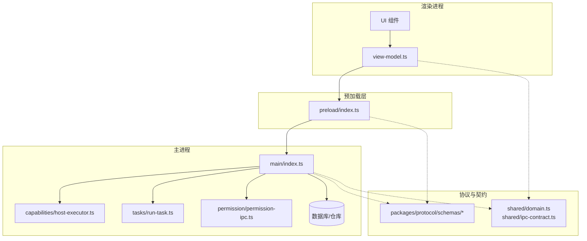
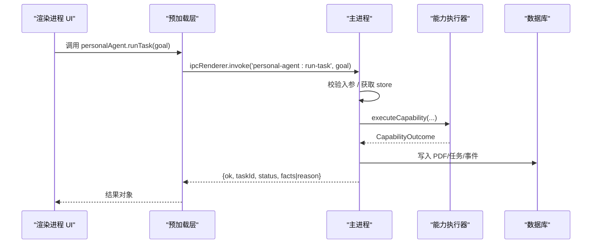
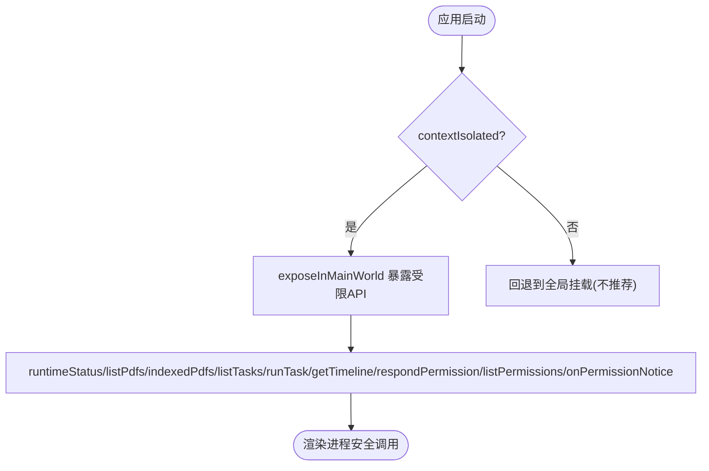
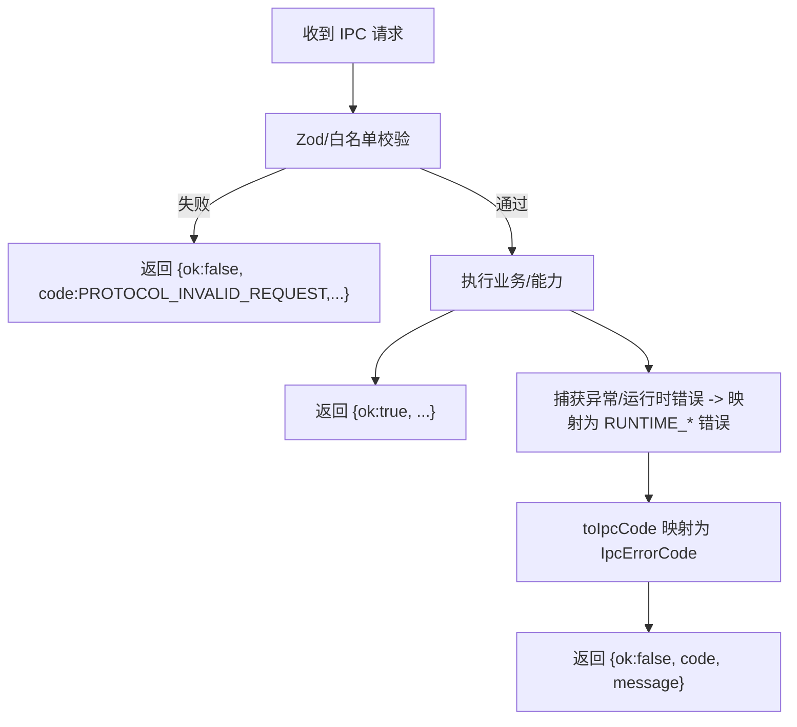
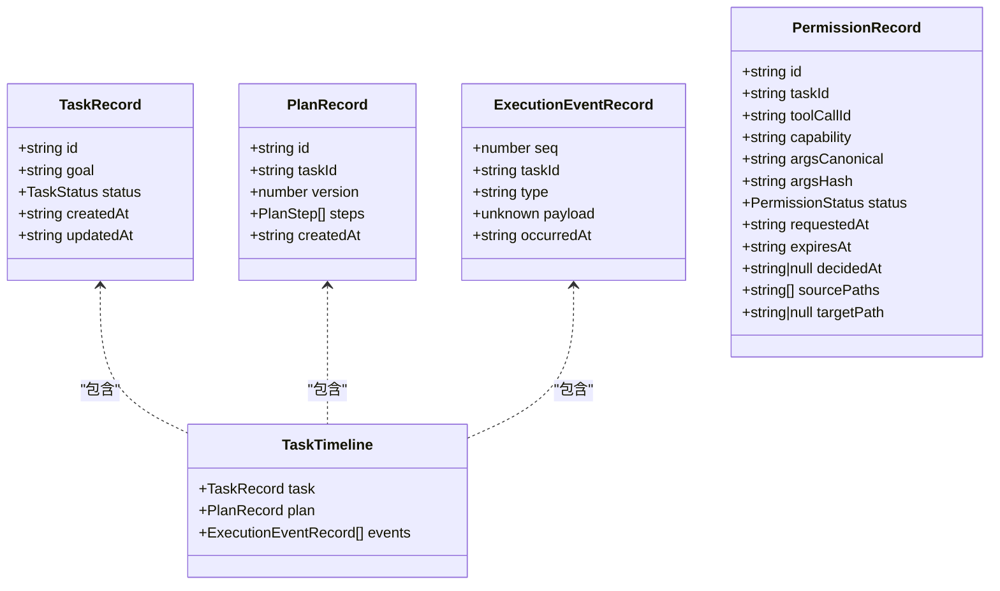
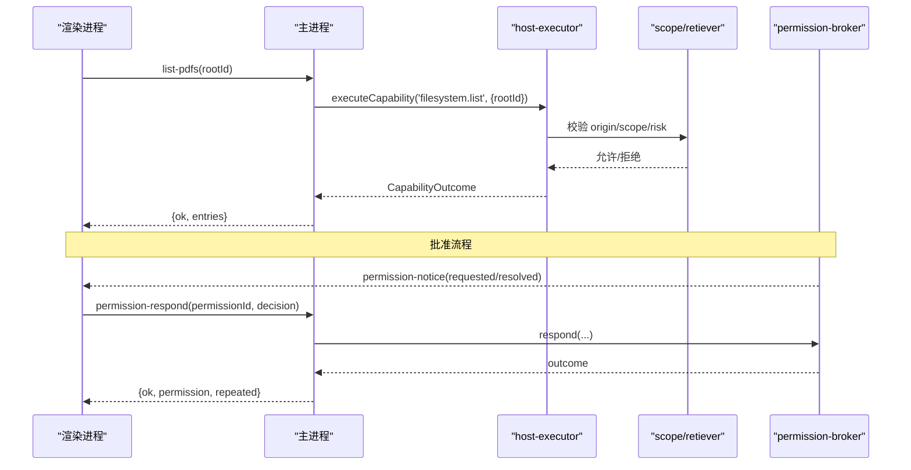
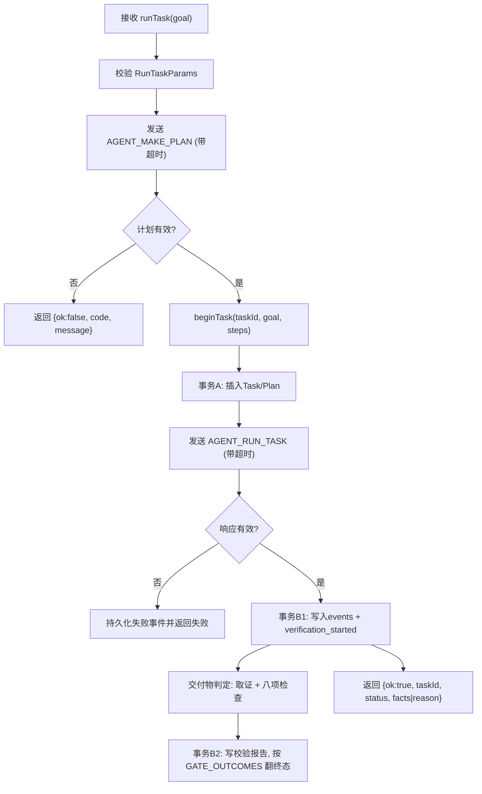
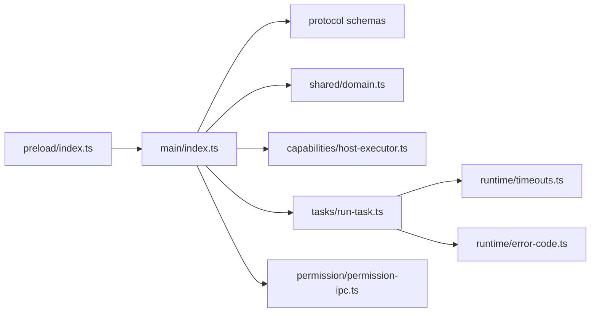

# IPC 通信

<cite>
**本文引用的文件**
- [apps/desktop/src/shared/ipc-contract.ts](file://apps/desktop/src/shared/ipc-contract.ts)
- [apps/desktop/src/preload/index.ts](file://apps/desktop/src/preload/index.ts)
- [apps/desktop/src/main/index.ts](file://apps/desktop/src/main/index.ts)
- [apps/desktop/src/shared/domain.ts](file://apps/desktop/src/shared/domain.ts)
- [packages/protocol/schemas/envelope.ts](file://packages/protocol/schemas/envelope.ts)
- [packages/protocol/schemas/errors.ts](file://packages/protocol/schemas/errors.ts)
- [packages/protocol/schemas/filesystem.ts](file://packages/protocol/schemas/filesystem.ts)
- [apps/desktop/src/main/runtime/error-code.ts](file://apps/desktop/src/main/runtime/error-code.ts)
- [apps/desktop/src/main/permission/permission-ipc.ts](file://apps/desktop/src/main/permission/permission-ipc.ts)
- [apps/desktop/src/main/tasks/run-task.ts](file://apps/desktop/src/main/tasks/run-task.ts)
- [apps/desktop/src/main/capabilities/host-executor.ts](file://apps/desktop/src/main/capabilities/host-executor.ts)
- [apps/desktop/src/main/runtime/timeouts.ts](file://apps/desktop/src/main/runtime/timeouts.ts)
- [apps/desktop/src/renderer/src/view-model.ts](file://apps/desktop/src/renderer/src/view-model.ts)
</cite>

## 目录
1. [简介](#简介)
2. [项目结构](#项目结构)
3. [核心组件](#核心组件)
4. [架构总览](#架构总览)
5. [详细组件分析](#详细组件分析)
6. [依赖关系分析](#依赖关系分析)
7. [性能与并发](#性能与并发)
8. [故障排除指南](#故障排除指南)
9. [结论](#结论)
10. [附录：新增 IPC 接口最佳实践](#附录新增-ipc-接口最佳实践)

## 简介
本文件系统化阐述主进程与渲染进程之间的 IPC 通信机制，覆盖消息格式、错误处理、类型安全保证；预加载脚本的安全边界与 API 暴露策略；共享域模型的数据契约、验证与序列化；以及 IPC 调用的最佳实践（重试、超时、并发控制）。文末提供新增 IPC 接口的步骤与示例路径，并给出调试与排障建议。

## 项目结构
本项目采用 Electron 多进程架构：
- 渲染进程通过 preload 暴露最小化、受控的 API 给 UI。
- 主进程集中注册 ipcMain.handle 处理器，负责参数校验、权限检查、持久化与能力执行。
- 协议与数据契约集中在 packages/protocol 与 apps/desktop/src/shared 中，确保跨进程的类型一致性与可验证性。

图表来源
- [apps/desktop/src/preload/index.ts:1-50](file://apps/desktop/src/preload/index.ts#L1-L50)
- [apps/desktop/src/main/index.ts:1-302](file://apps/desktop/src/main/index.ts#L1-L302)
- [apps/desktop/src/main/capabilities/host-executor.ts:1-55](file://apps/desktop/src/main/capabilities/host-executor.ts#L1-L55)
- [apps/desktop/src/main/tasks/run-task.ts:1-222](file://apps/desktop/src/main/tasks/run-task.ts#L1-L222)
- [apps/desktop/src/main/permission/permission-ipc.ts:1-83](file://apps/desktop/src/main/permission/permission-ipc.ts#L1-L83)
- [packages/protocol/schemas/envelope.ts:1-40](file://packages/protocol/schemas/envelope.ts#L1-L40)
- [packages/protocol/schemas/filesystem.ts:1-71](file://packages/protocol/schemas/filesystem.ts#L1-L71)
- [apps/desktop/src/shared/domain.ts:1-158](file://apps/desktop/src/shared/domain.ts#L1-L158)
- [apps/desktop/src/shared/ipc-contract.ts:1-74](file://apps/desktop/src/shared/ipc-contract.ts#L1-L74)

章节来源
- [apps/desktop/src/preload/index.ts:1-50](file://apps/desktop/src/preload/index.ts#L1-L50)
- [apps/desktop/src/main/index.ts:1-302](file://apps/desktop/src/main/index.ts#L1-L302)
- [packages/protocol/schemas/envelope.ts:1-40](file://packages/protocol/schemas/envelope.ts#L1-L40)
- [apps/desktop/src/shared/ipc-contract.ts:1-74](file://apps/desktop/src/shared/ipc-contract.ts#L1-L74)

## 核心组件
- 预加载桥接层：仅暴露必要方法，使用 contextBridge + contextIsolation，禁止直接访问 Node/Electron API。
- 主进程 IPC 路由：集中注册 channel，统一入参校验、错误码映射、落库与能力调用。
- 协议与契约：使用 Zod schema 定义请求/响应/通知信封与方法名规范；共享领域模型在 shared 中统一定义。
- 能力执行器：对文件系统、工具调用等能力进行范围限制、风险与对齐校验。
- 任务编排：run-task 串联计划生成、运行时调用、事件落库与状态更新。
- 权限通道：三个通道——personal-agent:permission-respond 与 personal-agent:list-permissions 是 renderer 发起的 invoke，personal-agent:permission-notice 是全应用唯一一个 main → renderer 的推送；broker 管理授权生命周期，permission-ipc 负责入参收窄与错误码映射。

章节来源
- [apps/desktop/src/preload/index.ts:1-50](file://apps/desktop/src/preload/index.ts#L1-L50)
- [apps/desktop/src/main/index.ts:35-49](file://apps/desktop/src/main/index.ts#L35-L49)
- [apps/desktop/src/main/index.ts:127-269](file://apps/desktop/src/main/index.ts#L127-L269)
- [packages/protocol/schemas/envelope.ts:1-40](file://packages/protocol/schemas/envelope.ts#L1-L40)
- [apps/desktop/src/main/capabilities/host-executor.ts:1-55](file://apps/desktop/src/main/capabilities/host-executor.ts#L1-L55)
- [apps/desktop/src/main/tasks/run-task.ts:1-222](file://apps/desktop/src/main/tasks/run-task.ts#L1-L222)
- [apps/desktop/src/main/permission/permission-ipc.ts:1-83](file://apps/desktop/src/main/permission/permission-ipc.ts#L1-L83)

## 架构总览
IPC 通信遵循“窄接口、强校验、可观测”的原则：
- 渲染进程通过 preload 暴露的方法发起 invoke，主进程在 handler 中做参数校验、权限检查、能力执行与落库。
- 所有跨进程数据结构均通过 Zod schema 或 TypeScript 联合类型约束，避免脏数据进入系统。
- 错误以统一的 ok/code/message 三元组返回，便于 UI 稳定展示。

图表来源
- [apps/desktop/src/preload/index.ts:23-25](file://apps/desktop/src/preload/index.ts#L23-L25)
- [apps/desktop/src/main/index.ts:200-222](file://apps/desktop/src/main/index.ts#L200-L222)
- [apps/desktop/src/main/capabilities/host-executor.ts:37-55](file://apps/desktop/src/main/capabilities/host-executor.ts#L37-L55)
- [apps/desktop/src/main/tasks/run-task.ts:105-162](file://apps/desktop/src/main/tasks/run-task.ts#L105-L162)

## 详细组件分析

### 预加载脚本的安全机制
- 启用 contextIsolation 与 sandbox，禁用 nodeIntegration，仅通过 contextBridge.exposeInMainWorld 暴露最小 API。
- 暴露的方法均为封装后的 ipcRenderer.invoke/on，严格限定 channel 名称与参数类型。
- 唯一的主→渲染推送通道 onPermissionNotice 返回取消订阅函数，避免内存泄漏与误删监听。

图表来源
- [apps/desktop/src/preload/index.ts:1-50](file://apps/desktop/src/preload/index.ts#L1-L50)
- [apps/desktop/src/main/index.ts:51-67](file://apps/desktop/src/main/index.ts#L51-L67)

章节来源
- [apps/desktop/src/preload/index.ts:1-50](file://apps/desktop/src/preload/index.ts#L1-L50)
- [apps/desktop/src/main/index.ts:51-67](file://apps/desktop/src/main/index.ts#L51-L67)

### 主进程 IPC 路由与错误处理
- 每个 channel 对应一个 handle，统一返回 {ok, code, message} 或业务成功体。
- 入参一律不可信，先通过 Zod schema 或白名单收窄，再交给下游逻辑。
- 错误码分为协议级 ERROR_CODE 与运行时 RUNTIME_ERROR_CODE，最终映射为 IpcErrorCode 供 UI 显示。

图表来源
- [apps/desktop/src/main/index.ts:127-269](file://apps/desktop/src/main/index.ts#L127-L269)
- [apps/desktop/src/main/tasks/run-task.ts:29-37](file://apps/desktop/src/main/tasks/run-task.ts#L29-L37)
- [apps/desktop/src/main/permission/permission-ipc.ts:17-32](file://apps/desktop/src/main/permission/permission-ipc.ts#L17-L32)

章节来源
- [apps/desktop/src/main/index.ts:127-269](file://apps/desktop/src/main/index.ts#L127-L269)
- [apps/desktop/src/main/tasks/run-task.ts:29-37](file://apps/desktop/src/main/tasks/run-task.ts#L29-L37)
- [apps/desktop/src/main/permission/permission-ipc.ts:17-32](file://apps/desktop/src/main/permission/permission-ipc.ts#L17-L32)

### 共享域模型与类型安全
- shared/domain.ts 定义任务、计划、事件、权限等核心实体与枚举，作为跨进程契约。
- shared/ipc-contract.ts 将领域类型与协议错误码组合成 IPC 返回值类型，保证 UI 侧可穷举分支。
- protocol schemas 使用 Zod 对 JSON 报文进行强校验，确保网络/子进程间数据一致性。

图表来源
- [apps/desktop/src/shared/domain.ts:13-94](file://apps/desktop/src/shared/domain.ts#L13-L94)

章节来源
- [apps/desktop/src/shared/domain.ts:1-158](file://apps/desktop/src/shared/domain.ts#L1-L158)
- [apps/desktop/src/shared/ipc-contract.ts:1-74](file://apps/desktop/src/shared/ipc-contract.ts#L1-L74)
- [packages/protocol/schemas/envelope.ts:1-40](file://packages/protocol/schemas/envelope.ts#L1-L40)

### 能力执行与权限控制
- host-executor 基于 scope 与 retriever 实现能力发现与执行，区分 agent 与 UI origin，agent 需对齐当前任务计划。
- 文件系统能力通过 FilesystemListParams/PdfEntry 等 schema 约束，防止非法 rootId 与越界路径。
- 权限 broker 负责授权生命周期：主→渲染通过 personal-agent:permission-notice 推送 PermissionNotice——kind:'requested' 携带完整 PermissionRecord，kind:'resolved' 携带 permissionId 与投影状态（PermissionViewState，含 expired）；载荷由 broker 产出、preload 原样转发、renderer 不做二次解析。渲染侧通过 personal-agent:permission-respond（respondPermission）提交决策，诊断面板通过 personal-agent:list-permissions（listPermissions）读取权限记录及其投影状态。
- permission-ipc 对 renderer 入参一律不可信先收窄：permissionId 必须是非空字符串、decision 必须属于 approved|denied（PERMISSION_DECISIONS），否则返回 PROTOCOL_INVALID_REQUEST；broker.respond 的失败码只放行 PERMISSION_REQUIRED / PERMISSION_DENIED / PERMISSION_EXPIRED / PERMISSION_TAMPERED 四条白名单，白名单外一律映射 RUNTIME_DB_FAILED；product-state 库没打开、broker 未构造时，两个权限通道直接返回 DB_FAILED（“批准通道未就绪”）。

图表来源
- [apps/desktop/src/main/capabilities/host-executor.ts:17-55](file://apps/desktop/src/main/capabilities/host-executor.ts#L17-L55)
- [packages/protocol/schemas/filesystem.ts:1-71](file://packages/protocol/schemas/filesystem.ts#L1-L71)
- [apps/desktop/src/main/permission/permission-ipc.ts:44-83](file://apps/desktop/src/main/permission/permission-ipc.ts#L44-L83)
- [apps/desktop/src/main/index.ts:35-49](file://apps/desktop/src/main/index.ts#L35-L49)
- [apps/desktop/src/main/index.ts:244-269](file://apps/desktop/src/main/index.ts#L244-L269)

章节来源
- [apps/desktop/src/main/capabilities/host-executor.ts:1-55](file://apps/desktop/src/main/capabilities/host-executor.ts#L1-L55)
- [packages/protocol/schemas/filesystem.ts:1-71](file://packages/protocol/schemas/filesystem.ts#L1-L71)
- [apps/desktop/src/main/permission/permission-ipc.ts:1-83](file://apps/desktop/src/main/permission/permission-ipc.ts#L1-L83)
- [apps/desktop/src/main/permission/permission-ipc.ts:17-32](file://apps/desktop/src/main/permission/permission-ipc.ts#L17-L32)
- [apps/desktop/src/shared/domain.ts:86-94](file://apps/desktop/src/shared/domain.ts#L86-L94)
- [apps/desktop/src/preload/index.ts:29-45](file://apps/desktop/src/preload/index.ts#L29-L45)

### 任务编排与异步调用
- run-task 负责端到端编排：索要计划 → 建 Task/Plan → 调用 Python 运行时 → 写事件 → 更新状态。
- 对计划构建与运行分别设置超时，避免长时间阻塞；失败时持久化失败事件并返回稳定的 UI 视图。
- 通过 beginTask/endTask 实现单槽并发控制，避免 ActionAlignment 基准错乱。

图表来源
- [apps/desktop/src/main/tasks/run-task.ts:105-341](file://apps/desktop/src/main/tasks/run-task.ts#L105-L341)
- [apps/desktop/src/main/runtime/timeouts.ts:1-12](file://apps/desktop/src/main/runtime/timeouts.ts#L1-L12)

章节来源
- [apps/desktop/src/main/tasks/run-task.ts:1-222](file://apps/desktop/src/main/tasks/run-task.ts#L1-L222)
- [apps/desktop/src/main/runtime/timeouts.ts:1-12](file://apps/desktop/src/main/runtime/timeouts.ts#L1-L12)

## 依赖关系分析
- 预加载层依赖 Electron 的 contextBridge/ipcRenderer，仅暴露有限方法。
- 主进程依赖 protocol schemas 与 shared domain 进行强校验与类型对齐。
- 能力执行器依赖 scope/retriever/execution-policy 实现细粒度权限控制。
- 任务编排依赖 product-state 仓库与运行时 supervisor，并通过错误码映射保持 UI 稳定性。

图表来源
- [apps/desktop/src/preload/index.ts:1-50](file://apps/desktop/src/preload/index.ts#L1-L50)
- [apps/desktop/src/main/index.ts:1-302](file://apps/desktop/src/main/index.ts#L1-L302)
- [apps/desktop/src/main/tasks/run-task.ts:1-222](file://apps/desktop/src/main/tasks/run-task.ts#L1-L222)
- [apps/desktop/src/main/runtime/timeouts.ts:1-12](file://apps/desktop/src/main/runtime/timeouts.ts#L1-L12)
- [apps/desktop/src/main/runtime/error-code.ts:1-17](file://apps/desktop/src/main/runtime/error-code.ts#L1-L17)

章节来源
- [apps/desktop/src/preload/index.ts:1-50](file://apps/desktop/src/preload/index.ts#L1-L50)
- [apps/desktop/src/main/index.ts:1-302](file://apps/desktop/src/main/index.ts#L1-L302)
- [apps/desktop/src/main/tasks/run-task.ts:1-222](file://apps/desktop/src/main/tasks/run-task.ts#L1-L222)

## 性能与并发
- 超时策略：计划构建与任务运行分别配置超时，避免长尾阻塞；批准窗口 TTL 与余量决定工具调用最大耗时。
- 并发控制：单槽任务上下文，防止 ActionAlignment 基准错乱；同一时刻只允许一个任务对齐计划。
- 错误幂等：失败路径会持久化事件与状态，保证 UI 可观测且可重试。
- 批量写入：PDF 列表入库采用 upsertMany，减少 IO 次数。

章节来源
- [apps/desktop/src/main/runtime/timeouts.ts:1-12](file://apps/desktop/src/main/runtime/timeouts.ts#L1-L12)
- [apps/desktop/src/main/tasks/run-task.ts:127-143](file://apps/desktop/src/main/tasks/run-task.ts#L127-L143)
- [apps/desktop/src/main/index.ts:158-163](file://apps/desktop/src/main/index.ts#L158-L163)

## 故障排除指南
- 常见错误码
  - 协议层：PROTOCOL_INVALID_JSON/REQUEST、METHOD_NOT_FOUND、INVALID_ARGUMENT、CAPABILITY_OUT_OF_SCOPE 等；批准相关的 PERMISSION_REQUIRED/DENIED/EXPIRED/TAMPERED 四条；以及能力失败码 CREATE_DIR_FAILED、MOVE_SOURCE_MISSING/MOVE_TARGET_EXISTS/MOVE_FAILED、REMINDER_TIME_IN_PAST/REMINDER_ALREADY_EXISTS/REMINDER_NOT_FOUND/REMINDER_NOT_DUE、SCHEDULER_CREATE_FAILED、NOTIFICATION_SEND_FAILED 等。
  - 运行时：RUNTIME_NOT_STARTED/TIMEOUT/CRASHED/RESPONSE_INVALID/PLAN_INVALID/DB_FAILED/TASK_BUSY 等。DB_FAILED 同时是 permission-ipc 白名单之外失败码的兜底映射。
- 定位步骤
  - 检查 preload 暴露的 channel 是否与 main 注册一致。
  - 核对入参是否通过 Zod schema 校验，必要时打印解析错误信息。
  - 查看任务时间线中的 task_failed/tool_called/tool_result 事件，定位失败阶段。
  - 若涉及权限，确认 permission-notice 与 respondPermission 配对正确，且未过期。
- UI 展示
  - view-model 中对不同事件类型与状态提供可读标签与摘要，便于快速定位问题。

章节来源
- [packages/protocol/schemas/errors.ts:1-39](file://packages/protocol/schemas/errors.ts#L1-L39)
- [apps/desktop/src/main/runtime/error-code.ts:1-17](file://apps/desktop/src/main/runtime/error-code.ts#L1-L17)
- [apps/desktop/src/renderer/src/view-model.ts:56-90](file://apps/desktop/src/renderer/src/view-model.ts#L56-L90)
- [apps/desktop/src/renderer/src/view-model.ts:179-255](file://apps/desktop/src/renderer/src/view-model.ts#L179-L255)

## 结论
本项目的 IPC 通信以“最小暴露、强校验、可观测”为核心设计原则：
- 预加载层严格控制 API 暴露面，保障渲染进程安全。
- 主进程集中路由与校验，结合协议 schema 与领域模型，确保类型安全与数据一致性。
- 错误处理统一化，UI 侧具备稳定的三态展示与诊断能力。
- 通过超时与单槽并发控制，提升系统鲁棒性与可维护性。

## 附录：新增 IPC 接口最佳实践
- 定义契约
  - 在 shared/ipc-contract.ts 中新增 IPC 输入/输出类型，复用 IpcErrorCode 与领域类型。
  - 如涉及外部协议，先在 packages/protocol/schemas 下新增 Zod schema，并在 index 中导出。
- 暴露 API
  - 在 preload/index.ts 中通过 contextBridge.exposeInMainWorld 暴露新方法，限定参数类型与 channel 名。
- 注册处理器
  - 在 main/index.ts 中新增 ipcMain.handle，完成入参校验、权限检查、能力执行与落库。
  - 统一返回 {ok, code, message} 或业务成功体，错误码映射至 IpcErrorCode。
- 异步与双向通信
  - 单向调用使用 ipcRenderer.invoke；如需主→渲染推送，使用 ipcRenderer.on 并返回取消订阅函数。
  - 对于长耗时任务，建议在任务内部持久化事件，渲染侧通过 get-timeline 轮询或事件驱动刷新。
- 错误重试与超时
  - 在渲染侧根据 code 决定是否重试（如 TIMEOUT），并限制重试次数。
  - 主侧已内置超时与单槽并发，避免重复提交导致的状态不一致。
- 代码示例路径
  - 新增 IPC 入口参考：[apps/desktop/src/main/index.ts:127-269](file://apps/desktop/src/main/index.ts#L127-L269)
  - 预加载暴露参考：[apps/desktop/src/preload/index.ts:10-45](file://apps/desktop/src/preload/index.ts#L10-L45)
  - 协议校验参考：[packages/protocol/schemas/filesystem.ts:1-71](file://packages/protocol/schemas/filesystem.ts#L1-L71)
  - 错误码映射参考：[apps/desktop/src/main/tasks/run-task.ts:29-37](file://apps/desktop/src/main/tasks/run-task.ts#L29-L37)
  - 权限通道参考：[apps/desktop/src/main/permission/permission-ipc.ts:44-83](file://apps/desktop/src/main/permission/permission-ipc.ts#L44-L83)