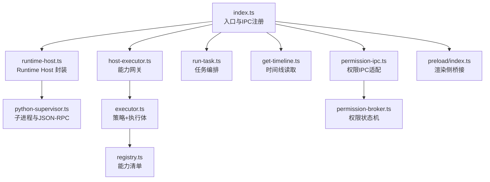
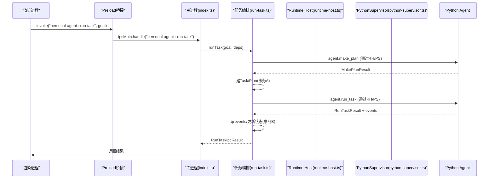
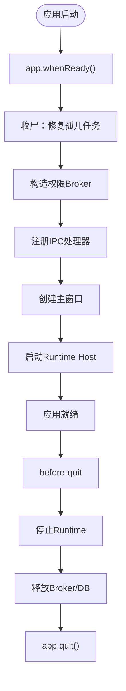
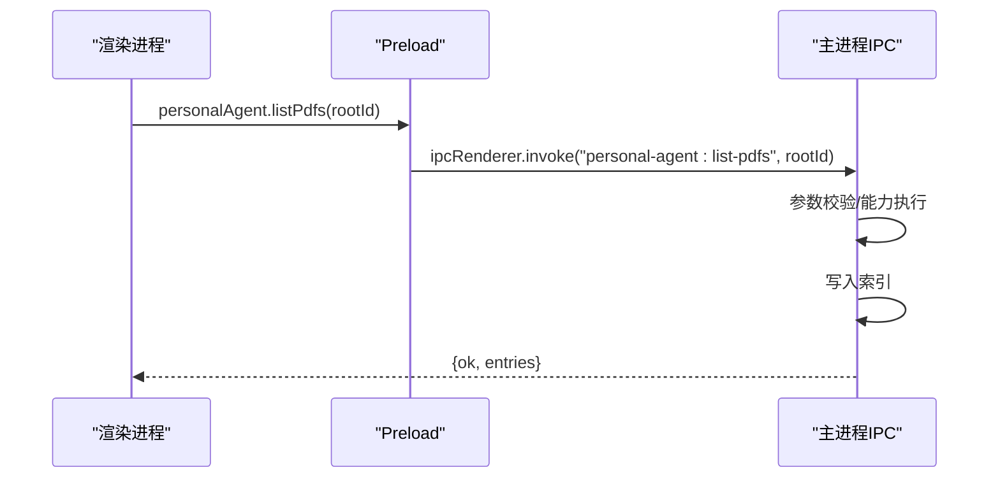
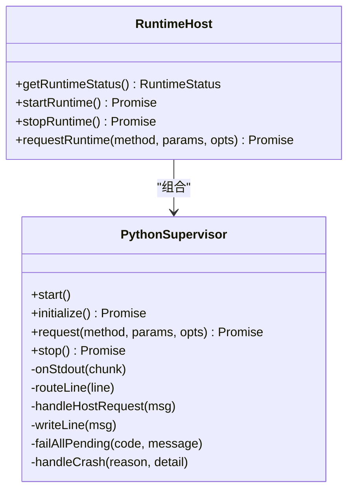
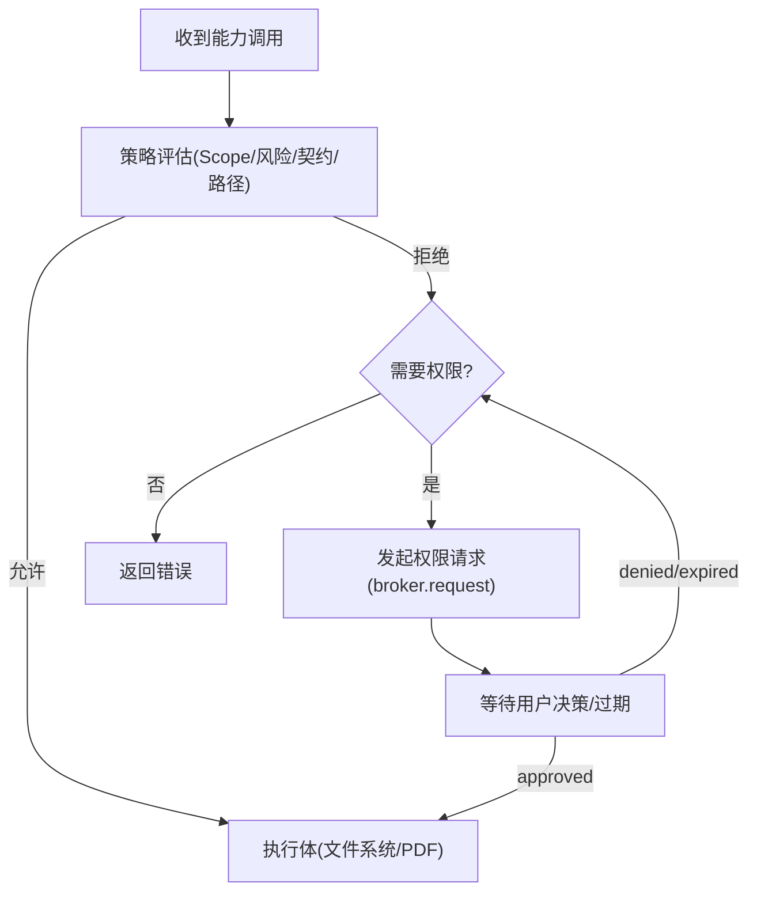
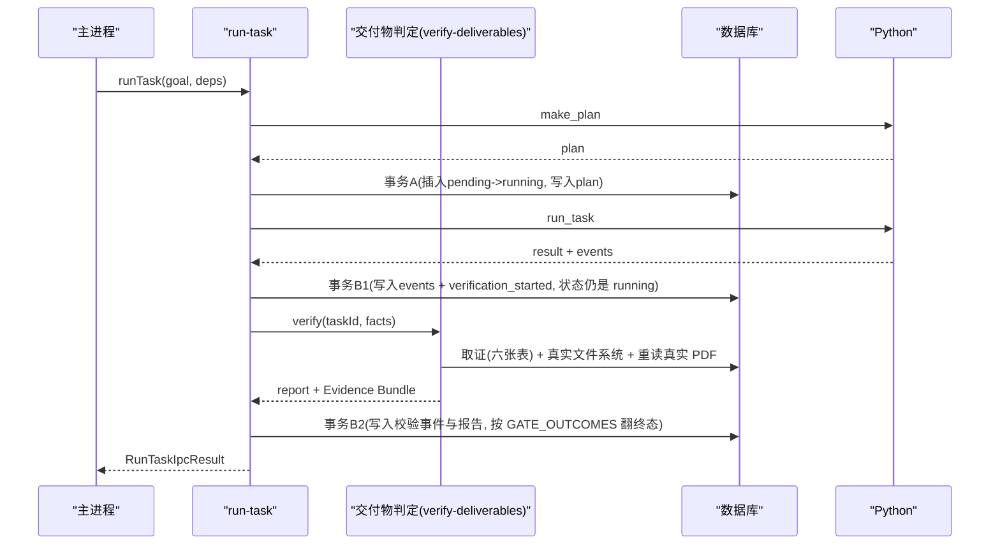
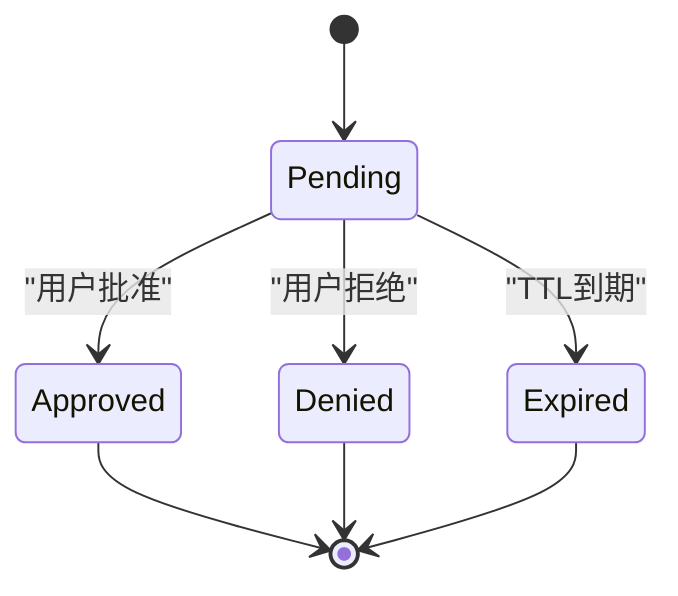
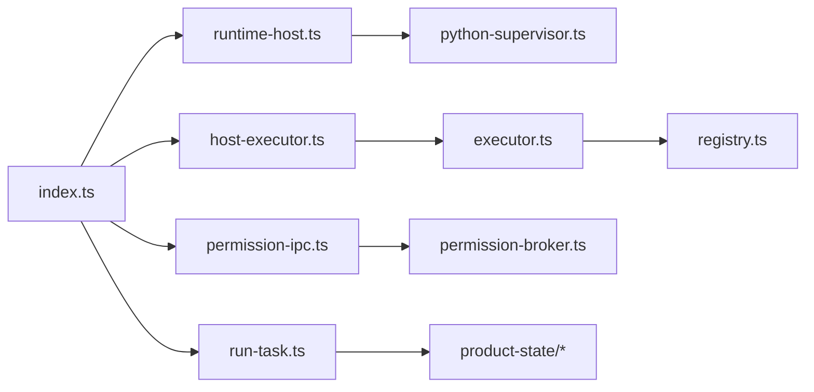

# 主进程架构

<cite>
**本文引用的文件**
- [apps/desktop/src/main/index.ts](file://apps/desktop/src/main/index.ts)
- [apps/desktop/src/main/runtime/runtime-host.ts](file://apps/desktop/src/main/runtime/runtime-host.ts)
- [apps/desktop/src/main/runtime/python-supervisor.ts](file://apps/desktop/src/main/runtime/python-supervisor.ts)
- [apps/desktop/src/main/capabilities/host-executor.ts](file://apps/desktop/src/main/capabilities/host-executor.ts)
- [apps/desktop/src/main/capabilities/executor.ts](file://apps/desktop/src/main/capabilities/executor.ts)
- [apps/desktop/src/main/capabilities/registry.ts](file://apps/desktop/src/main/capabilities/registry.ts)
- [apps/desktop/src/main/tasks/run-task.ts](file://apps/desktop/src/main/tasks/run-task.ts)
- [apps/desktop/src/main/tasks/get-timeline.ts](file://apps/desktop/src/main/tasks/get-timeline.ts)
- [apps/desktop/src/main/permission/permission-broker.ts](file://apps/desktop/src/main/permission/permission-broker.ts)
- [apps/desktop/src/main/permission/permission-ipc.ts](file://apps/desktop/src/main/permission/permission-ipc.ts)
- [apps/desktop/src/preload/index.ts](file://apps/desktop/src/preload/index.ts)
- [apps/desktop/src/shared/ipc-contract.ts](file://apps/desktop/src/shared/ipc-contract.ts)
- [apps/desktop/src/shared/domain.ts](file://apps/desktop/src/shared/domain.ts)
</cite>

## 目录
1. [简介](#简介)
2. [项目结构](#项目结构)
3. [核心组件](#核心组件)
4. [架构总览](#架构总览)
5. [详细组件分析](#详细组件分析)
6. [依赖关系分析](#依赖关系分析)
7. [性能考量](#性能考量)
8. [故障排查指南](#故障排查指南)
9. [结论](#结论)
10. [附录：扩展与示例](#附录：扩展与示例)

## 简介
本文面向 Electron 主进程的架构设计与实现，聚焦以下目标：
- 应用启动流程：app.whenReady()、窗口创建、生命周期管理
- IPC 处理器注册机制：任务执行、文件操作、权限管理等核心接口
- 运行时宿主（Runtime Host）集成：Python 子进程启动、停止、状态监控
- 错误处理策略与异常恢复
- 如何添加新的 IPC 处理器、处理异步任务、资源清理
- 调试技巧与性能优化建议

## 项目结构
主进程代码集中在 apps/desktop/src/main，按职责分层组织：
- index.ts：入口，负责初始化、IPC 注册、窗口与生命周期、启动 Runtime Host
- runtime：Python 子进程管理与协议握手
- capabilities：能力注册与执行器（文件系统、PDF 提取等）
- tasks：任务编排（计划生成、运行、时间线查询）
- permission：权限申请、审批、过期与通知
- preload：安全桥接，向渲染进程暴露最小 API
- shared：跨进程共享类型与领域模型

图表来源
- [apps/desktop/src/main/index.ts:95-331](file://apps/desktop/src/main/index.ts#L95-L331)
- [apps/desktop/src/main/runtime/runtime-host.ts:15-87](file://apps/desktop/src/main/runtime/runtime-host.ts#L15-L87)
- [apps/desktop/src/main/runtime/python-supervisor.ts:96-153](file://apps/desktop/src/main/runtime/python-supervisor.ts#L96-L153)
- [apps/desktop/src/main/capabilities/host-executor.ts:62-117](file://apps/desktop/src/main/capabilities/host-executor.ts#L62-L117)
- [apps/desktop/src/main/capabilities/executor.ts:73-113](file://apps/desktop/src/main/capabilities/executor.ts#L73-L113)
- [apps/desktop/src/main/capabilities/registry.ts:9-40](file://apps/desktop/src/main/capabilities/registry.ts#L9-L40)
- [apps/desktop/src/main/tasks/run-task.ts:105-162](file://apps/desktop/src/main/tasks/run-task.ts#L105-L162)
- [apps/desktop/src/main/tasks/get-timeline.ts:17-52](file://apps/desktop/src/main/tasks/get-timeline.ts#L17-L52)
- [apps/desktop/src/main/permission/permission-ipc.ts:44-83](file://apps/desktop/src/main/permission/permission-ipc.ts#L44-L83)
- [apps/desktop/src/main/permission/permission-broker.ts:132-257](file://apps/desktop/src/main/permission/permission-broker.ts#L132-L257)
- [apps/desktop/src/preload/index.ts:10-45](file://apps/desktop/src/preload/index.ts#L10-L45)

章节来源
- [apps/desktop/src/main/index.ts:95-331](file://apps/desktop/src/main/index.ts#L95-L331)

## 核心组件
- 应用入口与生命周期
  - app.whenReady() 中完成产品状态“收尸”、权限 Broker 构造、IPC 注册、窗口创建、Runtime Host 启动
  - before-quit 顺序关闭 Runtime、权限 Broker、数据库并退出
- Runtime Host
  - PythonSupervisor 管理子进程、JSON-RPC 请求/响应、超时、崩溃、stderr 日志
  - runtime-host 提供 start/stop/status/request 的窄接口
- 能力执行器
  - host-executor 为 IPC 和 Python 反向调用提供统一入口
  - executor 基于策略（Scope、风险、契约、路径）选择具体执行体
  - registry 声明可用能力及其读写属性
- 任务编排
  - run-task 负责计划生成、持久化、调用 Python 运行、事件落库、状态更新；completed 只有在交付物校验通过后才落库（TASK-026）
  - get-timeline 从仓库投影出任务时间线
- 交付物校验（TASK-026）
  - verification/evidence-bundle 从 Product State 六张表、真实文件系统与**重读的真实 PDF** 取证：selected_pdf 跟随移动后的位置，页号不是抄 Python 回传的页数
  - verification/verify-deliverables 是 completed 的唯一闸口，表驱动八项检查，必需性按计划推导（有 move 才要求文件与批准、有 scheduler.create 才要求 Reminder）
  - verification/ports 是三个外部依赖的生产实现（路径解析复用 path-guard、页号重读真实 PDF、存在性走真实 stat），失败各打一条 console.warn 且不进事件与 Bundle
- 权限系统
  - permission-broker 维护 Permission 生命周期（请求、过期、批准/拒绝），并向渲染进程推送通知
  - permission-ipc 将渲染进程请求转换为 broker 调用，做入参校验与错误码映射

章节来源
- [apps/desktop/src/main/index.ts:252-302](file://apps/desktop/src/main/index.ts#L252-L302)
- [apps/desktop/src/main/runtime/runtime-host.ts:22-87](file://apps/desktop/src/main/runtime/runtime-host.ts#L22-L87)
- [apps/desktop/src/main/runtime/python-supervisor.ts:66-153](file://apps/desktop/src/main/runtime/python-supervisor.ts#L66-L153)
- [apps/desktop/src/main/capabilities/host-executor.ts:62-117](file://apps/desktop/src/main/capabilities/host-executor.ts#L62-L117)
- [apps/desktop/src/main/capabilities/executor.ts:44-113](file://apps/desktop/src/main/capabilities/executor.ts#L44-L113)
- [apps/desktop/src/main/capabilities/registry.ts:9-40](file://apps/desktop/src/main/capabilities/registry.ts#L9-L40)
- [apps/desktop/src/main/tasks/run-task.ts:105-341](file://apps/desktop/src/main/tasks/run-task.ts#L105-L341)
- [apps/desktop/src/main/tasks/get-timeline.ts:17-52](file://apps/desktop/src/main/tasks/get-timeline.ts#L17-L52)
- [apps/desktop/src/main/verification/evidence-bundle.ts:484-558](file://apps/desktop/src/main/verification/evidence-bundle.ts#L484-L558)
- [apps/desktop/src/main/verification/verify-deliverables.ts:259-282](file://apps/desktop/src/main/verification/verify-deliverables.ts#L259-L282)
- [apps/desktop/src/main/verification/ports.ts:21-85](file://apps/desktop/src/main/verification/ports.ts#L21-L85)
- [apps/desktop/src/main/permission/permission-broker.ts:132-257](file://apps/desktop/src/main/permission/permission-broker.ts#L132-L257)
- [apps/desktop/src/main/permission/permission-ipc.ts:44-83](file://apps/desktop/src/main/permission/permission-ipc.ts#L44-L83)

## 架构总览
下图展示从渲染进程到主进程再到 Python 子进程的完整调用链。

图表来源
- [apps/desktop/src/preload/index.ts:23-25](file://apps/desktop/src/preload/index.ts#L23-L25)
- [apps/desktop/src/main/index.ts:252-275](file://apps/desktop/src/main/index.ts#L252-L275)
- [apps/desktop/src/main/tasks/run-task.ts:105-341](file://apps/desktop/src/main/tasks/run-task.ts#L105-L341)
- [apps/desktop/src/main/runtime/runtime-host.ts:77-87](file://apps/desktop/src/main/runtime/runtime-host.ts#L77-L87)
- [apps/desktop/src/main/runtime/python-supervisor.ts:129-153](file://apps/desktop/src/main/runtime/python-supervisor.ts#L129-L153)

## 详细组件分析

### 应用启动与生命周期
- 在 app.whenReady() 中：
  - 先进行“收尸”，修复孤儿任务，避免 UI 读到僵尸 running
  - 构造权限 Broker，失败时降级，不影响 PDF 列表等其它功能
  - 注册所有 IPC 处理器（运行时状态、PDF 列表、索引、任务列表、运行任务、时间线、权限响应/列表）
  - 创建主窗口，设置 webPreferences（沙箱、上下文隔离、禁用 Node 集成）
  - 启动 Runtime Host
- 退出流程：
  - before-quit 中依次停止 Runtime、释放权限 Broker、关闭数据库、退出应用

图表来源
- [apps/desktop/src/main/index.ts:95-129](file://apps/desktop/src/main/index.ts#L95-L129)
- [apps/desktop/src/main/index.ts:131-322](file://apps/desktop/src/main/index.ts#L131-L322)
- [apps/desktop/src/main/index.ts:336-346](file://apps/desktop/src/main/index.ts#L336-L346)

章节来源
- [apps/desktop/src/main/index.ts:95-346](file://apps/desktop/src/main/index.ts#L95-L346)

### IPC 处理器注册机制
- 预加载层（preload）通过 contextBridge 暴露最小 API，仅转发必要的 IPC 通道
- 主进程使用 ipcMain.handle 注册处理器，统一返回 { ok, code, message } 或业务成功结构
- 关键通道：
  - personal-agent:runtime-status：查询 Runtime 状态
  - personal-agent:list-pdfs：列出授权根下的条目，写入本地索引
  - personal-agent:indexed-pdfs：读取已索引 PDF
  - personal-agent:list-tasks：读取历史任务列表
  - personal-agent:run-task：触发任务执行
  - personal-agent:get-timeline：读取任务时间线
  - personal-agent:permission-respond / personal-agent:list-permissions：权限面板交互（批准/拒绝、权限记录只读观察）
  - personal-agent:permission-notice：非 handle 通道，main → renderer 的推送，由 broadcastPermissionNotice 向所有窗口广播 PermissionNotice

图表来源
- [apps/desktop/src/preload/index.ts:14-16](file://apps/desktop/src/preload/index.ts#L14-L16)
- [apps/desktop/src/main/index.ts:134-217](file://apps/desktop/src/main/index.ts#L134-L217)

章节来源
- [apps/desktop/src/preload/index.ts:10-45](file://apps/desktop/src/preload/index.ts#L10-L45)
- [apps/desktop/src/main/index.ts:131-322](file://apps/desktop/src/main/index.ts#L131-L322)

### 运行时宿主（Runtime Host）集成
- 启动流程：
  - 解析 Python 可执行路径与工作目录
  - 检查 venv python 是否存在，不存在则标记 crashed
  - 创建 PythonSupervisor，注入 hostHandler 与可见能力清单
  - 监听 stderr、runtime.crashed 事件
  - 调用 initialize 握手，成功后状态置为 ready
- 停止流程：
  - 发送 EOF 等待子进程退出，超时强制 kill
  - 清理 pending 请求，重置状态
- 请求转发：
  - request(method, params, opts) 封装 JSON-RPC 请求，支持超时与取消信号
  - 对 Python 反向调用 host.execute_tool，交由 host-executor 路由到具体能力

图表来源
- [apps/desktop/src/main/runtime/python-supervisor.ts:66-153](file://apps/desktop/src/main/runtime/python-supervisor.ts#L66-L153)
- [apps/desktop/src/main/runtime/runtime-host.ts:15-87](file://apps/desktop/src/main/runtime/runtime-host.ts#L15-L87)

章节来源
- [apps/desktop/src/main/runtime/runtime-host.ts:15-87](file://apps/desktop/src/main/runtime/runtime-host.ts#L15-L87)
- [apps/desktop/src/main/runtime/python-supervisor.ts:96-153](file://apps/desktop/src/main/runtime/python-supervisor.ts#L96-L153)

### 能力执行与权限控制
- 能力注册：registry 声明能力名、种类（READ/WRITE）、描述，当前共六项——filesystem.list、document.extract_pdf（READ），filesystem.create_dir、filesystem.move、scheduler.create、notification.send（WRITE）
- 能力执行：
  - host-executor 提供两个执行器：agentExecutor（受任务上下文约束）与 uiExecutor（无任务上下文）
  - executor 基于策略评估（Scope、风险、契约、路径）后按 registry 真名分派执行体；已实现 filesystem.list、document.extract_pdf、filesystem.create_dir、filesystem.move、scheduler.create，未登记执行体的能力（如 notification.send）兜底返回 NOT_IMPLEMENTED
  - WRITE 能力默认过幂等关：执行前 beginAttempt 查 tool_executions（idempotencyKey = capability + ':' + argsHash），已成功直接返回缓存结果、矛盾态拒绝；执行后 afterExecute 把 attempting 翻成终态。scheduler.create 是例外，不进这道关——它的副作用是库内一行而非文件系统，由 reminders.task_id UNIQUE 与执行体内按 idempotencyKey 比对覆盖幂等
  - scheduler.create 成功时把一条 scheduled Reminder 与 reminder_created 事件同事务落库；同参重试幂等返回已有记录（created:false），异参拒绝并回 REMINDER_ALREADY_EXISTS
- 权限控制：
  - permission-broker 维护 Permission 的生命周期，支持请求、过期、批准/拒绝
  - verifyPermission 在执行前进行六步验证（存在性、状态、过期、toolCallId、参数哈希、路径复查）

图表来源
- [apps/desktop/src/main/capabilities/host-executor.ts:62-117](file://apps/desktop/src/main/capabilities/host-executor.ts#L62-L117)
- [apps/desktop/src/main/capabilities/executor.ts:89-143](file://apps/desktop/src/main/capabilities/executor.ts#L89-L143)
- [apps/desktop/src/main/permission/permission-broker.ts:132-257](file://apps/desktop/src/main/permission/permission-broker.ts#L132-L257)

章节来源
- [apps/desktop/src/main/capabilities/registry.ts:9-40](file://apps/desktop/src/main/capabilities/registry.ts#L9-L40)
- [apps/desktop/src/main/capabilities/host-executor.ts:62-117](file://apps/desktop/src/main/capabilities/host-executor.ts#L62-L117)
- [apps/desktop/src/main/capabilities/executor.ts:89-143](file://apps/desktop/src/main/capabilities/executor.ts#L89-L143)
- [apps/desktop/src/main/capabilities/executor.ts:195-276](file://apps/desktop/src/main/capabilities/executor.ts#L195-L276)
- [apps/desktop/src/main/permission/permission-broker.ts:282-327](file://apps/desktop/src/main/permission/permission-broker.ts#L282-L327)

### 任务编排与时间线
- run-task：
  - 参数校验 -> 调用 Python 生成计划 -> 建 Task/Plan（事务A）-> 调用 Python 运行 -> 写事件与校验开始标记（事务B1）-> **交付物判定** -> 写校验报告与终态（事务B2）
  - completed 只能由判定表翻转：B1 只落 Python 事件 + verification_started 且状态**留在 running**，判定跑完才由 B2 按 GATE_OUTCOMES 那张表写 verification_passed/failed、必要时补一条 task_failed(RUNTIME_VERIFICATION_FAILED) 并翻终态（TASK-026）
  - 判定要读库、读真实 PDF、读文件系统，塞不进 better-sqlite3 的同步事务，所以 B1 与 B2 之间有一小段 running 窗口：此刻崩溃任务变孤儿，由启动收尸收成 failed——宁可失败也不放行未校验的 completed
  - 判定器抛异常按「未通过」处理（fail-closed）；Python 回 failed 时不开校验，直接落终态
  - 始终返回 RunTaskIpcResult，失败也走 ok:true + status:'failed' 的约定
- get-timeline：
  - 支持传入 taskId 或 null（最近一个任务）
  - 通过 projectTimeline 投影出任务、计划、事件

图表来源
- [apps/desktop/src/main/tasks/run-task.ts:105-341](file://apps/desktop/src/main/tasks/run-task.ts#L105-L341)
- [apps/desktop/src/main/tasks/get-timeline.ts:17-52](file://apps/desktop/src/main/tasks/get-timeline.ts#L17-L52)
- [apps/desktop/src/main/verification/verify-task.ts:35-43](file://apps/desktop/src/main/verification/verify-task.ts#L35-L43)

章节来源
- [apps/desktop/src/main/tasks/run-task.ts:167-341](file://apps/desktop/src/main/tasks/run-task.ts#L167-L341)
- [apps/desktop/src/main/tasks/get-timeline.ts:17-52](file://apps/desktop/src/main/tasks/get-timeline.ts#L17-L52)
- [apps/desktop/src/main/verification/verify-deliverables.ts:259-282](file://apps/desktop/src/main/verification/verify-deliverables.ts#L259-L282)
- [apps/desktop/src/main/verification/evidence-bundle.ts:484-558](file://apps/desktop/src/main/verification/evidence-bundle.ts#L484-L558)

### 权限系统与通知
- 权限请求：
  - broker.request 生成 PermissionRecord，落库并推送 requested 通知
  - 挂起等待用户决策，超过 TTL 自动过期并推送 expired 通知
- 通知通道：
  - PermissionNotice 定义在 shared/domain.ts（permission-broker 仅 re-export），两种载荷：kind:'requested' 携带完整 PermissionRecord；kind:'resolved' 携带 permissionId 与投影状态（PermissionViewState，含 expired）
  - main/index.ts 用 broadcastPermissionNotice 把通知广播到所有窗口的 personal-agent:permission-notice 通道；preload 的 onPermissionNotice 是全应用唯一的 main → renderer 订阅入口，返回取消订阅函数
  - 注意状态机图中的 Expired 是投影态：过期不改库，status 停在 pending、decidedAt 保持 null
- 权限响应：
  - renderer 经 personal-agent:permission-respond 通道触发 broker.respond 更新状态并推送 resolved 通知；permission-ipc 先收窄输入（permissionId 非空字符串、decision ∈ approved|denied，否则 PROTOCOL_INVALID_REQUEST），broker 失败码经 PERMISSION_REQUIRED/DENIED/EXPIRED/TAMPERED 白名单映射，白名单外收成 DB_FAILED
  - 诊断面板经 personal-agent:list-permissions 通道读取任务的权限记录与投影状态（broker.listForTask）
  - 重复响应同一 ID 且结论一致视为幂等（repeated=true，无副作用）
  - 启动时 product-state 库没打开、broker 未构造，两个权限通道直接返回 DB_FAILED（“批准通道未就绪”）
- 执行前验证：
  - verifyPermission 进行六步校验，确保工具调用未被篡改且路径合法

图表来源
- [apps/desktop/src/main/permission/permission-broker.ts:132-257](file://apps/desktop/src/main/permission/permission-broker.ts#L132-L257)
- [apps/desktop/src/main/permission/permission-ipc.ts:44-83](file://apps/desktop/src/main/permission/permission-ipc.ts#L44-L83)

章节来源
- [apps/desktop/src/main/permission/permission-broker.ts:132-257](file://apps/desktop/src/main/permission/permission-broker.ts#L132-L257)
- [apps/desktop/src/main/permission/permission-ipc.ts:17-32](file://apps/desktop/src/main/permission/permission-ipc.ts#L17-L32)
- [apps/desktop/src/main/permission/permission-ipc.ts:44-83](file://apps/desktop/src/main/permission/permission-ipc.ts#L44-L83)
- [apps/desktop/src/main/index.ts:35-54](file://apps/desktop/src/main/index.ts#L35-L54)
- [apps/desktop/src/main/index.ts:296-321](file://apps/desktop/src/main/index.ts#L296-L321)
- [apps/desktop/src/preload/index.ts:35-45](file://apps/desktop/src/preload/index.ts#L35-L45)
- [apps/desktop/src/shared/domain.ts:86-94](file://apps/desktop/src/shared/domain.ts#L86-L94)

## 依赖关系分析
- 耦合与内聚
  - index.ts 作为装配中心，依赖各模块但保持低耦合（通过依赖注入传递仓库实例）
  - runtime-host 与 python-supervisor 解耦，supervisor 专注子进程与协议
  - executor 与能力实现通过策略与检索器解耦，便于扩展新能力
- 外部依赖
  - @personal-agent/protocol：定义协议、错误码、能力描述
  - electron：窗口、IPC、shell 等
  - node:child_process：子进程管理
- 潜在循环依赖
  - 通过依赖注入与接口抽象避免循环引用（如 run-task 通过 send 接口调用 runtime）

图表来源
- [apps/desktop/src/main/index.ts:95-331](file://apps/desktop/src/main/index.ts#L95-L331)
- [apps/desktop/src/main/runtime/runtime-host.ts:15-87](file://apps/desktop/src/main/runtime/runtime-host.ts#L15-L87)
- [apps/desktop/src/main/capabilities/host-executor.ts:62-117](file://apps/desktop/src/main/capabilities/host-executor.ts#L62-L117)
- [apps/desktop/src/main/tasks/run-task.ts:105-341](file://apps/desktop/src/main/tasks/run-task.ts#L105-L341)
- [apps/desktop/src/main/permission/permission-ipc.ts:44-83](file://apps/desktop/src/main/permission/permission-ipc.ts#L44-L83)

章节来源
- [apps/desktop/src/main/index.ts:95-331](file://apps/desktop/src/main/index.ts#L95-L331)

## 性能考量
- 子进程通信
  - 使用行缓冲 JSON-RPC，避免粘包；合理设置默认超时与 host 超时
  - 崩溃时快速失败并清理 pending 请求，避免内存泄漏
- 数据库访问
  - 使用事务批量写入事件与状态，减少锁竞争
  - 只读通道（如 list-tasks、get-timeline）不写库，降低开销
- 能力执行
  - 策略前置校验，尽早拒绝非法调用，减少无效 IO
  - 文件读取使用 realpath 后的绝对路径，避免符号链接带来的额外解析
- 资源清理
  - before-quit 顺序关闭 Runtime、Broker、DB，确保资源释放
  - 权限 Broker 的定时器在 dispose 中清理

[本节为通用指导，不直接分析具体文件]

## 故障排查指南
- Runtime 未启动或崩溃
  - 检查 venv python 是否存在；查看 stderr 输出；确认 initialize 握手是否成功
  - 关注 runtime.crashed 事件与状态变更
- 任务执行失败
  - 查看 run-task 的事务 A/B 是否成功；检查 Python 返回的 RunTaskResult 是否符合契约
  - 注意 PLAN_NOT_BUILDABLE 会直接返回失败，无需进入运行阶段
- 权限问题
  - 确认 Permission 是否存在、是否过期、toolCallId 与 argsHash 是否匹配
  - 路径复查失败通常源于不在授权根目录下
- 数据库错误
  - 捕获并记录 DB_FAILED；检查连接与事务是否正常提交

章节来源
- [apps/desktop/src/main/runtime/runtime-host.ts:43-62](file://apps/desktop/src/main/runtime/runtime-host.ts#L43-L62)
- [apps/desktop/src/main/runtime/python-supervisor.ts:225-255](file://apps/desktop/src/main/runtime/python-supervisor.ts#L225-L255)
- [apps/desktop/src/main/tasks/run-task.ts:105-116](file://apps/desktop/src/main/tasks/run-task.ts#L105-L116)
- [apps/desktop/src/main/permission/permission-broker.ts:282-327](file://apps/desktop/src/main/permission/permission-broker.ts#L282-L327)

## 结论
该主进程架构以清晰的层次划分与严格的契约校验为核心：
- 入口集中管理生命周期与 IPC 注册，保证启动与退出的健壮性
- Runtime Host 封装 Python 子进程，提供稳定的 RPC 接口与错误语义
- 能力执行器通过策略与检索器解耦，易于扩展新能力
- 权限系统贯穿执行链路，确保敏感操作的合规与安全
- 统一的错误码与结果结构简化了前后端协作与排错

[本节为总结，不直接分析具体文件]

## 附录：扩展与示例

### 如何添加新的 IPC 处理器
步骤：
- 在 index.ts 中新增 ipcMain.handle 注册，定义通道名与处理逻辑
- 如需能力执行，调用 host-executor 的 executeCapability
- 返回统一的结果结构（{ ok, code, message } 或业务成功结构）
- 在 preload 中暴露对应方法供渲染进程调用

参考路径
- [apps/desktop/src/main/index.ts:131-322](file://apps/desktop/src/main/index.ts#L131-L322)
- [apps/desktop/src/preload/index.ts:10-45](file://apps/desktop/src/preload/index.ts#L10-L45)

### 如何处理异步任务与资源清理
- 使用 try/finally 确保 endTask 等资源释放
- 对数据库操作使用事务包裹，失败时回滚并返回错误码
- 对 Runtime 请求设置超时与取消信号，避免长时间阻塞

参考路径
- [apps/desktop/src/main/tasks/run-task.ts:146-161](file://apps/desktop/src/main/tasks/run-task.ts#L146-L161)
- [apps/desktop/src/main/runtime/python-supervisor.ts:156-200](file://apps/desktop/src/main/runtime/python-supervisor.ts#L156-L200)

### 调试技巧
- 开发模式下打印 Python stderr 输出，定位子进程问题
- 使用浏览器 DevTools 观察 IPC 调用与返回值
- 在权限面板查看 Permission 的状态变化与过期时间

参考路径
- [apps/desktop/src/main/runtime/runtime-host.ts:47-50](file://apps/desktop/src/main/runtime/runtime-host.ts#L47-L50)
- [apps/desktop/src/main/permission/permission-ipc.ts:70-83](file://apps/desktop/src/main/permission/permission-ipc.ts#L70-L83)

### 性能优化建议
- 批量写入事件与状态，减少数据库往返
- 对只读查询使用轻量级读取，避免不必要的事务
- 合理设置超时，避免长耗时操作阻塞主线程

[本节为通用指导，不直接分析具体文件]