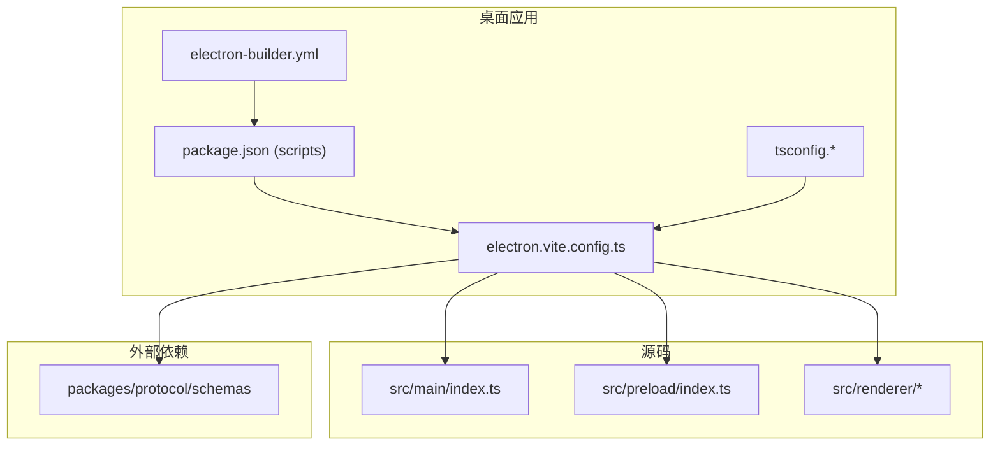
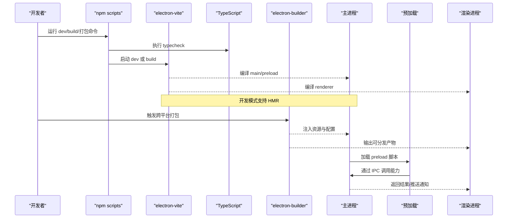
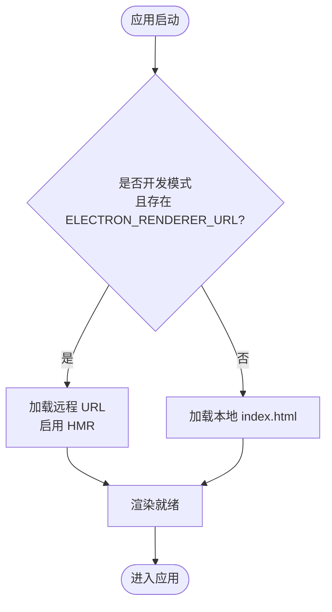
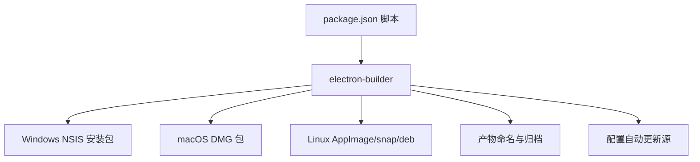
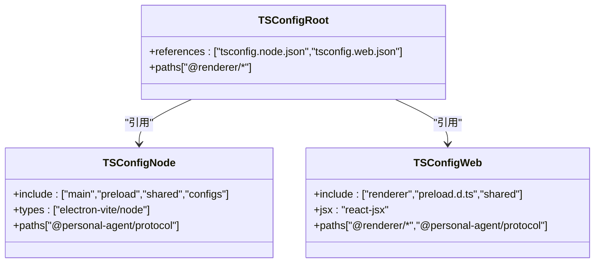
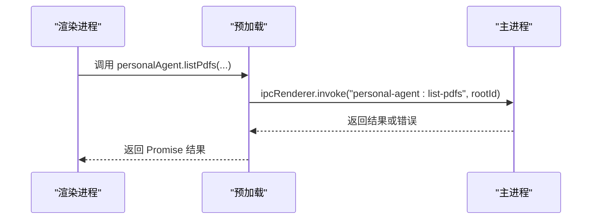
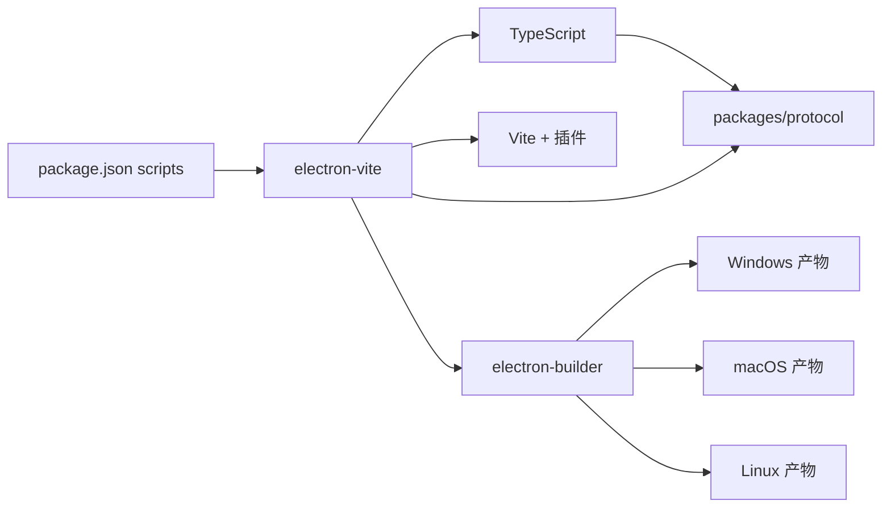

# 构建与部署

<cite>
**本文引用的文件**
- [apps/desktop/package.json](file://apps/desktop/package.json)
- [apps/desktop/electron.vite.config.ts](file://apps/desktop/electron.vite.config.ts)
- [apps/desktop/electron-builder.yml](file://apps/desktop/electron-builder.yml)
- [apps/desktop/tsconfig.json](file://apps/desktop/tsconfig.json)
- [apps/desktop/tsconfig.node.json](file://apps/desktop/tsconfig.node.json)
- [apps/desktop/tsconfig.web.json](file://apps/desktop/tsconfig.web.json)
- [apps/desktop/vitest.config.ts](file://apps/desktop/vitest.config.ts)
- [apps/desktop/src/main/index.ts](file://apps/desktop/src/main/index.ts)
- [apps/desktop/src/preload/index.ts](file://apps/desktop/src/preload/index.ts)
- [apps/desktop/build/entitlements.mac.plist](file://apps/desktop/build/entitlements.mac.plist)
</cite>

## 目录
1. [简介](#简介)
2. [项目结构](#项目结构)
3. [核心组件](#核心组件)
4. [架构总览](#架构总览)
5. [详细组件分析](#详细组件分析)
6. [依赖关系分析](#依赖关系分析)
7. [性能考虑](#性能考虑)
8. [故障排查指南](#故障排查指南)
9. [结论](#结论)
10. [附录](#附录)

## 简介
本文件面向 Vite + Electron 的构建与部署，系统化说明开发/生产差异、热重载策略、资源打包方式，以及 electron-builder 的跨平台打包、签名与自动更新配置。同时覆盖 TypeScript 编译配置（模块解析、路径映射、类型检查），并给出不同平台的差异化处理、新增构建目标与环境变量配置示例、构建优化建议与发布流程最佳实践。

## 项目结构
本项目采用 monorepo 组织：桌面端应用位于 apps/desktop，协议与共享类型位于 packages/protocol。Electron 主进程、预加载脚本与渲染进程分别位于 src/main、src/preload、src/renderer，并通过 IPC 通信。构建工具链由 electron-vite 驱动，使用 Vite 构建渲染产物，TypeScript 通过 tsconfig.* 进行分环境编译与类型检查。

图表来源
- [apps/desktop/electron.vite.config.ts:1-24](file://apps/desktop/electron.vite.config.ts#L1-L24)
- [apps/desktop/package.json:8-21](file://apps/desktop/package.json#L8-L21)
- [apps/desktop/electron-builder.yml:1-45](file://apps/desktop/electron-builder.yml#L1-L45)
- [apps/desktop/tsconfig.json:1-11](file://apps/desktop/tsconfig.json#L1-L11)

章节来源
- [apps/desktop/package.json:8-21](file://apps/desktop/package.json#L8-L21)
- [apps/desktop/electron.vite.config.ts:1-24](file://apps/desktop/electron.vite.config.ts#L1-L24)
- [apps/desktop/electron-builder.yml:1-45](file://apps/desktop/electron-builder.yml#L1-L45)
- [apps/desktop/tsconfig.json:1-11](file://apps/desktop/tsconfig.json#L1-L11)

## 核心组件
- 构建入口与脚本：通过 package.json scripts 统一编排 typecheck、dev、build 与多平台打包命令。
- Vite/Electron 配置：electron.vite.config.ts 定义 main、preload、renderer 三端构建选项与别名。
- 打包与分发：electron-builder.yml 定义产物名、asar 过滤、平台特定设置与自动更新源。
- TypeScript 编译：tsconfig.node.json 与 tsconfig.web.json 分别约束主进程/预加载与渲染侧的类型与模块解析。
- 运行时入口：src/main/index.ts 负责窗口创建、IPC 注册、生命周期管理；src/preload/index.ts 暴露安全 API 给渲染进程。

章节来源
- [apps/desktop/package.json:8-21](file://apps/desktop/package.json#L8-L21)
- [apps/desktop/electron.vite.config.ts:1-24](file://apps/desktop/electron.vite.config.ts#L1-L24)
- [apps/desktop/electron-builder.yml:1-45](file://apps/desktop/electron-builder.yml#L1-L45)
- [apps/desktop/tsconfig.node.json:1-14](file://apps/desktop/tsconfig.node.json#L1-L14)
- [apps/desktop/tsconfig.web.json:1-25](file://apps/desktop/tsconfig.web.json#L1-L25)
- [apps/desktop/src/main/index.ts:56-89](file://apps/desktop/src/main/index.ts#L56-L89)
- [apps/desktop/src/preload/index.ts:1-51](file://apps/desktop/src/preload/index.ts#L1-L51)

## 架构总览
下图展示了从脚本到构建再到打包产物的整体流程，以及主进程、预加载与渲染进程的交互关系。

图表来源
- [apps/desktop/package.json:8-21](file://apps/desktop/package.json#L8-L21)
- [apps/desktop/electron.vite.config.ts:1-24](file://apps/desktop/electron.vite.config.ts#L1-L24)
- [apps/desktop/electron-builder.yml:1-45](file://apps/desktop/electron-builder.yml#L1-L45)
- [apps/desktop/src/main/index.ts:56-89](file://apps/desktop/src/main/index.ts#L56-L89)
- [apps/desktop/src/preload/index.ts:1-51](file://apps/desktop/src/preload/index.ts#L1-L51)

## 详细组件分析

### Vite + Electron 构建配置
- 三端构建：electron-vite 将 main、preload、renderer 分别构建，便于独立优化与调试。
- 模块别名：
  - 主进程与测试将 @personal-agent/protocol 指向 packages/protocol/schemas/index.ts，保证类型与契约一致。
  - 渲染侧将 @renderer 指向 src/renderer/src，简化组件引用。
- 插件：渲染侧启用 React 与 Tailwind CSS 插件，提升开发体验与样式构建效率。
- 开发与生产差异：
  - 开发模式：主进程根据环境变量 ELECTRON_RENDERER_URL 加载远程 URL，配合 electron-vite 实现渲染端 HMR。
  - 生产模式：直接加载本地 index.html，减少网络依赖，提高稳定性。

图表来源
- [apps/desktop/src/main/index.ts:83-89](file://apps/desktop/src/main/index.ts#L83-L89)
- [apps/desktop/electron.vite.config.ts:6-22](file://apps/desktop/electron.vite.config.ts#L6-L22)

章节来源
- [apps/desktop/electron.vite.config.ts:1-24](file://apps/desktop/electron.vite.config.ts#L1-L24)
- [apps/desktop/src/main/index.ts:83-89](file://apps/desktop/src/main/index.ts#L83-L89)

### electron-builder 打包与分发
- 应用标识与产物名：appId、productName、NSIS/Dmg/AppImage artifactName 模板化命名，便于版本追踪。
- 资源过滤与 ASAR：
  - files 排除开发相关与敏感文件，避免污染产物。
  - asarUnpack 保留 resources 与 better-sqlite3，确保原生模块与资源可直接访问。
- 平台差异化：
  - Windows：指定 executableName，NSIS 安装器快捷方式与卸载显示名。
  - macOS：引入 entitlements.mac.plist，声明相机、麦克风、文档/下载目录等权限描述；提供 notarize 开关。
  - Linux：同时产出 AppImage、snap、deb，并设置维护者与分类。
- 自动更新：publish 使用 generic 提供者，指向自定义更新服务器地址。

图表来源
- [apps/desktop/package.json:18-21](file://apps/desktop/package.json#L18-L21)
- [apps/desktop/electron-builder.yml:1-45](file://apps/desktop/electron-builder.yml#L1-L45)

章节来源
- [apps/desktop/electron-builder.yml:1-45](file://apps/desktop/electron-builder.yml#L1-L45)
- [apps/desktop/package.json:18-21](file://apps/desktop/package.json#L18-L21)

### TypeScript 编译配置
- 分项目引用：根 tsconfig.json 引用 node 与 web 两个子项目，便于并行类型检查与增量编译。
- Node/Web 分离：
  - tsconfig.node.json：包含 main、preload、shared 与配置文件，启用 electron-vite/node 类型，严格模式 noImplicitAny。
  - tsconfig.web.json：包含 renderer 与 preload 类型声明，启用 react-jsx，baseUrl 与 paths 映射与 Vite 保持一致。
- 路径映射：@renderer 与 @personal-agent/protocol 在两端均正确映射，确保 IDE 提示与类型检查一致性。
- 类型检查脚本：typecheck:node 与 typecheck:web 分别校验，最终 typecheck 组合执行。

图表来源
- [apps/desktop/tsconfig.json:1-11](file://apps/desktop/tsconfig.json#L1-L11)
- [apps/desktop/tsconfig.node.json:1-14](file://apps/desktop/tsconfig.node.json#L1-L14)
- [apps/desktop/tsconfig.web.json:1-25](file://apps/desktop/tsconfig.web.json#L1-L25)

章节来源
- [apps/desktop/tsconfig.json:1-11](file://apps/desktop/tsconfig.json#L1-L11)
- [apps/desktop/tsconfig.node.json:1-14](file://apps/desktop/tsconfig.node.json#L1-L14)
- [apps/desktop/tsconfig.web.json:1-25](file://apps/desktop/tsconfig.web.json#L1-L25)

### 主进程与预加载的安全边界
- 主进程职责：创建窗口、注册 IPC、管理生命周期、启动/停止 Python 运行时、数据库与产品状态初始化。
- 预加载桥接：仅暴露必要方法至 window.personalAgent，使用 contextBridge 隔离上下文，禁止直接暴露危险 API。
- IPC 通道：统一的 personal-agent:* 命名空间，区分 invoke 与 on 推送通道，确保单向最小暴露原则。

图表来源
- [apps/desktop/src/preload/index.ts:10-34](file://apps/desktop/src/preload/index.ts#L10-L34)
- [apps/desktop/src/main/index.ts:132-217](file://apps/desktop/src/main/index.ts#L132-L217)

章节来源
- [apps/desktop/src/preload/index.ts:1-51](file://apps/desktop/src/preload/index.ts#L1-L51)
- [apps/desktop/src/main/index.ts:132-217](file://apps/desktop/src/main/index.ts#L132-L217)

### 平台特定配置与差异处理
- Windows：
  - 可执行文件名固定，NSIS 安装器生成 setup 包，桌面快捷方式始终创建。
- macOS：
  - 使用 entitlements.mac.plist 开启 JIT、无符号可执行内存与动态库环境变量等能力。
  - 声明相机、麦克风、文档/下载目录访问用途，关闭代码签名公证（可按需开启）。
- Linux：
  - 同时产出 AppImage、snap、deb，便于不同发行版用户安装。

章节来源
- [apps/desktop/electron-builder.yml:1-41](file://apps/desktop/electron-builder.yml#L1-L41)
- [apps/desktop/build/entitlements.mac.plist:1-13](file://apps/desktop/build/entitlements.mac.plist#L1-L13)

## 依赖关系分析
- 构建依赖：
  - electron-vite 协调 main/preload/renderer 构建，Vite 提供渲染端构建与插件生态。
  - TypeScript 负责类型检查与编译产物（由 electron-vite 集成）。
  - electron-builder 负责打包、签名与分发。
- 运行时依赖：
  - 主进程通过 IPC 与渲染进程通信，预加载作为安全桥梁。
  - 协议层 packages/protocol 被主进程与测试共用，确保契约一致。

图表来源
- [apps/desktop/package.json:8-21](file://apps/desktop/package.json#L8-L21)
- [apps/desktop/electron.vite.config.ts:1-24](file://apps/desktop/electron.vite.config.ts#L1-L24)
- [apps/desktop/electron-builder.yml:1-45](file://apps/desktop/electron-builder.yml#L1-L45)

章节来源
- [apps/desktop/package.json:8-21](file://apps/desktop/package.json#L8-L21)
- [apps/desktop/electron.vite.config.ts:1-24](file://apps/desktop/electron.vite.config.ts#L1-L24)
- [apps/desktop/electron-builder.yml:1-45](file://apps/desktop/electron-builder.yml#L1-L45)

## 性能考虑
- 构建阶段
  - 使用 electron-vite 的三端构建，避免全量重编译；合理划分 include/exclude 范围。
  - 保持 TypeScript 严格模式但避免不必要的类型计算；利用 composite 与增量编译。
  - 对大体积依赖（如 PDF 解析）按需引入，减少 bundle 大小。
- 运行时
  - 预加载仅暴露最小接口，降低 IPC 开销。
  - 数据库与产品状态在启动时懒初始化，失败不影响主流程。
- 打包阶段
  - 通过 files 排除无用文件，asarUnpack 仅保留必需的原生模块与资源。
  - 针对不同平台选择合适目标（如 Linux 优先 AppImage 以兼顾便携性）。

[本节为通用指导，不直接分析具体文件]

## 故障排查指南
- 开发模式无法热重载
  - 确认已设置环境变量 ELECTRON_RENDERER_URL，并在主进程中按条件加载远程 URL。
  - 检查 electron-vite 是否正常运行，浏览器控制台是否有 HMR 连接日志。
- 打包后原生模块不可用
  - 检查 asarUnpack 是否包含对应模块（如 better-sqlite3），以及资源路径是否正确。
- macOS 权限弹窗未出现或受限
  - 检查 entitlements.mac.plist 与 Info.plist 扩展项是否齐全，必要时开启公证。
- 自动更新无效
  - 核对 publish.provider 与 url，确保服务器返回正确的更新元数据与签名。

章节来源
- [apps/desktop/src/main/index.ts:83-89](file://apps/desktop/src/main/index.ts#L83-L89)
- [apps/desktop/electron-builder.yml:12-14](file://apps/desktop/electron-builder.yml#L12-L14)
- [apps/desktop/electron-builder.yml:22-31](file://apps/desktop/electron-builder.yml#L22-L31)
- [apps/desktop/electron-builder.yml:42-44](file://apps/desktop/electron-builder.yml#L42-L44)

## 结论
本项目基于 electron-vite 实现了清晰的三端构建与开发体验，结合 electron-builder 完成跨平台打包与分发。TypeScript 的分项目配置确保了类型安全与一致性。通过合理的资源过滤、ASAR 策略与平台特定配置，可在保证安全性的前提下获得良好的构建与运行性能。建议在发布前完善签名与公证流程，并结合 CI/CD 自动化构建与发布。

[本节为总结，不直接分析具体文件]

## 附录

### 如何添加新的构建目标
- 在 electron-builder.yml 中添加新平台或目标（例如增加 rpm 或 appimage 额外参数）。
- 在 package.json scripts 中新增命令，复用 electron-vite 构建与 electron-builder 打包。
- 如需平台专属资源或权限，补充对应目录与 plist/entitlements 配置。

章节来源
- [apps/desktop/electron-builder.yml:32-41](file://apps/desktop/electron-builder.yml#L32-L41)
- [apps/desktop/package.json:18-21](file://apps/desktop/package.json#L18-L21)

### 如何配置环境变量
- 开发模式：设置 ELECTRON_RENDERER_URL 以启用远程加载与 HMR。
- 生产模式：无需该变量，默认加载本地 HTML。
- 其他环境变量可通过 .env 或 CI 注入，并在主进程读取。

章节来源
- [apps/desktop/src/main/index.ts:83-89](file://apps/desktop/src/main/index.ts#L83-L89)

### 构建性能优化清单
- 启用 TypeScript composite 与增量编译。
- 精简 include 范围，避免无关文件参与类型检查。
- 合理使用别名与分包，减少重复依赖。
- 针对大依赖按需加载，避免一次性引入。
- 使用合适的打包目标与压缩策略。

[本节为通用指导，不直接分析具体文件]

### 发布流程与版本管理最佳实践
- 版本号管理：统一在 package.json 中维护版本，CI 中根据标签或分支策略递增。
- 签名与公证：macOS 建议开启代码签名与公证；Windows 建议对安装包与可执行文件签名。
- 自动更新：配置 generic 提供者并维护更新服务器，确保返回正确的版本信息与签名。
- 产物归档：保留完整构建日志与产物，便于回滚与审计。
- 变更日志：维护 CHANGELOG.md，记录重要修复与新特性。

章节来源
- [apps/desktop/electron-builder.yml:42-44](file://apps/desktop/electron-builder.yml#L42-L44)
- [apps/desktop/electron-builder.yml:22-31](file://apps/desktop/electron-builder.yml#L22-L31)