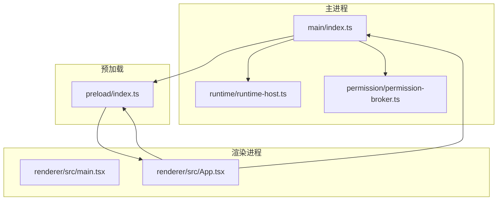
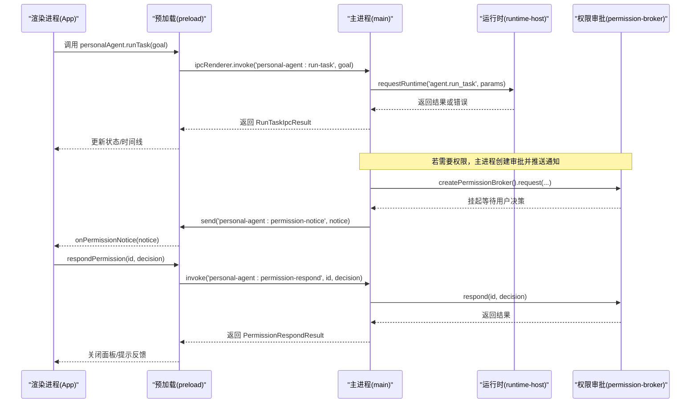
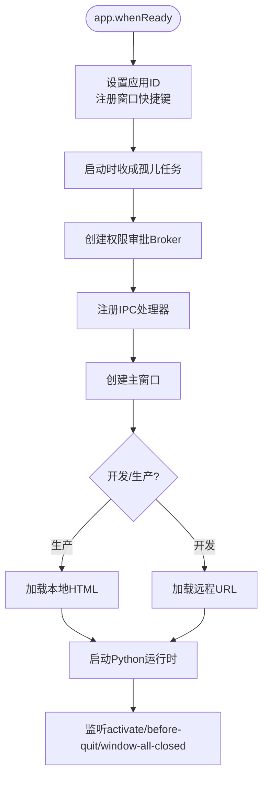
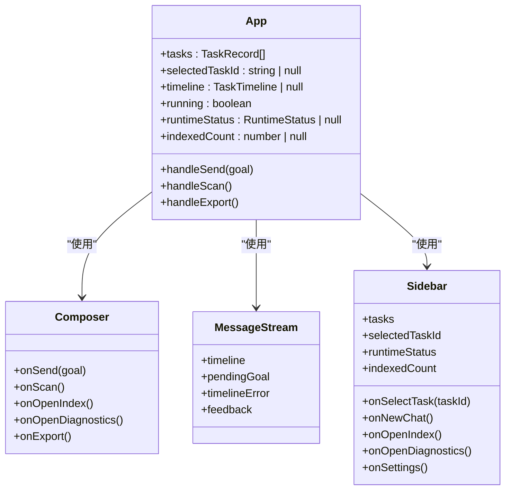
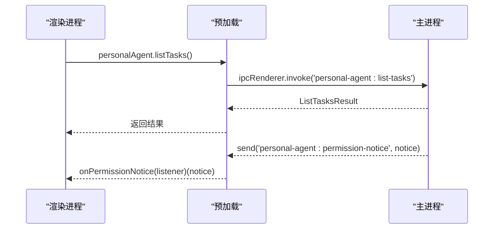
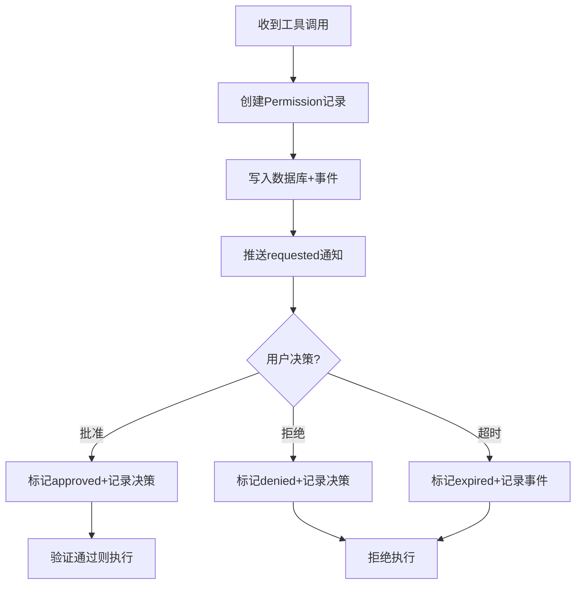
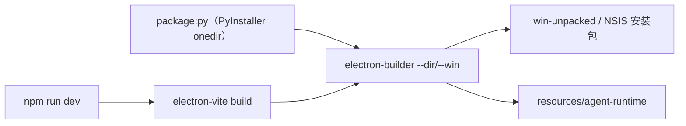
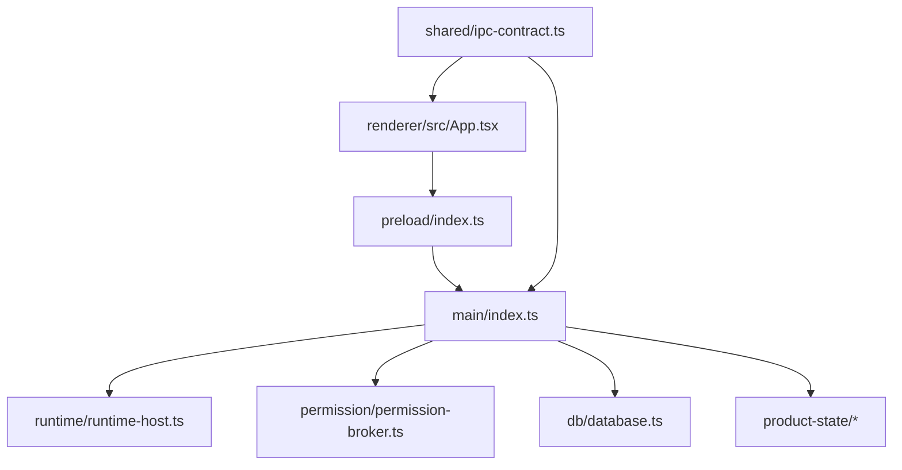

# 桌面应用

<cite>
**本文引用的文件**
- [apps/desktop/src/main/index.ts](file://apps/desktop/src/main/index.ts)
- [apps/desktop/src/preload/index.ts](file://apps/desktop/src/preload/index.ts)
- [apps/desktop/src/renderer/src/main.tsx](file://apps/desktop/src/renderer/src/main.tsx)
- [apps/desktop/src/renderer/src/App.tsx](file://apps/desktop/src/renderer/src/App.tsx)
- [apps/desktop/electron.vite.config.ts](file://apps/desktop/electron.vite.config.ts)
- [apps/desktop/package.json](file://apps/desktop/package.json)
- [apps/desktop/electron-builder.yml](file://apps/desktop/electron-builder.yml)
- [apps/desktop/src/shared/ipc-contract.ts](file://apps/desktop/src/shared/ipc-contract.ts)
- [apps/desktop/src/main/runtime/runtime-host.ts](file://apps/desktop/src/main/runtime/runtime-host.ts)
- [apps/desktop/src/main/permission/permission-broker.ts](file://apps/desktop/src/main/permission/permission-broker.ts)
- [apps/desktop/tsconfig.json](file://apps/desktop/tsconfig.json)
</cite>

## 目录
1. [简介](#简介)
2. [项目结构](#项目结构)
3. [核心组件](#核心组件)
4. [架构总览](#架构总览)
5. [详细组件分析](#详细组件分析)
6. [依赖关系分析](#依赖关系分析)
7. [性能考虑](#性能考虑)
8. [故障排查指南](#故障排查指南)
9. [结论](#结论)
10. [附录：示例与最佳实践](#附录示例与最佳实践)

## 简介
本项目是一个基于 Electron + React 的桌面应用，主进程负责窗口管理、生命周期、IPC 路由、Python 运行时管理与权限审批；渲染进程使用 React 构建用户界面，通过预加载脚本安全地暴露最小化 API。应用支持 PDF 索引、任务执行、时间线回放、权限审批等能力，并提供跨平台打包与发布配置。

## 项目结构
- 主进程入口位于 apps/desktop/src/main/index.ts，负责初始化 Electron 应用、创建窗口、注册 IPC 处理器、启动 Python 运行时、处理退出流程。
- 预加载脚本位于 apps/desktop/src/preload/index.ts，通过 contextBridge 暴露受限 API 给渲染进程。
- 渲染进程入口位于 apps/desktop/src/renderer/src/main.tsx，挂载 React 根节点；业务逻辑集中在 App.tsx 及子组件中。
- 构建与打包由 electron-vite 和 electron-builder 驱动，配置文件分别为 electron.vite.config.ts 与 electron-builder.yml。
- 共享类型定义在 src/shared/ipc-contract.ts，约束主/渲染之间的 IPC 契约。
- 运行时宿主与权限审批分别位于 main/runtime/runtime-host.ts 与 main/permission/permission-broker.ts。

**图表来源**
- [apps/desktop/src/main/index.ts:56-90](file://apps/desktop/src/main/index.ts#L56-L90)
- [apps/desktop/src/preload/index.ts:8-46](file://apps/desktop/src/preload/index.ts#L8-L46)
- [apps/desktop/src/renderer/src/main.tsx:3-11](file://apps/desktop/src/renderer/src/main.tsx#L3-L11)
- [apps/desktop/src/renderer/src/App.tsx:21-109](file://apps/desktop/src/renderer/src/App.tsx#L21-L109)
- [apps/desktop/src/main/runtime/runtime-host.ts:87-129](file://apps/desktop/src/main/runtime/runtime-host.ts#L87-L129)
- [apps/desktop/src/main/permission/permission-broker.ts:100-181](file://apps/desktop/src/main/permission/permission-broker.ts#L100-L181)

**章节来源**
- [apps/desktop/src/main/index.ts:1-357](file://apps/desktop/src/main/index.ts#L1-L357)
- [apps/desktop/src/preload/index.ts:1-51](file://apps/desktop/src/preload/index.ts#L1-L51)
- [apps/desktop/src/renderer/src/main.tsx:1-12](file://apps/desktop/src/renderer/src/main.tsx#L1-L12)
- [apps/desktop/src/renderer/src/App.tsx:1-294](file://apps/desktop/src/renderer/src/App.tsx#L1-L294)
- [apps/desktop/electron.vite.config.ts:1-24](file://apps/desktop/electron.vite.config.ts#L1-L24)
- [apps/desktop/package.json:1-61](file://apps/desktop/package.json#L1-L61)
- [apps/desktop/electron-builder.yml:1-34](file://apps/desktop/electron-builder.yml#L1-L34)
- [apps/desktop/src/shared/ipc-contract.ts:1-75](file://apps/desktop/src/shared/ipc-contract.ts#L1-L75)
- [apps/desktop/src/main/runtime/runtime-host.ts:1-154](file://apps/desktop/src/main/runtime/runtime-host.ts#L1-L154)
- [apps/desktop/src/main/permission/permission-broker.ts:1-328](file://apps/desktop/src/main/permission/permission-broker.ts#L1-L328)

## 核心组件
- 主进程（main）
  - 应用初始化与窗口创建：设置应用 ID、监听窗口事件、开发/生产环境资源加载策略。
  - IPC 处理器：集中注册所有 renderer → main 的请求通道，统一错误码与返回结构。
  - Python 运行时管理：启动/停止、状态查询、崩溃恢复、日志输出。
  - 权限审批：创建审批记录、推送通知、响应批准/拒绝、过期处理、路径校验。
- 预加载（preload）
  - 通过 contextBridge 暴露最小化 API，仅允许调用特定 IPC 通道，避免直接暴露 Node/Electron 对象。
- 渲染进程（renderer）
  - React 应用：状态管理集中于 App 组件，使用 hooks 管理任务列表、时间线、运行状态、权限弹窗等。
  - 视图模型：将后端数据转换为 UI 友好的展示文本与格式。

**章节来源**
- [apps/desktop/src/main/index.ts:92-333](file://apps/desktop/src/main/index.ts#L92-L333)
- [apps/desktop/src/preload/index.ts:8-46](file://apps/desktop/src/preload/index.ts#L8-L46)
- [apps/desktop/src/renderer/src/App.tsx:21-196](file://apps/desktop/src/renderer/src/App.tsx#L21-L196)
- [apps/desktop/src/renderer/src/view-model.ts:11-82](file://apps/desktop/src/renderer/src/view-model.ts#L11-L82)

## 架构总览
下图展示了从渲染进程发起请求到主进程处理并返回结果的完整链路，包括权限审批的通知流。

**图表来源**
- [apps/desktop/src/preload/index.ts:10-45](file://apps/desktop/src/preload/index.ts#L10-L45)
- [apps/desktop/src/main/index.ts:134-324](file://apps/desktop/src/main/index.ts#L134-L324)
- [apps/desktop/src/main/runtime/runtime-host.ts:144-153](file://apps/desktop/src/main/runtime/runtime-host.ts#L144-L153)
- [apps/desktop/src/main/permission/permission-broker.ts:133-181](file://apps/desktop/src/main/permission/permission-broker.ts#L133-L181)

## 详细组件分析

### 主进程初始化与生命周期
- 应用启动时设置应用标识、监听窗口快捷键、执行“收尸”逻辑以清理孤儿任务。
- 构造权限审批 Broker，失败不影响启动但会禁用批准通道。
- 注册多个 IPC 处理器，涵盖运行时状态、PDF 索引、任务列表、任务执行、时间线查询、权限响应与列表。
- 创建主窗口，配置安全选项（沙箱、上下文隔离、禁用 Node 集成），并在开发/生产环境下加载不同资源。
- 监听 activate/before-quit/window-all-closed 等生命周期事件，确保优雅退出与资源释放。

**图表来源**
- [apps/desktop/src/main/index.ts:92-131](file://apps/desktop/src/main/index.ts#L92-L131)
- [apps/desktop/src/main/index.ts:134-324](file://apps/desktop/src/main/index.ts#L134-L324)
- [apps/desktop/src/main/index.ts:326-354](file://apps/desktop/src/main/index.ts#L326-L354)

**章节来源**
- [apps/desktop/src/main/index.ts:92-354](file://apps/desktop/src/main/index.ts#L92-L354)

### 渲染进程 React 应用结构
- 入口 main.tsx 使用 React 18 createRoot 挂载 App 组件。
- App.tsx 集中管理全局状态：任务列表、选中任务、时间线、运行态、运行时状态、索引数量、反馈消息、权限弹窗等。
- 通过 useEffect 在启动时加载任务列表、索引数量与运行时状态；订阅权限通知事件。
- 提供发送任务、扫描 PDF、导出 Markdown、打开诊断/索引对话框等操作。
- 子组件如 Composer、MessageStream、Sidebar、IndexDialog、DiagnosticsDialog、PermissionDialog 负责具体交互与展示。

**图表来源**
- [apps/desktop/src/renderer/src/main.tsx:3-11](file://apps/desktop/src/renderer/src/main.tsx#L3-L11)
- [apps/desktop/src/renderer/src/App.tsx:21-294](file://apps/desktop/src/renderer/src/App.tsx#L21-L294)
- [apps/desktop/src/renderer/src/components/Composer.tsx:14-142](file://apps/desktop/src/renderer/src/components/Composer.tsx#L14-L142)

**章节来源**
- [apps/desktop/src/renderer/src/main.tsx:1-12](file://apps/desktop/src/renderer/src/main.tsx#L1-L12)
- [apps/desktop/src/renderer/src/App.tsx:1-294](file://apps/desktop/src/renderer/src/App.tsx#L1-L294)
- [apps/desktop/src/renderer/src/components/Composer.tsx:1-142](file://apps/desktop/src/renderer/src/components/Composer.tsx#L1-L142)

### 预加载脚本的安全机制与 API 暴露策略
- 仅在 contextIsolation 启用时通过 contextBridge.exposeInMainWorld 暴露 window.personalAgent。
- 暴露的方法均为对特定 IPC 通道的封装，参数类型受 shared 契约约束。
- 唯一的主→渲染推送通道为 onPermissionNotice，返回取消订阅函数，避免内存泄漏。
- 不直接暴露 Node/Electron 对象，降低攻击面。

**图表来源**
- [apps/desktop/src/preload/index.ts:8-46](file://apps/desktop/src/preload/index.ts#L8-L46)
- [apps/desktop/src/shared/ipc-contract.ts:36-75](file://apps/desktop/src/shared/ipc-contract.ts#L36-L75)

**章节来源**
- [apps/desktop/src/preload/index.ts:1-51](file://apps/desktop/src/preload/index.ts#L1-L51)
- [apps/desktop/src/shared/ipc-contract.ts:1-75](file://apps/desktop/src/shared/ipc-contract.ts#L1-L75)

### 权限审批流程与验证
- 当 Python 侧工具调用需要权限时，主进程创建 Permission 记录，写入数据库并推送 requested 通知。
- 渲染进程弹出 PermissionDialog，用户选择批准/拒绝后调用 respondPermission。
- 主进程调用 permission-broker.respond 更新状态、记录决策事件，并通知渲染进程 resolved。
- 执行前进行六步验证：存在性、状态、过期、toolCallId、参数指纹、路径复查。

**图表来源**
- [apps/desktop/src/main/permission/permission-broker.ts:133-181](file://apps/desktop/src/main/permission/permission-broker.ts#L133-L181)
- [apps/desktop/src/main/permission/permission-broker.ts:183-234](file://apps/desktop/src/main/permission/permission-broker.ts#L183-L234)
- [apps/desktop/src/main/permission/permission-broker.ts:283-327](file://apps/desktop/src/main/permission/permission-broker.ts#L283-L327)

**章节来源**
- [apps/desktop/src/main/permission/permission-broker.ts:1-328](file://apps/desktop/src/main/permission/permission-broker.ts#L1-L328)

### 构建配置与打包流程
- 开发环境：electron-vite dev 启动，渲染进程加载远程 URL，支持热更新。
- 生产环境：electron-vite build 编译产物；根脚本 `package:py` 先把 Python 运行时冻成 onedir 产物，再由 electron-builder 打包，并经 extraResources 复制到 `<安装目录>/resources/agent-runtime/`。
- 别名与插件：@personal-agent/protocol 指向共享协议 schema；React 与 Tailwind 插件用于渲染构建。
- 平台差异：V0.1 只出 Windows（CON-003）——`win.executableName: PersonalAgent`、NSIS 快捷方式；mac/linux 相关配置段已删除。

**图表来源**
- [apps/desktop/package.json:9-22](file://apps/desktop/package.json#L9-L22)
- [apps/desktop/electron.vite.config.ts:6-22](file://apps/desktop/electron.vite.config.ts#L6-L22)
- [apps/desktop/electron-builder.yml:1-34](file://apps/desktop/electron-builder.yml#L1-L34)

**章节来源**
- [apps/desktop/package.json:1-61](file://apps/desktop/package.json#L1-L61)
- [apps/desktop/electron.vite.config.ts:1-24](file://apps/desktop/electron.vite.config.ts#L1-L24)
- [apps/desktop/electron-builder.yml:1-34](file://apps/desktop/electron-builder.yml#L1-L34)

### 跨平台兼容性
- V0.1 只支持 Windows 10/11（CON-003）：可执行名与 NSIS 安装器配置、快捷方式创建策略；mac/linux 相关配置段与资源已删除。
- Windows 专注点在通知与身份标识：appId 与主进程的 `setAppUserModelId` 一致（com.personalagent.app），Windows 通知按 AUMID 匹配开始菜单快捷方式。
- 运行时路径解析覆盖三种布局（PERSONAL_AGENT_RUNTIME 覆盖 / 打包布局的随包冻结产物 / 开发布局的仓库 venv），打包版不依赖目标机器的 Python。

**章节来源**
- [apps/desktop/src/main/index.ts:56-72](file://apps/desktop/src/main/index.ts#L56-L72)
- [apps/desktop/src/main/index.ts:328-354](file://apps/desktop/src/main/index.ts#L328-L354)
- [apps/desktop/src/main/runtime/runtime-host.ts:15-154](file://apps/desktop/src/main/runtime/runtime-host.ts#L15-L154)
- [apps/desktop/electron-builder.yml:1-34](file://apps/desktop/electron-builder.yml#L1-L34)

## 依赖关系分析
- 主进程依赖：
  - Electron 模块（app、BrowserWindow、ipcMain、shell）
  - @electron-toolkit/utils（应用工具、优化器）
  - 内部模块：runtime、db、product-state、permission、capabilities、tasks
- 渲染进程依赖：
  - React、Tailwind CSS、Lucide 图标库
  - 通过 preload 暴露的 window.personalAgent 访问主进程能力
- 共享契约：
  - ipc-contract.ts 定义 IPC 数据结构与错误码，保证主/渲染一致性

**图表来源**
- [apps/desktop/src/main/index.ts:1-32](file://apps/desktop/src/main/index.ts#L1-L32)
- [apps/desktop/src/renderer/src/App.tsx:1-19](file://apps/desktop/src/renderer/src/App.tsx#L1-L19)
- [apps/desktop/src/preload/index.ts:1-4](file://apps/desktop/src/preload/index.ts#L1-L4)
- [apps/desktop/src/shared/ipc-contract.ts:1-23](file://apps/desktop/src/shared/ipc-contract.ts#L1-L23)

**章节来源**
- [apps/desktop/src/main/index.ts:1-32](file://apps/desktop/src/main/index.ts#L1-L32)
- [apps/desktop/src/renderer/src/App.tsx:1-19](file://apps/desktop/src/renderer/src/App.tsx#L1-L19)
- [apps/desktop/src/preload/index.ts:1-4](file://apps/desktop/src/preload/index.ts#L1-L4)
- [apps/desktop/src/shared/ipc-contract.ts:1-23](file://apps/desktop/src/shared/ipc-contract.ts#L1-L23)

## 性能考虑
- 渲染进程状态管理：
  - 使用 useCallback 缓存回调，减少重渲染开销。
  - 按需加载时间线与任务列表，避免一次性拉取大量数据。
- IPC 通信：
  - 预加载层只做必要转发，避免在主/渲染之间传递复杂对象。
  - 使用统一的 ok/code/message 结构，便于快速错误分支。
- 数据库访问：
  - 只读通道（如 list-tasks、get-timeline）避免事务开销。
  - 写操作（如 upsertMany）批量插入，减少 IO 次数。
- 运行时管理：
  - 避免重复 spawn，状态机防止竞态。
  - 崩溃时重置状态并清理资源。

[本节为通用指导，无需特定文件引用]

## 故障排查指南
- 启动阶段：
  - 检查 product-state 数据库是否成功打开，若失败会导致批准通道不可用。
  - 确认 Python 运行时路径存在，否则状态为 crashed 并附带详情。
- IPC 错误：
  - 查看 shared 契约中的错误码映射，区分协议错误与运行时错误。
  - 渲染端捕获异常并显示友好提示，避免白屏。
- 权限审批：
  - 若出现 repeated=true，表示结论已存在且无副作用，UI 不应视为失败。
  - 过期场景由主进程推送 resolved 通知，渲染端应自动关闭面板。
- 退出流程：
  - before-quit 中按顺序停止运行时、释放 Broker、关闭数据库与应用。

**章节来源**
- [apps/desktop/src/main/index.ts:108-131](file://apps/desktop/src/main/index.ts#L108-L131)
- [apps/desktop/src/main/index.ts:339-348](file://apps/desktop/src/main/index.ts#L339-L348)
- [apps/desktop/src/main/runtime/runtime-host.ts:87-129](file://apps/desktop/src/main/runtime/runtime-host.ts#L87-L129)
- [apps/desktop/src/main/permission/permission-broker.ts:183-234](file://apps/desktop/src/main/permission/permission-broker.ts#L183-L234)

## 结论
该 Electron 桌面应用采用清晰的分层架构：主进程负责系统级能力与安全边界，预加载脚本提供最小化 API，渲染进程专注 UI 与交互。通过严格的 IPC 契约与权限审批机制，应用在保证安全的同时实现了强大的本地文件处理能力与任务执行能力。构建与打包配置覆盖主流平台，便于开发与分发。

[本节为总结，无需特定文件引用]

## 附录：示例与最佳实践

### 添加新窗口
- 在 main/index.ts 中复制 createWindow 逻辑，调整窗口尺寸与标题。
- 为新窗口指定不同的 preload 或 webPreferences。
- 在 app.activate 中根据条件创建新窗口。

参考路径
- [apps/desktop/src/main/index.ts:56-90](file://apps/desktop/src/main/index.ts#L56-L90)
- [apps/desktop/src/main/index.ts:328-332](file://apps/desktop/src/main/index.ts#L328-L332)

### 注册新的 IPC 处理器
- 在 main/index.ts 中使用 ipcMain.handle 注册通道名与处理函数。
- 在 preload/index.ts 中通过 contextBridge 暴露对应方法。
- 在渲染进程中调用 window.personalAgent.xxx。

参考路径
- [apps/desktop/src/main/index.ts:134-324](file://apps/desktop/src/main/index.ts#L134-L324)
- [apps/desktop/src/preload/index.ts:10-45](file://apps/desktop/src/preload/index.ts#L10-L45)

### 处理用户交互
- 在 App.tsx 中定义事件处理函数，调用 preload 暴露的 API。
- 使用状态更新 UI，并通过 feedback 机制提供即时反馈。
- 对于耗时操作，设置 running 标志并禁用输入。

参考路径
- [apps/desktop/src/renderer/src/App.tsx:164-196](file://apps/desktop/src/renderer/src/App.tsx#L164-L196)
- [apps/desktop/src/renderer/src/components/Composer.tsx:53-142](file://apps/desktop/src/renderer/src/components/Composer.tsx#L53-L142)

### 调试技巧
- 开发环境启用 DevTools 快捷键，观察网络与 IPC 调用。
- 打印 Python stderr 日志，定位运行时问题。
- 使用浏览器控制台查看渲染进程错误与状态。

参考路径
- [apps/desktop/src/main/index.ts:99-106](file://apps/desktop/src/main/index.ts#L99-L106)
- [apps/desktop/src/main/runtime/runtime-host.ts:148-152](file://apps/desktop/src/main/runtime/runtime-host.ts#L148-L152)

### 性能优化建议
- 延迟加载非关键数据（如时间线、索引数量）。
- 使用防抖/节流处理高频事件（如输入框变化）。
- 批量写入数据库，减少 IO 次数。
- 避免在主线程执行重型计算，必要时使用 worker 或异步任务。

[本节为通用指导，无需特定文件引用]