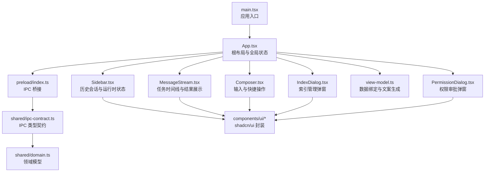
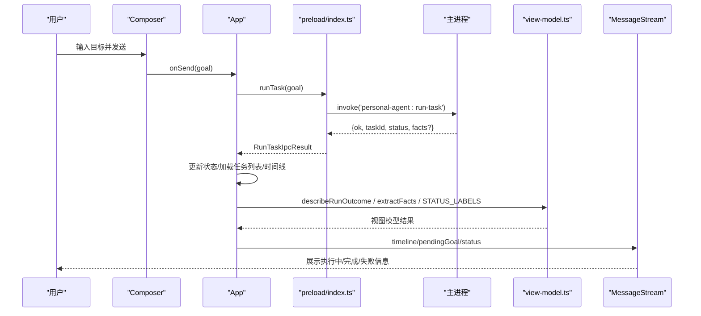
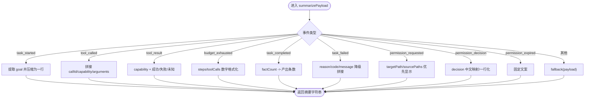
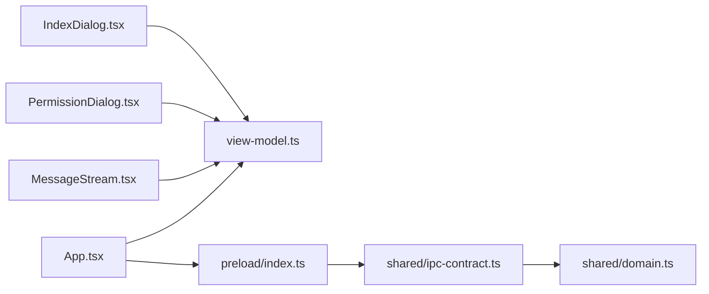

# 渲染界面

<cite>
**本文引用的文件**
- [App.tsx](file://apps/desktop/src/renderer/src/App.tsx)
- [view-model.ts](file://apps/desktop/src/renderer/src/view-model.ts)
- [Composer.tsx](file://apps/desktop/src/renderer/src/components/Composer.tsx)
- [Sidebar.tsx](file://apps/desktop/src/renderer/src/components/Sidebar.tsx)
- [MessageStream.tsx](file://apps/desktop/src/renderer/src/components/MessageStream.tsx)
- [IndexDialog.tsx](file://apps/desktop/src/renderer/src/components/IndexDialog.tsx)
- [PermissionDialog.tsx](file://apps/desktop/src/renderer/src/components/PermissionDialog.tsx)
- [button.tsx](file://apps/desktop/src/renderer/src/components/ui/button.tsx)
- [dialog.tsx](file://apps/desktop/src/renderer/src/components/ui/dialog.tsx)
- [ipc-contract.ts](file://apps/desktop/src/shared/ipc-contract.ts)
- [domain.ts](file://apps/desktop/src/shared/domain.ts)
- [utils.ts](file://apps/desktop/src/renderer/src/lib/utils.ts)
- [preload/index.ts](file://apps/desktop/src/preload/index.ts)
- [main.tsx](file://apps/desktop/src/renderer/src/main.tsx)
</cite>

## 目录
1. [简介](#简介)
2. [项目结构](#项目结构)
3. [核心组件](#核心组件)
4. [架构总览](#架构总览)
5. [详细组件分析](#详细组件分析)
6. [依赖关系分析](#依赖关系分析)
7. [性能与可维护性](#性能与可维护性)
8. [故障排查指南](#故障排查指南)
9. [结论](#结论)
10. [附录：扩展与最佳实践](#附录：扩展与最佳实践)

## 简介
本文件聚焦渲染进程界面的设计与实现，覆盖 React 应用结构、组件层次、状态管理、路由（本应用为单页布局，无传统路由）、视图模型（ViewModel）的数据绑定与事件处理机制，以及 UI 组件库（基于 shadcn/ui 的自定义封装）的使用方式。文档同时给出响应式设计与可访问性的实践建议，并提供如何添加新组件、处理用户交互、更新界面状态的示例路径指引。

## 项目结构
渲染进程采用单页应用模式，入口挂载根组件，主布局由 App 组合侧边栏、消息流、输入框与若干对话框。数据通过 preload 暴露的 IPC 接口与主进程通信，领域类型集中在 shared 层，视图模型负责将原始事件投影为用户可读的文案与摘要。

图表来源
- [main.tsx:1-12](file://apps/desktop/src/renderer/src/main.tsx#L1-L12)
- [App.tsx:1-277](file://apps/desktop/src/renderer/src/App.tsx#L1-L277)
- [preload/index.ts:1-51](file://apps/desktop/src/preload/index.ts#L1-L51)
- [ipc-contract.ts:1-75](file://apps/desktop/src/shared/ipc-contract.ts#L1-L75)
- [domain.ts:1-158](file://apps/desktop/src/shared/domain.ts#L1-L158)

章节来源
- [main.tsx:1-12](file://apps/desktop/src/renderer/src/main.tsx#L1-L12)
- [App.tsx:1-277](file://apps/desktop/src/renderer/src/App.tsx#L1-L277)
- [preload/index.ts:1-51](file://apps/desktop/src/preload/index.ts#L1-L51)
- [ipc-contract.ts:1-75](file://apps/desktop/src/shared/ipc-contract.ts#L1-L75)
- [domain.ts:1-158](file://apps/desktop/src/shared/domain.ts#L1-L158)

## 核心组件
- App：集中管理任务列表、当前选中任务、时间线、运行态、权限请求等全局状态；编排子组件并处理 IPC 调用与错误反馈。
- Sidebar：按天分组展示历史会话，显示运行时状态与索引数量，支持新建对话、打开索引/诊断/设置。
- MessageStream：渲染任务目标、执行状态、失败原因、完成摘要、步骤折叠面板与时长统计。
- Composer：文本输入、发送、扫描 PDF、快捷指令芯片、导出 Markdown、打开索引/诊断。
- IndexDialog：展示已索引 PDF 清单及首次/最近扫描时间。
- PermissionDialog：展示权限请求详情、剩余倒计时、批准/拒绝按钮，阻止外部点击关闭。
- view-model：事件标签、状态标签、时间格式化、计划步骤描述、摘要提取、Markdown 导出、权限倒计时计算等纯函数。

章节来源
- [App.tsx:1-277](file://apps/desktop/src/renderer/src/App.tsx#L1-L277)
- [Sidebar.tsx:1-155](file://apps/desktop/src/renderer/src/components/Sidebar.tsx#L1-L155)
- [MessageStream.tsx:1-175](file://apps/desktop/src/renderer/src/components/MessageStream.tsx#L1-L175)
- [Composer.tsx:1-142](file://apps/desktop/src/renderer/src/components/Composer.tsx#L1-L142)
- [IndexDialog.tsx:1-78](file://apps/desktop/src/renderer/src/components/IndexDialog.tsx#L1-L78)
- [PermissionDialog.tsx:1-165](file://apps/desktop/src/renderer/src/components/PermissionDialog.tsx#L1-L165)
- [view-model.ts:1-367](file://apps/desktop/src/renderer/src/view-model.ts#L1-L367)

## 架构总览
渲染进程通过 preload 暴露安全 API，组件仅调用 window.personalAgent.* 方法，避免直接耦合 Electron。App 作为状态中枢，使用 React 内置状态与副作用进行数据获取与事件订阅。view-model 提供纯函数，将后端事件与领域对象转换为 UI 友好的文案与结构。UI 组件基于 shadcn/ui 的 Button、Dialog、Table 等封装，统一样式与可访问性。

图表来源
- [Composer.tsx:53-142](file://apps/desktop/src/renderer/src/components/Composer.tsx#L53-L142)
- [App.tsx:147-179](file://apps/desktop/src/renderer/src/App.tsx#L147-L179)
- [preload/index.ts:23-25](file://apps/desktop/src/preload/index.ts#L23-L25)
- [view-model.ts:26-52](file://apps/desktop/src/renderer/src/view-model.ts#L26-L52)
- [MessageStream.tsx:39-175](file://apps/desktop/src/renderer/src/components/MessageStream.tsx#L39-L175)

## 详细组件分析

### 组件层次与职责
- App：聚合状态、IPC 调用、错误提示、权限弹窗控制。
- Sidebar：历史会话分组、运行时状态指示、导航入口。
- MessageStream：时间线渲染、状态文案、摘要与步骤折叠。
- Composer：输入、发送、快捷动作、工具入口。
- Dialogs：IndexDialog、PermissionDialog 分别承载独立功能。
- UI 库：Button、Dialog 等基于 Radix 与 Tailwind 的封装。

章节来源
- [App.tsx:1-277](file://apps/desktop/src/renderer/src/App.tsx#L1-L277)
- [Sidebar.tsx:1-155](file://apps/desktop/src/renderer/src/components/Sidebar.tsx#L1-L155)
- [MessageStream.tsx:1-175](file://apps/desktop/src/renderer/src/components/MessageStream.tsx#L1-L175)
- [Composer.tsx:1-142](file://apps/desktop/src/renderer/src/components/Composer.tsx#L1-L142)
- [IndexDialog.tsx:1-78](file://apps/desktop/src/renderer/src/components/IndexDialog.tsx#L1-L78)
- [PermissionDialog.tsx:1-165](file://apps/desktop/src/renderer/src/components/PermissionDialog.tsx#L1-L165)
- [button.tsx:1-62](file://apps/desktop/src/renderer/src/components/ui/button.tsx#L1-L62)
- [dialog.tsx:1-145](file://apps/desktop/src/renderer/src/components/ui/dialog.tsx#L1-L145)

### 聊天界面（Composer）
- 功能要点：多行输入、Enter 发送、Shift+Enter 换行、禁用态防重复提交、快捷动作芯片（填充 prompt 或直接触发）。
- 交互流程：用户输入 -> 校验非空且未运行 -> 清空输入 -> 回调父级发送。
- 可访问性：aria-label、title、禁用态语义正确。
- 扩展点：新增快捷动作只需在 QUICK_ACTIONS 中添加条目，支持 prompt 或 run 两种模式。

章节来源
- [Composer.tsx:14-142](file://apps/desktop/src/renderer/src/components/Composer.tsx#L14-L142)

### 侧边栏（Sidebar）
- 功能要点：按“今天/昨天/更早”分组历史会话，高亮选中项，显示运行时状态与索引数量，提供新建对话、索引管理、运行诊断、设置入口。
- 数据流：从 App 传入 tasks/runtimeStatus/indexedCount，点击项触发 onSelectTask。
- 可访问性：nav 区域 aria-label，按钮具备标题与图标语义。

章节来源
- [Sidebar.tsx:1-155](file://apps/desktop/src/renderer/src/components/Sidebar.tsx#L1-L155)

### 消息流（MessageStream）
- 功能要点：展示用户目标气泡、机器人回复、执行中/等待批准/失败/完成状态、摘要列表、步骤折叠面板、耗时统计。
- 数据绑定：根据 pendingGoal/timeline/error/feedback 决定渲染分支；使用 view-model 的 describeEvent/describePlanSteps/extractFacts/STATUS_LABELS。
- 滚动行为：内容变化时自动滚动到底部。
- 可访问性：状态提示与图标配合文字说明，确保屏幕阅读器友好。

章节来源
- [MessageStream.tsx:1-175](file://apps/desktop/src/renderer/src/components/MessageStream.tsx#L1-L175)
- [view-model.ts:133-150](file://apps/desktop/src/renderer/src/view-model.ts#L133-L150)
- [view-model.ts:263-280](file://apps/desktop/src/renderer/src/view-model.ts#L263-L280)
- [view-model.ts:291-315](file://apps/desktop/src/renderer/src/view-model.ts#L291-L315)

### 权限审批（PermissionDialog）
- 功能要点：展示能力、影响文件、目标位置、参数指纹、请求时间与剩余时间；禁止外部点击关闭；倒计时每秒刷新；提交后禁用按钮。
- 数据绑定：使用 formatRemaining 计算剩余时间，windowClosed 判断窗口是否过期。
- 交互流程：用户点击批准/拒绝 -> 调用 onDecide -> 父级提交到主进程 -> 清理本地状态。

章节来源
- [PermissionDialog.tsx:1-165](file://apps/desktop/src/renderer/src/components/PermissionDialog.tsx#L1-L165)
- [view-model.ts:105-129](file://apps/desktop/src/renderer/src/view-model.ts#L105-L129)

### 索引管理（IndexDialog）
- 功能要点：打开时拉取索引列表，展示文件名与扫描时间；空状态提示引导扫描。
- 数据绑定：随 Dialog 开合挂载/卸载，内部 useEffect 拉取数据，取消标记防止卸载后更新。

章节来源
- [IndexDialog.tsx:1-78](file://apps/desktop/src/renderer/src/components/IndexDialog.tsx#L1-L78)

### 视图模型（ViewModel）
- 职责：将后端事件与领域对象转换为 UI 友好的文案与结构；提供状态/事件标签、时间格式化、计划步骤描述、摘要提取、Markdown 导出、权限倒计时计算。
- 关键函数：
  - describeRunOutcome：将 runTask 结果映射为 success/failed/error 三态文案。
  - summarizePayload：按事件类型生成一行摘要，兼容脏数据。
  - describeEvent：将 ExecutionEventRecord 转为 EventLineView。
  - describePlanSteps：将 PlanRecord 转为带序号的步骤列表。
  - extractFacts/extractFactCount：从最后一条 task_completed 还原摘要与数量。
  - timelineToMarkdown：导出 goal、状态、摘要与计划步骤。
  - formatRemaining：计算权限窗口剩余时间，边界条件完备。

图表来源
- [view-model.ts:190-259](file://apps/desktop/src/renderer/src/view-model.ts#L190-L259)

章节来源
- [view-model.ts:1-367](file://apps/desktop/src/renderer/src/view-model.ts#L1-367)

### UI 组件库（shadcn/ui）使用与定制
- Button：基于 class-variance-authority 定义变体与尺寸，支持 asChild 透传；用于所有交互按钮。
- Dialog：基于 Radix Dialog 封装 Root/Trigger/Portal/Overlay/Content/Header/Footer/Title/Description，统一动画与可访问性；PermissionDialog 禁用了外部点击关闭以确保审批流程不被误关。
- Table：用于 IndexDialog 的索引列表展示。
- 工具函数：cn 合并类名，保证 Tailwind 类冲突合并正确。

章节来源
- [button.tsx:1-62](file://apps/desktop/src/renderer/src/components/ui/button.tsx#L1-L62)
- [dialog.tsx:1-145](file://apps/desktop/src/renderer/src/components/ui/dialog.tsx#L1-L145)
- [utils.ts:1-7](file://apps/desktop/src/renderer/src/lib/utils.ts#L1-L7)

## 依赖关系分析
- 组件依赖：
  - App 依赖 Sidebar、MessageStream、Composer、IndexDialog、PermissionDialog、view-model。
  - MessageStream 依赖 view-model 的事件与状态映射。
  - PermissionDialog 依赖 view-model 的时间格式化与倒计时。
  - IndexDialog 依赖 view-model 的时间格式化。
- 数据契约：
  - shared/ipc-contract 定义 IPC 返回值类型（ListTasksResult、RunTaskIpcResult、TimelineIpcResult、PermissionRespondResult 等）。
  - shared/domain 定义领域模型（TaskRecord、ExecutionEventRecord、PlanRecord、TaskTimeline、PermissionRecord 等）。
- 通信链路：
  - 组件通过 window.personalAgent.* 调用 preload 暴露的方法，再经 ipcRenderer.invoke/on 与主进程通信。

图表来源
- [App.tsx:1-277](file://apps/desktop/src/renderer/src/App.tsx#L1-L277)
- [preload/index.ts:1-51](file://apps/desktop/src/preload/index.ts#L1-L51)
- [ipc-contract.ts:1-75](file://apps/desktop/src/shared/ipc-contract.ts#L1-L75)
- [domain.ts:1-158](file://apps/desktop/src/shared/domain.ts#L1-L158)
- [MessageStream.tsx:1-175](file://apps/desktop/src/renderer/src/components/MessageStream.tsx#L1-L175)
- [PermissionDialog.tsx:1-165](file://apps/desktop/src/renderer/src/components/PermissionDialog.tsx#L1-L165)
- [IndexDialog.tsx:1-78](file://apps/desktop/src/renderer/src/components/IndexDialog.tsx#L1-L78)

章节来源
- [ipc-contract.ts:1-75](file://apps/desktop/src/shared/ipc-contract.ts#L1-L75)
- [domain.ts:1-158](file://apps/desktop/src/shared/domain.ts#L1-L158)

## 性能与可维护性
- 状态最小化：App 仅持有必要的全局状态，复杂转换下沉至 view-model 的纯函数，便于测试与复用。
- 事件订阅：权限通知使用一次性包装 listener 并返回取消函数，避免内存泄漏。
- 渲染优化：MessageStream 仅在依赖变化时滚动到底部；IndexDialog 使用 key 与受控 open 控制生命周期。
- 容错设计：时间戳解析失败回退原值；payload 形状不匹配时降级 fallback；错误码与消息统一展示。
- 可维护性：类型契约集中管理，新增字段需同步更新 IPC 与领域类型，编译期保障一致性。

[本节为通用指导，无需特定文件引用]

## 故障排查指南
- 任务列表读取失败：检查 listTasks 调用与错误日志输出位置。
- 时间线加载失败：查看 getTimeline 的错误分支与 timelineError 展示逻辑。
- 权限弹窗无法关闭：确认 PermissionDialog 的外部点击拦截与 resolved 推送是否正确清理状态。
- 倒计时异常：核对 formatRemaining 的边界条件（非法日期、负数、超过一小时）。
- 摘要为空：检查 extractFacts 对 task_completed 的最后一条记录与 facts 数组的校验逻辑。

章节来源
- [App.tsx:43-67](file://apps/desktop/src/renderer/src/App.tsx#L43-L67)
- [App.tsx:94-133](file://apps/desktop/src/renderer/src/App.tsx#L94-L133)
- [PermissionDialog.tsx:30-165](file://apps/desktop/src/renderer/src/components/PermissionDialog.tsx#L30-L165)
- [view-model.ts:93-129](file://apps/desktop/src/renderer/src/view-model.ts#L93-L129)
- [view-model.ts:291-315](file://apps/desktop/src/renderer/src/view-model.ts#L291-L315)

## 结论
渲染界面以 App 为中心，结合 Sidebar、MessageStream、Composer 与多个对话框，形成清晰的职责划分。view-model 承担数据到视图的转换，屏蔽后端细节与脏数据风险。UI 组件基于 shadcn/ui 统一风格与可访问性。整体架构简洁、类型安全、易于扩展与维护。

[本节为总结，无需特定文件引用]

## 附录：扩展与最佳实践

### 如何添加新组件
- 在 components 下创建新组件文件，定义 Props 接口与默认导出。
- 在 App 中引入并组合到合适的位置，必要时增加新的状态与 IPC 调用。
- 若涉及权限或索引，复用 view-model 的格式化工具与共享类型。

参考路径
- [App.tsx:13-19](file://apps/desktop/src/renderer/src/App.tsx#L13-L19)
- [Composer.tsx:14-22](file://apps/desktop/src/renderer/src/components/Composer.tsx#L14-L22)

### 如何处理用户交互
- 在组件内定义事件处理器，调用父级回调或触发 IPC。
- 使用 disabled 与 loading 状态防止重复提交。
- 通过 feedback 或错误提示向用户反馈结果。

参考路径
- [Composer.tsx:53-142](file://apps/desktop/src/renderer/src/components/Composer.tsx#L53-L142)
- [App.tsx:147-179](file://apps/desktop/src/renderer/src/App.tsx#L147-L179)

### 如何更新界面状态
- 使用 useState 管理局部状态，useEffect 处理副作用与数据获取。
- 复杂转换放入 view-model，保持组件轻量。
- 对于长列表或频繁更新，考虑拆分组件与惰性加载。

参考路径
- [App.tsx:21-92](file://apps/desktop/src/renderer/src/App.tsx#L21-L92)
- [MessageStream.tsx:45-54](file://apps/desktop/src/renderer/src/components/MessageStream.tsx#L45-L54)

### 响应式设计最佳实践
- 使用 Tailwind 的断点与弹性布局，确保在不同屏幕尺寸下的可用性。
- 限制最大宽度与溢出处理，避免内容撑破容器。
- 在小屏设备上隐藏次要操作或折叠面板。

参考路径
- [Sidebar.tsx:64-155](file://apps/desktop/src/renderer/src/components/Sidebar.tsx#L64-L155)
- [MessageStream.tsx:56-175](file://apps/desktop/src/renderer/src/components/MessageStream.tsx#L56-L175)

### 可访问性最佳实践
- 为交互元素提供 aria-label、title、role 等语义属性。
- 键盘导航与焦点可见性：确保 Tab 顺序合理，焦点环清晰。
- 颜色对比度与状态提示：使用语义化颜色与图标辅助传达状态。

参考路径
- [Composer.tsx:67-81](file://apps/desktop/src/renderer/src/components/Composer.tsx#L67-L81)
- [dialog.tsx:50-73](file://apps/desktop/src/renderer/src/components/ui/dialog.tsx#L50-L73)