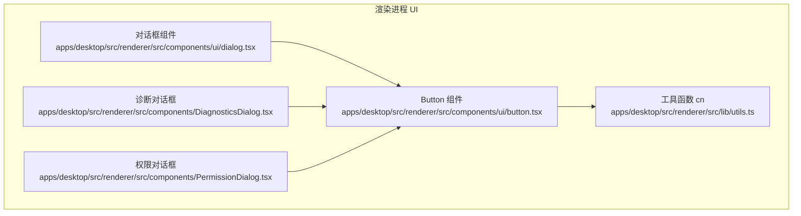
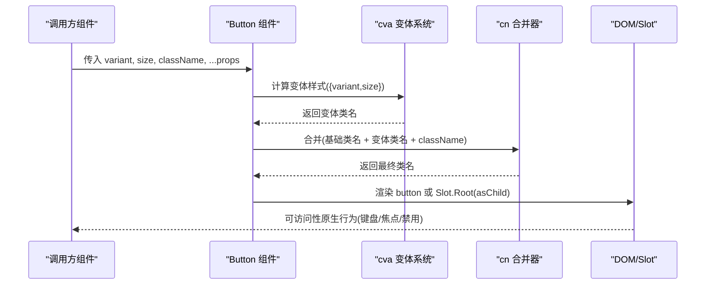
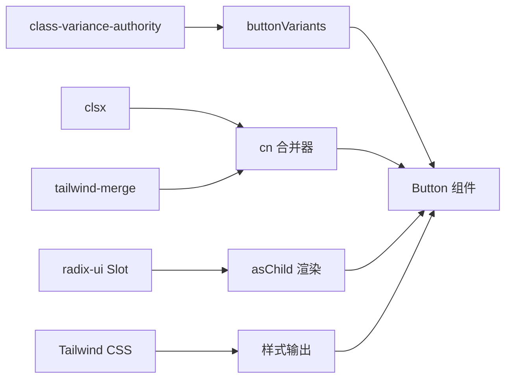

# Button 按钮组件

<cite>
**本文引用的文件**
- [button.tsx](file://apps/desktop/src/renderer/src/components/ui/button.tsx)
- [utils.ts](file://apps/desktop/src/renderer/src/lib/utils.ts)
- [DiagnosticsDialog.tsx](file://apps/desktop/src/renderer/src/components/DiagnosticsDialog.tsx)
- [PermissionDialog.tsx](file://apps/desktop/src/renderer/src/components/PermissionDialog.tsx)
- [dialog.tsx](file://apps/desktop/src/renderer/src/components/ui/dialog.tsx)
- [components.json](file://apps/desktop/components.json)
</cite>

## 目录
1. [简介](#简介)
2. [项目结构](#项目结构)
3. [核心组件](#核心组件)
4. [架构总览](#架构总览)
5. [详细组件分析](#详细组件分析)
6. [依赖关系分析](#依赖关系分析)
7. [性能考量](#性能考量)
8. [故障排查指南](#故障排查指南)
9. [结论](#结论)
10. [附录：使用示例与最佳实践](#附录使用示例与最佳实践)

## 简介
本章节介绍 Button 按钮组件的设计目标、能力边界与使用场景。该组件基于 class-variance-authority（CVA）实现样式变体管理，提供统一的视觉风格与交互行为；通过 Radix UI Slot 支持 asChild 透传渲染，便于与第三方元素或组件组合；借助 Tailwind CSS 与 clsx/tailwind-merge 工具函数实现可组合的类名合并策略。

## 项目结构
Button 组件位于渲染进程 UI 层，属于共享 UI 原子组件集合的一部分，被对话框等上层组件复用。其样式由 Tailwind 类名驱动，并通过 utils 中的 cn 工具进行类名合并。

图表来源
- [button.tsx:1-62](file://apps/desktop/src/renderer/src/components/ui/button.tsx#L1-L62)
- [utils.ts:1-7](file://apps/desktop/src/renderer/src/lib/utils.ts#L1-L7)
- [dialog.tsx:100-105](file://apps/desktop/src/renderer/src/components/ui/dialog.tsx#L100-L105)
- [DiagnosticsDialog.tsx:50-60](file://apps/desktop/src/renderer/src/components/DiagnosticsDialog.tsx#L50-L60)
- [PermissionDialog.tsx:115-135](file://apps/desktop/src/renderer/src/components/PermissionDialog.tsx#L115-L135)

章节来源
- [button.tsx:1-62](file://apps/desktop/src/renderer/src/components/ui/button.tsx#L1-L62)
- [utils.ts:1-7](file://apps/desktop/src/renderer/src/lib/utils.ts#L1-L7)
- [components.json:1-22](file://apps/desktop/components.json#L1-L22)

## 核心组件
- 组件名称：Button
- 技术栈：React + TypeScript、class-variance-authority、Radix UI Slot、Tailwind CSS、clsx/tailwind-merge
- 职责：封装按钮的默认样式、交互态、尺寸与变体，并提供 asChild 透传能力以适配不同宿主元素。

章节来源
- [button.tsx:1-62](file://apps/desktop/src/renderer/src/components/ui/button.tsx#L1-L62)

## 架构总览
Button 组件采用“声明式变体 + 运行时合并”的架构：
- 使用 cva 定义变体映射（variant、size），并设置默认值
- 在渲染时通过 cn 将基础样式、变体样式与外部 className 合并
- 通过 data-* 属性暴露当前变体与尺寸，便于测试与调试
- 通过 Radix Slot 支持 asChild，允许将 Button 作为任意 React 节点渲染

图表来源
- [button.tsx:6-36](file://apps/desktop/src/renderer/src/components/ui/button.tsx#L6-L36)
- [button.tsx:38-59](file://apps/desktop/src/renderer/src/components/ui/button.tsx#L38-L59)
- [utils.ts:1-7](file://apps/desktop/src/renderer/src/lib/utils.ts#L1-L7)

## 详细组件分析

### 变体系统（variants）
- 支持的变体：default、destructive、outline、secondary、ghost、link
- 作用：控制颜色、背景、边框、悬停态、禁用态、无效态等视觉表现
- 默认值：default

章节来源
- [button.tsx:9-19](file://apps/desktop/src/renderer/src/components/ui/button.tsx#L9-L19)
- [button.tsx:31-35](file://apps/desktop/src/renderer/src/components/ui/button.tsx#L31-L35)

### 尺寸系统（sizes）
- 支持的尺寸：xs、sm、default、lg、icon、icon-xs、icon-sm、icon-lg
- 作用：统一高度、内边距、字号与图标尺寸，确保一致的网格对齐
- 默认值：default

章节来源
- [button.tsx:20-29](file://apps/desktop/src/renderer/src/components/ui/button.tsx#L20-L29)
- [button.tsx:31-35](file://apps/desktop/src/renderer/src/components/ui/button.tsx#L31-L35)

### 属性接口
- variant: 字符串枚举，决定视觉变体
- size: 字符串枚举，决定尺寸
- asChild: 布尔值，为 true 时使用 Radix Slot.Root 替代原生 button，用于将样式与事件透传到子元素
- className: 字符串或类名数组，用于覆盖或追加样式
- 其他 props: 透传给底层元素（如 type、onClick、disabled 等）

章节来源
- [button.tsx:38-59](file://apps/desktop/src/renderer/src/components/ui/button.tsx#L38-L59)

### 可访问性与键盘导航
- 原生 <button> 具备完整的键盘导航（Tab、Enter、Space）、焦点可见性与屏幕阅读器语义
- 当 asChild=true 时，需确保宿主元素是可聚焦且可操作的（例如 a[href]、[role="button"] 等）
- 组件内置 focus-visible 与 disabled 状态样式，保证焦点环与禁用态一致性
- aria-invalid 相关样式已内置，便于表单集成时的错误提示

章节来源
- [button.tsx:6-8](file://apps/desktop/src/renderer/src/components/ui/button.tsx#L6-L8)
- [button.tsx:48-59](file://apps/desktop/src/renderer/src/components/ui/button.tsx#L48-L59)

### 数据标记与调试
- data-slot="button"：标识组件插槽类型
- data-variant、data-size：暴露当前变体与尺寸，便于自动化测试与调试

章节来源
- [button.tsx:50-56](file://apps/desktop/src/renderer/src/components/ui/button.tsx#L50-L56)

### 样式合并机制
- 使用 clsx 生成类名列表，再通过 tailwind-merge 去重与冲突解决，确保 className 优先级可控
- 支持动态类名与条件类名的安全合并

章节来源
- [utils.ts:1-7](file://apps/desktop/src/renderer/src/lib/utils.ts#L1-L7)
- [button.tsx:3-4](file://apps/desktop/src/renderer/src/components/ui/button.tsx#L3-L4)
- [button.tsx:55](file://apps/desktop/src/renderer/src/components/ui/button.tsx#L55)

### 与对话框组件的集成
- Dialog 关闭按钮使用 outline 变体的 Button，体现一致的风格
- 业务对话框中根据场景选择 secondary、outline 等变体，配合 sm 尺寸提升信息密度

章节来源
- [dialog.tsx:100-105](file://apps/desktop/src/renderer/src/components/ui/dialog.tsx#L100-L105)
- [DiagnosticsDialog.tsx:50-60](file://apps/desktop/src/renderer/src/components/DiagnosticsDialog.tsx#L50-L60)
- [PermissionDialog.tsx:115-135](file://apps/desktop/src/renderer/src/components/PermissionDialog.tsx#L115-L135)

## 依赖关系分析
- 内部依赖
  - class-variance-authority：声明式变体系统
  - radix-ui（Slot）：asChild 透传渲染
  - clsx / tailwind-merge：类名合并与冲突解决
- 外部依赖
  - Tailwind CSS：原子化样式系统（通过变量与主题色）
  - shadcn/ui 配置：样式风格与别名（zinc 主题、CSS 变量）

图表来源
- [button.tsx:1-5](file://apps/desktop/src/renderer/src/components/ui/button.tsx#L1-L5)
- [button.tsx:6-36](file://apps/desktop/src/renderer/src/components/ui/button.tsx#L6-L36)
- [utils.ts:1-7](file://apps/desktop/src/renderer/src/lib/utils.ts#L1-L7)
- [components.json:1-22](file://apps/desktop/components.json#L1-L22)

章节来源
- [button.tsx:1-62](file://apps/desktop/src/renderer/src/components/ui/button.tsx#L1-L62)
- [utils.ts:1-7](file://apps/desktop/src/renderer/src/lib/utils.ts#L1-L7)
- [components.json:1-22](file://apps/desktop/components.json#L1-L22)

## 性能考量
- 变体计算开销极低：cva 在构建期生成类名映射，运行期仅做对象查找与字符串拼接
- 类名合并成本可控：clsx + tailwind-merge 对常见输入有良好优化
- 避免过度嵌套：asChild 时应保持 DOM 层级扁平，减少重排
- 图标尺寸：组件已针对 SVG 图标做了尺寸兜底，建议显式指定图标尺寸以获得最佳效果

## 故障排查指南
- 样式未生效
  - 检查是否引入了 Tailwind 样式与 CSS 变量
  - 确认 className 未被后续样式覆盖（可通过浏览器开发者工具查看最终类名）
- asChild 后不可点击
  - 确保宿主元素可聚焦且可操作（如 <a href> 或带 role="button" 的元素）
  - 检查事件冒泡与阻止默认行为
- 禁用态异常
  - 确认 disabled 属性正确传递至底层元素
- 图标尺寸异常
  - 为 SVG 显式添加尺寸类或使用组件提供的 icon-* 尺寸

章节来源
- [button.tsx:6-8](file://apps/desktop/src/renderer/src/components/ui/button.tsx#L6-L8)
- [button.tsx:48-59](file://apps/desktop/src/renderer/src/components/ui/button.tsx#L48-L59)

## 结论
Button 组件通过 CVA 实现了清晰可扩展的变体与尺寸体系，结合 Radix Slot 提供了灵活的渲染方式，并以 Tailwind 原子类保证了样式的一致性与可维护性。其在对话框等场景中的稳定复现证明了良好的工程实践价值。

## 附录：使用示例与最佳实践

### 使用示例（来自实际代码）
- 次要变体 + 小尺寸：在诊断对话框中用于触发扫描操作
  - 参考路径：[DiagnosticsDialog.tsx:50-60](file://apps/desktop/src/renderer/src/components/DiagnosticsDialog.tsx#L50-L60)
- 轮廓变体：在权限对话框中用于拒绝操作
  - 参考路径：[PermissionDialog.tsx:115-135](file://apps/desktop/src/renderer/src/components/PermissionDialog.tsx#L115-L135)
- 轮廓变体：在通用对话框中用于关闭
  - 参考路径：[dialog.tsx:100-105](file://apps/desktop/src/renderer/src/components/ui/dialog.tsx#L100-L105)

### 最佳实践
- 优先使用预设变体与尺寸，必要时通过 className 微调
- 在表单中使用 destructive 表示危险操作，使用 default/secondary 表达主要/次要动作
- 需要与链接或第三方组件组合时，启用 asChild 并确保宿主元素具备可访问性语义
- 利用 data-variant、data-size 编写端到端测试断言
- 遵循项目的 shadcn/ui 配置（zinc 主题、CSS 变量），保持全局风格一致

章节来源
- [DiagnosticsDialog.tsx:50-60](file://apps/desktop/src/renderer/src/components/DiagnosticsDialog.tsx#L50-L60)
- [PermissionDialog.tsx:115-135](file://apps/desktop/src/renderer/src/components/PermissionDialog.tsx#L115-L135)
- [dialog.tsx:100-105](file://apps/desktop/src/renderer/src/components/ui/dialog.tsx#L100-L105)
- [components.json:1-22](file://apps/desktop/components.json#L1-L22)