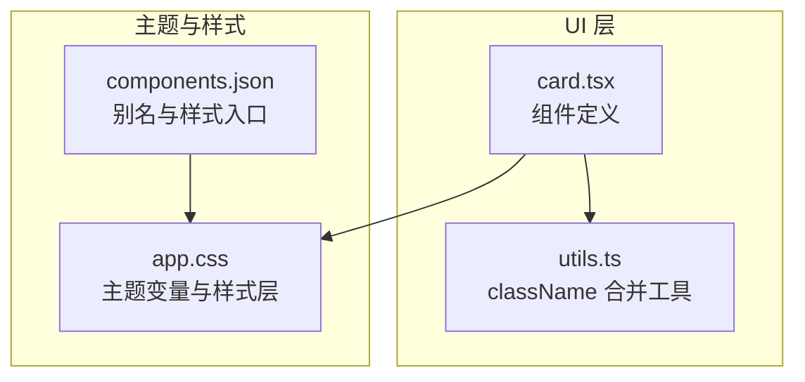
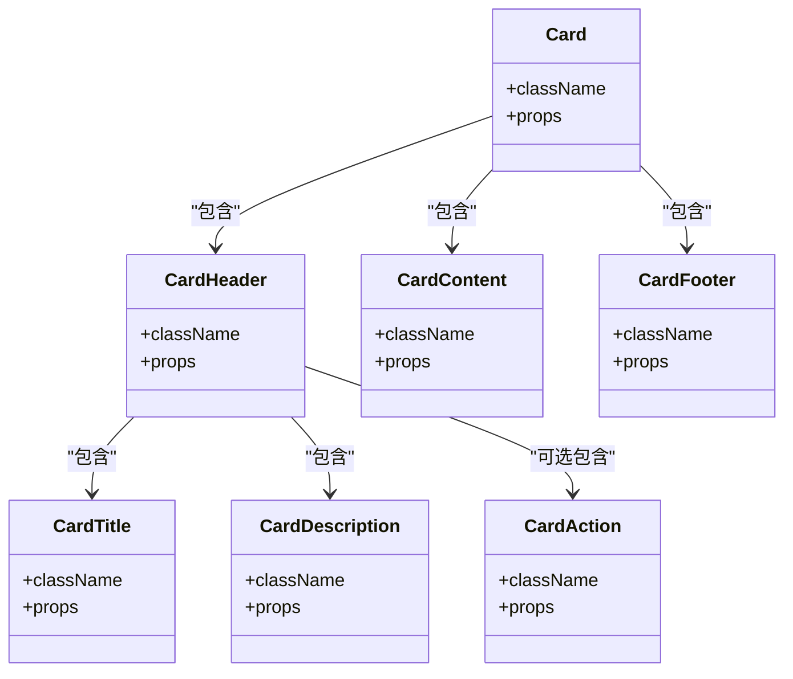
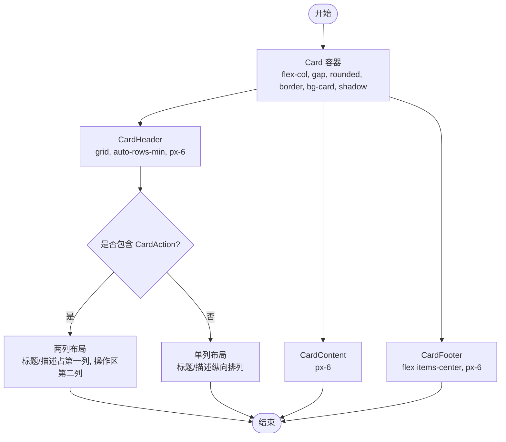
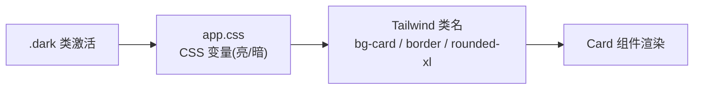
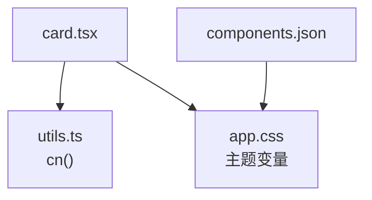

# Card 卡片组件

<cite>
**本文引用的文件**
- [apps/desktop/src/renderer/src/components/ui/card.tsx](file://apps/desktop/src/renderer/src/components/ui/card.tsx)
- [apps/desktop/src/renderer/src/assets/app.css](file://apps/desktop/src/renderer/src/assets/app.css)
- [apps/desktop/src/renderer/src/lib/utils.ts](file://apps/desktop/src/renderer/src/lib/utils.ts)
- [apps/desktop/components.json](file://apps/desktop/components.json)
</cite>

## 目录
1. [简介](#简介)
2. [项目结构](#项目结构)
3. [核心组件](#核心组件)
4. [架构总览](#架构总览)
5. [详细组件分析](#详细组件分析)
6. [依赖关系分析](#依赖关系分析)
7. [性能与可访问性](#性能与可访问性)
8. [故障排查指南](#故障排查指南)
9. [结论](#结论)
10. [附录：使用示例与最佳实践](#附录使用示例与最佳实践)

## 简介
Card 卡片组件用于将相关内容以“卡片”的形式进行分组展示，具备清晰的头部、主体、底部区域划分，支持标题、描述、操作区等常见内容组织方式。该组件基于 Tailwind CSS 构建，通过语义化 CSS 变量实现主题适配（亮/暗色），并借助容器查询与网格布局实现灵活的响应式排版。

## 项目结构
- 组件定义位于 UI 子目录，导出多个子块组件，便于组合使用。
- 样式系统由全局样式文件提供语义化颜色与圆角变量，配合 Tailwind 类名完成视觉表现。
- 工具函数用于合并 className，确保样式覆盖与优先级可控。
- 组件库配置定义了别名与基础样式入口，便于统一引入与扩展。

图表来源
- [apps/desktop/src/renderer/src/components/ui/card.tsx:1-74](file://apps/desktop/src/renderer/src/components/ui/card.tsx#L1-L74)
- [apps/desktop/src/renderer/src/assets/app.css:1-136](file://apps/desktop/src/renderer/src/assets/app.css#L1-L136)
- [apps/desktop/src/renderer/src/lib/utils.ts:1-7](file://apps/desktop/src/renderer/src/lib/utils.ts#L1-L7)
- [apps/desktop/components.json:1-22](file://apps/desktop/components.json#L1-L22)

章节来源
- [apps/desktop/src/renderer/src/components/ui/card.tsx:1-74](file://apps/desktop/src/renderer/src/components/ui/card.tsx#L1-L74)
- [apps/desktop/src/renderer/src/assets/app.css:1-136](file://apps/desktop/src/renderer/src/assets/app.css#L1-L136)
- [apps/desktop/src/renderer/src/lib/utils.ts:1-7](file://apps/desktop/src/renderer/src/lib/utils.ts#L1-L7)
- [apps/desktop/components.json:1-22](file://apps/desktop/components.json#L1-L22)

## 核心组件
- Card：卡片容器，负责整体布局、背景、边框、阴影、圆角与内边距。
- CardHeader：卡片头部，采用网格布局，支持标题与描述的纵向排列，以及可选的操作区横向对齐。
- CardTitle：卡片标题，强调层级与字重。
- CardDescription：卡片描述，使用次要文字色与较小字号。
- CardAction：卡片头部右侧操作区，适合放置按钮或图标。
- CardContent：卡片主体内容区，提供统一的左右内边距。
- CardFooter：卡片底部，常用于并列的辅助信息或操作按钮。

章节来源
- [apps/desktop/src/renderer/src/components/ui/card.tsx:4-72](file://apps/desktop/src/renderer/src/components/ui/card.tsx#L4-L72)

## 架构总览
卡片组件通过“容器 + 区块”的组合模式组织内容，所有区块均通过 data-slot 标记，便于在复杂场景中进行定位与调试。样式层面依赖 Tailwind 原子类与 CSS 变量，主题切换通过 .dark 类驱动。

图表来源
- [apps/desktop/src/renderer/src/components/ui/card.tsx:4-72](file://apps/desktop/src/renderer/src/components/ui/card.tsx#L4-L72)

## 详细组件分析

### 布局结构与内容组织
- 容器（Card）：垂直弹性布局，设置间距、圆角、边框、背景与文本色，并提供默认阴影。
- 头部（CardHeader）：网格布局，自动行高；当存在 CardAction 时，自动切换为两列布局，使操作区靠右对齐。
- 标题（CardTitle）与描述（CardDescription）：分别控制字体粗细与字号、颜色，形成清晰的信息层次。
- 操作区（CardAction）：通过网格定位到第二列，适合放置按钮、开关等交互元素。
- 主体（CardContent）：统一左右内边距，承载任意内容。
- 底部（CardFooter）：水平居中排列，适合附加说明或次要操作。

图表来源
- [apps/desktop/src/renderer/src/components/ui/card.tsx:17-71](file://apps/desktop/src/renderer/src/components/ui/card.tsx#L17-L71)

章节来源
- [apps/desktop/src/renderer/src/components/ui/card.tsx:17-71](file://apps/desktop/src/renderer/src/components/ui/card.tsx#L17-L71)

### 属性配置与插槽机制
- 所有子组件均接受 className 与标准 HTML 属性，可通过 className 覆盖默认样式。
- 通过 data-slot 标记区分不同区块，便于在复杂结构中定位与调试。
- 无显式 props 类型约束，保持灵活性与可扩展性。

章节来源
- [apps/desktop/src/renderer/src/components/ui/card.tsx:4-72](file://apps/desktop/src/renderer/src/components/ui/card.tsx#L4-L72)

### 样式系统与主题适配
- 颜色与圆角来自 CSS 变量，如 --color-card、--color-border、--radius-*，在 app.css 中定义亮/暗两套变量。
- 组件使用 Tailwind 类名引用这些变量，例如 bg-card、border、rounded-xl。
- 通过 .dark 类切换暗色主题，组件无需额外逻辑即可适配。

图表来源
- [apps/desktop/src/renderer/src/assets/app.css:9-116](file://apps/desktop/src/renderer/src/assets/app.css#L9-L116)
- [apps/desktop/src/renderer/src/components/ui/card.tsx:8-10](file://apps/desktop/src/renderer/src/components/ui/card.tsx#L8-L10)

章节来源
- [apps/desktop/src/renderer/src/assets/app.css:9-116](file://apps/desktop/src/renderer/src/assets/app.css#L9-L116)
- [apps/desktop/src/renderer/src/components/ui/card.tsx:8-10](file://apps/desktop/src/renderer/src/components/ui/card.tsx#L8-L10)

### 阴影、边框、圆角的配置方法
- 阴影：Card 默认使用小阴影，可通过 className 替换为更大或更淡的阴影。
- 边框：使用 border 类与 --color-border 变量，可在不同主题下保持一致的描边效果。
- 圆角：使用 rounded-xl 等半径类，变量 --radius-* 提供统一尺度。

章节来源
- [apps/desktop/src/renderer/src/components/ui/card.tsx:8-10](file://apps/desktop/src/renderer/src/components/ui/card.tsx#L8-L10)
- [apps/desktop/src/renderer/src/assets/app.css:45-49](file://apps/desktop/src/renderer/src/assets/app.css#L45-L49)

### 响应式设计与移动端适配
- 头部网格在检测到 CardAction 时自动切换为两列，保证操作区始终靠右且不被挤压。
- 容器查询 @container/card-header 可用于更细粒度的响应式调整（需父容器启用容器上下文）。
- 通过 px-6 等内边距与合理的字号、行高，在小屏设备上保持良好的可读性。

章节来源
- [apps/desktop/src/renderer/src/components/ui/card.tsx:21-23](file://apps/desktop/src/renderer/src/components/ui/card.tsx#L21-L23)
- [apps/desktop/src/renderer/src/components/ui/card.tsx:50-55](file://apps/desktop/src/renderer/src/components/ui/card.tsx#L50-L55)

## 依赖关系分析
- card.tsx 依赖 utils.ts 中的 cn 工具进行 className 合并，避免冲突并提升可维护性。
- 样式依赖 app.css 提供的主题变量与 Tailwind 配置。
- components.json 定义了别名与样式入口，便于统一导入与扩展。

图表来源
- [apps/desktop/src/renderer/src/components/ui/card.tsx:1-2](file://apps/desktop/src/renderer/src/components/ui/card.tsx#L1-L2)
- [apps/desktop/src/renderer/src/lib/utils.ts:1-7](file://apps/desktop/src/renderer/src/lib/utils.ts#L1-L7)
- [apps/desktop/src/renderer/src/assets/app.css:1-136](file://apps/desktop/src/renderer/src/assets/app.css#L1-L136)
- [apps/desktop/components.json:1-22](file://apps/desktop/components.json#L1-L22)

章节来源
- [apps/desktop/src/renderer/src/components/ui/card.tsx:1-2](file://apps/desktop/src/renderer/src/components/ui/card.tsx#L1-L2)
- [apps/desktop/src/renderer/src/lib/utils.ts:1-7](file://apps/desktop/src/renderer/src/lib/utils.ts#L1-L7)
- [apps/desktop/src/renderer/src/assets/app.css:1-136](file://apps/desktop/src/renderer/src/assets/app.css#L1-L136)
- [apps/desktop/components.json:1-22](file://apps/desktop/components.json#L1-L22)

## 性能与可访问性
- 性能：组件仅使用轻量级 DOM 与 Tailwind 原子类，无运行时计算开销；网格布局与容器查询在现代浏览器中高效。
- 可访问性：建议为交互元素添加 aria-label/title，确保键盘可达与屏幕阅读器友好。
- 主题：通过 .dark 类切换，避免 JS 动态注入样式带来的重排。

[本节为通用指导，不直接分析具体文件]

## 故障排查指南
- 样式未生效：检查是否在根节点启用了 .dark 类以加载暗色变量；确认 Tailwind 已正确编译。
- 布局异常：若 CardHeader 未出现两列布局，确认是否存在 CardAction 且其 data-slot 未被覆盖。
- 主题色不一致：确认 app.css 中对应 CSS 变量已定义，且未被第三方样式覆盖。
- 类名冲突：使用 cn 工具合并 className，避免重复或冲突的 Tailwind 类。

章节来源
- [apps/desktop/src/renderer/src/components/ui/card.tsx:8-10](file://apps/desktop/src/renderer/src/components/ui/card.tsx#L8-L10)
- [apps/desktop/src/renderer/src/components/ui/card.tsx:21-23](file://apps/desktop/src/renderer/src/components/ui/card.tsx#L21-L23)
- [apps/desktop/src/renderer/src/assets/app.css:54-116](file://apps/desktop/src/renderer/src/assets/app.css#L54-L116)
- [apps/desktop/src/renderer/src/lib/utils.ts:4-6](file://apps/desktop/src/renderer/src/lib/utils.ts#L4-L6)

## 结论
Card 卡片组件通过清晰的区域划分、灵活的网格布局与强大的主题系统，提供了开箱即用且易于定制的卡片能力。结合 Tailwind 与 CSS 变量，开发者可以快速实现多种卡片形态，并在不同主题与屏幕尺寸下保持一致的视觉体验。

[本节为总结性内容，不直接分析具体文件]

## 附录：使用示例与最佳实践

### 典型用法模式
- 基本信息卡片：Card > CardHeader(CardTitle + CardDescription) + CardContent + CardFooter。
- 带操作的卡片：Card > CardHeader(CardTitle + CardDescription + CardAction) + CardContent。
- 数据展示卡片：Card > CardHeader(CardTitle) + CardContent(表格/列表) + CardFooter(分页/统计)。

章节来源
- [apps/desktop/src/renderer/src/components/ui/card.tsx:17-71](file://apps/desktop/src/renderer/src/components/ui/card.tsx#L17-L71)

### 内容与组织结构建议
- 标题与描述应简洁明确，避免过长导致换行影响布局。
- 操作区尽量集中在 CardAction，保持头部整洁。
- 主体内容按信息密度分层，必要时使用分隔线或子卡片嵌套。
- 底部用于补充说明或次要操作，避免喧宾夺主。

章节来源
- [apps/desktop/src/renderer/src/components/ui/card.tsx:30-71](file://apps/desktop/src/renderer/src/components/ui/card.tsx#L30-L71)

### 响应式与移动端适配方案
- 利用 CardHeader 的两列自适应布局，在小屏上自动堆叠标题/描述与操作区。
- 如需更精细控制，可为父容器启用容器查询并使用 @container/card-header 断点。
- 合理设置内边距与字号，确保在小屏上的可读性与触控友好性。

章节来源
- [apps/desktop/src/renderer/src/components/ui/card.tsx:21-23](file://apps/desktop/src/renderer/src/components/ui/card.tsx#L21-L23)
- [apps/desktop/src/renderer/src/components/ui/card.tsx:50-55](file://apps/desktop/src/renderer/src/components/ui/card.tsx#L50-L55)