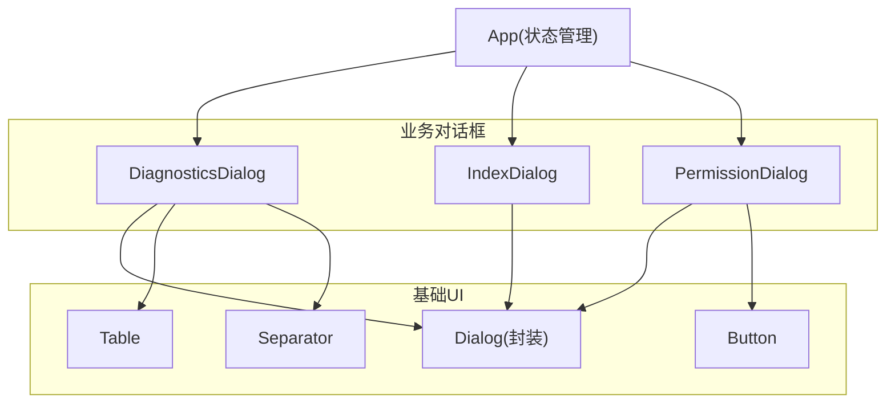
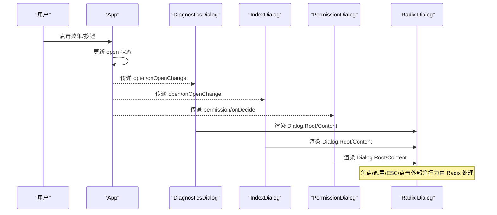
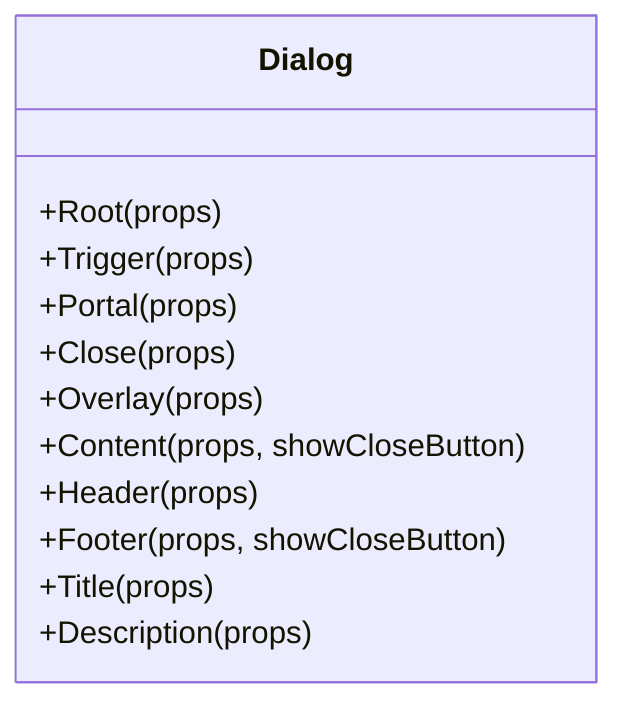
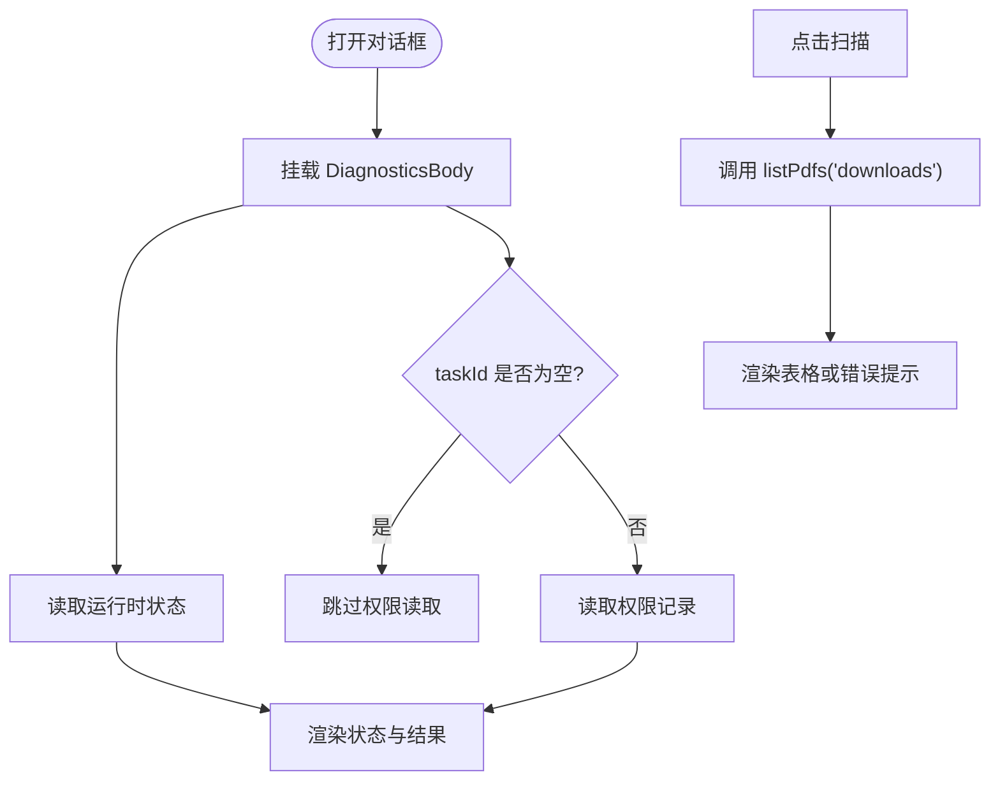
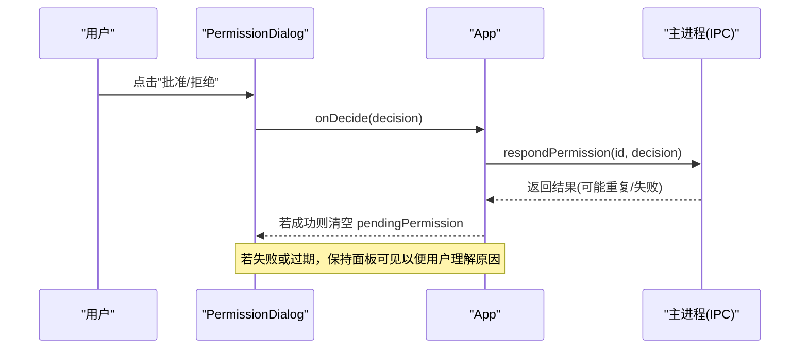
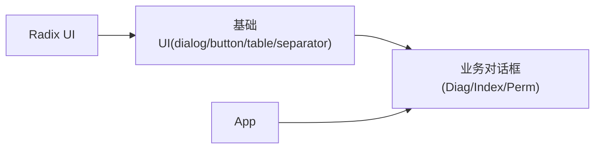

# Dialog 对话框组件

<cite>
**本文引用的文件**
- [dialog.tsx](file://apps/desktop/src/renderer/src/components/ui/dialog.tsx)
- [DiagnosticsDialog.tsx](file://apps/desktop/src/renderer/src/components/DiagnosticsDialog.tsx)
- [IndexDialog.tsx](file://apps/desktop/src/renderer/src/components/IndexDialog.tsx)
- [PermissionDialog.tsx](file://apps/desktop/src/renderer/src/components/PermissionDialog.tsx)
- [button.tsx](file://apps/desktop/src/renderer/src/components/ui/button.tsx)
- [table.tsx](file://apps/desktop/src/renderer/src/components/ui/table.tsx)
- [separator.tsx](file://apps/desktop/src/renderer/src/components/ui/separator.tsx)
- [App.tsx](file://apps/desktop/src/renderer/src/App.tsx)
</cite>

## 目录
1. [简介](#简介)
2. [项目结构](#项目结构)
3. [核心组件](#核心组件)
4. [架构总览](#架构总览)
5. [详细组件分析](#详细组件分析)
6. [依赖关系分析](#依赖关系分析)
7. [性能与可访问性](#性能与可访问性)
8. [故障排查指南](#故障排查指南)
9. [结论](#结论)
10. [附录：使用示例与样式定制](#附录使用示例与样式定制)

## 简介
本组件库基于 Radix UI 的 Dialog 原语，封装了符合业务需求的对话框组件，并提供多种典型场景的实现：诊断信息、索引管理、权限审批等。文档将深入说明其实现原理、属性配置、生命周期管理、与 Radix UI 的集成方式、可访问性特性、样式定制方法以及与其他组件的组合模式。

## 项目结构
对话框相关代码位于渲染进程（renderer）中，采用“基础 UI 组件 + 业务对话框”的分层组织方式：
- 基础 UI 层：提供通用的 Dialog、Button、Table、Separator 等原子组件
- 业务对话框层：封装具体业务场景的对话框（诊断、索引、权限审批）
- 应用层：在 App 中集中管理多个对话框的开合状态与数据流

图表来源
- [dialog.tsx:10-144](file://apps/desktop/src/renderer/src/components/ui/dialog.tsx#L10-L144)
- [DiagnosticsDialog.tsx:185-203](file://apps/desktop/src/renderer/src/components/DiagnosticsDialog.tsx#L185-L203)
- [IndexDialog.tsx:65-77](file://apps/desktop/src/renderer/src/components/IndexDialog.tsx#L65-L77)
- [PermissionDialog.tsx:136-164](file://apps/desktop/src/renderer/src/components/PermissionDialog.tsx#L136-L164)
- [button.tsx:38-61](file://apps/desktop/src/renderer/src/components/ui/button.tsx#L38-L61)
- [table.tsx:6-91](file://apps/desktop/src/renderer/src/components/ui/table.tsx#L6-L91)
- [separator.tsx:5-25](file://apps/desktop/src/renderer/src/components/ui/separator.tsx#L5-L25)

章节来源
- [dialog.tsx:10-144](file://apps/desktop/src/renderer/src/components/ui/dialog.tsx#L10-L144)
- [DiagnosticsDialog.tsx:185-203](file://apps/desktop/src/renderer/src/components/DiagnosticsDialog.tsx#L185-L203)
- [IndexDialog.tsx:65-77](file://apps/desktop/src/renderer/src/components/IndexDialog.tsx#L65-L77)
- [PermissionDialog.tsx:136-164](file://apps/desktop/src/renderer/src/components/PermissionDialog.tsx#L136-L164)
- [button.tsx:38-61](file://apps/desktop/src/renderer/src/components/ui/button.tsx#L38-L61)
- [table.tsx:6-91](file://apps/desktop/src/renderer/src/components/ui/table.tsx#L6-L91)
- [separator.tsx:5-25](file://apps/desktop/src/renderer/src/components/ui/separator.tsx#L5-L25)

## 核心组件
- Dialog 基础封装：对 Radix UI 的 Root、Trigger、Portal、Close、Overlay、Content、Header、Footer、Title、Description 进行统一包装，添加 data-slot 标记与默认样式，并内置关闭按钮与动画过渡。
- 业务对话框：
  - DiagnosticsDialog：展示运行时状态、Downloads 扫描结果与权限记录概览
  - IndexDialog：展示已索引 PDF 列表及时间信息
  - PermissionDialog：用于用户审批能力请求，支持倒计时、提交态与不可点击遮罩

章节来源
- [dialog.tsx:10-144](file://apps/desktop/src/renderer/src/components/ui/dialog.tsx#L10-L144)
- [DiagnosticsDialog.tsx:14-203](file://apps/desktop/src/renderer/src/components/DiagnosticsDialog.tsx#L14-L203)
- [IndexDialog.tsx:7-77](file://apps/desktop/src/renderer/src/components/IndexDialog.tsx#L7-L77)
- [PermissionDialog.tsx:15-164](file://apps/desktop/src/renderer/src/components/PermissionDialog.tsx#L15-L164)

## 架构总览
对话框由应用层集中管理开合状态，通过受控模式传递给各业务对话框；业务对话框内部按需发起 IPC 获取数据，并在打开时挂载子树以触发副作用（如读取数据），关闭时卸载以清理资源。

图表来源
- [App.tsx:282-288](file://apps/desktop/src/renderer/src/App.tsx#L282-L288)
- [dialog.tsx:10-144](file://apps/desktop/src/renderer/src/components/ui/dialog.tsx#L10-L144)

章节来源
- [App.tsx:282-288](file://apps/desktop/src/renderer/src/App.tsx#L282-L288)
- [dialog.tsx:10-144](file://apps/desktop/src/renderer/src/components/ui/dialog.tsx#L10-L144)

## 详细组件分析

### 基础 Dialog 组件（ui/dialog.tsx）
- 组件拆分：Root、Trigger、Portal、Close、Overlay、Content、Header、Footer、Title、Description 分别封装，便于组合与样式控制
- 内容区 Content：
  - 使用 Portal 将弹窗渲染到根节点，避免层级问题
  - 内置 Overlay 作为遮罩，带淡入淡出动画
  - 默认显示右上角关闭按钮，可通过 showCloseButton 控制
  - 居中定位、响应式最大宽度、阴影与圆角、过渡动画
- 头部与底部：
  - Header/Footer 提供布局容器，Footer 可选显示关闭按钮
- 可访问性：
  - 使用 Radix 的语义化元素，自动维护焦点环与键盘交互
  - 关闭按钮包含 sr-only 文本，辅助读屏

图表来源
- [dialog.tsx:10-144](file://apps/desktop/src/renderer/src/components/ui/dialog.tsx#L10-L144)

章节来源
- [dialog.tsx:10-144](file://apps/desktop/src/renderer/src/components/ui/dialog.tsx#L10-L144)

### 诊断对话框（DiagnosticsDialog）
- 功能：
  - 打开时读取运行时状态
  - 提供“扫描 Downloads”按钮，列出 PDF 并展示结果表格
  - 展示当前会话的权限记录（只读）
- 生命周期：
  - 使用条件渲染 {open && <DiagnosticsBody />}，确保打开时才挂载子树，关闭即卸载，避免不必要的副作用
  - 内部使用 useEffect 在挂载时拉取数据，并在卸载时取消未完成的请求（cancelled 标志）
- 数据流：
  - 通过 window.personalAgent.runtimeStatus() 获取运行时状态
  - 通过 listPdfs('downloads') 获取扫描结果
  - 通过 listPermissions(taskId) 获取权限记录（仅当 taskId 非空）

图表来源
- [DiagnosticsDialog.tsx:22-103](file://apps/desktop/src/renderer/src/components/DiagnosticsDialog.tsx#L22-L103)
- [DiagnosticsDialog.tsx:108-183](file://apps/desktop/src/renderer/src/components/DiagnosticsDialog.tsx#L108-L183)
- [DiagnosticsDialog.tsx:185-203](file://apps/desktop/src/renderer/src/components/DiagnosticsDialog.tsx#L185-L203)

章节来源
- [DiagnosticsDialog.tsx:22-103](file://apps/desktop/src/renderer/src/components/DiagnosticsDialog.tsx#L22-L103)
- [DiagnosticsDialog.tsx:108-183](file://apps/desktop/src/renderer/src/components/DiagnosticsDialog.tsx#L108-L183)
- [DiagnosticsDialog.tsx:185-203](file://apps/desktop/src/renderer/src/components/DiagnosticsDialog.tsx#L185-L203)

### 索引对话框（IndexDialog）
- 功能：展示已索引的 PDF 列表及其首次/最近扫描时间
- 生命周期：
  - 打开时挂载 IndexBody，读取一次索引数据；关闭后卸载，无需手动重置状态
- 数据流：
  - 通过 indexedPdfs() 获取索引条目，渲染为表格

章节来源
- [IndexDialog.tsx:12-63](file://apps/desktop/src/renderer/src/components/IndexDialog.tsx#L12-L63)
- [IndexDialog.tsx:65-77](file://apps/desktop/src/renderer/src/components/IndexDialog.tsx#L65-L77)

### 权限审批对话框（PermissionDialog）
- 功能：向用户展示需要批准的能力请求，支持拒绝/批准操作
- 交互细节：
  - 禁止点击遮罩、按下 ESC 或外部交互关闭，确保必须明确选择
  - 显示剩余时间倒计时，过期则禁用按钮并提示等待主进程结算
  - 提交过程中禁用按钮，防止重复提交
- 数据流：
  - 通过 onDecide 回调返回决策，由上层调用 respondPermission 完成 IPC 通信
  - 上层根据推送通知决定是否清空 pendingPermission

图表来源
- [PermissionDialog.tsx:30-134](file://apps/desktop/src/renderer/src/components/PermissionDialog.tsx#L30-L134)
- [PermissionDialog.tsx:136-164](file://apps/desktop/src/renderer/src/components/PermissionDialog.tsx#L136-L164)
- [App.tsx:111-150](file://apps/desktop/src/renderer/src/App.tsx#L111-L150)

章节来源
- [PermissionDialog.tsx:30-134](file://apps/desktop/src/renderer/src/components/PermissionDialog.tsx#L30-L134)
- [PermissionDialog.tsx:136-164](file://apps/desktop/src/renderer/src/components/PermissionDialog.tsx#L136-L164)
- [App.tsx:111-150](file://apps/desktop/src/renderer/src/App.tsx#L111-L150)

## 依赖关系分析
- 基础 UI 依赖：
  - Radix UI Dialog/Separator 提供无障碍与行为保障
  - Button/Table/Separator 提供一致的视觉风格
- 业务对话框依赖：
  - DiagnosticsDialog 依赖 Table、Separator 展示结构化数据
  - PermissionDialog 依赖 Button 提供操作入口
- 应用层依赖：
  - App 集中管理 open 状态与权限审批流程，串联各对话框

图表来源
- [dialog.tsx:10-144](file://apps/desktop/src/renderer/src/components/ui/dialog.tsx#L10-L144)
- [button.tsx:38-61](file://apps/desktop/src/renderer/src/components/ui/button.tsx#L38-L61)
- [table.tsx:6-91](file://apps/desktop/src/renderer/src/components/ui/table.tsx#L6-L91)
- [separator.tsx:5-25](file://apps/desktop/src/renderer/src/components/ui/separator.tsx#L5-L25)
- [DiagnosticsDialog.tsx:185-203](file://apps/desktop/src/renderer/src/components/DiagnosticsDialog.tsx#L185-L203)
- [IndexDialog.tsx:65-77](file://apps/desktop/src/renderer/src/components/IndexDialog.tsx#L65-L77)
- [PermissionDialog.tsx:136-164](file://apps/desktop/src/renderer/src/components/PermissionDialog.tsx#L136-L164)
- [App.tsx:282-288](file://apps/desktop/src/renderer/src/App.tsx#L282-L288)

章节来源
- [dialog.tsx:10-144](file://apps/desktop/src/renderer/src/components/ui/dialog.tsx#L10-L144)
- [button.tsx:38-61](file://apps/desktop/src/renderer/src/components/ui/button.tsx#L38-L61)
- [table.tsx:6-91](file://apps/desktop/src/renderer/src/components/ui/table.tsx#L6-L91)
- [separator.tsx:5-25](file://apps/desktop/src/renderer/src/components/ui/separator.tsx#L5-L25)
- [DiagnosticsDialog.tsx:185-203](file://apps/desktop/src/renderer/src/components/DiagnosticsDialog.tsx#L185-L203)
- [IndexDialog.tsx:65-77](file://apps/desktop/src/renderer/src/components/IndexDialog.tsx#L65-L77)
- [PermissionDialog.tsx:136-164](file://apps/desktop/src/renderer/src/components/PermissionDialog.tsx#L136-L164)
- [App.tsx:282-288](file://apps/desktop/src/renderer/src/App.tsx#L282-L288)

## 性能与可访问性
- 性能
  - 条件渲染：仅在 open 为真时挂载对话框主体，减少无效渲染
  - 取消机制：useEffect 中使用 cancelled 标志，避免组件卸载后的状态更新
  - 最小化重渲染：通过 key 变化（如 taskId、permission.id）强制重新挂载，重置内部状态
- 可访问性
  - 使用 Radix 的 Dialog 原语，自动处理焦点管理、Tab 顺序、Esc 关闭、点击外部关闭等
  - 关闭按钮包含 sr-only 文本，提升读屏体验
  - 权限对话框通过阻止外部交互，确保关键决策不被误触

章节来源
- [DiagnosticsDialog.tsx:22-35](file://apps/desktop/src/renderer/src/components/DiagnosticsDialog.tsx#L22-L35)
- [IndexDialog.tsx:16-24](file://apps/desktop/src/renderer/src/components/IndexDialog.tsx#L16-L24)
- [PermissionDialog.tsx:41-44](file://apps/desktop/src/renderer/src/components/PermissionDialog.tsx#L41-L44)
- [PermissionDialog.tsx:141-148](file://apps/desktop/src/renderer/src/components/PermissionDialog.tsx#L141-L148)
- [dialog.tsx:62-70](file://apps/desktop/src/renderer/src/components/ui/dialog.tsx#L62-L70)

## 故障排查指南
- 权限对话框无法关闭
  - 检查是否设置了阻止外部交互（onPointerDownOutside/onEscapeKeyDown/onInteractOutside）
  - 确认过期逻辑是否正确禁用按钮，避免用户误以为卡死
- 数据未更新
  - 确认是否在 open 条件下挂载子树，且 useEffect 已执行
  - 检查 IPC 调用是否返回错误，是否有错误提示
- 样式异常
  - 检查 Tailwind 类名是否正确引入
  - 确认 data-slot 未被覆盖导致样式失效

章节来源
- [PermissionDialog.tsx:141-148](file://apps/desktop/src/renderer/src/components/PermissionDialog.tsx#L141-L148)
- [DiagnosticsDialog.tsx:27-45](file://apps/desktop/src/renderer/src/components/DiagnosticsDialog.tsx#L27-L45)
- [IndexDialog.tsx:16-24](file://apps/desktop/src/renderer/src/components/IndexDialog.tsx#L16-L24)
- [dialog.tsx:50-73](file://apps/desktop/src/renderer/src/components/ui/dialog.tsx#L50-L73)

## 结论
该对话框体系以 Radix UI 为基础，结合 React 的条件渲染与副作用管理，提供了稳定、可访问、易扩展的模态窗口解决方案。通过统一的封装与清晰的职责划分，不同业务场景可快速复用基础能力，同时保持各自的状态与交互特性。

## 附录：使用示例与样式定制

### 使用示例
- 索引对话框
  - 在 App 中通过 open/onOpenChange 控制显示
  - 打开时自动读取索引数据并渲染表格
- 诊断对话框
  - 打开时读取运行时状态，支持扫描 Downloads 并展示结果
  - 根据选中任务加载权限记录
- 权限审批对话框
  - 当有权限请求时弹出，禁止外部关闭
  - 用户批准后调用 onDecide，上层负责 IPC 与状态清理

章节来源
- [App.tsx:282-288](file://apps/desktop/src/renderer/src/App.tsx#L282-L288)
- [IndexDialog.tsx:65-77](file://apps/desktop/src/renderer/src/components/IndexDialog.tsx#L65-L77)
- [DiagnosticsDialog.tsx:185-203](file://apps/desktop/src/renderer/src/components/DiagnosticsDialog.tsx#L185-L203)
- [PermissionDialog.tsx:136-164](file://apps/desktop/src/renderer/src/components/PermissionDialog.tsx#L136-L164)

### 样式定制与主题适配
- 全局样式
  - 使用 Tailwind 类名进行布局与外观定制
  - 通过 data-slot 选择器精准定位 DOM 节点进行样式覆盖
- 组件级定制
  - Dialog.Content 支持 className 透传，可自定义尺寸、间距、阴影等
  - Dialog.Header/Footer 可自由组合按钮与信息展示
  - Button 支持 variant/size 变体，适配不同场景
- 主题适配
  - 使用语义化颜色变量（如 background、foreground、border、ring）
  - 暗色模式下通过 dark: 前缀调整样式

章节来源
- [dialog.tsx:50-73](file://apps/desktop/src/renderer/src/components/ui/dialog.tsx#L50-L73)
- [button.tsx:6-35](file://apps/desktop/src/renderer/src/components/ui/button.tsx#L6-L35)
- [table.tsx:6-91](file://apps/desktop/src/renderer/src/components/ui/table.tsx#L6-L91)
- [separator.tsx:5-25](file://apps/desktop/src/renderer/src/components/ui/separator.tsx#L5-L25)