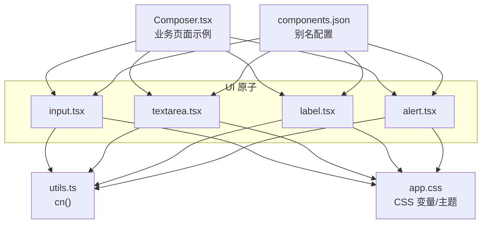
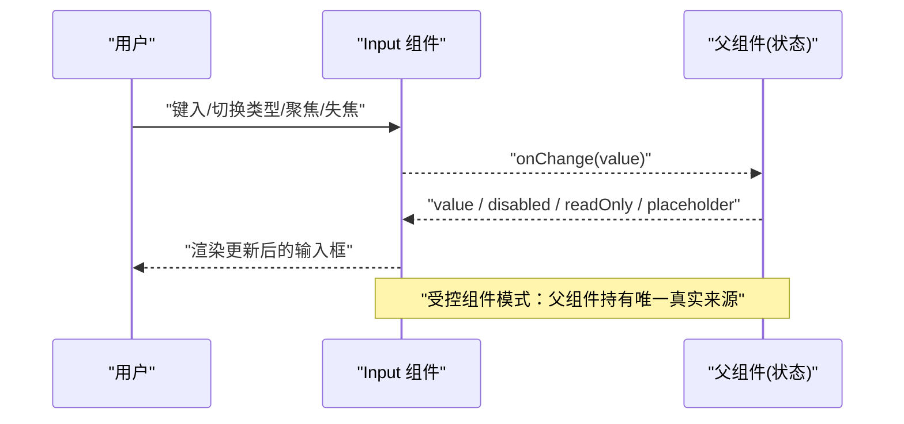
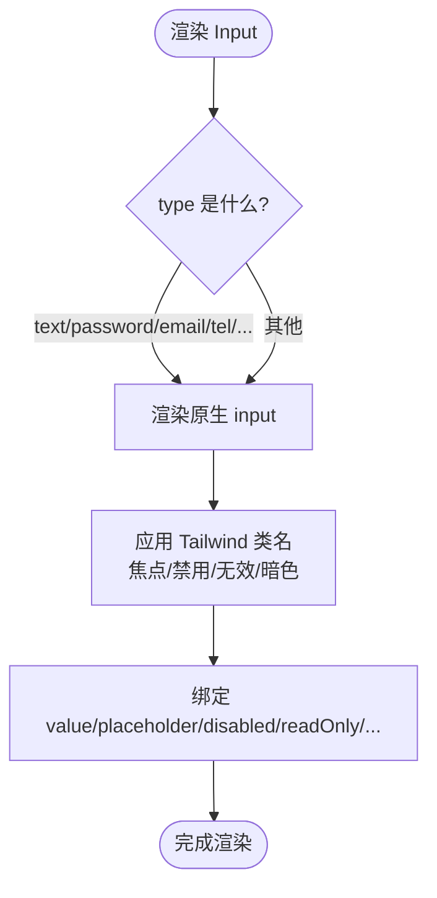
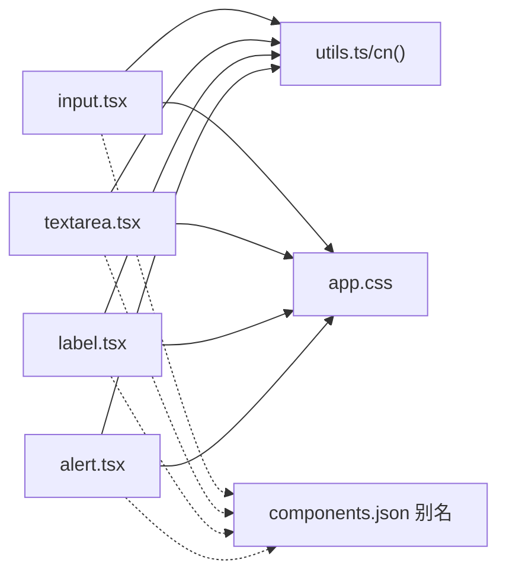

# Input 输入框组件

<cite>
**本文引用的文件**
- [apps/desktop/src/renderer/src/components/ui/input.tsx](file://apps/desktop/src/renderer/src/components/ui/input.tsx)
- [apps/desktop/src/renderer/src/lib/utils.ts](file://apps/desktop/src/renderer/src/lib/utils.ts)
- [apps/desktop/src/renderer/src/assets/app.css](file://apps/desktop/src/renderer/src/assets/app.css)
- [apps/desktop/src/renderer/src/components/ui/textarea.tsx](file://apps/desktop/src/renderer/src/components/ui/textarea.tsx)
- [apps/desktop/src/renderer/src/components/ui/label.tsx](file://apps/desktop/src/renderer/src/components/ui/label.tsx)
- [apps/desktop/src/renderer/src/components/ui/alert.tsx](file://apps/desktop/src/renderer/src/components/ui/alert.tsx)
- [apps/desktop/src/renderer/src/components/Composer.tsx](file://apps/desktop/src/renderer/src/components/Composer.tsx)
- [apps/desktop/components.json](file://apps/desktop/components.json)
</cite>

## 目录
1. [简介](#简介)
2. [项目结构](#项目结构)
3. [核心组件](#核心组件)
4. [架构总览](#架构总览)
5. [详细组件分析](#详细组件分析)
6. [依赖关系分析](#依赖关系分析)
7. [性能考量](#性能考量)
8. [故障排查指南](#故障排查指南)
9. [结论](#结论)
10. [附录](#附录)

## 简介
本文件为 Input 输入框组件的详细技术文档。该组件基于原生 input 元素封装，提供统一的样式与可访问性基础能力，并通过 Tailwind CSS 与 CSS 变量实现主题化与响应式适配。文档涵盖：
- 文本、数值、密码等类型输入的实现方式
- 属性接口与状态控制（如 value、placeholder、disabled、readOnly 等）
- 输入验证与错误提示的集成模式
- 与表单系统的集成和数据绑定模式
- 使用示例与最佳实践
- 样式定制与响应式适配方法
- 可访问性与键盘交互优化

## 项目结构
Input 组件位于 UI 原子层，配合 Label、Textarea、Alert 等基础组件以及全局样式与工具函数，形成一致的输入体验。

图表来源
- [apps/desktop/src/renderer/src/components/ui/input.tsx:1-21](file://apps/desktop/src/renderer/src/components/ui/input.tsx#L1-L21)
- [apps/desktop/src/renderer/src/components/ui/textarea.tsx:1-18](file://apps/desktop/src/renderer/src/components/ui/textarea.tsx#L1-L18)
- [apps/desktop/src/renderer/src/components/ui/label.tsx:1-19](file://apps/desktop/src/renderer/src/components/ui/label.tsx#L1-L19)
- [apps/desktop/src/renderer/src/components/ui/alert.tsx:1-60](file://apps/desktop/src/renderer/src/components/ui/alert.tsx#L1-L60)
- [apps/desktop/src/renderer/src/lib/utils.ts:1-7](file://apps/desktop/src/renderer/src/lib/utils.ts#L1-L7)
- [apps/desktop/src/renderer/src/assets/app.css:1-136](file://apps/desktop/src/renderer/src/assets/app.css#L1-L136)
- [apps/desktop/components.json:1-22](file://apps/desktop/components.json#L1-L22)
- [apps/desktop/src/renderer/src/components/Composer.tsx:1-142](file://apps/desktop/src/renderer/src/components/Composer.tsx#L1-L142)

章节来源
- [apps/desktop/src/renderer/src/components/ui/input.tsx:1-21](file://apps/desktop/src/renderer/src/components/ui/input.tsx#L1-L21)
- [apps/desktop/src/renderer/src/lib/utils.ts:1-7](file://apps/desktop/src/renderer/src/lib/utils.ts#L1-L7)
- [apps/desktop/src/renderer/src/assets/app.css:1-136](file://apps/desktop/src/renderer/src/assets/app.css#L1-L136)
- [apps/desktop/components.json:1-22](file://apps/desktop/components.json#L1-L22)

## 核心组件
- Input 输入框：基于原生 input 的轻量封装，统一样式、焦点环、禁用态与无效态视觉反馈，支持所有标准 input 类型（text、number、password 等）。
- Textarea 多行输入：与 Input 风格一致的多行输入控件，便于长文本场景。
- Label 标签：用于关联表单控件的可访问性标签。
- Alert 告警：用于展示错误、警告等信息，常与输入验证结果联动。

章节来源
- [apps/desktop/src/renderer/src/components/ui/input.tsx:1-21](file://apps/desktop/src/renderer/src/components/ui/input.tsx#L1-L21)
- [apps/desktop/src/renderer/src/components/ui/textarea.tsx:1-18](file://apps/desktop/src/renderer/src/components/ui/textarea.tsx#L1-L18)
- [apps/desktop/src/renderer/src/components/ui/label.tsx:1-19](file://apps/desktop/src/renderer/src/components/ui/label.tsx#L1-L19)
- [apps/desktop/src/renderer/src/components/ui/alert.tsx:1-60](file://apps/desktop/src/renderer/src/components/ui/alert.tsx#L1-L60)

## 架构总览
Input 组件通过以下机制实现统一体验：
- 样式系统：Tailwind 类名 + CSS 变量主题，暗色模式由 app.css 中的 .dark 变体驱动。
- 工具函数：cn() 合并类名，避免冲突并支持条件类。
- 可访问性：aria-invalid 用于无效态；focus-visible 提供焦点环；Label 与控件关联提升读屏体验。
- 数据绑定：遵循受控组件模式，通过 value 与 onChange 将输入值同步到父组件状态。

图表来源
- [apps/desktop/src/renderer/src/components/ui/input.tsx:1-21](file://apps/desktop/src/renderer/src/components/ui/input.tsx#L1-L21)
- [apps/desktop/src/renderer/src/components/Composer.tsx:1-142](file://apps/desktop/src/renderer/src/components/Composer.tsx#L1-L142)

## 详细组件分析

### Input 输入框
- 类型支持：通过 type 属性支持 text、number、password、email、tel 等所有原生 input 类型。
- 状态控制：
  - value：受控值，由父组件管理。
  - placeholder：占位提示文本。
  - disabled：禁用态，不可编辑且降低透明度。
  - readOnly：只读态，可聚焦但不可修改。
  - className：自定义样式覆盖。
- 样式与可访问性：
  - 焦点环：focus-visible:border-ring 与 focus-visible:ring 提供可见焦点指示。
  - 无效态：aria-invalid 触发破坏色边框与弱环，便于错误提示。
  - 禁用态：pointer-events-none、cursor-not-allowed、opacity 降低。
  - 暗色模式：dark:bg-input/30 等暗色背景增强对比度。
- 与工具函数：使用 cn() 合并 Tailwind 类名，确保样式优先级与条件类正确生效。

图表来源
- [apps/desktop/src/renderer/src/components/ui/input.tsx:1-21](file://apps/desktop/src/renderer/src/components/ui/input.tsx#L1-L21)
- [apps/desktop/src/renderer/src/lib/utils.ts:1-7](file://apps/desktop/src/renderer/src/lib/utils.ts#L1-L7)

章节来源
- [apps/desktop/src/renderer/src/components/ui/input.tsx:1-21](file://apps/desktop/src/renderer/src/components/ui/input.tsx#L1-L21)
- [apps/desktop/src/renderer/src/lib/utils.ts:1-7](file://apps/desktop/src/renderer/src/lib/utils.ts#L1-L7)

### Textarea 多行输入
- 与 Input 保持一致的样式语言与可访问性策略，适合多行文本输入。
- 支持 disabled、aria-invalid 等状态，便于与表单校验联动。

章节来源
- [apps/desktop/src/renderer/src/components/ui/textarea.tsx:1-18](file://apps/desktop/src/renderer/src/components/ui/textarea.tsx#L1-L18)

### Label 标签
- 基于 Radix UI 的 Label 根组件封装，提供语义化标签与禁用态样式。
- 可与 Input/Textarea 通过 htmlFor 或组合方式建立关联，提升可访问性。

章节来源
- [apps/desktop/src/renderer/src/components/ui/label.tsx:1-19](file://apps/desktop/src/renderer/src/components/ui/label.tsx#L1-L19)

### Alert 告警
- 用于展示错误、警告、信息等内容，支持 destructive 变体。
- 常与输入验证结果结合，在输入框下方显示错误消息。

章节来源
- [apps/desktop/src/renderer/src/components/ui/alert.tsx:1-60](file://apps/desktop/src/renderer/src/components/ui/alert.tsx#L1-L60)

### 使用示例（来自业务组件）
- Composer 展示了受控输入的使用模式：通过 useState 维护 value，并在 onChange 中更新状态；通过 Enter 键发送消息，体现键盘交互优化。
- 虽然 Composer 内部使用的是 textarea，但其受控模式与键盘事件处理可直接迁移至 Input 组件。

章节来源
- [apps/desktop/src/renderer/src/components/Composer.tsx:1-142](file://apps/desktop/src/renderer/src/components/Composer.tsx#L1-L142)

## 依赖关系分析
- 组件依赖：
  - Input/Textarea/Label/Alert 均依赖 cn() 进行类名合并。
  - 样式依赖 app.css 中的 CSS 变量与 dark 变体。
  - 组件路径通过 components.json 的别名统一引用。
- 外部依赖：
  - Tailwind CSS：原子化样式。
  - class-variance-authority（在 Alert 中使用）：用于变体管理。
  - radix-ui（在 Label 中使用）：提供无障碍原语。

图表来源
- [apps/desktop/src/renderer/src/components/ui/input.tsx:1-21](file://apps/desktop/src/renderer/src/components/ui/input.tsx#L1-L21)
- [apps/desktop/src/renderer/src/components/ui/textarea.tsx:1-18](file://apps/desktop/src/renderer/src/components/ui/textarea.tsx#L1-L18)
- [apps/desktop/src/renderer/src/components/ui/label.tsx:1-19](file://apps/desktop/src/renderer/src/components/ui/label.tsx#L1-L19)
- [apps/desktop/src/renderer/src/components/ui/alert.tsx:1-60](file://apps/desktop/src/renderer/src/components/ui/alert.tsx#L1-L60)
- [apps/desktop/src/renderer/src/lib/utils.ts:1-7](file://apps/desktop/src/renderer/src/lib/utils.ts#L1-L7)
- [apps/desktop/src/renderer/src/assets/app.css:1-136](file://apps/desktop/src/renderer/src/assets/app.css#L1-L136)
- [apps/desktop/components.json:1-22](file://apps/desktop/components.json#L1-L22)

章节来源
- [apps/desktop/components.json:1-22](file://apps/desktop/components.json#L1-L22)
- [apps/desktop/src/renderer/src/lib/utils.ts:1-7](file://apps/desktop/src/renderer/src/lib/utils.ts#L1-L7)
- [apps/desktop/src/renderer/src/assets/app.css:1-136](file://apps/desktop/src/renderer/src/assets/app.css#L1-L136)

## 性能考量
- 受控组件：建议在父组件中对高频输入进行节流或防抖，减少不必要的重渲染。
- 类名合并：cn() 使用 clsx 与 twMerge，避免重复与冲突，保持渲染高效。
- 样式变量：通过 CSS 变量集中管理主题，减少运行时计算开销。
- 事件处理：对 keydown/keyup 等高频事件进行必要优化，避免阻塞主线程。

[本节为通用指导，不直接分析具体文件]

## 故障排查指南
- 输入无响应：
  - 检查是否设置了 disabled 或 readOnly。
  - 确认父组件是否正确传递 value 与 onChange。
- 样式异常：
  - 确认 app.css 已引入，且 html/body 包含必要的主题类（如 .dark）。
  - 检查 cn() 传入的类名是否存在冲突或被覆盖。
- 无效态未生效：
  - 确保在验证失败时设置 aria-invalid="true"。
  - 结合 Alert 组件展示错误信息，提升用户体验。
- 键盘交互问题：
  - 对于 Enter 发送等行为，注意阻止默认换行行为（preventDefault）。
  - 在多行输入中区分 Shift+Enter 与 Enter 的行为。

章节来源
- [apps/desktop/src/renderer/src/components/ui/input.tsx:1-21](file://apps/desktop/src/renderer/src/components/ui/input.tsx#L1-L21)
- [apps/desktop/src/renderer/src/components/ui/alert.tsx:1-60](file://apps/desktop/src/renderer/src/components/ui/alert.tsx#L1-L60)
- [apps/desktop/src/renderer/src/components/Composer.tsx:1-142](file://apps/desktop/src/renderer/src/components/Composer.tsx#L1-L142)
- [apps/desktop/src/renderer/src/assets/app.css:1-136](file://apps/desktop/src/renderer/src/assets/app.css#L1-L136)

## 结论
Input 输入框组件以最小封装提供稳定的样式、可访问性与状态管理能力，配合 Textarea、Label、Alert 等基础组件，能够覆盖大多数表单输入场景。通过受控组件模式与 CSS 变量主题化，开发者可以便捷地实现复杂表单逻辑与一致的视觉体验。建议在实际项目中结合业务需求，补充输入验证、格式化与国际化等能力。

[本节为总结性内容，不直接分析具体文件]

## 附录

### 属性接口说明（Input）
- value：字符串，受控值，由父组件管理。
- placeholder：字符串，占位提示。
- type：字符串，支持 text、number、password、email、tel 等原生类型。
- disabled：布尔值，禁用态。
- readOnly：布尔值，只读态。
- className：字符串，自定义样式覆盖。
- 其他原生 input 属性：可通过 props 透传。

章节来源
- [apps/desktop/src/renderer/src/components/ui/input.tsx:1-21](file://apps/desktop/src/renderer/src/components/ui/input.tsx#L1-L21)

### 输入验证与错误处理模式
- 实时验证：在 onChange 中执行校验规则，根据结果设置错误状态。
- 错误展示：当存在错误时，为输入框添加 aria-invalid="true"，并使用 Alert 组件展示错误信息。
- 提交前校验：在提交动作中再次校验，防止绕过前端校验。

章节来源
- [apps/desktop/src/renderer/src/components/ui/alert.tsx:1-60](file://apps/desktop/src/renderer/src/components/ui/alert.tsx#L1-L60)
- [apps/desktop/src/renderer/src/components/ui/input.tsx:1-21](file://apps/desktop/src/renderer/src/components/ui/input.tsx#L1-L21)

### 与表单系统集成与数据绑定
- 受控组件：父组件持有 value 与 onChange，保证单一数据源。
- 表单库集成：可将 Input 作为受控字段接入 React Hook Form、Formik 等表单库，通过 ref 与 rules 实现校验与格式化。
- 双向绑定：在简单场景中可使用 useState 直接绑定 value 与 onChange。

章节来源
- [apps/desktop/src/renderer/src/components/Composer.tsx:1-142](file://apps/desktop/src/renderer/src/components/Composer.tsx#L1-L142)
- [apps/desktop/src/renderer/src/components/ui/input.tsx:1-21](file://apps/desktop/src/renderer/src/components/ui/input.tsx#L1-L21)

### 样式定制与响应式适配
- 主题定制：通过 app.css 中的 CSS 变量调整颜色、圆角、阴影等。
- 暗色模式：在 html/body 上切换 .dark 类，组件自动适配暗色样式。
- 响应式：利用 Tailwind 断点类（如 md:text-sm）在不同屏幕尺寸下调整字号与间距。
- 类名覆盖：通过 className 传入自定义类名，优先于默认样式。

章节来源
- [apps/desktop/src/renderer/src/assets/app.css:1-136](file://apps/desktop/src/renderer/src/assets/app.css#L1-L136)
- [apps/desktop/src/renderer/src/components/ui/input.tsx:1-21](file://apps/desktop/src/renderer/src/components/ui/input.tsx#L1-L21)

### 可访问性与键盘交互优化
- 可访问性：
  - 使用 Label 与 htmlFor 关联输入框，提升读屏体验。
  - 使用 aria-invalid 表达无效状态。
  - 使用 data-slot 标记便于测试定位。
- 键盘交互：
  - 使用 focus-visible 提供清晰的焦点指示。
  - 在需要时阻止默认行为（如 Enter 发送），并提供明确的用户提示。

章节来源
- [apps/desktop/src/renderer/src/components/ui/label.tsx:1-19](file://apps/desktop/src/renderer/src/components/ui/label.tsx#L1-L19)
- [apps/desktop/src/renderer/src/components/ui/input.tsx:1-21](file://apps/desktop/src/renderer/src/components/ui/input.tsx#L1-L21)
- [apps/desktop/src/renderer/src/components/Composer.tsx:1-142](file://apps/desktop/src/renderer/src/components/Composer.tsx#L1-L142)