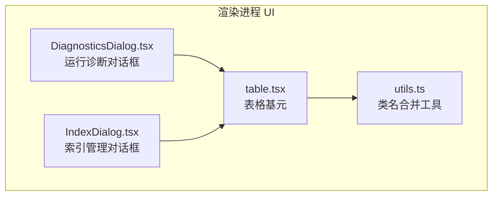
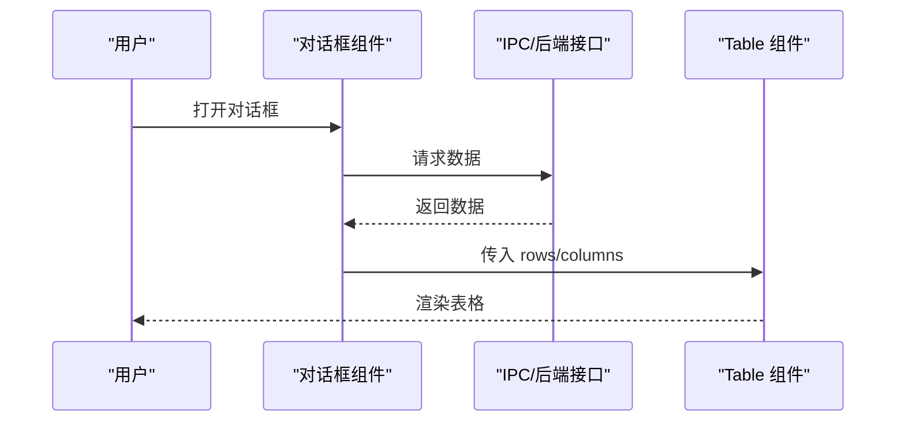
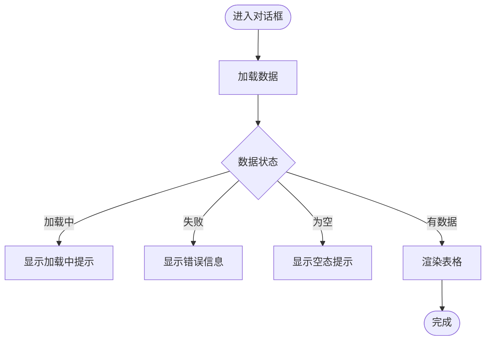
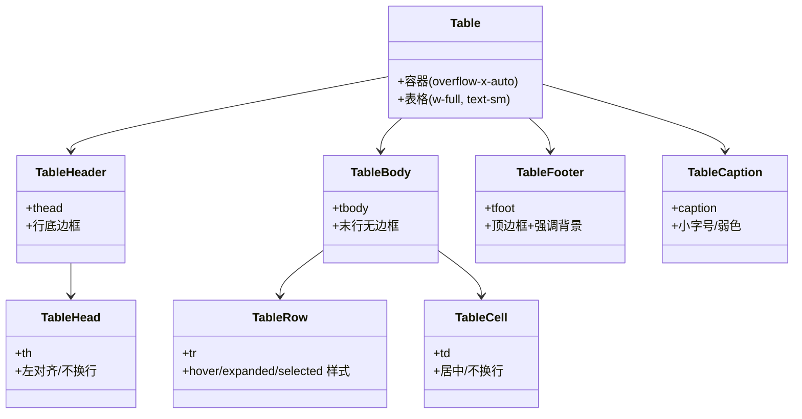
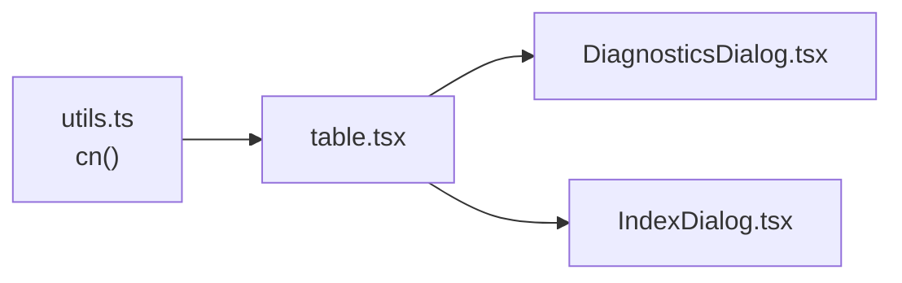

# Table 表格组件

<cite>
**本文引用的文件**
- [table.tsx](file://apps/desktop/src/renderer/src/components/ui/table.tsx)
- [DiagnosticsDialog.tsx](file://apps/desktop/src/renderer/src/components/DiagnosticsDialog.tsx)
- [IndexDialog.tsx](file://apps/desktop/src/renderer/src/components/IndexDialog.tsx)
- [utils.ts](file://apps/desktop/src/renderer/src/lib/utils.ts)
</cite>

## 目录
1. [简介](#简介)
2. [项目结构](#项目结构)
3. [核心组件](#核心组件)
4. [架构总览](#架构总览)
5. [详细组件分析](#详细组件分析)
6. [依赖关系分析](#依赖关系分析)
7. [性能考量](#性能考量)
8. [故障排查指南](#故障排查指南)
9. [结论](#结论)
10. [附录：使用示例与最佳实践](#附录使用示例与最佳实践)

## 简介
本文件面向本项目中的 Table 表格组件，系统性说明其数据展示能力、结构与样式、响应式行为、可访问性基础以及在实际业务场景中的用法。该组件是一套轻量、语义化、基于 Tailwind CSS 的表格 UI 基元，提供表头、行、单元格等基础元素，并通过容器实现横向滚动以适配不同屏幕宽度。当前仓库未内置排序、分页、筛选等高级交互，但提供了扩展这些能力的良好起点。

## 项目结构
Table 组件位于渲染进程 UI 层，作为通用 UI 原子组件被多个对话框复用，用于呈现结构化数据（如诊断结果、索引列表）。

图表来源
- [table.tsx:1-92](file://apps/desktop/src/renderer/src/components/ui/table.tsx#L1-L92)
- [DiagnosticsDialog.tsx:1-204](file://apps/desktop/src/renderer/src/components/DiagnosticsDialog.tsx#L1-L204)
- [IndexDialog.tsx:1-78](file://apps/desktop/src/renderer/src/components/IndexDialog.tsx#L1-L78)
- [utils.ts:1-7](file://apps/desktop/src/renderer/src/lib/utils.ts#L1-L7)

章节来源
- [table.tsx:1-92](file://apps/desktop/src/renderer/src/components/ui/table.tsx#L1-L92)
- [DiagnosticsDialog.tsx:1-204](file://apps/desktop/src/renderer/src/components/DiagnosticsDialog.tsx#L1-L204)
- [IndexDialog.tsx:1-78](file://apps/desktop/src/renderer/src/components/IndexDialog.tsx#L1-L78)
- [utils.ts:1-7](file://apps/desktop/src/renderer/src/lib/utils.ts#L1-L7)

## 核心组件
- 容器与表格
  - 外层容器负责水平溢出滚动，确保在小屏或窄列宽下仍可横向浏览。
  - 表格本身采用全宽布局与较小字号，便于信息密度更高的展示。
- 表头/表体/表尾
  - 表头行带底部边框，表体最后一行去除底边线，表尾带顶部边框与强调背景。
- 行与单元格
  - 行支持悬停高亮、展开态高亮与选中态高亮；单元格默认不换行，保证对齐与可读性。
  - 针对复选框场景做了内边距与垂直对齐优化。
- 标题
  - 提供 caption 元素用于无障碍描述与视觉标题。

章节来源
- [table.tsx:6-16](file://apps/desktop/src/renderer/src/components/ui/table.tsx#L6-L16)
- [table.tsx:18-40](file://apps/desktop/src/renderer/src/components/ui/table.tsx#L18-L40)
- [table.tsx:42-79](file://apps/desktop/src/renderer/src/components/ui/table.tsx#L42-L79)
- [table.tsx:81-89](file://apps/desktop/src/renderer/src/components/ui/table.tsx#L81-L89)

## 架构总览
下图展示了表格在对话框中的典型使用方式：对话框负责数据获取与状态管理，表格仅负责渲染。

图表来源
- [DiagnosticsDialog.tsx:22-103](file://apps/desktop/src/renderer/src/components/DiagnosticsDialog.tsx#L22-L103)
- [IndexDialog.tsx:13-63](file://apps/desktop/src/renderer/src/components/IndexDialog.tsx#L13-L63)
- [table.tsx:6-16](file://apps/desktop/src/renderer/src/components/ui/table.tsx#L6-L16)

## 详细组件分析

### 数据结构与渲染模型
- 数据模型
  - 行：由父组件提供的数组项构成，每个项映射为一行。
  - 列：通过表头定义列标题，单元格按列顺序渲染对应字段。
- 渲染流程
  - 父组件维护数据状态，条件渲染空态、加载中、错误态与成功态。
  - 表格根据数据长度动态生成行与单元格。

图表来源
- [DiagnosticsDialog.tsx:22-103](file://apps/desktop/src/renderer/src/components/DiagnosticsDialog.tsx#L22-L103)
- [IndexDialog.tsx:13-63](file://apps/desktop/src/renderer/src/components/IndexDialog.tsx#L13-L63)

章节来源
- [DiagnosticsDialog.tsx:22-103](file://apps/desktop/src/renderer/src/components/DiagnosticsDialog.tsx#L22-L103)
- [IndexDialog.tsx:13-63](file://apps/desktop/src/renderer/src/components/IndexDialog.tsx#L13-L63)

### 表头、行、单元格的结构设计
- 表头
  - 使用 thead 与 th，具备明确的对齐与字体样式，适合放置列标题。
- 行
  - 使用 tr，包含 hover、aria-expanded、selected 等状态样式钩子，便于扩展交互。
- 单元格
  - 使用 td，默认不换行，配合文本截断策略可避免溢出。
- 辅助元素
  - tfoot 可用于汇总统计；caption 用于无障碍标题。

图表来源
- [table.tsx:6-89](file://apps/desktop/src/renderer/src/components/ui/table.tsx#L6-L89)

章节来源
- [table.tsx:18-89](file://apps/desktop/src/renderer/src/components/ui/table.tsx#L18-L89)

### 属性配置与扩展点
- 样式覆盖
  - 所有组件均透传 className，可通过 cn 工具合并自定义样式。
- 状态钩子
  - 行支持 data-[state=selected]、has-aria-expanded 等选择器，便于实现选中、展开等交互。
- 无障碍
  - 提供 caption 与语义化标签，便于屏幕阅读器识别。
- 注意
  - 当前组件不包含排序、分页、筛选等内置逻辑，需在上层封装实现。

章节来源
- [table.tsx:6-16](file://apps/desktop/src/renderer/src/components/ui/table.tsx#L6-L16)
- [table.tsx:42-79](file://apps/desktop/src/renderer/src/components/ui/table.tsx#L42-L79)
- [table.tsx:81-89](file://apps/desktop/src/renderer/src/components/ui/table.tsx#L81-L89)
- [utils.ts:1-7](file://apps/desktop/src/renderer/src/lib/utils.ts#L1-L7)

### 响应式布局与自适应显示
- 横向滚动
  - 容器设置 overflow-x-auto，确保在窄屏下可左右滑动查看完整内容。
- 文本换行控制
  - 表头与单元格默认不换行，避免内容折行导致高度不一致；如需多行，可在上层按需覆盖样式。
- 尺寸与密度
  - 表格整体使用较小字号与紧凑间距，适合信息密集型场景。

章节来源
- [table.tsx:6-16](file://apps/desktop/src/renderer/src/components/ui/table.tsx#L6-L16)
- [table.tsx:55-79](file://apps/desktop/src/renderer/src/components/ui/table.tsx#L55-L79)

### 数据绑定与实时更新
- 数据绑定
  - 父组件通过状态驱动渲染，将数组映射为行与单元格。
- 实时更新
  - 组件本身无订阅机制，建议在父组件中监听数据源变化并更新状态，从而触发重渲染。
- 典型模式
  - 对话框打开时拉取一次数据；关闭时卸载组件，状态自然丢弃，避免内存泄漏。

章节来源
- [DiagnosticsDialog.tsx:22-103](file://apps/desktop/src/renderer/src/components/DiagnosticsDialog.tsx#L22-L103)
- [IndexDialog.tsx:13-63](file://apps/desktop/src/renderer/src/components/IndexDialog.tsx#L13-L63)

### 复杂表格场景示例
- 诊断结果表
  - 展示运行时状态、扫描结果与权限记录，包含多种状态分支（加载中、错误、空态、数据态）。
- 索引管理表
  - 展示已索引文件的名称与时间戳，支持空态与错误态提示。

章节来源
- [DiagnosticsDialog.tsx:74-98](file://apps/desktop/src/renderer/src/components/DiagnosticsDialog.tsx#L74-L98)
- [DiagnosticsDialog.tsx:145-174](file://apps/desktop/src/renderer/src/components/DiagnosticsDialog.tsx#L145-L174)
- [IndexDialog.tsx:37-60](file://apps/desktop/src/renderer/src/components/IndexDialog.tsx#L37-L60)

## 依赖关系分析
- 内部依赖
  - 表格组件依赖 utils.ts 的 cn 工具进行类名合并。
- 外部依赖
  - 基于 React 与 Tailwind CSS 的原子样式体系，无额外 UI 库依赖。
- 耦合度
  - 表格组件与业务解耦，仅关注渲染与样式；业务逻辑集中在对话框组件中。

图表来源
- [utils.ts:1-7](file://apps/desktop/src/renderer/src/lib/utils.ts#L1-L7)
- [table.tsx:1-92](file://apps/desktop/src/renderer/src/components/ui/table.tsx#L1-L92)
- [DiagnosticsDialog.tsx:1-204](file://apps/desktop/src/renderer/src/components/DiagnosticsDialog.tsx#L1-L204)
- [IndexDialog.tsx:1-78](file://apps/desktop/src/renderer/src/components/IndexDialog.tsx#L1-L78)

章节来源
- [utils.ts:1-7](file://apps/desktop/src/renderer/src/lib/utils.ts#L1-L7)
- [table.tsx:1-92](file://apps/desktop/src/renderer/src/components/ui/table.tsx#L1-L92)

## 性能考量
- 渲染成本
  - 当前为全量渲染，行数较多时可能影响性能。建议对大数据集采用虚拟滚动或分页。
- 样式开销
  - 大量行与单元格会产生 DOM 节点与样式计算开销，应结合虚拟化或分页降低首屏压力。
- 事件与状态
  - 避免在每行中创建闭包函数，必要时使用稳定引用或 memo 优化。
- 网络与缓存
  - 对频繁读取的数据做本地缓存或去抖，减少重复请求。

[本节为通用性能建议，不直接分析具体文件]

## 故障排查指南
- 表格空白或无数据
  - 检查父组件是否正确处理空态与错误态分支。
- 内容溢出或错位
  - 确认是否启用了横向滚动容器；若需要多行显示，可在单元格上覆盖换行样式。
- 样式冲突
  - 使用 cn 工具合并类名，避免 Tailwind 类名冲突。
- 无障碍问题
  - 为表格添加 caption 描述；为交互元素补充 aria-* 属性。

章节来源
- [DiagnosticsDialog.tsx:22-103](file://apps/desktop/src/renderer/src/components/DiagnosticsDialog.tsx#L22-L103)
- [IndexDialog.tsx:13-63](file://apps/desktop/src/renderer/src/components/IndexDialog.tsx#L13-L63)
- [table.tsx:6-16](file://apps/desktop/src/renderer/src/components/ui/table.tsx#L6-L16)
- [utils.ts:1-7](file://apps/desktop/src/renderer/src/lib/utils.ts#L1-L7)

## 结论
Table 组件提供了一套简洁、语义化、易扩展的表格基元，适用于中小型数据集的展示。其容器级横向滚动与紧凑样式使其具备良好的响应式表现。对于排序、分页、筛选等高级功能，建议在上层封装实现，并结合虚拟化或分页策略应对大数据场景。当前实现已具备无障碍基础，可在此基础上进一步完善键盘导航与屏幕阅读器支持。

[本节为总结性内容，不直接分析具体文件]

## 附录：使用示例与最佳实践
- 基本用法
  - 在对话框中拉取数据后，使用 Table、TableHeader、TableRow、TableHead、TableBody、TableCell 组合渲染。
- 空态与错误态
  - 在数据未就绪或请求失败时，优先给出明确的提示文案。
- 可扩展性
  - 利用行的 data-[state=selected] 与 has-aria-expanded 选择器，叠加选中与展开样式。
- 响应式
  - 保持容器 overflow-x-auto，必要时在单元格内启用换行或截断策略。
- 无障碍
  - 为表格添加 caption；为交互控件补充 aria-label 等属性。

章节来源
- [DiagnosticsDialog.tsx:74-98](file://apps/desktop/src/renderer/src/components/DiagnosticsDialog.tsx#L74-L98)
- [IndexDialog.tsx:37-60](file://apps/desktop/src/renderer/src/components/IndexDialog.tsx#L37-L60)
- [table.tsx:6-89](file://apps/desktop/src/renderer/src/components/ui/table.tsx#L6-L89)