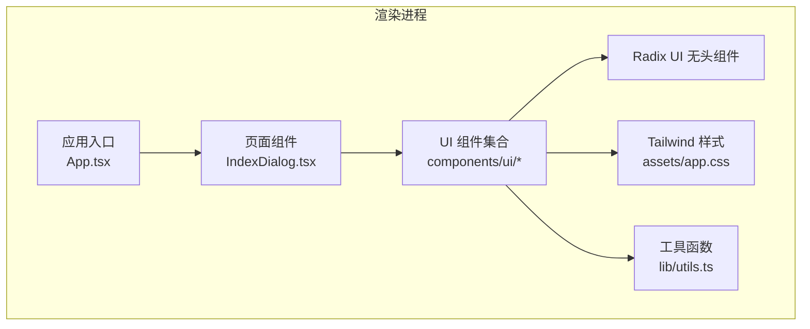
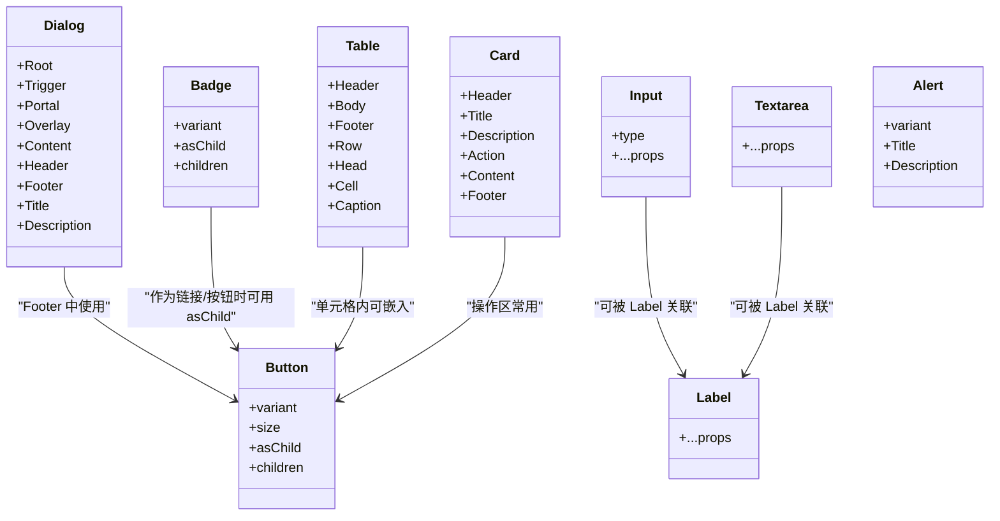
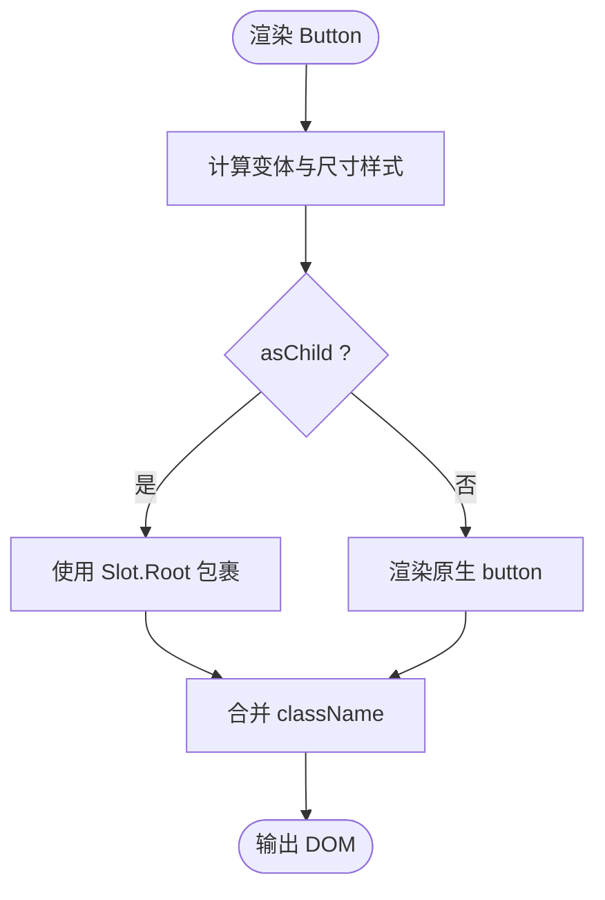
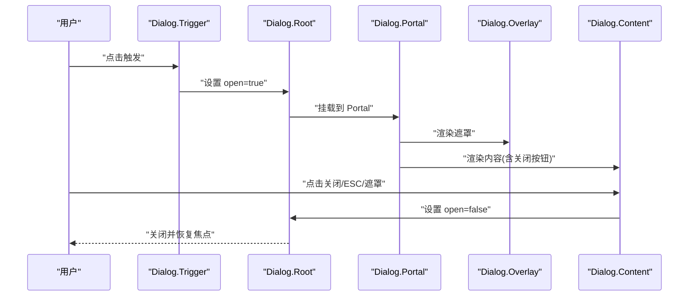
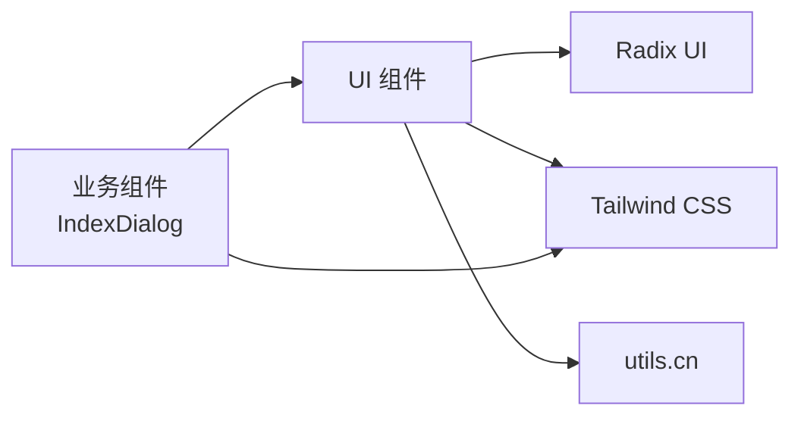

# UI 组件库

<cite>
**本文引用的文件**
- [apps/desktop/src/renderer/src/components/ui/button.tsx](file://apps/desktop/src/renderer/src/components/ui/button.tsx)
- [apps/desktop/src/renderer/src/components/ui/dialog.tsx](file://apps/desktop/src/renderer/src/components/ui/dialog.tsx)
- [apps/desktop/src/renderer/src/components/ui/input.tsx](file://apps/desktop/src/renderer/src/components/ui/input.tsx)
- [apps/desktop/src/renderer/src/components/ui/card.tsx](file://apps/desktop/src/renderer/src/components/ui/card.tsx)
- [apps/desktop/src/renderer/src/components/ui/table.tsx](file://apps/desktop/src/renderer/src/components/ui/table.tsx)
- [apps/desktop/src/renderer/src/components/ui/alert.tsx](file://apps/desktop/src/renderer/src/components/ui/alert.tsx)
- [apps/desktop/src/renderer/src/components/ui/badge.tsx](file://apps/desktop/src/renderer/src/components/ui/badge.tsx)
- [apps/desktop/src/renderer/src/components/ui/label.tsx](file://apps/desktop/src/renderer/src/components/ui/label.tsx)
- [apps/desktop/src/renderer/src/components/ui/textarea.tsx](file://apps/desktop/src/renderer/src/components/ui/textarea.tsx)
- [apps/desktop/src/renderer/src/lib/utils.ts](file://apps/desktop/src/renderer/src/lib/utils.ts)
- [apps/desktop/src/renderer/src/assets/app.css](file://apps/desktop/src/renderer/src/assets/app.css)
- [apps/desktop/components.json](file://apps/desktop/components.json)
- [apps/desktop/src/renderer/src/components/IndexDialog.tsx](file://apps/desktop/src/renderer/src/components/IndexDialog.tsx)
- [apps/desktop/src/renderer/src/view-model.test.ts](file://apps/desktop/src/renderer/src/view-model.test.ts)
</cite>

## 目录
1. [简介](#简介)
2. [项目结构](#项目结构)
3. [核心组件](#核心组件)
4. [架构总览](#架构总览)
5. [详细组件分析](#详细组件分析)
6. [依赖关系分析](#依赖关系分析)
7. [性能与可访问性](#性能与可访问性)
8. [测试与质量保证](#测试与质量保证)
9. [主题与样式定制](#主题与样式定制)
10. [组合、复用与扩展指南](#组合复用与扩展指南)
11. [故障排查](#故障排查)
12. [结论](#结论)

## 简介
本仓库的 UI 组件库基于 React + Tailwind CSS，采用 shadcn/ui 风格与 Radix UI 无头组件构建。组件以“原子化”的方式提供 Button、Dialog、Input、Card、Table、Alert、Badge、Label、Textarea 等基础能力，并通过统一的样式变量与工具函数实现一致的主题、响应式与可访问性。文档将深入说明各组件的属性接口、事件处理、样式定制、组合模式、可扩展性与质量保证策略，并提供实际使用示例与最佳实践。

## 项目结构
UI 组件位于 apps/desktop/src/renderer/src/components/ui，统一通过 @renderer/components/ui 别名引入；样式与主题集中在 assets/app.css，工具函数在 lib/utils.ts；配置由 components.json 管理（shadcn 风格）。业务页面通过 Dialog + Table 组合展示数据，如 IndexDialog。

图表来源
- [apps/desktop/src/renderer/src/components/IndexDialog.tsx:1-78](file://apps/desktop/src/renderer/src/components/IndexDialog.tsx#L1-L78)
- [apps/desktop/src/renderer/src/components/ui/dialog.tsx:1-145](file://apps/desktop/src/renderer/src/components/ui/dialog.tsx#L1-L145)
- [apps/desktop/src/renderer/src/assets/app.css:1-136](file://apps/desktop/src/renderer/src/assets/app.css#L1-L136)
- [apps/desktop/src/renderer/src/lib/utils.ts:1-7](file://apps/desktop/src/renderer/src/lib/utils.ts#L1-L7)

章节来源
- [apps/desktop/components.json:1-22](file://apps/desktop/components.json#L1-L22)
- [apps/desktop/src/renderer/src/assets/app.css:1-136](file://apps/desktop/src/renderer/src/assets/app.css#L1-L136)

## 核心组件
- Button：支持多 variant/size、asChild 透传、焦点与禁用态、图标尺寸适配。
- Dialog：基于 Radix 的 Root/Trigger/Portal/Overlay/Content/Header/Footer/Title/Description 组合，提供关闭按钮开关与动画。
- Input/Textarea：表单输入控件，含聚焦环、无效态、禁用态与暗色适配。
- Card：卡片容器及 Header/Title/Description/Action/Content/Footer 子块，网格布局对齐。
- Table：表格容器与 Head/Body/Footer/Row/Cell/Caption，支持选中态与悬停高亮。
- Alert/Badge：状态提示与标签，支持多种语义变体与 asChild。
- Label：无障碍关联标签，与表单控件配合。

章节来源
- [apps/desktop/src/renderer/src/components/ui/button.tsx:1-62](file://apps/desktop/src/renderer/src/components/ui/button.tsx#L1-L62)
- [apps/desktop/src/renderer/src/components/ui/dialog.tsx:1-145](file://apps/desktop/src/renderer/src/components/ui/dialog.tsx#L1-L145)
- [apps/desktop/src/renderer/src/components/ui/input.tsx:1-21](file://apps/desktop/src/renderer/src/components/ui/input.tsx#L1-L21)
- [apps/desktop/src/renderer/src/components/ui/textarea.tsx:1-18](file://apps/desktop/src/renderer/src/components/ui/textarea.tsx#L1-L18)
- [apps/desktop/src/renderer/src/components/ui/card.tsx:1-75](file://apps/desktop/src/renderer/src/components/ui/card.tsx#L1-L75)
- [apps/desktop/src/renderer/src/components/ui/table.tsx:1-92](file://apps/desktop/src/renderer/src/components/ui/table.tsx#L1-L92)
- [apps/desktop/src/renderer/src/components/ui/alert.tsx:1-60](file://apps/desktop/src/renderer/src/components/ui/alert.tsx#L1-L60)
- [apps/desktop/src/renderer/src/components/ui/badge.tsx:1-46](file://apps/desktop/src/renderer/src/components/ui/badge.tsx#L1-L46)
- [apps/desktop/src/renderer/src/components/ui/label.tsx:1-19](file://apps/desktop/src/renderer/src/components/ui/label.tsx#L1-L19)

## 架构总览
组件层遵循“无头 + 样式封装”的模式：Radix 提供可访问的交互行为，组件负责样式与组合；所有样式通过 Tailwind 与 CSS 变量统一管理，确保主题一致与暗色模式切换。

图表来源
- [apps/desktop/src/renderer/src/components/ui/button.tsx:1-62](file://apps/desktop/src/renderer/src/components/ui/button.tsx#L1-L62)
- [apps/desktop/src/renderer/src/components/ui/dialog.tsx:1-145](file://apps/desktop/src/renderer/src/components/ui/dialog.tsx#L1-L145)
- [apps/desktop/src/renderer/src/components/ui/table.tsx:1-92](file://apps/desktop/src/renderer/src/components/ui/table.tsx#L1-L92)
- [apps/desktop/src/renderer/src/components/ui/card.tsx:1-75](file://apps/desktop/src/renderer/src/components/ui/card.tsx#L1-L75)
- [apps/desktop/src/renderer/src/components/ui/alert.tsx:1-60](file://apps/desktop/src/renderer/src/components/ui/alert.tsx#L1-L60)
- [apps/desktop/src/renderer/src/components/ui/badge.tsx:1-46](file://apps/desktop/src/renderer/src/components/ui/badge.tsx#L1-L46)
- [apps/desktop/src/renderer/src/components/ui/input.tsx:1-21](file://apps/desktop/src/renderer/src/components/ui/input.tsx#L1-L21)
- [apps/desktop/src/renderer/src/components/ui/textarea.tsx:1-18](file://apps/desktop/src/renderer/src/components/ui/textarea.tsx#L1-L18)
- [apps/desktop/src/renderer/src/components/ui/label.tsx:1-19](file://apps/desktop/src/renderer/src/components/ui/label.tsx#L1-L19)

## 详细组件分析

### Button
- 设计原则：单一职责、可组合、可访问、主题驱动。
- 属性接口：
  - variant：default、destructive、outline、secondary、ghost、link
  - size：default、xs、sm、lg、icon、icon-xs、icon-sm、icon-lg
  - asChild：是否使用 Slot.Root 透传为外部元素
  - className：追加自定义类名
- 事件处理：透传原生 button 事件；禁用态自动阻止交互。
- 样式定制：通过 cva 定义变体与尺寸，结合 cn 合并类名；支持 dark 前缀与 focus-visible 环。
- 可访问性：focus-visible 可见焦点环；aria-invalid 联动错误态。

图表来源
- [apps/desktop/src/renderer/src/components/ui/button.tsx:6-59](file://apps/desktop/src/renderer/src/components/ui/button.tsx#L6-L59)

章节来源
- [apps/desktop/src/renderer/src/components/ui/button.tsx:1-62](file://apps/desktop/src/renderer/src/components/ui/button.tsx#L1-L62)

### Dialog
- 设计原则：基于 Radix 的可访问弹窗，提供完整结构子组件与默认动画。
- 属性接口：
  - Root/Trigger/Portal/Close：透传 Radix 属性
  - Content：showCloseButton 控制右上角关闭按钮显隐
  - Header/Footer：布局容器，Footer 可选内置关闭按钮
  - Title/Description：标题与描述文本
- 事件处理：触发打开/关闭；点击遮罩或 ESC 关闭；内部 Close 按钮触发关闭。
- 样式定制：固定定位居中、缩放淡入淡出动画、响应式最大宽度。
- 可访问性：焦点陷阱、角色与 aria 由 Radix 管理。

图表来源
- [apps/desktop/src/renderer/src/components/ui/dialog.tsx:10-131](file://apps/desktop/src/renderer/src/components/ui/dialog.tsx#L10-L131)

章节来源
- [apps/desktop/src/renderer/src/components/ui/dialog.tsx:1-145](file://apps/desktop/src/renderer/src/components/ui/dialog.tsx#L1-L145)

### Input / Textarea
- 设计原则：最小包装，保留原生语义，统一样式与状态。
- 属性接口：透传 input/textarea 全部属性；type 用于输入类型。
- 事件处理：onChange/onFocus/onBlur 等原生事件透传。
- 样式定制：边框、聚焦环、无效态、禁用态、暗色背景；占位符颜色。
- 可访问性：placeholder、disabled、aria-invalid 等原生能力。

章节来源
- [apps/desktop/src/renderer/src/components/ui/input.tsx:1-21](file://apps/desktop/src/renderer/src/components/ui/input.tsx#L1-L21)
- [apps/desktop/src/renderer/src/components/ui/textarea.tsx:1-18](file://apps/desktop/src/renderer/src/components/ui/textarea.tsx#L1-L18)

### Card
- 设计原则：结构化容器，便于组合标题、描述、动作与内容区域。
- 属性接口：Card/CardHeader/CardTitle/CardDescription/CardAction/CardContent/CardFooter，均透传 div 属性。
- 样式定制：网格布局、间距、边框、阴影、响应式列对齐。
- 可访问性：语义化 div 组合，适合承载任意内容。

章节来源
- [apps/desktop/src/renderer/src/components/ui/card.tsx:1-75](file://apps/desktop/src/renderer/src/components/ui/card.tsx#L1-L75)

### Table
- 设计原则：语义化表格结构，支持横向滚动与行交互。
- 属性接口：Table/TableHeader/TableBody/TableFooter/TableRow/TableHead/TableCell/TableCaption，透传原生表格元素属性。
- 事件处理：行级 hover、选中态、展开态样式；单元格内可嵌入交互元素。
- 样式定制：表头下划线、最后一行去底边、选中高亮、悬停背景。
- 可访问性：caption、thead/tbody/tfoot 语义清晰，便于屏幕阅读器理解。

章节来源
- [apps/desktop/src/renderer/src/components/ui/table.tsx:1-92](file://apps/desktop/src/renderer/src/components/ui/table.tsx#L1-L92)

### Alert / Badge / Label
- Alert：语义化提示框，支持 default/destructive 变体；包含 Title/Description 子组件。
- Badge：小型标签，支持多种语义变体与 asChild；常用于状态标记。
- Label：无障碍标签，与表单控件配对，支持禁用态。

章节来源
- [apps/desktop/src/renderer/src/components/ui/alert.tsx:1-60](file://apps/desktop/src/renderer/src/components/ui/alert.tsx#L1-L60)
- [apps/desktop/src/renderer/src/components/ui/badge.tsx:1-46](file://apps/desktop/src/renderer/src/components/ui/badge.tsx#L1-L46)
- [apps/desktop/src/renderer/src/components/ui/label.tsx:1-19](file://apps/desktop/src/renderer/src/components/ui/label.tsx#L1-L19)

## 依赖关系分析
- 组件依赖 Radix UI 提供可访问的无头行为（Dialog、Label、Slot）。
- 样式依赖 Tailwind CSS 与 CSS 变量（主题色、圆角、字体）。
- 工具函数 cn 合并类名，避免冲突并支持条件类。
- 业务组件通过组合 UI 组件完成复杂界面（如 IndexDialog 组合 Dialog + Table）。

图表来源
- [apps/desktop/src/renderer/src/components/ui/dialog.tsx:1-145](file://apps/desktop/src/renderer/src/components/ui/dialog.tsx#L1-L145)
- [apps/desktop/src/renderer/src/components/ui/table.tsx:1-92](file://apps/desktop/src/renderer/src/components/ui/table.tsx#L1-L92)
- [apps/desktop/src/renderer/src/components/IndexDialog.tsx:1-78](file://apps/desktop/src/renderer/src/components/IndexDialog.tsx#L1-L78)
- [apps/desktop/src/renderer/src/lib/utils.ts:1-7](file://apps/desktop/src/renderer/src/lib/utils.ts#L1-L7)
- [apps/desktop/src/renderer/src/assets/app.css:1-136](file://apps/desktop/src/renderer/src/assets/app.css#L1-L136)

章节来源
- [apps/desktop/src/renderer/src/components/IndexDialog.tsx:1-78](file://apps/desktop/src/renderer/src/components/IndexDialog.tsx#L1-L78)
- [apps/desktop/src/renderer/src/lib/utils.ts:1-7](file://apps/desktop/src/renderer/src/lib/utils.ts#L1-L7)

## 性能与可访问性
- 性能
  - 组件轻量：仅做样式与组合，逻辑由 Radix 承担，减少重复实现。
  - 样式合并：cn 使用 clsx + tailwind-merge，避免类名冲突与冗余。
  - 列表渲染：Table 行与单元格按需渲染，避免不必要的重排。
- 可访问性
  - 焦点管理：Button/Input/Dialog 等具备清晰的焦点环与键盘交互。
  - 语义化：Table/Alert/Label 等使用合适 HTML 语义，利于屏幕阅读器。
  - 状态反馈：aria-invalid、disabled、role 等增强可用性。

[本节为通用指导，不直接分析具体文件]

## 测试与质量保证
- 单元测试策略
  - 视图模型与格式化：对时间格式、剩余时间、摘要生成等进行断言，覆盖脏数据与边界情况。
  - 契约一致性：通过共享 fixture 验证跨语言数据还原正确性。
- 质量保障
  - 类型安全：TypeScript 严格类型约束组件 props 与数据结构。
  - 样式一致性：CSS 变量集中管理主题，避免硬编码颜色。
  - 可维护性：组件拆分细粒度，职责单一，易于替换与扩展。

章节来源
- [apps/desktop/src/renderer/src/view-model.test.ts:1-683](file://apps/desktop/src/renderer/src/view-model.test.ts#L1-L683)

## 主题与样式定制
- 主题变量
  - 通过 CSS 变量定义背景、前景、卡片、主色、次色、强调、破坏、边框、输入、环等语义色。
  - 亮色与暗色两套变量，dark 前缀在 .dark 祖先下生效。
- 组件样式
  - 使用 Tailwind 原子类与 cva 变体系统，保证一致的视觉层级与交互反馈。
  - 通过 data-slot 与 data-variant/data-size 进行调试与选择器定位。
- 自定义
  - 修改 app.css 中的变量即可全局换肤。
  - 通过 className 覆盖局部样式；必要时扩展 cva 变体。

章节来源
- [apps/desktop/src/renderer/src/assets/app.css:1-136](file://apps/desktop/src/renderer/src/assets/app.css#L1-L136)
- [apps/desktop/src/renderer/src/components/ui/button.tsx:6-36](file://apps/desktop/src/renderer/src/components/ui/button.tsx#L6-L36)
- [apps/desktop/src/renderer/src/components/ui/badge.tsx:6-25](file://apps/desktop/src/renderer/src/components/ui/badge.tsx#L6-L25)
- [apps/desktop/src/renderer/src/components/ui/alert.tsx:5-19](file://apps/desktop/src/renderer/src/components/ui/alert.tsx#L5-L19)

## 组合、复用与扩展指南
- 组合模式
  - Dialog + Table：用于展示结构化数据与操作（如索引管理）。
  - Card + Button：卡片内容区放置操作按钮，形成信息+行动单元。
  - Label + Input/Textarea：表单字段的标准组合，提升可访问性。
- 复用策略
  - 通过 asChild 将组件作为外部元素渲染，便于与路由、第三方组件集成。
  - 使用 cva 变体系统扩展新样式变体，保持 API 一致。
- 扩展方法
  - 新增组件：参照现有组件结构，封装 Radix 行为与 Tailwind 样式，导出组件与变体。
  - 主题扩展：在 app.css 中增加语义变量，并在组件中引用。
  - 工具函数：在 utils.ts 中扩展类名合并逻辑或新增辅助方法。

章节来源
- [apps/desktop/src/renderer/src/components/IndexDialog.tsx:1-78](file://apps/desktop/src/renderer/src/components/IndexDialog.tsx#L1-L78)
- [apps/desktop/src/renderer/src/components/ui/button.tsx:38-59](file://apps/desktop/src/renderer/src/components/ui/button.tsx#L38-L59)
- [apps/desktop/src/renderer/src/components/ui/badge.tsx:27-43](file://apps/desktop/src/renderer/src/components/ui/badge.tsx#L27-L43)
- [apps/desktop/src/renderer/src/components/ui/dialog.tsx:10-131](file://apps/desktop/src/renderer/src/components/ui/dialog.tsx#L10-L131)

## 故障排查
- 常见问题
  - 主题未生效：检查 <html> 是否添加 .dark 类；确认 CSS 变量已正确导入。
  - 样式冲突：使用 cn 合并类名，避免重复或覆盖顺序问题。
  - 对话框无法关闭：确认 Trigger/Close/Portal 正确使用；检查事件冒泡与拦截。
  - 表格错位：确保外层容器允许横向滚动；检查单元格内容长度与换行。
- 调试技巧
  - 使用 data-slot 与 data-variant/data-size 快速定位组件节点。
  - 在浏览器开发者工具中检查焦点环与 aria 属性。
  - 通过单元测试验证数据格式化与摘要生成的正确性。

章节来源
- [apps/desktop/src/renderer/src/assets/app.css:1-136](file://apps/desktop/src/renderer/src/assets/app.css#L1-L136)
- [apps/desktop/src/renderer/src/components/ui/dialog.tsx:10-131](file://apps/desktop/src/renderer/src/components/ui/dialog.tsx#L10-L131)
- [apps/desktop/src/renderer/src/components/ui/table.tsx:6-92](file://apps/desktop/src/renderer/src/components/ui/table.tsx#L6-L92)
- [apps/desktop/src/renderer/src/view-model.test.ts:1-683](file://apps/desktop/src/renderer/src/view-model.test.ts#L1-L683)

## 结论
本 UI 组件库以 Radix 为核心交互能力，结合 Tailwind 与 CSS 变量实现高度一致的主题与样式体系。组件设计遵循可访问性、可组合性与可扩展性原则，通过严格的类型与测试保障质量。建议在实际项目中优先使用这些基础组件进行组合，必要时通过 cva 与 CSS 变量进行主题与样式定制，以保持整体一致性与可维护性。