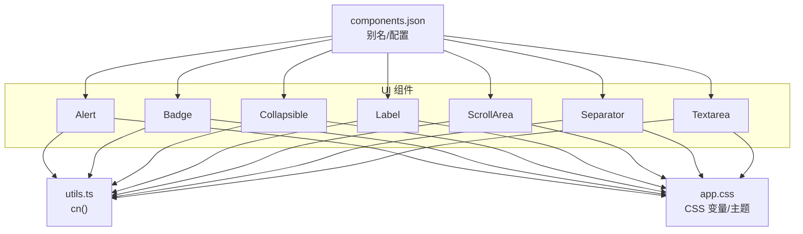
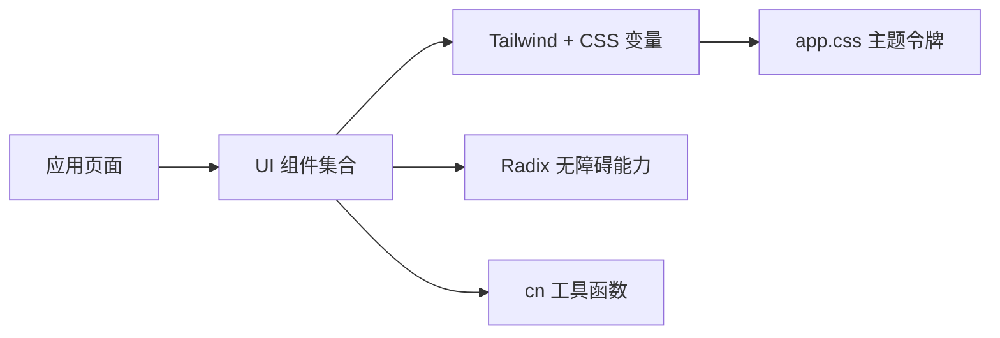
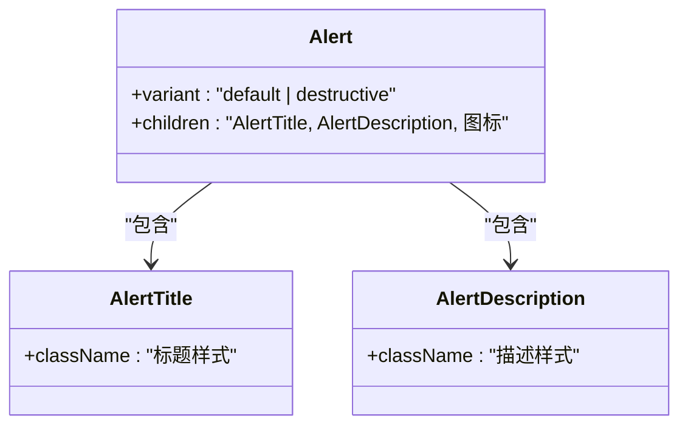
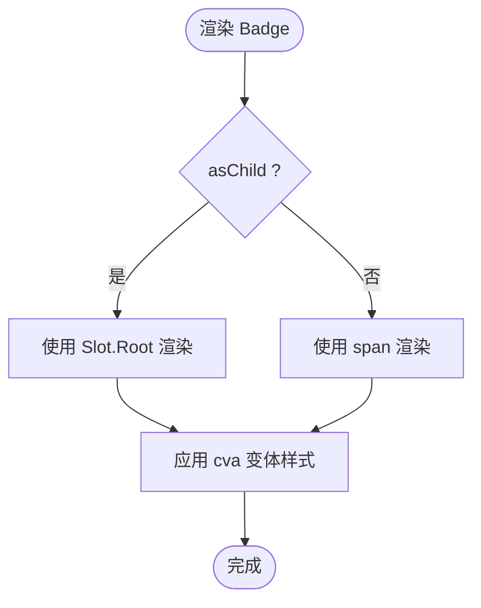
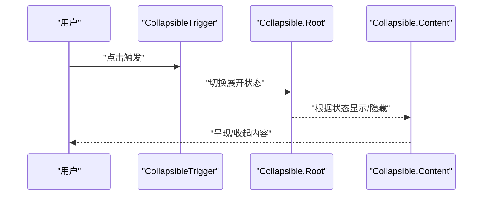
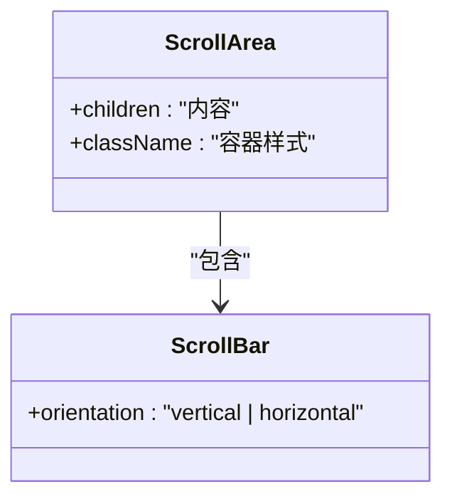
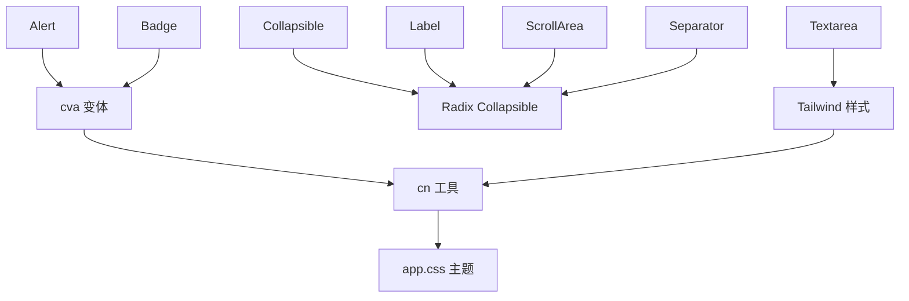

# 其他基础组件

<cite>
**本文引用的文件**
- [alert.tsx](file://apps/desktop/src/renderer/src/components/ui/alert.tsx)
- [badge.tsx](file://apps/desktop/src/renderer/src/components/ui/badge.tsx)
- [collapsible.tsx](file://apps/desktop/src/renderer/src/components/ui/collapsible.tsx)
- [label.tsx](file://apps/desktop/src/renderer/src/components/ui/label.tsx)
- [scroll-area.tsx](file://apps/desktop/src/renderer/src/components/ui/scroll-area.tsx)
- [separator.tsx](file://apps/desktop/src/renderer/src/components/ui/separator.tsx)
- [textarea.tsx](file://apps/desktop/src/renderer/src/components/ui/textarea.tsx)
- [utils.ts](file://apps/desktop/src/renderer/src/lib/utils.ts)
- [components.json](file://apps/desktop/components.json)
- [app.css](file://apps/desktop/src/renderer/src/assets/app.css)
</cite>

## 目录
1. [简介](#简介)
2. [项目结构](#项目结构)
3. [核心组件](#核心组件)
4. [架构总览](#架构总览)
5. [详细组件分析](#详细组件分析)
6. [依赖关系分析](#依赖关系分析)
7. [性能考量](#性能考量)
8. [故障排查指南](#故障排查指南)
9. [结论](#结论)
10. [附录](#附录)

## 简介
本章节面向“其他基础 UI 组件”的综合文档，覆盖以下辅助型组件：Alert 警告提示、Badge 徽章、Collapsible 折叠面板、Label 标签、ScrollArea 滚动区域、Separator 分隔线、Textarea 文本域。内容包含：
- 使用场景与基本配置项说明
- 组合使用模式与最佳实践
- 统一样式规范与主题定制方法
- 可访问性支持与国际化适配建议
- 具体代码示例路径与常见用法演示（以源码路径引用代替直接粘贴代码）

这些组件基于 Radix UI 的无样式基础能力，结合 Tailwind CSS 与 class-variance-authority（cva）进行变体管理，并通过统一的 CSS 变量实现主题化。

## 项目结构
- 组件位于 apps/desktop/src/renderer/src/components/ui 下，每个组件一个独立文件，职责单一、易于复用。
- 样式系统：
  - 通过 Tailwind 原子类 + cva 变体管理视觉风格
  - 通过 app.css 中的 CSS 变量定义主题色板与圆角等设计令牌
  - components.json 提供 shadcn 风格的别名与配置
- 工具函数：
  - utils.ts 提供 cn 合并类名工具，用于安全地合并 className

**图示来源**
- [alert.tsx:1-60](file://apps/desktop/src/renderer/src/components/ui/alert.tsx#L1-L60)
- [badge.tsx:1-46](file://apps/desktop/src/renderer/src/components/ui/badge.tsx#L1-L46)
- [collapsible.tsx:1-20](file://apps/desktop/src/renderer/src/components/ui/collapsible.tsx#L1-L20)
- [label.tsx:1-19](file://apps/desktop/src/renderer/src/components/ui/label.tsx#L1-L19)
- [scroll-area.tsx:1-56](file://apps/desktop/src/renderer/src/components/ui/scroll-area.tsx#L1-L56)
- [separator.tsx:1-26](file://apps/desktop/src/renderer/src/components/ui/separator.tsx#L1-L26)
- [textarea.tsx:1-18](file://apps/desktop/src/renderer/src/components/ui/textarea.tsx#L1-L18)
- [utils.ts:1-7](file://apps/desktop/src/renderer/src/lib/utils.ts#L1-L7)
- [app.css:1-136](file://apps/desktop/src/renderer/src/assets/app.css#L1-L136)
- [components.json:1-22](file://apps/desktop/components.json#L1-L22)

**章节来源**
- [components.json:1-22](file://apps/desktop/components.json#L1-L22)
- [app.css:1-136](file://apps/desktop/src/renderer/src/assets/app.css#L1-L136)
- [utils.ts:1-7](file://apps/desktop/src/renderer/src/lib/utils.ts#L1-L7)

## 核心组件
本节概述各组件的职责、典型使用场景与关键配置项。

- Alert 警告提示
  - 用途：展示重要信息、错误提示或状态反馈
  - 关键配置：variant（default / destructive），支持图标与标题、描述子元素
  - 可访问性：根节点设置 role="alert"，适合屏幕阅读器播报
  - 参考路径：[alert.tsx:21-33](file://apps/desktop/src/renderer/src/components/ui/alert.tsx#L21-L33)

- Badge 徽章
  - 用途：标签、计数、状态标记
  - 关键配置：variant（default / secondary / destructive / outline / ghost / link），asChild（透传为任意元素）
  - 可访问性：作为语义化标签时注意 aria-* 配合
  - 参考路径：[badge.tsx:27-43](file://apps/desktop/src/renderer/src/components/ui/badge.tsx#L27-L43)

- Collapsible 折叠面板
  - 用途：展开/收起内容区块，常用于步骤列表、详情面板
  - 关键组成：Root、Trigger、Content 三部分
  - 可访问性：由 Radix 提供键盘与焦点管理
  - 参考路径：[collapsible.tsx:3-17](file://apps/desktop/src/renderer/src/components/ui/collapsible.tsx#L3-L17)

- Label 标签
  - 用途：表单控件的可见标签，提升可读性与可访问性
  - 关键特性：与输入控件关联，禁用态样式
  - 参考路径：[label.tsx:5-15](file://apps/desktop/src/renderer/src/components/ui/label.tsx#L5-L15)

- ScrollArea 滚动区域
  - 用途：自定义滚动条外观与行为，包裹长内容
  - 关键组成：Root、Viewport、Scrollbar、Thumb、Corner
  - 可访问性：聚焦环与无障碍滚动
  - 参考路径：[scroll-area.tsx:7-27](file://apps/desktop/src/renderer/src/components/ui/scroll-area.tsx#L7-L27)

- Separator 分隔线
  - 用途：水平或垂直分割内容
  - 关键配置：orientation（horizontal / vertical），decorative（是否参与无障碍树）
  - 参考路径：[separator.tsx:5-22](file://apps/desktop/src/renderer/src/components/ui/separator.tsx#L5-L22)

- Textarea 文本域
  - 用途：多行文本输入，支持占位符、禁用态、无效态
  - 关键特性：自适应高度、聚焦环、无效态样式
  - 参考路径：[textarea.tsx:4-14](file://apps/desktop/src/renderer/src/components/ui/textarea.tsx#L4-L14)

**章节来源**
- [alert.tsx:1-60](file://apps/desktop/src/renderer/src/components/ui/alert.tsx#L1-L60)
- [badge.tsx:1-46](file://apps/desktop/src/renderer/src/components/ui/badge.tsx#L1-L46)
- [collapsible.tsx:1-20](file://apps/desktop/src/renderer/src/components/ui/collapsible.tsx#L1-L20)
- [label.tsx:1-19](file://apps/desktop/src/renderer/src/components/ui/label.tsx#L1-L19)
- [scroll-area.tsx:1-56](file://apps/desktop/src/renderer/src/components/ui/scroll-area.tsx#L1-L56)
- [separator.tsx:1-26](file://apps/desktop/src/renderer/src/components/ui/separator.tsx#L1-L26)
- [textarea.tsx:1-18](file://apps/desktop/src/renderer/src/components/ui/textarea.tsx#L1-L18)

## 架构总览
所有组件遵循统一的设计与工程约定：
- 样式层：Tailwind 原子类 + cva 变体；主题通过 CSS 变量集中管理
- 可访问性：优先采用 Radix 提供的无障碍能力；必要时补充 role/aria
- 组合方式：通过 data-slot 与语义化结构组织子元素，便于样式定位与测试选择器
- 工具链：cn 工具函数确保类名合并稳定；components.json 提供模块别名

**图示来源**
- [app.css:9-49](file://apps/desktop/src/renderer/src/assets/app.css#L9-L49)
- [utils.ts:4-6](file://apps/desktop/src/renderer/src/lib/utils.ts#L4-L6)
- [components.json:14-20](file://apps/desktop/components.json#L14-L20)

## 详细组件分析

### Alert 警告提示
- 结构与职责
  - Alert：容器，承载标题与描述，支持图标布局
  - AlertTitle：标题行，限制单行溢出
  - AlertDescription：描述区，段落行高优化
- 变体
  - default：卡片背景与前景色
  - destructive：强调错误语义，描述文字颜色调整
- 可访问性
  - 根节点 role="alert"，适合即时通知
- 组合模式
  - 与 Badge 搭配显示状态；与 Separator 分隔不同告警条目
- 示例路径
  - 容器与变体：[alert.tsx:21-33](file://apps/desktop/src/renderer/src/components/ui/alert.tsx#L21-L33)
  - 标题与描述：[alert.tsx:36-57](file://apps/desktop/src/renderer/src/components/ui/alert.tsx#L36-L57)

**图示来源**
- [alert.tsx:21-57](file://apps/desktop/src/renderer/src/components/ui/alert.tsx#L21-L57)

**章节来源**
- [alert.tsx:1-60](file://apps/desktop/src/renderer/src/components/ui/alert.tsx#L1-L60)

### Badge 徽章
- 结构与职责
  - 小尺寸标签，支持多种语义变体
- 变体
  - default / secondary / destructive / outline / ghost / link
- asChild 透传
  - 可将 Badge 渲染为任意元素（如 a、button），保持样式一致
- 可访问性
  - 作为装饰性标签时可考虑 aria-hidden；作为交互元素需保证键盘可达
- 示例路径
  - 变体与 asChild：[badge.tsx:27-43](file://apps/desktop/src/renderer/src/components/ui/badge.tsx#L27-L43)

**图示来源**
- [badge.tsx:27-43](file://apps/desktop/src/renderer/src/components/ui/badge.tsx#L27-L43)

**章节来源**
- [badge.tsx:1-46](file://apps/desktop/src/renderer/src/components/ui/badge.tsx#L1-L46)

### Collapsible 折叠面板
- 结构与职责
  - Root：折叠容器
  - Trigger：触发展开/收起的按钮或元素
  - Content：被折叠的内容区域
- 可访问性
  - 由 Radix 管理展开状态、键盘导航与焦点顺序
- 组合模式
  - 与 Separator 分隔步骤；与 Badge 标注步骤状态
- 示例路径
  - 三件套封装：[collapsible.tsx:3-17](file://apps/desktop/src/renderer/src/components/ui/collapsible.tsx#L3-L17)

**图示来源**
- [collapsible.tsx:3-17](file://apps/desktop/src/renderer/src/components/ui/collapsible.tsx#L3-L17)

**章节来源**
- [collapsible.tsx:1-20](file://apps/desktop/src/renderer/src/components/ui/collapsible.tsx#L1-L20)

### Label 标签
- 结构与职责
  - 与表单控件建立关联，提升可访问性与可用性
- 样式特性
  - 禁用态不响应指针事件并降低透明度
- 示例路径
  - 标签封装：[label.tsx:5-15](file://apps/desktop/src/renderer/src/components/ui/label.tsx#L5-L15)

**章节来源**
- [label.tsx:1-19](file://apps/desktop/src/renderer/src/components/ui/label.tsx#L1-L19)

### ScrollArea 滚动区域
- 结构与职责
  - 自定义滚动条外观，提供一致的滚动体验
- 关键子组件
  - Viewport：内容视口
  - Scrollbar/Thumb：滚动条与滑块
  - Corner：角落占位
- 可访问性
  - 聚焦环与键盘滚动支持
- 示例路径
  - 滚动区域封装：[scroll-area.tsx:7-27](file://apps/desktop/src/renderer/src/components/ui/scroll-area.tsx#L7-L27)
  - 滚动条封装：[scroll-area.tsx:30-53](file://apps/desktop/src/renderer/src/components/ui/scroll-area.tsx#L30-L53)

**图示来源**
- [scroll-area.tsx:7-27](file://apps/desktop/src/renderer/src/components/ui/scroll-area.tsx#L7-L27)
- [scroll-area.tsx:30-53](file://apps/desktop/src/renderer/src/components/ui/scroll-area.tsx#L30-L53)

**章节来源**
- [scroll-area.tsx:1-56](file://apps/desktop/src/renderer/src/components/ui/scroll-area.tsx#L1-L56)

### Separator 分隔线
- 结构与职责
  - 水平或垂直分隔内容，默认 decorative=true 不参与无障碍树
- 示例路径
  - 分隔线封装：[separator.tsx:5-22](file://apps/desktop/src/renderer/src/components/ui/separator.tsx#L5-L22)

**章节来源**
- [separator.tsx:1-26](file://apps/desktop/src/renderer/src/components/ui/separator.tsx#L1-L26)

### Textarea 文本域
- 结构与职责
  - 多行文本输入，支持占位符、禁用态、无效态
- 样式特性
  - 自适应高度、聚焦环、无效态边框与描边
- 示例路径
  - 文本域封装：[textarea.tsx:4-14](file://apps/desktop/src/renderer/src/components/ui/textarea.tsx#L4-L14)

**章节来源**
- [textarea.tsx:1-18](file://apps/desktop/src/renderer/src/components/ui/textarea.tsx#L1-L18)

## 依赖关系分析
- 外部依赖
  - Radix UI：提供 Collapsible、Label、ScrollArea、Separator 的基础能力与无障碍支持
  - class-variance-authority（cva）：管理 Alert、Badge 的变体样式
  - Tailwind CSS：原子类与主题变量
- 内部依赖
  - utils.ts 的 cn 工具：统一类名合并策略
  - app.css 的主题变量：全局色彩、圆角等设计令牌
  - components.json：模块别名与构建配置

**图示来源**
- [alert.tsx:1-19](file://apps/desktop/src/renderer/src/components/ui/alert.tsx#L1-L19)
- [badge.tsx:1-25](file://apps/desktop/src/renderer/src/components/ui/badge.tsx#L1-L25)
- [collapsible.tsx:1-17](file://apps/desktop/src/renderer/src/components/ui/collapsible.tsx#L1-L17)
- [label.tsx:1-15](file://apps/desktop/src/renderer/src/components/ui/label.tsx#L1-L15)
- [scroll-area.tsx:1-27](file://apps/desktop/src/renderer/src/components/ui/scroll-area.tsx#L1-L27)
- [separator.tsx:1-22](file://apps/desktop/src/renderer/src/components/ui/separator.tsx#L1-L22)
- [textarea.tsx:1-14](file://apps/desktop/src/renderer/src/components/ui/textarea.tsx#L1-L14)
- [utils.ts:4-6](file://apps/desktop/src/renderer/src/lib/utils.ts#L4-L6)
- [app.css:9-49](file://apps/desktop/src/renderer/src/assets/app.css#L9-L49)

**章节来源**
- [utils.ts:1-7](file://apps/desktop/src/renderer/src/lib/utils.ts#L1-L7)
- [app.css:1-136](file://apps/desktop/src/renderer/src/assets/app.css#L1-L136)
- [components.json:1-22](file://apps/desktop/components.json#L1-L22)

## 性能考量
- 避免过度嵌套：将大段内容放入 ScrollArea，减少主线程重排
- 合理使用 Badge：数量较多时注意 DOM 节点开销，必要时虚拟化
- 折叠面板：仅在需要时渲染 Content，避免不必要的计算
- 主题变量：通过 CSS 变量切换主题，避免频繁重建样式
- 类名合并：使用 cn 工具减少冲突与冗余类名

## 故障排查指南
- 主题未生效
  - 检查 app.css 中 CSS 变量是否已定义，确认 dark 模式类是否正确挂载
  - 参考：[app.css:54-116](file://apps/desktop/src/renderer/src/assets/app.css#L54-L116)
- 组件样式冲突
  - 使用 cn 工具合并 className，避免重复或覆盖
  - 参考：[utils.ts:4-6](file://apps/desktop/src/renderer/src/lib/utils.ts#L4-L6)
- 可访问性问题
  - Alert 必须包含 role="alert"；Separator 若参与交互需设置 decorative=false
  - 参考：[alert.tsx:27-31](file://apps/desktop/src/renderer/src/components/ui/alert.tsx#L27-L31)，[separator.tsx:12-15](file://apps/desktop/src/renderer/src/components/ui/separator.tsx#L12-L15)
- 滚动异常
  - 确保 ScrollArea 的 Viewport 包裹内容且高度受控
  - 参考：[scroll-area.tsx:13-26](file://apps/desktop/src/renderer/src/components/ui/scroll-area.tsx#L13-L26)

**章节来源**
- [app.css:54-116](file://apps/desktop/src/renderer/src/assets/app.css#L54-L116)
- [utils.ts:4-6](file://apps/desktop/src/renderer/src/lib/utils.ts#L4-L6)
- [alert.tsx:27-31](file://apps/desktop/src/renderer/src/components/ui/alert.tsx#L27-L31)
- [separator.tsx:12-15](file://apps/desktop/src/renderer/src/components/ui/separator.tsx#L12-L15)
- [scroll-area.tsx:13-26](file://apps/desktop/src/renderer/src/components/ui/scroll-area.tsx#L13-L26)

## 结论
本套基础组件以 Radix 为基础、Tailwind 与 cva 为样式引擎，通过统一的 CSS 变量实现主题化，具备良好的可访问性与可扩展性。建议在项目中：
- 统一使用这些组件构建界面，保持一致的视觉与交互体验
- 通过主题变量扩展品牌色与语义色，避免硬编码颜色
- 在复杂场景中组合使用，例如 Alert+Badge、Collapsible+Separator、Label+Textarea 等
- 重视可访问性与国际化，确保产品对全球用户友好

## 附录
- 主题定制
  - 修改 app.css 中的 CSS 变量即可全局调整色彩、圆角等
  - 参考：[app.css:9-49](file://apps/desktop/src/renderer/src/assets/app.css#L9-L49)
- 组件别名
  - 通过 components.json 配置 @renderer/components、@renderer/ui 等别名，简化导入
  - 参考：[components.json:14-20](file://apps/desktop/components.json#L14-L20)
- 常用组合示例路径
  - 告警与状态：[alert.tsx:21-57](file://apps/desktop/src/renderer/src/components/ui/alert.tsx#L21-L57)，[badge.tsx:27-43](file://apps/desktop/src/renderer/src/components/ui/badge.tsx#L27-L43)
  - 折叠步骤：[collapsible.tsx:3-17](file://apps/desktop/src/renderer/src/components/ui/collapsible.tsx#L3-L17)，[separator.tsx:5-22](file://apps/desktop/src/renderer/src/components/ui/separator.tsx#L5-L22)
  - 表单标签与输入：[label.tsx:5-15](file://apps/desktop/src/renderer/src/components/ui/label.tsx#L5-L15)，[textarea.tsx:4-14](file://apps/desktop/src/renderer/src/components/ui/textarea.tsx#L4-L14)
  - 长内容滚动：[scroll-area.tsx:7-27](file://apps/desktop/src/renderer/src/components/ui/scroll-area.tsx#L7-L27)