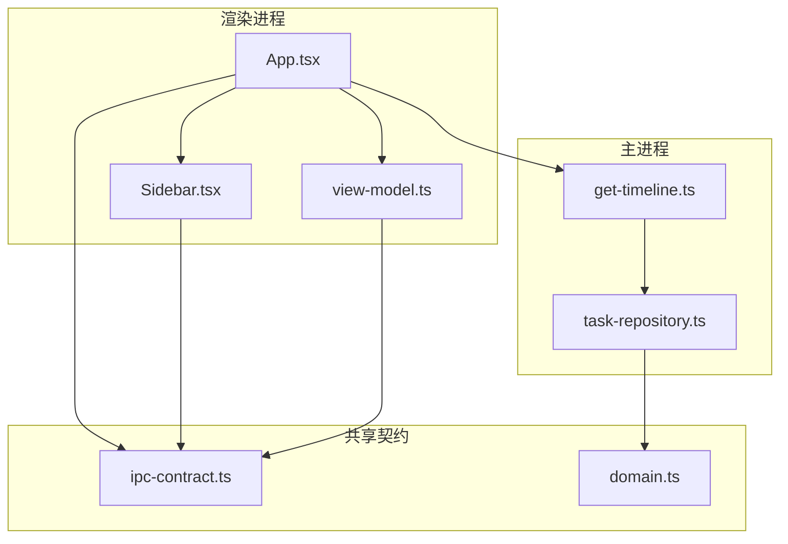
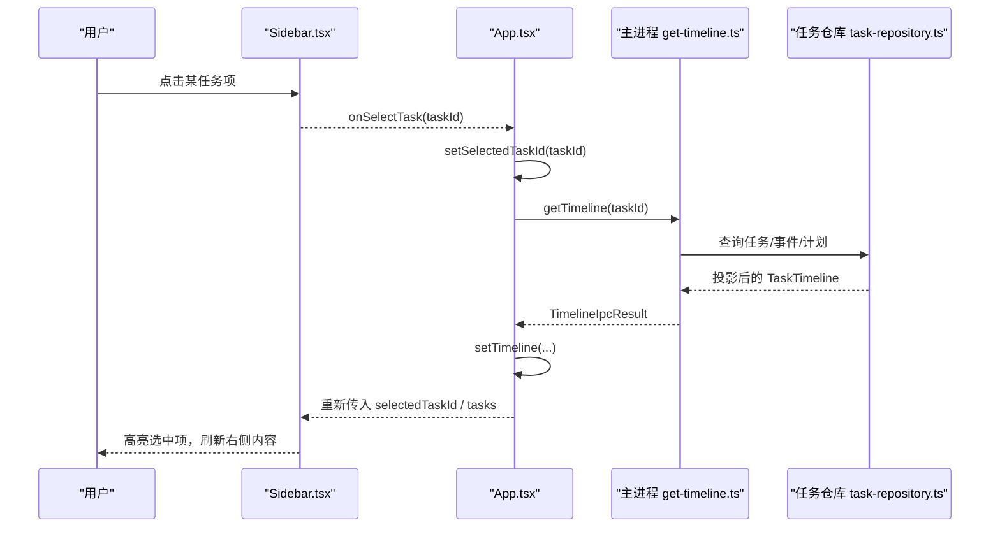
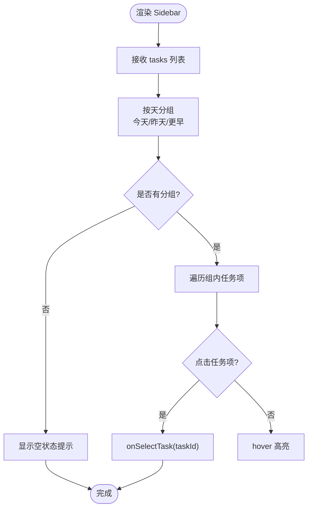
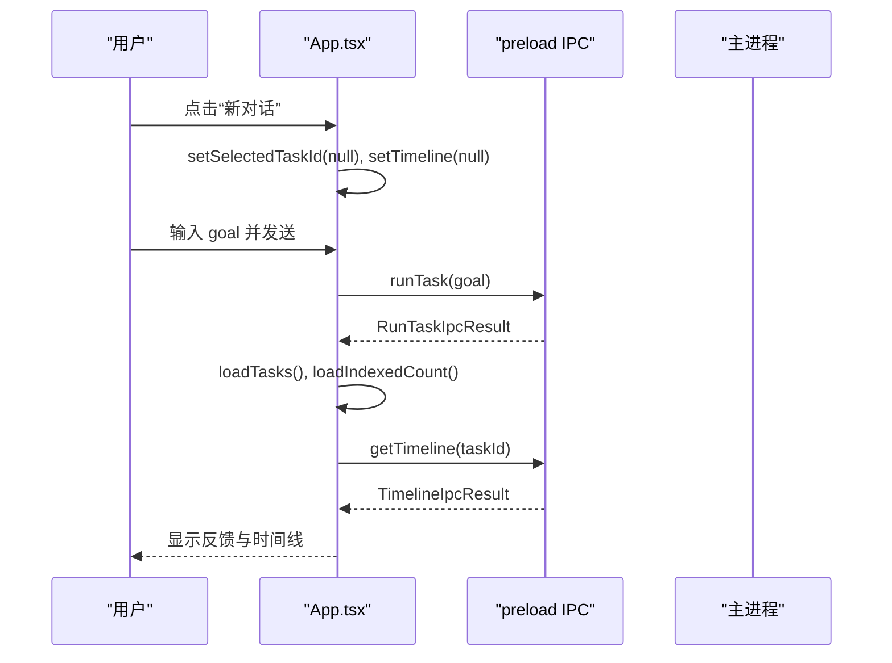
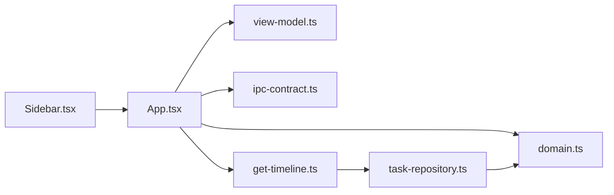

# 侧边栏界面

<cite>
**本文引用的文件**
- [Sidebar.tsx](file://apps/desktop/src/renderer/src/components/Sidebar.tsx)
- [App.tsx](file://apps/desktop/src/renderer/src/App.tsx)
- [view-model.ts](file://apps/desktop/src/renderer/src/view-model.ts)
- [ipc-contract.ts](file://apps/desktop/src/shared/ipc-contract.ts)
- [domain.ts](file://apps/desktop/src/shared/domain.ts)
- [task-repository.ts](file://apps/desktop/src/main/product-state/task-repository.ts)
- [get-timeline.ts](file://apps/desktop/src/main/tasks/get-timeline.ts)
- [utils.ts](file://apps/desktop/src/renderer/src/lib/utils.ts)
</cite>

## 目录
1. [简介](#简介)
2. [项目结构](#项目结构)
3. [核心组件](#核心组件)
4. [架构总览](#架构总览)
5. [详细组件分析](#详细组件分析)
6. [依赖关系分析](#依赖关系分析)
7. [性能考量](#性能考量)
8. [故障排查指南](#故障排查指南)
9. [结论](#结论)
10. [附录：配置与样式定制、可访问性与响应式方案](#附录：配置与样式定制、可访问性与响应式方案)

## 简介
本文件聚焦于桌面应用渲染进程中的“侧边栏”界面，围绕任务列表的历史展示、导航逻辑、状态同步、渲染机制（任务状态显示、时间戳格式化、点击事件处理）、筛选与搜索能力、与主应用的状态管理（任务选择、数据加载、实时更新）以及可访问性与响应式设计进行系统化说明。文档同时给出关键流程图与时序图，帮助读者快速理解从 UI 到后端存储的数据流与控制流。

## 项目结构
侧边栏位于渲染进程的 React 组件层，通过 IPC 与主进程交互，读取任务列表、任务时间线、运行时状态与索引数量等数据；主进程则通过仓库层访问 SQLite 数据库，并返回结构化结果。

图表来源
- [App.tsx:21-294](file://apps/desktop/src/renderer/src/App.tsx#L21-L294)
- [Sidebar.tsx:1-155](file://apps/desktop/src/renderer/src/components/Sidebar.tsx#L1-L155)
- [view-model.ts:1-370](file://apps/desktop/src/renderer/src/view-model.ts#L1-L370)
- [ipc-contract.ts:1-75](file://apps/desktop/src/shared/ipc-contract.ts#L1-L75)
- [domain.ts:1-158](file://apps/desktop/src/shared/domain.ts#L1-L158)
- [get-timeline.ts:1-53](file://apps/desktop/src/main/tasks/get-timeline.ts#L1-L53)
- [task-repository.ts:1-103](file://apps/desktop/src/main/product-state/task-repository.ts#L1-L103)

章节来源
- [App.tsx:21-294](file://apps/desktop/src/renderer/src/App.tsx#L21-L294)
- [Sidebar.tsx:1-155](file://apps/desktop/src/renderer/src/components/Sidebar.tsx#L1-L155)
- [ipc-contract.ts:1-75](file://apps/desktop/src/shared/ipc-contract.ts#L1-L75)
- [domain.ts:1-158](file://apps/desktop/src/shared/domain.ts#L1-L158)
- [get-timeline.ts:1-53](file://apps/desktop/src/main/tasks/get-timeline.ts#L1-L53)
- [task-repository.ts:1-103](file://apps/desktop/src/main/product-state/task-repository.ts#L1-L103)

## 核心组件
- Sidebar 组件：负责历史会话的分组展示、任务项渲染、运行时状态与索引数量提示、底部工具按钮（索引管理、运行诊断、设置）。
- App 容器：维护全局状态（任务列表、选中任务、时间线、运行时状态、索引数量、权限弹窗等），提供任务选择、新建对话、发送任务、扫描 PDF、导出 Markdown 等行为，并通过 IPC 调用主进程接口。
- view-model：提供时间戳格式化、事件摘要、计划步骤描述、Markdown 导出等纯函数工具。
- 共享契约与领域模型：定义任务、事件、计划、权限、IPC 返回值类型，确保前后端类型一致。
- 主进程仓库：封装数据库查询，按创建时间升序返回任务列表，组装任务时间线。

章节来源
- [Sidebar.tsx:1-155](file://apps/desktop/src/renderer/src/components/Sidebar.tsx#L1-L155)
- [App.tsx:21-294](file://apps/desktop/src/renderer/src/App.tsx#L21-L294)
- [view-model.ts:1-370](file://apps/desktop/src/renderer/src/view-model.ts#L1-L370)
- [ipc-contract.ts:1-75](file://apps/desktop/src/shared/ipc-contract.ts#L1-L75)
- [domain.ts:1-158](file://apps/desktop/src/shared/domain.ts#L1-L158)
- [task-repository.ts:1-103](file://apps/desktop/src/main/product-state/task-repository.ts#L1-L103)
- [get-timeline.ts:1-53](file://apps/desktop/src/main/tasks/get-timeline.ts#L1-L53)

## 架构总览
侧边栏作为只读视图，由 App 注入数据与回调。用户点击任务项触发选择，App 更新选中态并请求时间线；任务列表与索引数量在初始化时拉取，运行时状态通过 IPC 获取。所有数据变更均通过 React 状态驱动重渲染。

图表来源
- [Sidebar.tsx:96-111](file://apps/desktop/src/renderer/src/components/Sidebar.tsx#L96-L111)
- [App.tsx:152-186](file://apps/desktop/src/renderer/src/App.tsx#L152-L186)
- [get-timeline.ts:17-44](file://apps/desktop/src/main/tasks/get-timeline.ts#L17-L44)
- [task-repository.ts:90-93](file://apps/desktop/src/main/product-state/task-repository.ts#L90-L93)

## 详细组件分析

### Sidebar 组件：任务列表与历史分组
- 输入属性
  - tasks：任务记录数组，来自 App 状态，按 created_at 升序。
  - selectedTaskId：当前选中的任务 ID。
  - runtimeStatus：运行时状态对象，用于显示就绪/启动中/崩溃/未启动。
  - indexedCount：已索引 PDF 数量，用于状态文案拼接。
  - 回调：onSelectTask、onNewChat、onOpenIndex、onOpenDiagnostics、onSettings。
- 历史分组与排序
  - 将任务按“今天/昨天/更早”分组，倒序保证最新在上。
  - 使用 dayKey 根据 createdAt 计算分组键。
- 任务项渲染
  - 每个任务项为按钮，包含图标与目标文本（goal），支持截断显示。
  - 选中态通过 cn 合并类名实现高亮背景与前景色。
  - 点击触发 onSelectTask。
- 运行时状态与索引提示
  - 根据 runtimeStatus.state 映射中文文案与指示点颜色。
  - 若存在 indexedCount，则在状态行追加“索引 N 份 PDF”。
- 底部工具区
  - 索引管理、运行诊断、设置三个按钮，分别打开对应对话框或触发回调。

图表来源
- [Sidebar.tsx:24-47](file://apps/desktop/src/renderer/src/components/Sidebar.tsx#L24-L47)
- [Sidebar.tsx:90-115](file://apps/desktop/src/renderer/src/components/Sidebar.tsx#L90-L115)

章节来源
- [Sidebar.tsx:1-155](file://apps/desktop/src/renderer/src/components/Sidebar.tsx#L1-L155)

### App 容器：状态管理与数据加载
- 状态字段
  - tasks、selectedTaskId、timeline、timelineError、pendingGoal、running、runtimeStatus、indexedCount、feedback、indexOpen、diagnosticsOpen、pendingPermission。
- 数据加载
  - 初始化时调用 listTasks、indexedPdfs、runtimeStatus。
  - 选择任务时调用 getTimeline 并设置 timeline/timelineError。
  - 发送任务后刷新任务列表与索引数量，并自动选中新任务。
- 权限通道
  - 订阅 onPermissionNotice，弹出 PermissionDialog，处理批准/拒绝。
- 行为回调
  - handleSelectTask：更新选中并加载时间线。
  - handleNewChat：清空选中与时间线，聚焦输入框。
  - handleSend：发起 runTask，处理成功/失败反馈。
  - handleScan：扫描 Downloads 下的 PDF 并更新索引数量。
  - handleExport：将当前时间线导出为 Markdown 到剪贴板。

图表来源
- [App.tsx:43-109](file://apps/desktop/src/renderer/src/App.tsx#L43-L109)
- [App.tsx:152-196](file://apps/desktop/src/renderer/src/App.tsx#L152-L196)
- [ipc-contract.ts:52-63](file://apps/desktop/src/shared/ipc-contract.ts#L52-L63)

章节来源
- [App.tsx:21-294](file://apps/desktop/src/renderer/src/App.tsx#L21-L294)
- [ipc-contract.ts:1-75](file://apps/desktop/src/shared/ipc-contract.ts#L1-L75)

### view-model：时间戳与事件摘要
- 时间戳格式化
  - formatOccurredAt：将 ISO 字符串格式化为本地可读时间，容错脏数据。
- 事件摘要
  - describeEvent：为执行事件生成可读的行信息，包括序号、类型标签、摘要、时间。
  - summarizePayload：根据不同事件类型提取关键字段并拼接一行摘要。
- 计划步骤
  - describePlanSteps：将 PlanRecord 转换为带序号的步骤视图。
- Markdown 导出
  - timelineToMarkdown：将任务目标、状态、摘要事实与计划步骤导出为 Markdown。

章节来源
- [view-model.ts:91-103](file://apps/desktop/src/renderer/src/view-model.ts#L91-L103)
- [view-model.ts:131-150](file://apps/desktop/src/renderer/src/view-model.ts#L131-L150)
- [view-model.ts:190-262](file://apps/desktop/src/renderer/src/view-model.ts#L190-L262)
- [view-model.ts:275-283](file://apps/desktop/src/renderer/src/view-model.ts#L275-L283)
- [view-model.ts:344-369](file://apps/desktop/src/renderer/src/view-model.ts#L344-L369)

### 主进程：任务列表与时间线
- 任务列表
  - SqliteTaskRepository.findAll：按 created_at ASC, id ASC 查询任务，映射为 TaskRecord。
- 时间线
  - getTimeline：校验 taskId，若为空则取最近任务；组装 TaskTimeline 并返回。
  - 错误处理：非法参数或数据库异常返回统一错误结构。

章节来源
- [task-repository.ts:90-93](file://apps/desktop/src/main/product-state/task-repository.ts#L90-L93)
- [get-timeline.ts:17-51](file://apps/desktop/src/main/tasks/get-timeline.ts#L17-L51)

## 依赖关系分析
- 组件耦合
  - Sidebar 仅依赖 props 与回调，无副作用，易于测试与复用。
  - App 集中管理状态与 IPC 调用，职责清晰。
- 外部依赖
  - ipc-contract 与 domain 提供强类型契约，避免前后端不一致。
  - utils.cn 合并 Tailwind 类名，提升样式组合的可维护性。
- 潜在循环依赖
  - 渲染层与主进程通过 IPC 解耦，无直接 import 循环。

图表来源
- [Sidebar.tsx:1-155](file://apps/desktop/src/renderer/src/components/Sidebar.tsx#L1-L155)
- [App.tsx:21-294](file://apps/desktop/src/renderer/src/App.tsx#L21-L294)
- [view-model.ts:1-370](file://apps/desktop/src/renderer/src/view-model.ts#L1-L370)
- [ipc-contract.ts:1-75](file://apps/desktop/src/shared/ipc-contract.ts#L1-L75)
- [domain.ts:1-158](file://apps/desktop/src/shared/domain.ts#L1-L158)
- [get-timeline.ts:1-53](file://apps/desktop/src/main/tasks/get-timeline.ts#L1-L53)
- [task-repository.ts:1-103](file://apps/desktop/src/main/product-state/task-repository.ts#L1-L103)

章节来源
- [utils.ts:1-7](file://apps/desktop/src/renderer/src/lib/utils.ts#L1-L7)

## 性能考量
- 列表渲染
  - 任务列表较小，React 默认渲染足够；如需优化可使用 key 稳定化（已使用 task.id）。
- 分组计算
  - groupTasks 每次渲染都会重建 Map，复杂度 O(n)，n 为任务数，通常可接受。
- 时间格式化
  - formatOccurredAt 仅在需要时调用，避免重复计算。
- IPC 调用
  - 列表与索引数量在初始化时拉取，避免频繁轮询；任务选择时按需加载时间线。
- 内存占用
  - 时间线数据可能较大，建议在 App 中合理缓存与清理（当前实现已按需设置 null）。

[本节为通用指导，不直接分析具体文件]

## 故障排查指南
- 任务列表为空
  - 检查初始化是否调用 listTasks；查看控制台错误日志。
- 时间线加载失败
  - 检查 getTimeline 返回的错误码与消息；确认 taskId 合法。
- 运行时状态异常
  - 检查 runtimeStatus 初始值与后续更新；确认主进程状态推送正常。
- 权限弹窗不关闭
  - 检查 onPermissionNotice 的 resolved 分支是否正确清除 pendingPermission。
- 导出失败
  - 浏览器环境剪贴板不可用时会失败，需提示用户授权或使用其他方案。

章节来源
- [App.tsx:43-109](file://apps/desktop/src/renderer/src/App.tsx#L43-L109)
- [App.tsx:112-150](file://apps/desktop/src/renderer/src/App.tsx#L112-L150)
- [get-timeline.ts:17-51](file://apps/desktop/src/main/tasks/get-timeline.ts#L17-L51)

## 结论
侧边栏以简洁的分组与高亮交互呈现任务历史，配合 App 的状态管理与 IPC 通信，实现了任务选择、数据加载与实时更新的完整闭环。view-model 提供稳定的格式化与摘要能力，主进程仓库保障数据一致性。整体架构清晰、职责分离良好，便于扩展与维护。

[本节为总结，不直接分析具体文件]

## 附录：配置与样式定制、可访问性与响应式方案

### 组件配置选项
- SidebarProps
  - tasks：任务数组，用于历史列表。
  - selectedTaskId：当前选中任务 ID。
  - runtimeStatus：运行时状态，影响状态文案与指示点颜色。
  - indexedCount：索引数量，影响状态文案后缀。
  - 回调：onSelectTask、onNewChat、onOpenIndex、onOpenDiagnostics、onSettings。

章节来源
- [Sidebar.tsx:5-15](file://apps/desktop/src/renderer/src/components/Sidebar.tsx#L5-L15)

### 样式定制方法
- 使用 Tailwind 类名进行布局与主题控制，如宽度、边框、背景、字体大小与颜色。
- 通过 cn 工具合并动态类名，实现选中态与 hover 态切换。
- 可通过主题变量（primary、secondary、background、foreground 等）统一调整配色。

章节来源
- [Sidebar.tsx:64-152](file://apps/desktop/src/renderer/src/components/Sidebar.tsx#L64-L152)
- [utils.ts:1-7](file://apps/desktop/src/renderer/src/lib/utils.ts#L1-L7)

### 可访问性支持
- 语义化元素：使用 aside、nav、button 等语义标签。
- 键盘交互：按钮具备默认焦点与可访问名称；必要时可添加 aria-label。
- 屏幕阅读器：为图标按钮提供 title 与 aria-label，确保朗读正确。
- 对比度与焦点可见：遵循主题色对比度要求，focus-visible 样式已内置。

章节来源
- [Sidebar.tsx:86-150](file://apps/desktop/src/renderer/src/components/Sidebar.tsx#L86-L150)

### 响应式设计实现方案
- 固定宽度侧边栏：w-[232px] 保证在小屏下仍可用。
- 主内容区域自适应：flex-1 与 min-w-0 确保文本截断与换行。
- 滚动区域：nav 使用 overflow-y-auto，避免长列表溢出。
- 移动端适配建议：可在外层容器增加媒体查询，折叠侧边栏并提供抽屉式入口。

章节来源
- [Sidebar.tsx:64-115](file://apps/desktop/src/renderer/src/components/Sidebar.tsx#L64-L115)
- [App.tsx:228-280](file://apps/desktop/src/renderer/src/App.tsx#L228-L280)

### 任务筛选与搜索功能说明
- 当前实现：侧边栏未内置筛选与搜索控件，任务列表按“今天/昨天/更早”分组展示。
- 扩展建议：
  - 在 Sidebar 顶部增加搜索输入框，基于 goal 模糊匹配过滤 tasks。
  - 增加状态筛选下拉（如“进行中/已完成/失败”），结合 TASK_STATUSES 进行过滤。
  - 使用受控组件管理筛选状态，并在渲染前对 tasks 进行过滤，保持性能。

[本节为概念性扩展建议，不直接分析具体文件]