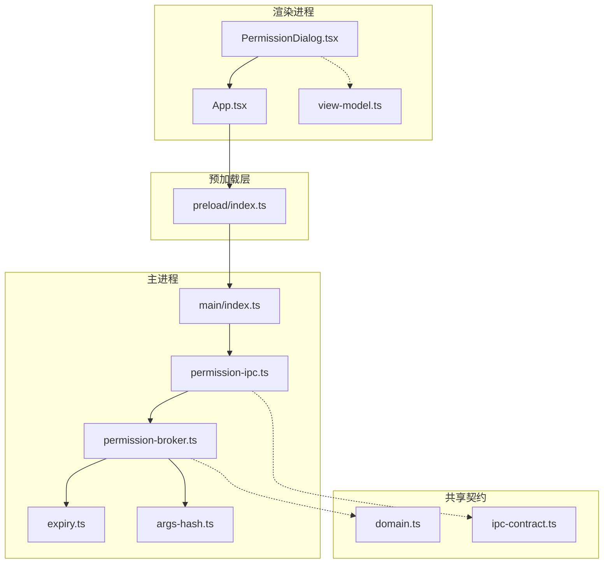
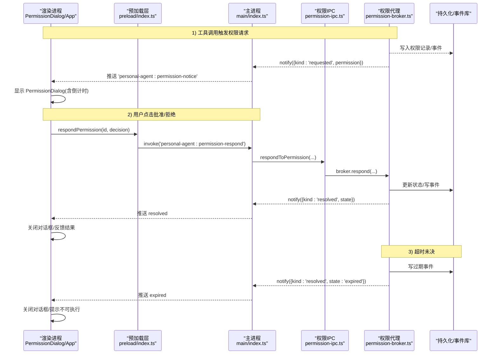
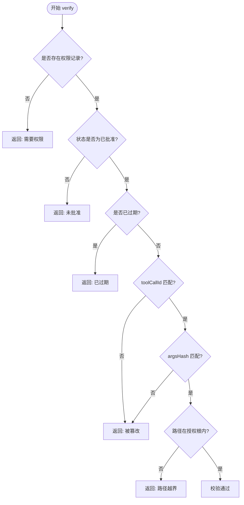
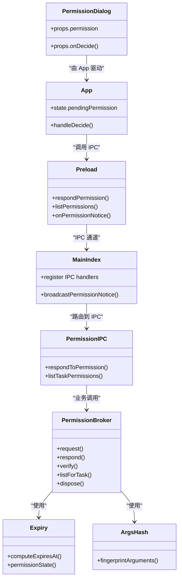

# 权限对话框

<cite>
**本文引用的文件**
- [PermissionDialog.tsx](file://apps/desktop/src/renderer/src/components/PermissionDialog.tsx)
- [App.tsx](file://apps/desktop/src/renderer/src/App.tsx)
- [view-model.ts](file://apps/desktop/src/renderer/src/view-model.ts)
- [permission-broker.ts](file://apps/desktop/src/main/permission/permission-broker.ts)
- [permission-ipc.ts](file://apps/desktop/src/main/permission/permission-ipc.ts)
- [expiry.ts](file://apps/desktop/src/main/permission/expiry.ts)
- [args-hash.ts](file://apps/desktop/src/main/permission/args-hash.ts)
- [domain.ts](file://apps/desktop/src/shared/domain.ts)
- [ipc-contract.ts](file://apps/desktop/src/shared/ipc-contract.ts)
- [preload/index.ts](file://apps/desktop/src/preload/index.ts)
- [main/index.ts](file://apps/desktop/src/main/index.ts)
- [DiagnosticsDialog.tsx](file://apps/desktop/src/renderer/src/components/DiagnosticsDialog.tsx)
</cite>

## 目录
1. [简介](#简介)
2. [项目结构](#项目结构)
3. [核心组件](#核心组件)
4. [架构总览](#架构总览)
5. [详细组件分析](#详细组件分析)
6. [依赖关系分析](#依赖关系分析)
7. [性能与可用性考虑](#性能与可用性考虑)
8. [故障排查指南](#故障排查指南)
9. [结论](#结论)
10. [附录：集成与自定义示例](#附录集成与自定义示例)

## 简介
本文件围绕“权限对话框”展开，系统性说明 PermissionDialog 组件的用户体验设计、生命周期管理、数据绑定与事件处理；解释权限信息的展示格式（操作类型、目标资源、风险评估）；详述用户交互逻辑（同意/拒绝、取消、超时处理）；并提供集成示例与自定义样式方法。同时给出无障碍访问支持与多语言适配方案。

## 项目结构
权限对话框位于渲染进程（Renderer），通过主进程（Main）的权限代理（Broker）与持久化存储、事件系统协作完成请求、决策与过期处理。关键路径如下：
- Renderer：PermissionDialog 负责展示与交互；App 订阅主进程推送的权限通知并维护当前待批记录。
- Preload：暴露 IPC 桥接 API，供 Renderer 调用主进程的权限响应与列表查询，以及订阅权限通知。
- Main：注册 IPC 处理器，将请求转发给 permission-ipc，再交由 permission-broker 执行业务逻辑（创建、等待、决议、过期）。
- Shared：领域模型与 IPC 契约定义，保证前后端类型一致。

图表来源
- [PermissionDialog.tsx:1-197](file://apps/desktop/src/renderer/src/components/PermissionDialog.tsx#L1-L197)
- [App.tsx:94-133](file://apps/desktop/src/renderer/src/App.tsx#L94-L133)
- [preload/index.ts:29-45](file://apps/desktop/src/preload/index.ts#L29-L45)
- [main/index.ts:120-129](file://apps/desktop/src/main/index.ts#L120-L129)
- [main/index.ts:296-321](file://apps/desktop/src/main/index.ts#L296-L321)
- [permission-ipc.ts:43-68](file://apps/desktop/src/main/permission/permission-ipc.ts#L43-L68)
- [permission-broker.ts:100-181](file://apps/desktop/src/main/permission/permission-broker.ts#L100-L181)
- [expiry.ts:1-26](file://apps/desktop/src/main/permission/expiry.ts#L1-L26)
- [args-hash.ts:18-32](file://apps/desktop/src/main/permission/args-hash.ts#L18-L32)
- [domain.ts:52-94](file://apps/desktop/src/shared/domain.ts#L52-L94)
- [ipc-contract.ts:65-74](file://apps/desktop/src/shared/ipc-contract.ts#L65-L74)

章节来源
- [PermissionDialog.tsx:1-197](file://apps/desktop/src/renderer/src/components/PermissionDialog.tsx#L1-L197)
- [App.tsx:94-133](file://apps/desktop/src/renderer/src/App.tsx#L94-L133)
- [main/index.ts:120-129](file://apps/desktop/src/main/index.ts#L120-L129)
- [main/index.ts:296-321](file://apps/desktop/src/main/index.ts#L296-L321)

## 核心组件
- PermissionDialog：展示权限请求详情（能力、影响文件与目标位置、或 scheduler.create 的提醒时间预览、参数摘要、参数指纹、请求时间、过期时间）、倒计时、批准/拒绝按钮，禁用外部关闭与 ESC 关闭，确保用户必须明确选择。
- view-model：提供 formatOccurredAt / formatRemaining 时间格式化，以及 describeReminderPreview——从 argsCanonical 解析 scheduler.create 的提醒时间预览数据。
- App：订阅权限通知，维护 pendingPermission，处理 onDecide 回调并通过 preload 调用主进程。
- permission-broker：创建权限记录、设置 TTL、挂起等待用户决策、处理重复响应、过期事件与执行前校验。
- permission-ipc：对 renderer 传入参数进行严格校验，映射错误码，调用 broker.respond/listForTask。
- expiry：计算过期时间与状态投影。
- args-hash：生成参数指纹（规范化 JSON + SHA-256），用于防篡改校验。
- domain/ipc-contract：统一权限状态、通知、IPC 结果等类型。

章节来源
- [PermissionDialog.tsx:15-197](file://apps/desktop/src/renderer/src/components/PermissionDialog.tsx#L15-L197)
- [view-model.ts:257-277](file://apps/desktop/src/renderer/src/view-model.ts#L257-L277)
- [permission-broker.ts:100-181](file://apps/desktop/src/main/permission/permission-broker.ts#L100-L181)
- [permission-broker.ts:235-319](file://apps/desktop/src/main/permission/permission-broker.ts#L235-L319)
- [permission-ipc.ts:43-83](file://apps/desktop/src/main/permission/permission-ipc.ts#L43-L83)
- [expiry.ts:1-26](file://apps/desktop/src/main/permission/expiry.ts#L1-L26)
- [args-hash.ts:18-32](file://apps/desktop/src/main/permission/args-hash.ts#L18-L32)
- [domain.ts:52-94](file://apps/desktop/src/shared/domain.ts#L52-L94)
- [ipc-contract.ts:65-74](file://apps/desktop/src/shared/ipc-contract.ts#L65-L74)

## 架构总览
权限对话框的工作流分为“请求-展示-决策-结算-执行验证”五个阶段。

图表来源
- [permission-broker.ts:133-181](file://apps/desktop/src/main/permission/permission-broker.ts#L133-L181)
- [permission-broker.ts:213-234](file://apps/desktop/src/main/permission/permission-broker.ts#L213-L234)
- [main/index.ts:49-54](file://apps/desktop/src/main/index.ts#L49-L54)
- [main/index.ts:296-321](file://apps/desktop/src/main/index.ts#L296-L321)
- [preload/index.ts:29-45](file://apps/desktop/src/preload/index.ts#L29-L45)
- [permission-ipc.ts:43-68](file://apps/desktop/src/main/permission/permission-ipc.ts#L43-L68)
- [App.tsx:94-133](file://apps/desktop/src/renderer/src/App.tsx#L94-L133)

## 详细组件分析

### 用户体验设计与信息展示
- 标题与风险提示：标题“需要你批准”配 ShieldAlert 警示图标；头部描述按能力区分——scheduler.create 显示“这个操作会创建一次性提醒。时间是解析之后的具体时刻，批准的就是它。”，其余能力显示“这个操作会改动授权目录里的文件。路径是规范化之后的绝对路径，批准的就是它。”
- 能力与资源（通用分支，逐行 Row 展示）：
  - 能力（capability）：等宽字体展示，如 filesystem.move、filesystem.create_dir。
  - 影响文件：先显示 sourcePaths 的数量；非空时逐条列出来源路径；目标位置（targetPath）非 null 时单独一行展示。
  - 参数摘要：argsCanonical 原文（绑定与路径规范化之后的 canonical JSON 串）。
  - 参数指纹：argsHash 前 12 位，便于核对是否被篡改。
  - 请求时间（requestedAt）、过期时间（expiresAt 的本地化格式，无法解析时原样显示字符串）与剩余时间（formatRemaining 每秒刷新的 mm:ss 倒计时，无法解析时提示“无法解析过期时刻”）。
- scheduler.create 特殊分支（提醒时间预览）：
  - describeReminderPreview 从 argsCanonical 解析 remindAt 与 message，成功时以「提醒时间」（remindAt 本地化格式）与「提醒内容」（message，缺失时不渲染）两行替代影响文件/来源路径/目标位置——用户在批准前能看见“今晚”被解析成了哪个具体时刻。
  - 非 scheduler.create、argsCanonical 不是合法 JSON 或缺 remindAt 时返回 null，退回通用文件展示（参数摘要行仍原样展示 argsCanonical）。
- 行为约束：
  - 禁止外部点击关闭、ESC 关闭（onPointerDownOutside / onEscapeKeyDown / onInteractOutside 均 preventDefault）且不渲染右上角关闭按钮，避免误关导致无结论。
  - 窗口关闭后仅禁用按钮并红字提示“批准窗口已关闭，等待主进程结算。这个操作不会被执行。”，不替主进程下结论；过期由主进程结算并推送。

章节来源
- [PermissionDialog.tsx:66-148](file://apps/desktop/src/renderer/src/components/PermissionDialog.tsx#L66-L148)
- [PermissionDialog.tsx:167-197](file://apps/desktop/src/renderer/src/components/PermissionDialog.tsx#L167-L197)
- [view-model.ts:257-277](file://apps/desktop/src/renderer/src/view-model.ts#L257-L277)
- [view-model.ts:92-118](file://apps/desktop/src/renderer/src/view-model.ts#L92-L118)

### 生命周期管理与动画
- 打开/关闭：由 open={permission !== null} 控制；当收到 resolved 或过期推送时，App 清空 pendingPermission，对话框自然关闭。
- 数据绑定：PermissionBody 以 key={permission.id} 挂载，切换新请求时自动重置倒计时与提交态。
- 事件处理：
  - 每秒刷新 now，计算 remaining，并在过期时禁用按钮。
  - 提交时 setSubmitting=true，onDecide 完成后 finally 恢复。

章节来源
- [PermissionDialog.tsx:30-64](file://apps/desktop/src/renderer/src/components/PermissionDialog.tsx#L30-L64)
- [App.tsx:94-108](file://apps/desktop/src/renderer/src/App.tsx#L94-L108)

### 权限信息与风险评估
- 操作类型：capability 字段标识具体能力。
- 目标资源：sourcePaths/targetPath 由 broker 的 splitPaths 按能力从绑定结果拆出（filesystem.move 拆 source/target，filesystem.create_dir 只归 targetPath，其余能力把全部规范化路径归入 sourcePaths）。参数摘要与参数指纹恒展示；来源路径列表仅在非空时渲染；scheduler.create 没有路径参数，走提醒时间预览分支。
- 风险评估：
  - 参数指纹（argsHash）用于防篡改校验。
  - 执行前六步验证（见下文）确保 toolCallId、argsHash 与路径均在授权范围内。

章节来源
- [permission-broker.ts:78-98](file://apps/desktop/src/main/permission/permission-broker.ts#L78-L98)
- [permission-broker.ts:283-327](file://apps/desktop/src/main/permission/permission-broker.ts#L283-L327)
- [args-hash.ts:18-32](file://apps/desktop/src/main/permission/args-hash.ts#L18-L32)
- [PermissionDialog.tsx:73-111](file://apps/desktop/src/renderer/src/components/PermissionDialog.tsx#L73-L111)

### 用户交互逻辑
- 同意/拒绝：点击后调用 onDecide，最终通过 preload 调用主进程 respondPermission。
- 取消：对话框屏蔽外部关闭与 ESC，不提供显式取消按钮；如需取消可关闭应用或等待过期。
- 超时处理：默认 TTL 为 5 分钟；超时后主进程写入过期事件并推送 resolved，UI 收到后关闭对话框并提示不可执行。

章节来源
- [App.tsx:110-133](file://apps/desktop/src/renderer/src/App.tsx#L110-L133)
- [expiry.ts:1-26](file://apps/desktop/src/main/permission/expiry.ts#L1-L26)
- [permission-broker.ts:168-181](file://apps/desktop/src/main/permission/permission-broker.ts#L168-L181)

### 执行前校验流程（六步验证）

图表来源
- [permission-broker.ts:283-327](file://apps/desktop/src/main/permission/permission-broker.ts#L283-L327)

章节来源
- [permission-broker.ts:283-327](file://apps/desktop/src/main/permission/permission-broker.ts#L283-L327)

### 类与模块关系图

图表来源
- [PermissionDialog.tsx:167-197](file://apps/desktop/src/renderer/src/components/PermissionDialog.tsx#L167-L197)
- [App.tsx:94-133](file://apps/desktop/src/renderer/src/App.tsx#L94-L133)
- [preload/index.ts:29-45](file://apps/desktop/src/preload/index.ts#L29-L45)
- [main/index.ts:120-129](file://apps/desktop/src/main/index.ts#L120-L129)
- [main/index.ts:296-321](file://apps/desktop/src/main/index.ts#L296-L321)
- [permission-ipc.ts:43-83](file://apps/desktop/src/main/permission/permission-ipc.ts#L43-L83)
- [permission-broker.ts:100-181](file://apps/desktop/src/main/permission/permission-broker.ts#L100-L181)
- [expiry.ts:1-26](file://apps/desktop/src/main/permission/expiry.ts#L1-L26)
- [args-hash.ts:18-32](file://apps/desktop/src/main/permission/args-hash.ts#L18-L32)

## 依赖关系分析
- 渲染层依赖：
  - PermissionDialog 依赖 view-model 的时间格式化函数（formatOccurredAt、formatRemaining）与 describeReminderPreview（scheduler.create 提醒时间预览）。
  - App 依赖 preload 暴露的 IPC 方法与权限通知订阅。
- 主进程依赖：
  - main/index.ts 注册 IPC 处理器，构造 permission-broker，并广播通知。
  - permission-ipc 对输入做严格校验，映射错误码，调用 broker。
  - permission-broker 依赖 expiry、args-hash、持久化与事件仓库。
- 共享契约：
  - domain 定义权限状态、通知、视图状态等。
  - ipc-contract 定义 IPC 结果类型，包括 repeated 语义。

章节来源
- [view-model.ts:92-118](file://apps/desktop/src/renderer/src/view-model.ts#L92-L118)
- [view-model.ts:257-277](file://apps/desktop/src/renderer/src/view-model.ts#L257-L277)
- [permission-broker.ts:100-181](file://apps/desktop/src/main/permission/permission-broker.ts#L100-L181)
- [permission-ipc.ts:43-83](file://apps/desktop/src/main/permission/permission-ipc.ts#L43-L83)
- [domain.ts:52-94](file://apps/desktop/src/shared/domain.ts#L52-L94)
- [ipc-contract.ts:65-74](file://apps/desktop/src/shared/ipc-contract.ts#L65-L74)

## 性能与可用性考虑
- 性能
  - 倒计时使用 setInterval 每秒刷新，内存占用极低；组件卸载时清理定时器。
  - 提交态 submitting 防止重复提交；broker.respond 支持幂等重复调用。
  - 过期 TTL 默认 5 分钟，避免长时间挂起。
- 可用性
  - 禁止外部关闭与 ESC，强制用户做出明确选择。
  - 窗口关闭后仅禁用按钮，不替主进程下结论，避免误判。
  - 失败与过期通过通知推送，UI 能正确关闭对话框并给出反馈。
- 无障碍
  - 按钮具备语义化标签；可通过 aria-label 增强描述。
  - 建议为标题添加 role="alert" 或在首次打开时聚焦到第一个可操作元素，提升键盘与读屏体验。
- 多语言
  - 界面文案集中在组件中，可按需抽取为 i18n 键值；时间格式化已在 view-model 中实现本地化友好输出。

[本节为通用指导，不直接分析具体文件]

## 故障排查指南
- 常见错误码与含义
  - PERMISSION_REQUIRED：缺少权限记录或记录不存在。
  - PERMISSION_DENIED：状态不是 approved 或被拒绝（含已有相反结论后再次响应）。
  - PERMISSION_EXPIRED：超过 TTL 未响应，或批准窗口已结算后迟到响应。
  - PERMISSION_TAMPERED：toolCallId 或 argsHash 不匹配。
  - PROTOCOL_INVALID_REQUEST：permission-ipc 入参收窄失败（permissionId 不是非空字符串，或 decision 不是 approved/denied）。
  - DB_FAILED：broker 失败码白名单（上面四条 PERMISSION_*）之外的兜底映射，或启动时 product-state 库没打开、批准通道未就绪。
- repeated 语义：ok:true 且 repeated=true 不是失败——这条记录早有同样结论，本次点击没产生新副作用，UI 按“已批准/已拒绝”正常反馈。
- 定位步骤
  - 检查 App 是否正确订阅 onPermissionNotice，并在 requested 时设置 pendingPermission。
  - 检查 respondPermission 调用是否传入正确的 permissionId 与 decision。
  - 查看主进程日志与数据库事件，确认 broker 是否写入 DECISION/EXPIRED 事件。
  - 若反复出现 PERMISSION_TAMPERED，检查参数指纹生成与路径规范化逻辑。
- 调试建议
  - 使用诊断面板查看任务权限记录与状态投影。
  - 在开发环境开启 Electron DevTools，观察 IPC 消息与状态变化。

章节来源
- [permission-ipc.ts:17-32](file://apps/desktop/src/main/permission/permission-ipc.ts#L17-L32)
- [permission-broker.ts:183-234](file://apps/desktop/src/main/permission/permission-broker.ts#L183-L234)
- [ipc-contract.ts:65-74](file://apps/desktop/src/shared/ipc-contract.ts#L65-L74)
- [App.tsx:110-133](file://apps/desktop/src/renderer/src/App.tsx#L110-L133)
- [DiagnosticsDialog.tsx:106-183](file://apps/desktop/src/renderer/src/components/DiagnosticsDialog.tsx#L106-L183)

## 结论
PermissionDialog 通过严格的 UI 约束与清晰的信息展示，确保用户对敏感操作的知情与可控；配合主进程的 Broker 与 IPC 层，实现了可靠的请求-决策-结算闭环。其设计兼顾了安全性（参数指纹、路径复查）、可用性（禁止误关、倒计时反馈）与可维护性（清晰的职责划分与类型契约）。

[本节为总结，不直接分析具体文件]

## 附录：集成与自定义示例

### 集成步骤（从 0 到 1）
- 在 App 中订阅权限通知，维护 pendingPermission，并在用户操作时调用 respondPermission。
- 将 PermissionDialog 注入到页面树中，传入 permission 与 onDecide。
- 在主进程中初始化 permission-broker，并注册 IPC 处理器。

章节来源
- [App.tsx:94-133](file://apps/desktop/src/renderer/src/App.tsx#L94-L133)
- [main/index.ts:120-129](file://apps/desktop/src/main/index.ts#L120-L129)
- [main/index.ts:296-321](file://apps/desktop/src/main/index.ts#L296-L321)

### 自定义样式
- 对话框宽度：通过 DialogContent 的 className 调整最大宽度。
- 按钮样式：复用 Button 组件的 variant 属性定制外观。
- 图标与颜色：标题区使用 ShieldAlert 图标与破坏色，可根据主题替换。

章节来源
- [PermissionDialog.tsx:167-197](file://apps/desktop/src/renderer/src/components/PermissionDialog.tsx#L167-L197)

### 无障碍与多语言
- 无障碍
  - 为按钮添加 aria-label 描述操作意图。
  - 在对话框打开时聚焦到第一个可操作元素，或使用 role="alert" 提示重要变更。
- 多语言
  - 将固定文案（如“需要你批准”、“批准”、“拒绝”）抽离为 i18n 键。
  - 时间格式化已支持本地化友好的字符串输出，可在 view-model 中扩展。

[本节为通用指导，不直接分析具体文件]