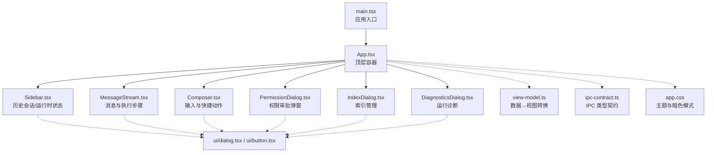
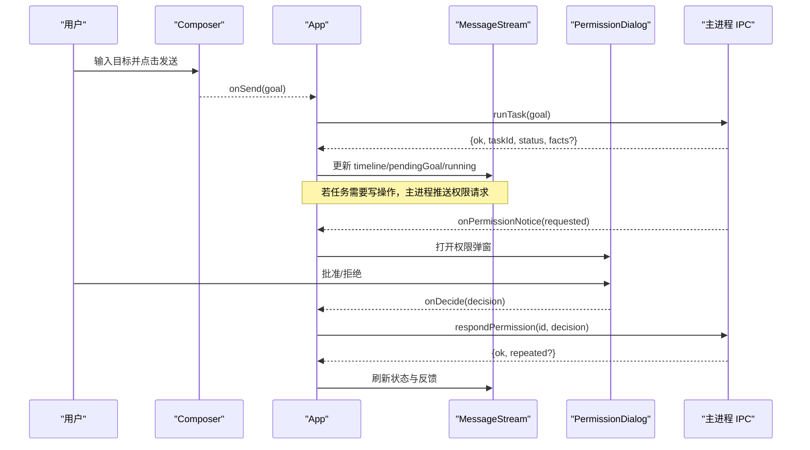
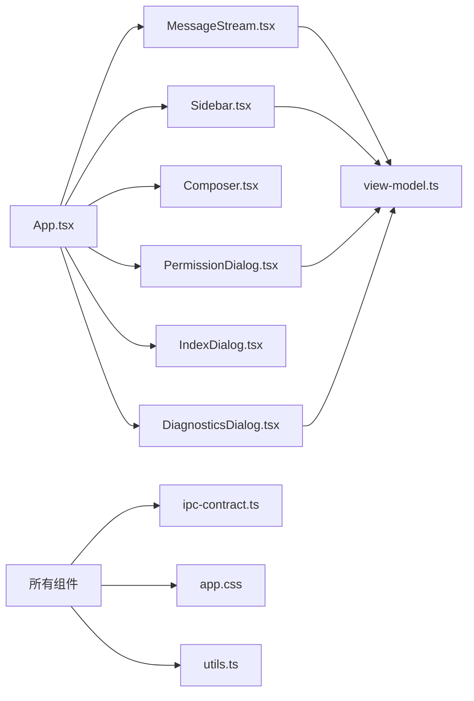

# 用户界面

<cite>
**本文引用的文件**
- [App.tsx](file://apps/desktop/src/renderer/src/App.tsx)
- [main.tsx](file://apps/desktop/src/renderer/src/main.tsx)
- [view-model.ts](file://apps/desktop/src/renderer/src/view-model.ts)
- [Sidebar.tsx](file://apps/desktop/src/renderer/src/components/Sidebar.tsx)
- [MessageStream.tsx](file://apps/desktop/src/renderer/src/components/MessageStream.tsx)
- [Composer.tsx](file://apps/desktop/src/renderer/src/components/Composer.tsx)
- [PermissionDialog.tsx](file://apps/desktop/src/renderer/src/components/PermissionDialog.tsx)
- [IndexDialog.tsx](file://apps/desktop/src/renderer/src/components/IndexDialog.tsx)
- [DiagnosticsDialog.tsx](file://apps/desktop/src/renderer/src/components/DiagnosticsDialog.tsx)
- [ipc-contract.ts](file://apps/desktop/src/shared/ipc-contract.ts)
- [app.css](file://apps/desktop/src/renderer/src/assets/app.css)
- [utils.ts](file://apps/desktop/src/renderer/src/lib/utils.ts)
- [dialog.tsx](file://apps/desktop/src/renderer/src/components/ui/dialog.tsx)
- [button.tsx](file://apps/desktop/src/renderer/src/components/ui/button.tsx)
</cite>

## 目录
1. [简介](#简介)
2. [项目结构](#项目结构)
3. [核心组件](#核心组件)
4. [架构总览](#架构总览)
5. [详细组件分析](#详细组件分析)
6. [依赖关系分析](#依赖关系分析)
7. [性能考量](#性能考量)
8. [故障排查指南](#故障排查指南)
9. [结论](#结论)
10. [附录：样式定制与可访问性](#附录：样式定制与可访问性)

## 简介
本文件面向个人代理桌面应用的渲染层（React）用户界面，系统性说明组件层次、状态管理、事件处理、聊天消息流、侧边栏任务导航、权限审批对话框的交互设计、响应式布局与可访问性支持，并给出使用示例、样式定制方法与性能优化建议。目标是让非技术读者也能理解整体流程，同时为开发者提供落地实现参考。

## 项目结构
渲染层入口通过 React 根节点挂载应用，顶层 App 负责全局状态、IPC 通信、权限弹窗与子模块组合；业务视图由 Sidebar（历史与运行态）、MessageStream（消息与执行步骤）、Composer（输入与快捷操作）构成；辅助能力包括 view-model（数据到视图的转换）、UI 基础组件（Dialog、Button 等）以及主题样式。

图表来源
- [main.tsx:1-12](file://apps/desktop/src/renderer/src/main.tsx#L1-L12)
- [App.tsx:211-272](file://apps/desktop/src/renderer/src/App.tsx#L211-L272)
- [Sidebar.tsx:49-155](file://apps/desktop/src/renderer/src/components/Sidebar.tsx#L49-L155)
- [MessageStream.tsx:39-175](file://apps/desktop/src/renderer/src/components/MessageStream.tsx#L39-L175)
- [Composer.tsx:53-142](file://apps/desktop/src/renderer/src/components/Composer.tsx#L53-L142)
- [PermissionDialog.tsx:136-165](file://apps/desktop/src/renderer/src/components/PermissionDialog.tsx#L136-L165)
- [IndexDialog.tsx:65-78](file://apps/desktop/src/renderer/src/components/IndexDialog.tsx#L65-L78)
- [DiagnosticsDialog.tsx:185-204](file://apps/desktop/src/renderer/src/components/DiagnosticsDialog.tsx#L185-L204)
- [view-model.ts:1-367](file://apps/desktop/src/renderer/src/view-model.ts#L1-L367)
- [ipc-contract.ts:1-75](file://apps/desktop/src/shared/ipc-contract.ts#L1-L75)
- [app.css:1-136](file://apps/desktop/src/renderer/src/assets/app.css#L1-L136)

章节来源
- [main.tsx:1-12](file://apps/desktop/src/renderer/src/main.tsx#L1-L12)
- [App.tsx:211-272](file://apps/desktop/src/renderer/src/App.tsx#L211-L272)

## 核心组件
- App：集中管理任务列表、当前选中任务、时间线、运行中状态、权限请求、反馈提示；负责与主进程 IPC 通信（任务、时间线、PDF 索引、权限通知）。
- Sidebar：展示历史会话并按“今天/昨天/更早”分组；显示运行时状态与 PDF 索引数量；支持新建对话、打开索引管理、运行诊断与设置。
- MessageStream：渲染用户目标气泡、机器人回复、执行状态、失败原因、摘要事实、计划步骤或事件序列；自动滚动到底部。
- Composer：文本输入区、发送按钮、快捷动作芯片（全文摘要、对比文档、提取条款、索引管理、运行诊断、导出 Markdown）。
- PermissionDialog：权限请求弹窗，展示能力、影响路径、参数指纹、剩余倒计时，提供批准/拒绝操作。
- IndexDialog：列出已索引 PDF 及其首次/最近扫描时间。
- DiagnosticsDialog：查看运行时状态、扫描 Downloads 结果、按任务维度查看权限记录。
- view-model：将 IPC 返回的数据转换为可读的标签、摘要、Markdown 导出内容等。
- UI 基础组件：基于 Radix 的 Dialog、Button 等，配合 Tailwind 主题。

章节来源
- [App.tsx:21-277](file://apps/desktop/src/renderer/src/App.tsx#L21-L277)
- [Sidebar.tsx:1-155](file://apps/desktop/src/renderer/src/components/Sidebar.tsx#L1-L155)
- [MessageStream.tsx:1-175](file://apps/desktop/src/renderer/src/components/MessageStream.tsx#L1-L175)
- [Composer.tsx:1-142](file://apps/desktop/src/renderer/src/components/Composer.tsx#L1-L142)
- [PermissionDialog.tsx:1-165](file://apps/desktop/src/renderer/src/components/PermissionDialog.tsx#L1-L165)
- [IndexDialog.tsx:1-78](file://apps/desktop/src/renderer/src/components/IndexDialog.tsx#L1-L78)
- [DiagnosticsDialog.tsx:1-204](file://apps/desktop/src/renderer/src/components/DiagnosticsDialog.tsx#L1-L204)
- [view-model.ts:1-367](file://apps/desktop/src/renderer/src/view-model.ts#L1-L367)

## 架构总览
渲染层采用“单源状态 + 受控组件”的模式：App 持有所有关键状态并通过 props 下发给子组件；子组件仅触发回调，不直接读写共享状态。IPC 调用集中在 App 中封装，保证错误处理与用户反馈统一。view-model 作为纯函数层，屏蔽底层数据结构差异，输出稳定视图模型。

图表来源
- [Composer.tsx:53-142](file://apps/desktop/src/renderer/src/components/Composer.tsx#L53-L142)
- [App.tsx:147-179](file://apps/desktop/src/renderer/src/App.tsx#L147-L179)
- [App.tsx:94-133](file://apps/desktop/src/renderer/src/App.tsx#L94-L133)
- [MessageStream.tsx:39-175](file://apps/desktop/src/renderer/src/components/MessageStream.tsx#L39-L175)
- [PermissionDialog.tsx:30-134](file://apps/desktop/src/renderer/src/components/PermissionDialog.tsx#L30-L134)

## 详细组件分析

### App：状态与事件中枢
- 状态管理
  - 任务列表、当前选中任务、时间线、运行中标志、运行时状态、索引数量、反馈提示、权限请求、对话框开关。
  - 使用 useEffect 在启动时加载任务列表、索引数量与运行时状态；订阅权限通知通道，根据 kind 更新待批权限。
- 事件处理
  - 选择任务：切换选中并拉取时间线。
  - 新对话：清空选中与时间线，聚焦输入框。
  - 发送目标：调用 runTask，成功后切换到新任务并拉取时间线；失败则显示错误。
  - 扫描 PDF：调用 listPdfs('downloads') 并反馈结果。
  - 导出 Markdown：将时间线转为 Markdown 写入剪贴板。
  - 权限决策：调用 respondPermission，根据结果与是否重复提交显示不同反馈。
- 错误处理
  - 对 IPC 调用进行 try/catch 兜底，统一以反馈条提示；对时间线加载失败设置错误信息。

章节来源
- [App.tsx:21-277](file://apps/desktop/src/renderer/src/App.tsx#L21-L277)

### Sidebar：任务导航与历史查看
- 功能
  - 按“今天/昨天/更早”分组展示历史会话，最新在前。
  - 显示运行时状态与 PDF 索引数量。
  - 支持新建对话、打开索引管理、运行诊断与设置入口。
- 交互
  - 点击历史项触发 onSelectTask，App 切换选中并加载对应时间线。
  - 底部工具栏提供索引、诊断、设置快捷入口。
- 可访问性
  - 历史区域使用 aria-label 标注“历史会话”，按钮具备语义化标题与无障碍标签。

章节来源
- [Sidebar.tsx:1-155](file://apps/desktop/src/renderer/src/components/Sidebar.tsx#L1-L155)

### MessageStream：消息流与实时渲染
- 渲染逻辑
  - 空态：展示引导文案与机器人图标。
  - 用户目标：右侧气泡显示目标文本。
  - 运行中/等待批准/失败/取消/完成：分别展示不同状态文案与图标。
  - 完成态：从事件中提取摘要事实并展示页码引用。
  - 步骤展开：可折叠查看计划步骤或事件序列，显示耗时。
- 滚动行为
  - 当 timeline、pendingGoal、feedback、步骤展开状态变化时，自动滚动到底部。
- 数据来源
  - 使用 view-model 中的 describeEvent、describePlanSteps、extractFacts、STATUS_LABELS 等生成视图。

章节来源
- [MessageStream.tsx:1-175](file://apps/desktop/src/renderer/src/components/MessageStream.tsx#L1-L175)
- [view-model.ts:54-89](file://apps/desktop/src/renderer/src/view-model.ts#L54-L89)
- [view-model.ts:131-259](file://apps/desktop/src/renderer/src/view-model.ts#L131-L259)
- [view-model.ts:282-367](file://apps/desktop/src/renderer/src/view-model.ts#L282-L367)

### Composer：输入与快捷动作
- 输入与发送
  - 多行文本输入，Enter 发送，Shift+Enter 换行。
  - 发送时清空输入并禁用按钮直到运行结束。
- 快捷动作
  - 预设常用指令（全文摘要、两文档对比、关键条款提取），点击后填入输入框。
  - 其他动作直接触发（索引管理、运行诊断、导出 Markdown）。
- 可访问性
  - 输入框带 aria-label，按钮具备 title 与 aria-label。

章节来源
- [Composer.tsx:1-142](file://apps/desktop/src/renderer/src/components/Composer.tsx#L1-L142)

### PermissionDialog：权限审批对话框
- 用户体验设计
  - 明确展示能力名称、影响路径、目标位置、参数指纹、请求时间与剩余倒计时。
  - 倒计时每秒刷新，过期后禁用按钮并提示窗口关闭。
  - 提交过程中显示“提交中…”避免重复提交。
  - 禁止外部点击关闭与 ESC 关闭，确保用户必须做出决定。
- 交互流程
  - 父组件收到权限请求后打开弹窗；用户点击批准/拒绝后调用 onDecide；父组件调用 respondPermission 并反馈结果。
- 可访问性
  - 标题含警示图标与文案；描述解释风险；按钮具备语义化标签。

章节来源
- [PermissionDialog.tsx:1-165](file://apps/desktop/src/renderer/src/components/PermissionDialog.tsx#L1-L165)
- [App.tsx:94-133](file://apps/desktop/src/renderer/src/App.tsx#L94-L133)

### IndexDialog：索引管理
- 功能
  - 打开时读取已索引 PDF 列表，展示文件名与首次/最近扫描时间。
  - 空索引提示先扫描 Downloads。
- 可访问性
  - 表格结构清晰，标题列语义完整。

章节来源
- [IndexDialog.tsx:1-78](file://apps/desktop/src/renderer/src/components/IndexDialog.tsx#L1-L78)

### DiagnosticsDialog：运行诊断
- 功能
  - 读取运行时状态并打印 JSON。
  - 扫描 Downloads 目录，展示找到的 PDF 及修改时间。
  - 按当前选中任务维度读取权限记录，展示能力、状态、参数指纹、请求与决定时间。
- 可访问性
  - 各区块有标题与描述，表格列头语义清晰。

章节来源
- [DiagnosticsDialog.tsx:1-204](file://apps/desktop/src/renderer/src/components/DiagnosticsDialog.tsx#L1-L204)

### view-model：数据到视图的转换
- 任务结果三态文案：成功/失败/调用错误。
- 事件类型与任务状态标签映射。
- 时间格式化与剩余时间计算（用于权限倒计时）。
- 事件摘要生成：针对不同事件类型抽取关键字段并拼接一行摘要。
- 计划步骤解析与摘要事实提取。
- 导出 Markdown：将任务目标、状态、摘要事实与计划步骤转为 Markdown。

章节来源
- [view-model.ts:1-367](file://apps/desktop/src/renderer/src/view-model.ts#L1-L367)

## 依赖关系分析
- 组件耦合
  - App 与所有子组件通过 props 解耦，子组件仅触发回调，降低耦合度。
  - view-model 被多个组件复用，提升一致性。
- IPC 契约
  - ipc-contract 定义所有跨进程数据类型与结果形态，保证前后端一致。
- UI 基础组件
  - Dialog、Button 等基于 Radix 与 Tailwind，统一交互与样式。

图表来源
- [App.tsx:211-272](file://apps/desktop/src/renderer/src/App.tsx#L211-L272)
- [view-model.ts:1-367](file://apps/desktop/src/renderer/src/view-model.ts#L1-L367)
- [ipc-contract.ts:1-75](file://apps/desktop/src/shared/ipc-contract.ts#L1-L75)
- [app.css:1-136](file://apps/desktop/src/renderer/src/assets/app.css#L1-L136)
- [utils.ts:1-7](file://apps/desktop/src/renderer/src/lib/utils.ts#L1-L7)

章节来源
- [ipc-contract.ts:1-75](file://apps/desktop/src/shared/ipc-contract.ts#L1-L75)

## 性能考量
- 减少重渲染
  - 使用 useCallback 包裹频繁调用的副作用函数（如 loadTasks、loadTimeline、loadIndexedCount），避免不必要的重新绑定。
  - 将大对象（timeline）作为 props 传递，避免在子组件内重复计算。
- 滚动优化
  - MessageStream 仅在依赖变化时滚动到底部，避免每帧滚动导致卡顿。
- 网络与 IPC
  - 批量加载：启动时并行加载任务列表、索引数量与运行时状态。
  - 错误快速失败：IPC 调用失败立即反馈，避免长时间阻塞。
- 内存与清理
  - 权限倒计时使用 setInterval，并在组件卸载时清除，防止内存泄漏。
  - IndexDialog 与 DiagnosticsDialog 在打开时读取数据，关闭时丢弃状态，避免持久化多余数据。
- 文本与渲染
  - 长文本使用 oneLine 截断，避免超长字符串造成布局抖动。
  - 使用 CSS 变量与 Tailwind 类名，减少内联样式计算。

[本节为通用性能建议，不直接分析具体代码文件]

## 故障排查指南
- 任务列表加载失败
  - 现象：侧栏无历史或报错。
  - 排查：检查 listTasks IPC 调用与错误日志。
- 时间线加载失败
  - 现象：消息区显示错误信息。
  - 排查：确认 getTimeline 返回值与 code/message。
- 权限弹窗无法关闭
  - 现象：外部点击无效。
  - 说明：这是预期行为，需用户做出批准/拒绝决定；过期后由主进程推送 resolved 关闭。
- 倒计时异常
  - 现象：剩余时间为空或负数。
  - 排查：检查 expiresAt 格式与 formatRemaining 实现；脏数据会隐藏倒计时。
- 导出 Markdown 失败
  - 现象：提示剪贴板不可用。
  - 排查：浏览器/环境是否允许剪贴板写入。

章节来源
- [App.tsx:43-92](file://apps/desktop/src/renderer/src/App.tsx#L43-L92)
- [App.tsx:110-133](file://apps/desktop/src/renderer/src/App.tsx#L110-L133)
- [MessageStream.tsx:51-54](file://apps/desktop/src/renderer/src/components/MessageStream.tsx#L51-L54)
- [PermissionDialog.tsx:41-50](file://apps/desktop/src/renderer/src/components/PermissionDialog.tsx#L41-L50)
- [IndexDialog.tsx:16-24](file://apps/desktop/src/renderer/src/components/IndexDialog.tsx#L16-L24)
- [DiagnosticsDialog.tsx:27-46](file://apps/desktop/src/renderer/src/components/DiagnosticsDialog.tsx#L27-L46)

## 结论
该用户界面以 App 为中心，通过清晰的组件分层与单向数据流，实现了聊天消息流、任务导航、权限审批与诊断工具的完整闭环。view-model 将复杂 IPC 数据转化为稳定的视图模型，提升了可维护性与可读性。通过合理的错误处理、可访问性支持与主题系统，界面在不同环境下保持一致体验。后续可在权限摘要文案、性能监控与测试覆盖方面继续增强。

[本节为总结性内容，不直接分析具体代码文件]

## 附录：样式定制与可访问性
- 主题定制
  - 通过 app.css 中的 CSS 变量调整背景、前景、卡片、主色、次色、警告、成功、信息等语义色。
  - 暗色模式通过 .dark 类切换，保持与 shadcn 组件一致的视觉风格。
- 组件样式
  - Button 使用 class-variance-authority 管理变体与尺寸，可通过 variant/size 快速定制。
  - Dialog 基于 Radix，支持自定义遮罩、内容与动画，可通过 className 扩展。
- 可访问性
  - 所有交互元素具备语义化标签（aria-label、title）。
  - 键盘操作：Enter 发送、Esc 在权限弹窗中被阻止以避免误关。
  - 颜色对比度遵循设计稿，确保可读性。

章节来源
- [app.css:1-136](file://apps/desktop/src/renderer/src/assets/app.css#L1-L136)
- [button.tsx:1-62](file://apps/desktop/src/renderer/src/components/ui/button.tsx#L1-L62)
- [dialog.tsx:1-145](file://apps/desktop/src/renderer/src/components/ui/dialog.tsx#L1-L145)
- [Composer.tsx:67-81](file://apps/desktop/src/renderer/src/components/Composer.tsx#L67-L81)
- [PermissionDialog.tsx:141-148](file://apps/desktop/src/renderer/src/components/PermissionDialog.tsx#L141-L148)