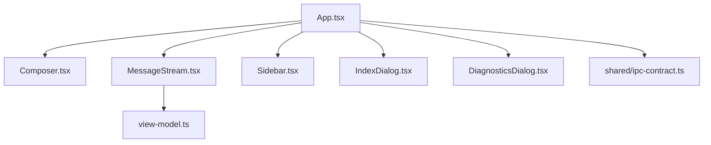
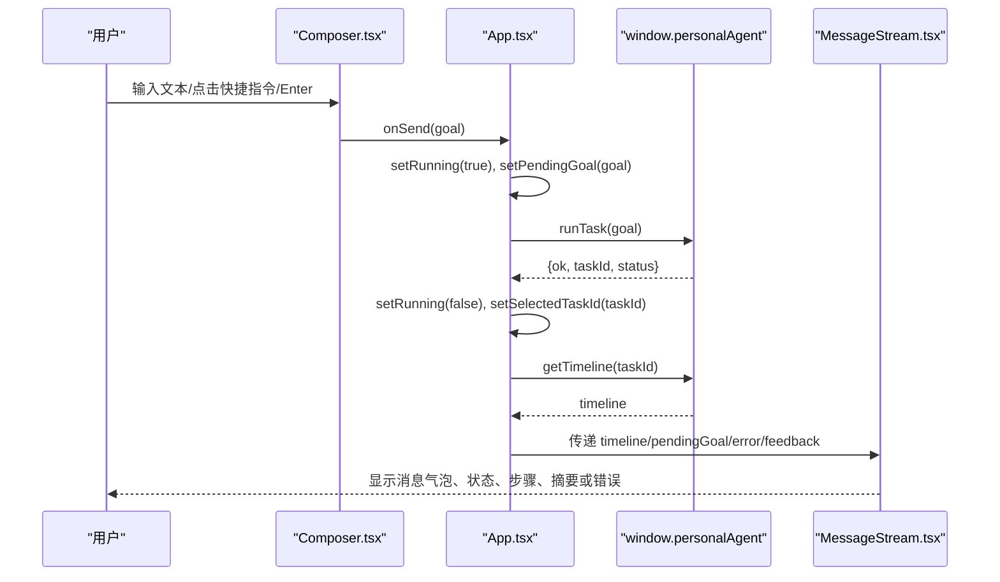
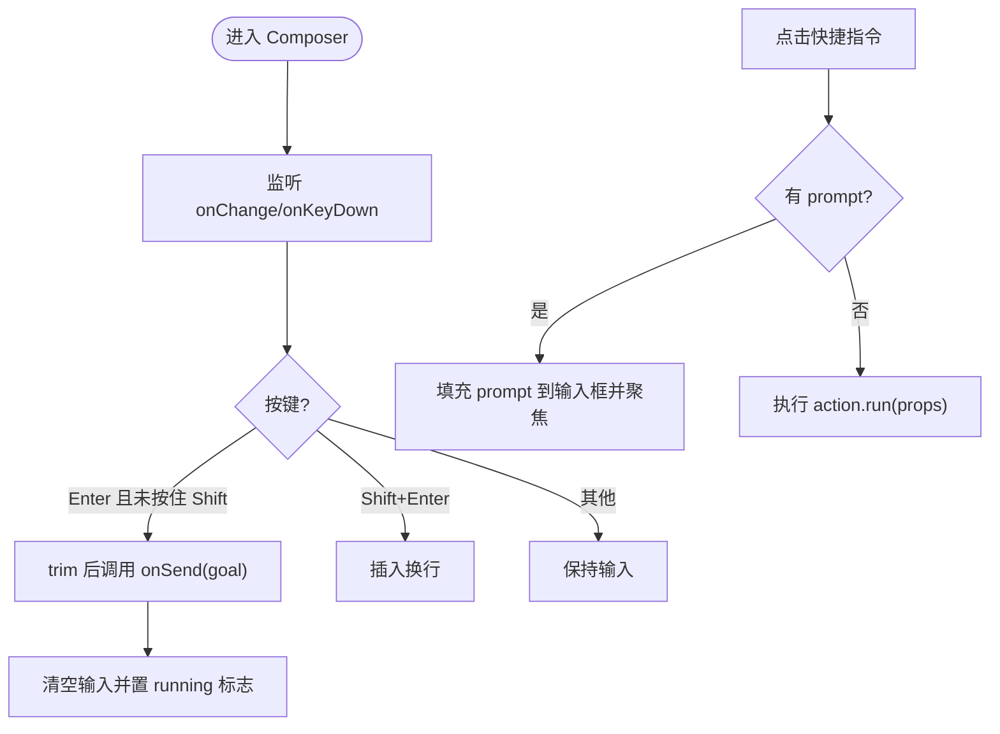
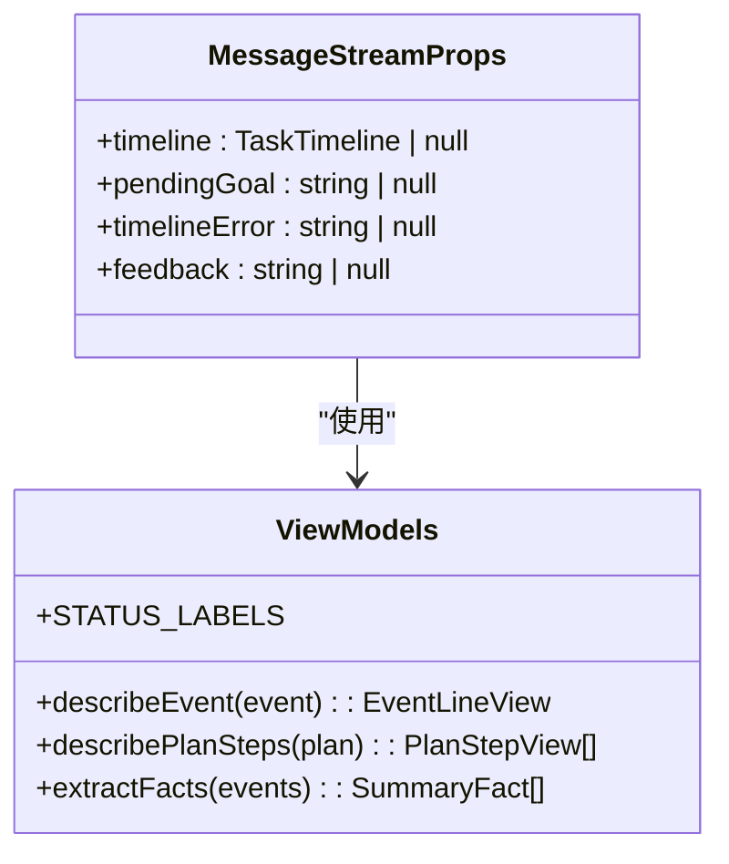
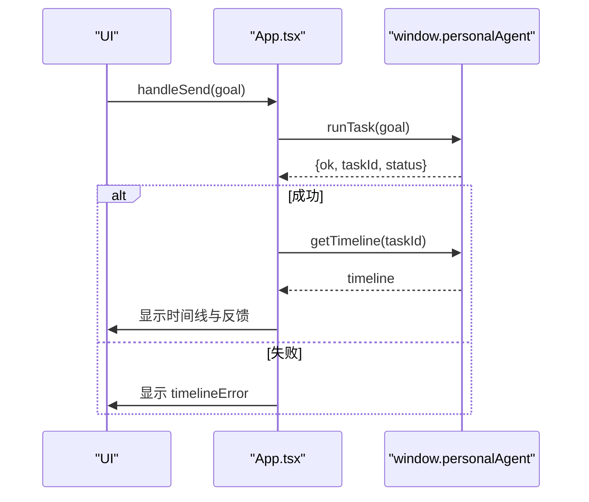
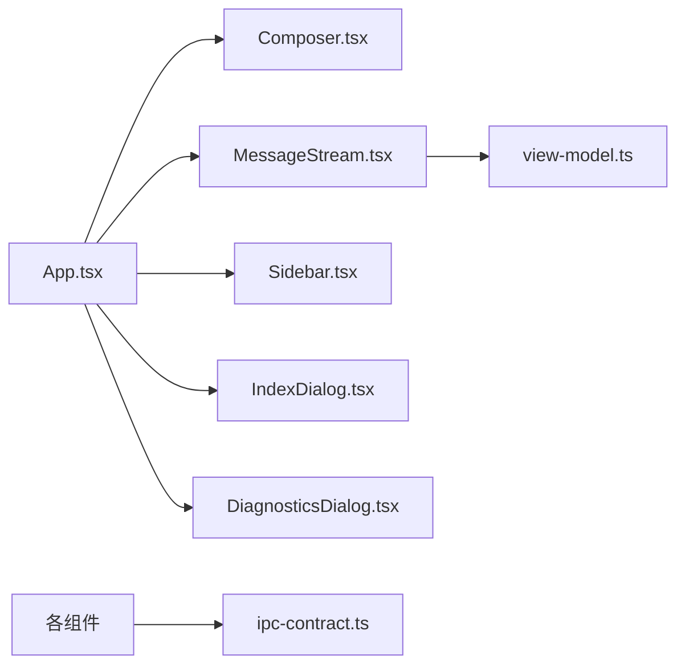

# 聊天界面

<cite>
**本文引用的文件**
- [Composer.tsx](file://apps/desktop/src/renderer/src/components/Composer.tsx)
- [MessageStream.tsx](file://apps/desktop/src/renderer/src/components/MessageStream.tsx)
- [App.tsx](file://apps/desktop/src/renderer/src/App.tsx)
- [view-model.ts](file://apps/desktop/src/renderer/src/view-model.ts)
- [ipc-contract.ts](file://apps/desktop/src/shared/ipc-contract.ts)
- [Sidebar.tsx](file://apps/desktop/src/renderer/src/components/Sidebar.tsx)
- [IndexDialog.tsx](file://apps/desktop/src/renderer/src/components/IndexDialog.tsx)
- [DiagnosticsDialog.tsx](file://apps/desktop/src/renderer/src/components/DiagnosticsDialog.tsx)
</cite>

## 目录
1. [简介](#简介)
2. [项目结构](#项目结构)
3. [核心组件](#核心组件)
4. [架构总览](#架构总览)
5. [详细组件分析](#详细组件分析)
6. [依赖关系分析](#依赖关系分析)
7. [性能考量](#性能考量)
8. [故障排查指南](#故障排查指南)
9. [结论](#结论)
10. [附录：使用示例与扩展](#附录使用示例与扩展)

## 简介
本文件面向聊天界面的前端实现，重点说明以下能力：
- Composer 组件的消息输入处理、快速操作按钮与键盘快捷键支持
- MessageStream 组件的消息流渲染机制，包括实时状态更新、错误展示与状态管理
- 用户交互流程：发送消息、输入校验、响应式布局
- 快速操作功能：全文摘要、文档对比等预设指令的注入方式
- 组件使用示例与自定义扩展方法
- 性能优化建议与用户体验改进方案

## 项目结构
聊天界面位于 Electron 应用的渲染进程（renderer）中，采用 React 组件化组织。关键目录与职责：
- components：UI 组件（Composer、MessageStream、Sidebar、各类对话框）
- view-model：视图层数据转换与文案生成（事件描述、时间格式化、导出 Markdown 等）
- shared/ipc-contract：IPC 类型契约（任务、时间线、权限、运行时状态等）
- App.tsx：应用根组件，负责状态编排与 IPC 调用

图表来源
- [App.tsx:1-294](file://apps/desktop/src/renderer/src/App.tsx#L1-L294)
- [Composer.tsx:1-142](file://apps/desktop/src/renderer/src/components/Composer.tsx#L1-L142)
- [MessageStream.tsx:1-175](file://apps/desktop/src/renderer/src/components/MessageStream.tsx#L1-L175)
- [view-model.ts:1-367](file://apps/desktop/src/renderer/src/view-model.ts#L1-L367)
- [ipc-contract.ts:1-75](file://apps/desktop/src/shared/ipc-contract.ts#L1-L75)

章节来源
- [App.tsx:1-294](file://apps/desktop/src/renderer/src/App.tsx#L1-L294)
- [ipc-contract.ts:1-75](file://apps/desktop/src/shared/ipc-contract.ts#L1-L75)

## 核心组件
- Composer：消息输入区、快捷指令芯片、发送按钮、附件与索引入口
- MessageStream：会话消息气泡、运行状态、步骤折叠面板、失败原因与完成摘要
- Sidebar：历史会话列表、运行时状态指示、索引管理与诊断入口
- 对话框：IndexDialog（索引管理）、DiagnosticsDialog（运行时诊断与权限记录）

章节来源
- [Composer.tsx:14-142](file://apps/desktop/src/renderer/src/components/Composer.tsx#L14-L142)
- [MessageStream.tsx:12-175](file://apps/desktop/src/renderer/src/components/MessageStream.tsx#L12-L175)
- [Sidebar.tsx:5-155](file://apps/desktop/src/renderer/src/components/Sidebar.tsx#L5-L155)
- [IndexDialog.tsx:7-78](file://apps/desktop/src/renderer/src/components/IndexDialog.tsx#L7-L78)
- [DiagnosticsDialog.tsx:14-204](file://apps/desktop/src/renderer/src/components/DiagnosticsDialog.tsx#L14-L204)

## 架构总览
渲染进程通过 window.personalAgent 暴露的 IPC 接口与主进程通信，执行任务、读取时间线、扫描 PDF、查询运行时状态与权限记录。视图层由 App 统一编排状态，子组件仅负责展示与触发回调。

图表来源
- [Composer.tsx:53-142](file://apps/desktop/src/renderer/src/components/Composer.tsx#L53-L142)
- [App.tsx:164-196](file://apps/desktop/src/renderer/src/App.tsx#L164-L196)
- [MessageStream.tsx:39-175](file://apps/desktop/src/renderer/src/components/MessageStream.tsx#L39-L175)

## 详细组件分析

### Composer 组件：输入、快捷指令与快捷键
- 输入处理
  - 本地维护 value 状态，onChange 同步更新
  - Enter 发送，Shift+Enter 换行；空内容或运行中时禁用发送
- 快捷指令
  - QUICK_ACTIONS 定义一组预设指令，部分带 prompt（填入输入框），部分直接触发动作（如打开索引、诊断、导出）
  - 点击后聚焦输入框，便于用户二次编辑
- 键盘快捷键
  - 在 textarea 上监听 onKeyDown，区分 Enter 与 Shift+Enter 行为
- 可访问性
  - 为输入与按钮提供 aria-label/title，提升无障碍体验

图表来源
- [Composer.tsx:53-142](file://apps/desktop/src/renderer/src/components/Composer.tsx#L53-L142)

章节来源
- [Composer.tsx:24-51](file://apps/desktop/src/renderer/src/components/Composer.tsx#L24-L51)
- [Composer.tsx:53-142](file://apps/desktop/src/renderer/src/components/Composer.tsx#L53-L142)

### MessageStream 组件：消息流渲染、状态与错误
- 状态来源
  - pendingGoal：发送后、任务落库前的过渡态，用于立即显示用户目标与“正在整理”提示
  - timeline：任务时间线（包含 task 状态、events、plan）
  - timelineError：加载时间线失败时的错误信息
  - feedback：全局反馈提示（例如复制成功、扫描结果）
- 滚动与展开
  - 使用 ref 自动滚动到底部
  - 步骤区域可折叠，显示计划步骤或事件序列，并计算持续时间
- 状态渲染
  - pending/running：显示加载中动画与文案
  - waiting_permission：提示等待用户批准
  - failed：从最后一条失败事件中抽取原因
  - completed：提取摘要事实并展示页码引用
- 错误处理
  - 顶层显示 timelineError
  - 失败时给出可读原因

图表来源
- [MessageStream.tsx:12-175](file://apps/desktop/src/renderer/src/components/MessageStream.tsx#L12-L175)
- [view-model.ts:54-82](file://apps/desktop/src/renderer/src/view-model.ts#L54-L82)
- [view-model.ts:142-150](file://apps/desktop/src/renderer/src/view-model.ts#L142-L150)
- [view-model.ts:272-280](file://apps/desktop/src/renderer/src/view-model.ts#L272-L280)
- [view-model.ts:301-315](file://apps/desktop/src/renderer/src/view-model.ts#L301-L315)

章节来源
- [MessageStream.tsx:39-175](file://apps/desktop/src/renderer/src/components/MessageStream.tsx#L39-L175)
- [view-model.ts:142-150](file://apps/desktop/src/renderer/src/view-model.ts#L142-L150)
- [view-model.ts:272-280](file://apps/desktop/src/renderer/src/view-model.ts#L272-L280)
- [view-model.ts:301-315](file://apps/desktop/src/renderer/src/view-model.ts#L301-L315)

### App 组件：交互编排与 IPC
- 发送消息
  - 设置 running 与 pendingGoal，调用 runTask，成功后选择对应任务并拉取时间线
  - 失败时设置 timelineError 并提示
- 权限审批通道
  - 订阅 onPermissionNotice，弹出 PermissionDialog 并处理 approved/denied/expired
  - respondPermission 返回 repeated=true 表示重复决策，不视为失败
- 辅助功能
  - 扫描 Downloads：listPdfs('downloads') 并反馈结果
  - 导出 Markdown：将当前时间线转为 Markdown 复制到剪贴板
  - 侧栏：列出历史任务并按天分组，显示运行时状态与索引数量

图表来源
- [App.tsx:164-196](file://apps/desktop/src/renderer/src/App.tsx#L164-L196)
- [App.tsx:198-224](file://apps/desktop/src/renderer/src/App.tsx#L198-L224)
- [ipc-contract.ts:52-63](file://apps/desktop/src/shared/ipc-contract.ts#L52-L63)

章节来源
- [App.tsx:21-294](file://apps/desktop/src/renderer/src/App.tsx#L21-L294)
- [ipc-contract.ts:24-75](file://apps/desktop/src/shared/ipc-contract.ts#L24-L75)

### Sidebar、IndexDialog、DiagnosticsDialog
- Sidebar：按天分组历史会话，显示运行时状态与索引数量，提供新对话、索引管理、诊断入口
- IndexDialog：打开时拉取 indexedPdfs，展示文件名与扫描时间
- DiagnosticsDialog：展示运行时状态、扫描结果与权限记录（只读观察）

章节来源
- [Sidebar.tsx:35-155](file://apps/desktop/src/renderer/src/components/Sidebar.tsx#L35-L155)
- [IndexDialog.tsx:12-78](file://apps/desktop/src/renderer/src/components/IndexDialog.tsx#L12-L78)
- [DiagnosticsDialog.tsx:21-204](file://apps/desktop/src/renderer/src/components/DiagnosticsDialog.tsx#L21-L204)

## 依赖关系分析
- 组件耦合
  - App 作为编排中心，持有所有状态并通过 props 下发给子组件
  - MessageStream 依赖 view-model 进行事件与计划的可视化转换
  - Composer 与 App 通过回调解耦，避免直接耦合 IPC
- 外部依赖
  - ipc-contract 定义了所有 IPC 返回类型，保证类型安全
  - 图标库 lucide-react 提供统一图标
- 潜在循环依赖
  - 当前无循环导入，组件间通过 props 与回调单向通信

图表来源
- [App.tsx:1-294](file://apps/desktop/src/renderer/src/App.tsx#L1-L294)
- [MessageStream.tsx:1-175](file://apps/desktop/src/renderer/src/components/MessageStream.tsx#L1-L175)
- [view-model.ts:1-367](file://apps/desktop/src/renderer/src/view-model.ts#L1-L367)
- [ipc-contract.ts:1-75](file://apps/desktop/src/shared/ipc-contract.ts#L1-L75)

章节来源
- [App.tsx:1-294](file://apps/desktop/src/renderer/src/App.tsx#L1-L294)
- [ipc-contract.ts:1-75](file://apps/desktop/src/shared/ipc-contract.ts#L1-L75)

## 性能考量
- 减少重渲染
  - 将频繁更新的 feedback 使用定时器清理，避免长时间占用状态
  - 对大列表（如时间线步骤）考虑虚拟滚动（当前条目数较少，暂非瓶颈）
- 网络与 IPC
  - 仅在必要时调用 IPC（如打开对话框才拉取索引/权限），避免重复请求
  - 对 runTask/getTimeline 的错误进行捕获与降级，避免白屏
- 渲染优化
  - 使用 key 稳定标识列表项（如 event.seq、task.id）
  - 折叠面板仅在需要时展开，减少初始渲染成本
- 内存与资源
  - 及时清理事件监听与定时器（已在多处使用 useEffect 返回清理函数）

[本节为通用性能建议，不直接分析具体代码]

## 故障排查指南
- 无法发送消息
  - 检查 running 状态是否被阻塞（上一次任务未完成）
  - 确认输入是否为空字符串
- 时间线加载失败
  - 查看 timelineError 提示信息，定位 IPC 错误码与消息
- 权限审批无响应
  - 检查 onPermissionNotice 是否正确订阅
  - 确认 respondPermission 返回值中的 repeated 字段含义
- 导出失败
  - 浏览器环境可能限制剪贴板访问，需用户授权或 HTTPS 环境

章节来源
- [App.tsx:52-67](file://apps/desktop/src/renderer/src/App.tsx#L52-L67)
- [App.tsx:127-150](file://apps/desktop/src/renderer/src/App.tsx#L127-L150)
- [App.tsx:213-224](file://apps/desktop/src/renderer/src/App.tsx#L213-L224)

## 结论
该聊天界面以 App 为中心编排状态，Composer 与 MessageStream 分别承担输入与展示职责，配合 view-model 完成复杂数据的可读化呈现。通过 IPC 契约确保前后端类型一致，结合权限审批与诊断工具，形成完整的本地文档工作流。后续可在输入校验、错误提示与性能优化方面持续迭代。

[本节为总结性内容，不直接分析具体代码]

## 附录：使用示例与扩展

### 组件使用示例
- 在 App 中集成 Composer
  - 传入 running、inputRef、onSend 及快捷动作回调
  - 参考路径：[App.tsx:254-262](file://apps/desktop/src/renderer/src/App.tsx#L254-L262)
- 在 App 中集成 MessageStream
  - 传入 timeline、pendingGoal、timelineError、feedback
  - 参考路径：[App.tsx:247-252](file://apps/desktop/src/renderer/src/App.tsx#L247-L252)

章节来源
- [App.tsx:264-279](file://apps/desktop/src/renderer/src/App.tsx#L264-L279)

### 自定义扩展方法
- 新增快捷指令
  - 在 Composer 的 QUICK_ACTIONS 中添加新的 QuickAction，可选择提供 prompt 或直接 run 回调
  - 参考路径：[Composer.tsx:24-51](file://apps/desktop/src/renderer/src/components/Composer.tsx#L24-L51)
- 扩展事件描述
  - 在 view-model 的 summarizePayload 中为新的事件类型添加 case，输出可读摘要
  - 参考路径：[view-model.ts:190-259](file://apps/desktop/src/renderer/src/view-model.ts#L190-L259)
- 扩展导出格式
  - 在 timelineToMarkdown 中追加需要的字段或章节
  - 参考路径：[view-model.ts:341-366](file://apps/desktop/src/renderer/src/view-model.ts#L341-L366)

章节来源
- [Composer.tsx:24-51](file://apps/desktop/src/renderer/src/components/Composer.tsx#L24-L51)
- [view-model.ts:190-259](file://apps/desktop/src/renderer/src/view-model.ts#L190-L259)
- [view-model.ts:341-366](file://apps/desktop/src/renderer/src/view-model.ts#L341-L366)

### 用户交互流程（发送消息、输入验证、响应式布局）
- 发送消息
  - 用户在 Composer 中输入并回车，触发 onSend，App 设置 pendingGoal 并调用 runTask
  - 参考路径：[Composer.tsx:57-62](file://apps/desktop/src/renderer/src/components/Composer.tsx#L57-L62)、[App.tsx:147-179](file://apps/desktop/src/renderer/src/App.tsx#L147-L179)
- 输入验证
  - 空内容与运行中状态阻止发送，避免无效请求
  - 参考路径：[Composer.tsx:57-62](file://apps/desktop/src/renderer/src/components/Composer.tsx#L57-L62)
- 响应式布局
  - 使用 flex 与 min-w-0 确保在不同屏幕宽度下正常显示
  - 参考路径：[App.tsx:228-280](file://apps/desktop/src/renderer/src/App.tsx#L228-L280)

章节来源
- [Composer.tsx:57-62](file://apps/desktop/src/renderer/src/components/Composer.tsx#L57-L62)
- [App.tsx:211-263](file://apps/desktop/src/renderer/src/App.tsx#L211-L263)

### 快速操作功能（预设指令）
- 全文摘要、两文档对比、关键条款提取：点击后将预设 prompt 填入输入框并聚焦，便于用户修改后发送
- 索引管理、运行诊断、导出 Markdown：直接触发对应动作
- 参考路径：[Composer.tsx:32-51](file://apps/desktop/src/renderer/src/components/Composer.tsx#L32-L51)、[Composer.tsx:116-133](file://apps/desktop/src/renderer/src/components/Composer.tsx#L116-L133)

章节来源
- [Composer.tsx:32-51](file://apps/desktop/src/renderer/src/components/Composer.tsx#L32-L51)
- [Composer.tsx:116-133](file://apps/desktop/src/renderer/src/components/Composer.tsx#L116-L133)