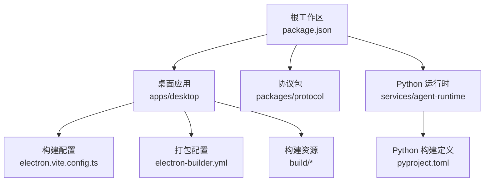
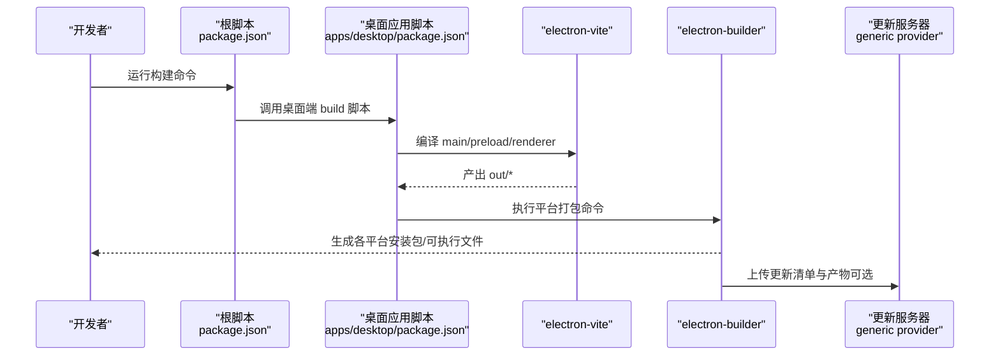
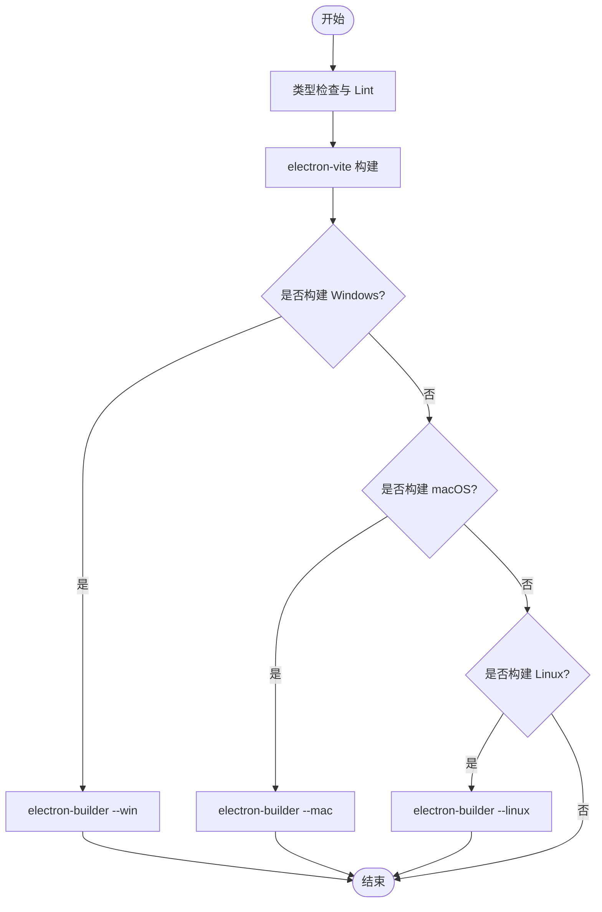
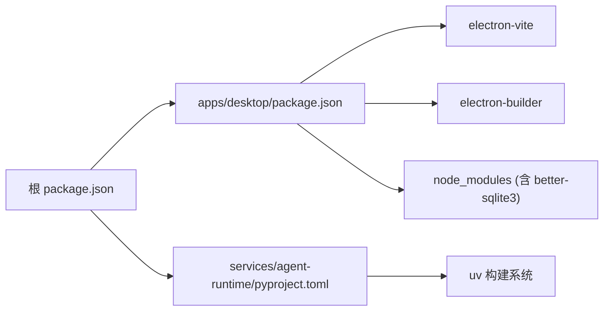
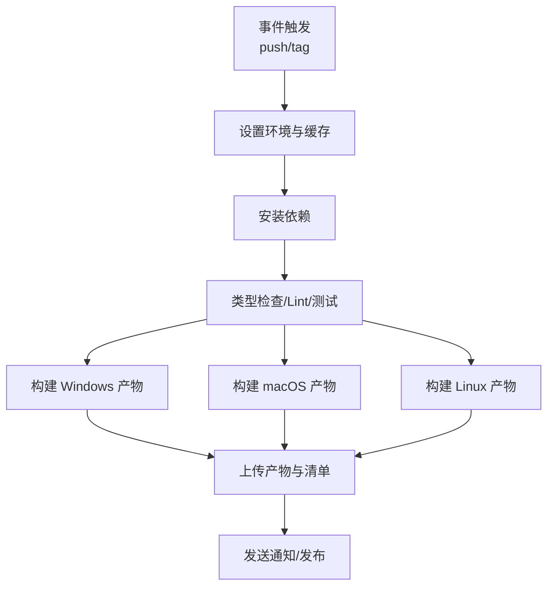

# 部署发布

<cite>
**本文引用的文件**
- [apps/desktop/package.json](file://apps/desktop/package.json)
- [apps/desktop/electron-builder.yml](file://apps/desktop/electron-builder.yml)
- [apps/desktop/electron.vite.config.ts](file://apps/desktop/electron.vite.config.ts)
- [package.json](file://package.json)
- [pnpm-workspace.yaml](file://pnpm-workspace.yaml)
- [apps/desktop/build/entitlements.mac.plist](file://apps/desktop/build/entitlements.mac.plist)
- [services/agent-runtime/pyproject.toml](file://services/agent-runtime/pyproject.toml)
</cite>

## 目录
1. [简介](#简介)
2. [项目结构](#项目结构)
3. [核心组件](#核心组件)
4. [架构总览](#架构总览)
5. [详细组件分析](#详细组件分析)
6. [依赖分析](#依赖分析)
7. [性能考虑](#性能考虑)
8. [故障排查指南](#故障排查指南)
9. [结论](#结论)
10. [附录](#附录)

## 简介
本文件面向生产环境的构建与发布，覆盖以下目标：
- 代码编译、资源打包、签名验证的完整流程
- 跨平台（Windows、macOS、Linux）打包配置说明
- 应用分发策略（自动更新机制与版本管理）
- 安装程序生成与分发流程
- CI/CD 流水线配置示例
- 部署后的监控与维护建议

本项目采用 Electron + Vite 的前端主进程方案，使用 electron-vite 进行多入口构建，electron-builder 负责产物打包与分发。Python 侧的 agent 运行时通过独立包管理工具 uv 管理依赖。

## 项目结构
仓库为 monorepo，桌面端位于 apps/desktop，协议与共享类型在 packages/protocol，Python 运行时在 services/agent-runtime。根级 package.json 提供统一脚本入口，pnpm workspace 管理多包依赖与构建权限。

图表来源
- [package.json:1-34](file://package.json#L1-L34)
- [apps/desktop/package.json:1-62](file://apps/desktop/package.json#L1-L62)
- [apps/desktop/electron.vite.config.ts:1-24](file://apps/desktop/electron.vite.config.ts#L1-L24)
- [apps/desktop/electron-builder.yml:1-45](file://apps/desktop/electron-builder.yml#L1-L45)
- [services/agent-runtime/pyproject.toml:1-22](file://services/agent-runtime/pyproject.toml#L1-L22)

章节来源
- [package.json:1-34](file://package.json#L1-L34)
- [apps/desktop/package.json:1-62](file://apps/desktop/package.json#L1-L62)
- [apps/desktop/electron.vite.config.ts:1-24](file://apps/desktop/electron.vite.config.ts#L1-L24)
- [apps/desktop/electron-builder.yml:1-45](file://apps/desktop/electron-builder.yml#L1-L45)
- [services/agent-runtime/pyproject.toml:1-22](file://services/agent-runtime/pyproject.toml#L1-L22)

## 核心组件
- 构建与打包
  - 前端构建：electron-vite 负责 main、preload、renderer 三入口构建，支持别名与插件。
  - 产物打包：electron-builder 根据平台生成安装包与可执行文件，并支持 NSIS、DMG、AppImage/snap/deb 等格式。
- 跨平台配置
  - Windows：NSIS 安装器、可执行名、桌面快捷方式。
  - macOS：扩展信息、权限声明、可选公证与签名。
  - Linux：多目标输出（AppImage、snap、deb）。
- Python 运行时
  - 使用 uv 管理依赖与构建，暴露命令行入口供主进程调用。

章节来源
- [apps/desktop/electron.vite.config.ts:1-24](file://apps/desktop/electron.vite.config.ts#L1-L24)
- [apps/desktop/electron-builder.yml:1-45](file://apps/desktop/electron-builder.yml#L1-L45)
- [services/agent-runtime/pyproject.toml:1-22](file://services/agent-runtime/pyproject.toml#L1-L22)

## 架构总览
下图展示从源码到可分发包的端到端流程，包括 TypeScript/JS 构建、资源打包、平台特定产物生成以及自动更新元数据发布。

图表来源
- [package.json:1-34](file://package.json#L1-L34)
- [apps/desktop/package.json:1-62](file://apps/desktop/package.json#L1-L62)
- [apps/desktop/electron-builder.yml:42-45](file://apps/desktop/electron-builder.yml#L42-L45)

## 详细组件分析

### 构建与打包流程
- 构建阶段
  - 类型检查与 lint：根脚本提供 typecheck/lint/test 聚合命令，确保质量门禁。
  - 前端构建：electron-vite 依据 electron.vite.config.ts 完成别名解析与插件加载，输出至 out 目录。
- 打包阶段
  - electron-builder 读取 electron-builder.yml，按平台生成产物；asar 打包时排除敏感或原生模块。
  - 资源与原生模块：better-sqlite3 等原生模块通过 asarUnpack 保持可执行性。
- 自动化脚本
  - 根脚本统一入口，便于 CI 复用；桌面端脚本提供 win/mac/linux 一键打包。

图表来源
- [apps/desktop/package.json:8-21](file://apps/desktop/package.json#L8-L21)
- [apps/desktop/electron-builder.yml:1-45](file://apps/desktop/electron-builder.yml#L1-L45)

章节来源
- [apps/desktop/package.json:8-21](file://apps/desktop/package.json#L8-L21)
- [apps/desktop/electron-builder.yml:1-45](file://apps/desktop/electron-builder.yml#L1-L45)
- [apps/desktop/electron.vite.config.ts:1-24](file://apps/desktop/electron.vite.config.ts#L1-L24)

### 跨平台打包配置
- Windows
  - 可执行文件名、NSIS 安装器产物命名、桌面快捷方式创建。
- macOS
  - 扩展信息（相机、麦克风、文档/下载目录访问），继承 entitlements 以启用 JIT 等能力；默认关闭公证以便本地调试，生产环境可按需开启。
- Linux
  - 同时生成 AppImage、snap、deb 三种格式，便于不同发行版分发。

章节来源
- [apps/desktop/electron-builder.yml:1-41](file://apps/desktop/electron-builder.yml#L1-L41)
- [apps/desktop/build/entitlements.mac.plist:1-13](file://apps/desktop/build/entitlements.mac.plist#L1-L13)

### 自动更新与版本管理
- 更新提供者
  - 使用 generic 提供者指向一个静态 URL，用于存放更新清单与产物。
- 版本来源
  - 版本号来自桌面端 package.json 的 version 字段，electron-builder 会将其写入产物与清单。
- 客户端行为
  - 可在应用中集成更新检查逻辑，拉取 generic 服务器上的最新清单并提示用户升级。

章节来源
- [apps/desktop/electron-builder.yml:42-45](file://apps/desktop/electron-builder.yml#L42-L45)
- [apps/desktop/package.json:1-10](file://apps/desktop/package.json#L1-L10)

### 安装程序生成与分发
- Windows
  - 使用 NSIS 生成 setup.exe，包含桌面快捷方式与卸载显示名。
- macOS
  - 生成 dmg 安装包，可通过 Apple 公证提升信任度（当前配置未启用）。
- Linux
  - 生成 AppImage（便携）、snap（商店分发）、deb（APT 源）。

章节来源
- [apps/desktop/electron-builder.yml:1-41](file://apps/desktop/electron-builder.yml#L1-L41)

### Python 运行时集成
- 依赖与构建
  - 使用 uv 管理依赖与构建后端，暴露命令行入口 personal_agent。
- 集成方式
  - 主进程通过子进程或 IPC 调用 Python 运行时，实现工具执行与模型交互。

章节来源
- [services/agent-runtime/pyproject.toml:1-22](file://services/agent-runtime/pyproject.toml#L1-L22)

## 依赖分析
- 工作区与构建权限
  - pnpm workspace 将 apps、packages、services 纳入同一工作区，允许 electron/esbuild 等构建工具运行，禁用 better-sqlite3 的本地重建以避免不必要的编译。
- 关键依赖
  - electron、electron-builder、electron-vite 构成桌面端构建与打包核心。
  - better-sqlite3 作为原生模块，通过 asarUnpack 保证可执行。
  - Python 侧使用 uv 与 pydantic/openai 等库。

图表来源
- [package.json:1-34](file://package.json#L1-L34)
- [apps/desktop/package.json:23-59](file://apps/desktop/package.json#L23-L59)
- [pnpm-workspace.yaml:1-13](file://pnpm-workspace.yaml#L1-L13)
- [services/agent-runtime/pyproject.toml:1-22](file://services/agent-runtime/pyproject.toml#L1-L22)

章节来源
- [pnpm-workspace.yaml:1-13](file://pnpm-workspace.yaml#L1-L13)
- [apps/desktop/package.json:23-59](file://apps/desktop/package.json#L23-L59)
- [services/agent-runtime/pyproject.toml:1-22](file://services/agent-runtime/pyproject.toml#L1-L22)

## 性能考虑
- 构建优化
  - 使用 electron-vite 增量构建与并行插件，减少冷启动时间。
  - 仅打包必要文件，排除开发配置与源码，减小产物体积。
- 原生模块
  - better-sqlite3 通过 asarUnpack 避免解压开销，但需注意安全边界。
- 运行时超时与限流
  - 主进程对工具调用设置超时与最大调用次数，防止长时间阻塞。

章节来源
- [apps/desktop/electron-builder.yml:5-14](file://apps/desktop/electron-builder.yml#L5-L14)
- [apps/desktop/src/main/runtime/timeouts.ts:1-16](file://apps/desktop/src/main/runtime/timeouts.ts#L1-L16)

## 故障排查指南
- 构建失败
  - 检查 node 与 pnpm 版本是否符合要求；确认 workspace 允许构建的依赖未被禁用。
  - 若原生模块编译失败，检查平台工具链与编译器是否就绪。
- 打包失败
  - macOS 签名/公证问题：确认 entitlements 与证书配置；如需公证，开启相应选项并配置凭据。
  - Windows 安装器失败：检查 NSIS 路径与权限。
- 运行时异常
  - Python 侧错误：查看日志与退出码；必要时增加重试与降级策略。
  - 数据库访问失败：检查 SQLite 文件权限与路径。

章节来源
- [pnpm-workspace.yaml:8-13](file://pnpm-workspace.yaml#L8-L13)
- [apps/desktop/electron-builder.yml:22-31](file://apps/desktop/electron-builder.yml#L22-L31)
- [apps/desktop/electron-builder.yml:15-21](file://apps/desktop/electron-builder.yml#L15-L21)

## 结论
本项目提供了清晰的构建与打包链路：通过 electron-vite 构建前端与主进程，再由 electron-builder 生成跨平台安装包，并支持 generic 更新服务器进行自动更新。配合 pnpm workspace 与 Python uv，实现了 TS/Py 双栈的统一管理与发布。建议在 CI 中固化构建与测试步骤，并在生产环境启用签名与公证以提升可信度。

## 附录

### 生产环境构建流程（推荐步骤）
- 前置准备
  - 安装 pnpm、Node.js、Python 与 uv。
  - 安装平台构建工具（如 macOS 的 Xcode 命令行工具、Windows 的 Visual Studio Build Tools、Linux 的对应打包工具）。
- 执行构建
  - 根脚本执行类型检查与测试，确保质量门禁通过。
  - 进入桌面端执行对应平台的构建命令，生成安装包。
- 产物校验
  - 校验产物签名（macOS）、安装器完整性（Windows）、包管理器兼容性（Linux）。
- 发布与更新
  - 将产物与更新清单上传至 generic 服务器，配置客户端更新地址。

章节来源
- [package.json:6-20](file://package.json#L6-L20)
- [apps/desktop/package.json:8-21](file://apps/desktop/package.json#L8-L21)
- [apps/desktop/electron-builder.yml:42-45](file://apps/desktop/electron-builder.yml#L42-L45)

### CI/CD 流水线配置示例（GitHub Actions）
- 触发条件
  - push 到 main 分支或创建 tag 时触发。
- 作业步骤
  - 设置 Node.js 与 pnpm 环境。
  - 缓存依赖，安装工作区依赖。
  - 运行类型检查、Lint、测试。
  - 构建桌面端产物（win/mac/linux）。
  - 上传产物与更新清单至对象存储或静态站点。
  - 可选：触发通知或发布到应用商店。

[本节为概念性流程图，不直接映射具体源码文件]

### 部署后监控与维护建议
- 监控指标
  - 崩溃率、启动耗时、工具调用成功率与平均耗时、数据库读写延迟。
- 日志与遥测
  - 集中收集主进程与 Python 运行时日志，标记版本与平台信息。
- 回滚策略
  - 保留上一版本产物与清单，出现问题快速切换。
- 安全加固
  - 启用 macOS 公证与代码签名；限制原生模块访问范围；定期更新依赖。

[本节为通用指导，不直接引用具体源码文件]