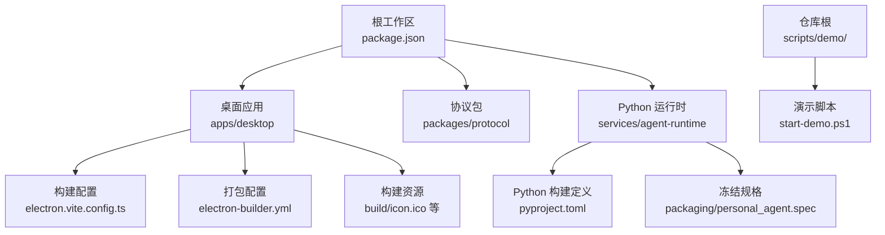
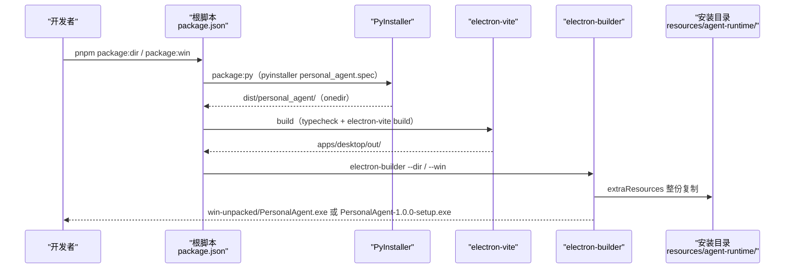
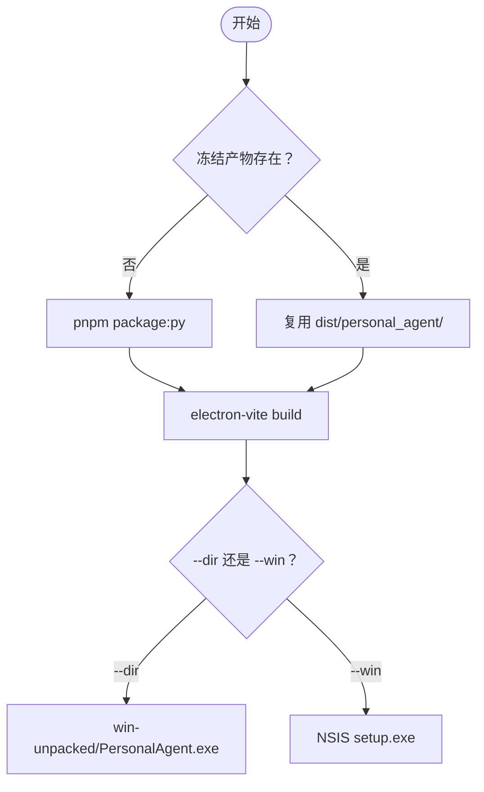
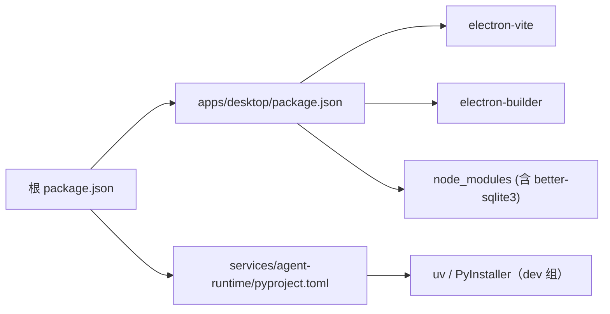
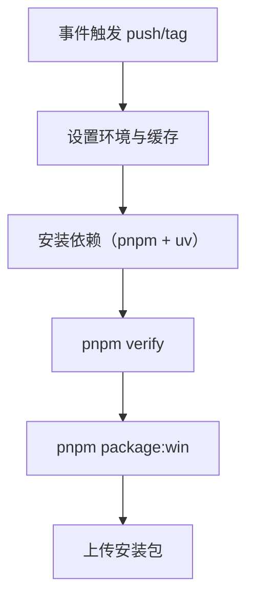

# 部署发布

<cite>
**本文引用的文件**
- [package.json](file://package.json)
- [apps/desktop/package.json](file://apps/desktop/package.json)
- [apps/desktop/electron-builder.yml](file://apps/desktop/electron-builder.yml)
- [apps/desktop/electron.vite.config.ts](file://apps/desktop/electron.vite.config.ts)
- [apps/desktop/src/main/runtime/runtime-host.ts](file://apps/desktop/src/main/runtime/runtime-host.ts)
- [services/agent-runtime/pyproject.toml](file://services/agent-runtime/pyproject.toml)
- [services/agent-runtime/packaging/personal_agent.spec](file://services/agent-runtime/packaging/personal_agent.spec)
- [services/agent-runtime/packaging/entrypoint.py](file://services/agent-runtime/packaging/entrypoint.py)
- [scripts/demo/start-demo.ps1](file://scripts/demo/start-demo.ps1)
- [README.md](file://README.md)
- [docs/DEMO.md](file://docs/DEMO.md)
- [pnpm-workspace.yaml](file://pnpm-workspace.yaml)
</cite>

## 目录
1. [简介](#简介)
2. [项目结构](#项目结构)
3. [核心组件](#核心组件)
4. [架构总览](#架构总览)
5. [详细组件分析](#详细组件分析)
6. [依赖分析](#依赖分析)
7. [性能考虑](#性能考虑)
8. [故障排查指南](#故障排查指南)
9. [结论](#结论)
10. [附录](#附录)

## 简介
本文面向 Windows Demo 的构建与分发（TASK-029），覆盖：
- 从源码到免安装目录/NSIS 安装包的两步打包链路；
- Python Agent Runtime 的冻结与随包分发；
- 打包态与开发态的运行时布局解析；
- 演示脚本与演示清单；
- 排障与数据位置。

V0.1 只出 Windows 产物（CON-003），没有自动更新与代码签名：升级靠重装新版本，安装包在干净机器上会触发 SmartScreen 提示（预期行为）。macOS/Linux 相关配置（mac / dmg / linux / appImage 段、`publish` 更新源）已随 TASK-029 从 `electron-builder.yml` 删除——配置里写着支持而从未验证过，比没有配置更误导。

## 项目结构
仓库为 monorepo：`apps/desktop`（Electron，唯一可信运行时）、`packages/protocol`（跨语言契约）、`services/agent-runtime`（Python Agent Loop）。打包相关位置：

图表来源
- [package.json:1-37](file://package.json#L1-L37)
- [apps/desktop/package.json:1-61](file://apps/desktop/package.json#L1-L61)
- [apps/desktop/electron.vite.config.ts:1-24](file://apps/desktop/electron.vite.config.ts#L1-L24)
- [apps/desktop/electron-builder.yml:1-34](file://apps/desktop/electron-builder.yml#L1-L34)
- [services/agent-runtime/pyproject.toml:1-30](file://services/agent-runtime/pyproject.toml#L1-L30)
- [services/agent-runtime/packaging/personal_agent.spec:1-75](file://services/agent-runtime/packaging/personal_agent.spec#L1-L75)

章节来源
- [package.json:1-37](file://package.json#L1-L37)
- [apps/desktop/package.json:1-61](file://apps/desktop/package.json#L1-L61)
- [apps/desktop/electron-builder.yml:1-34](file://apps/desktop/electron-builder.yml#L1-L34)
- [services/agent-runtime/pyproject.toml:1-30](file://services/agent-runtime/pyproject.toml#L1-L30)

## 核心组件
- **electron-vite 构建**：main、preload、renderer 三入口，输出到 `apps/desktop/out/`。
- **PyInstaller 冻结**：把 Python Agent Runtime 冻成 onedir 产物（`services/agent-runtime/dist/personal_agent/`，约 33 MB），让安装包不依赖目标机器上的 Python 与 uv。
- **electron-builder 打包**：按 `electron-builder.yml` 产出免安装目录或 NSIS 安装包，并经 `extraResources` 把冻结产物复制到 `<安装目录>/resources/agent-runtime/`。
- **运行时布局解析**：`resolveRuntimeLaunch` 在打包态/开发态/环境变量覆盖三种布局中按优先级择一，找不到则把 Runtime 标成 `crashed` 并给出可读原因。
- **演示链路**：`scripts/demo/start-demo.ps1` 准备素材（fixture PDF + 填好占位符的剧本）并启动 app；步骤与观察点见 [docs/DEMO.md](file://docs/DEMO.md)。

章节来源
- [apps/desktop/electron-builder.yml:1-34](file://apps/desktop/electron-builder.yml#L1-L34)
- [apps/desktop/src/main/runtime/runtime-host.ts:15-161](file://apps/desktop/src/main/runtime/runtime-host.ts#L15-L161)
- [scripts/demo/start-demo.ps1:1-112](file://scripts/demo/start-demo.ps1#L1-L112)

## 架构总览
从源码到可分发安装包的两步流程；`package:py` 必须先于 electron-builder 完成，否则 `extraResources` 复制不到东西（electron-builder 只打一行日志，不会失败）。

图表来源
- [package.json:18-23](file://package.json#L18-L23)
- [apps/desktop/package.json:9-22](file://apps/desktop/package.json#L9-L22)
- [apps/desktop/electron-builder.yml:20-23](file://apps/desktop/electron-builder.yml#L20-L23)

## 详细组件分析

### 构建与打包流程
- `pnpm build`：`typecheck && electron-vite build`，只构建不打包。
- `pnpm package:py`：`uv run --project services/agent-runtime --locked pyinstaller …`，按 spec 冻结 Python 运行时；产物落 `services/agent-runtime/dist/`（已忽略），工作目录 `dist/_pyi-work/` 同被忽略。
- `pnpm package:dir`：`package:py` + `electron-builder --dir` → `apps/desktop/dist/win-unpacked/PersonalAgent.exe`。
- `pnpm package:win`：`package:py` + `electron-builder --win` → `apps/desktop/dist/PersonalAgent-1.0.0-setup.exe`。

图表来源
- [package.json:18-23](file://package.json#L18-L23)
- [apps/desktop/package.json:9-22](file://apps/desktop/package.json#L9-L22)

章节来源
- [package.json:1-37](file://package.json#L1-L37)
- [apps/desktop/package.json:9-22](file://apps/desktop/package.json#L9-L22)

### Windows 打包配置（electron-builder.yml）
- `appId: com.personalagent.app`：与主进程 `setAppUserModelId` 一致——Windows 通知按 AUMID 匹配开始菜单快捷方式，不一致时开发态正常、安装版反而弹不出通知。
- `productName` 不写在 yml 里：由 `apps/desktop/package.json` 的 `productName: PersonalAgent` 提供，Electron 运行时的 `app.getName()`/userData 路径与 electron-builder 产物命名共用这一处。
- `files`：排除源码、构建配置、锁文件与开发配置，减小产物体积。
- `asarUnpack`：`resources/**` 与 `node_modules/better-sqlite3/**`（原生模块必须解包才能加载）。
- `extraResources`：把 `../../services/agent-runtime/dist/personal_agent` 整份复制到 `<安装目录>/resources/agent-runtime/`。**`from` 相对 apps/desktop 解析**（不是仓库根），写成 `../services/...` 会指向 `apps/services/...`。
- `win.executableName: PersonalAgent`；`nsis` 段定义安装器命名、快捷方式与卸载显示名。
- `npmRebuild: false`：原生模块重建交给 pnpm workspace 的 `allowBuilds` 策略。

章节来源
- [apps/desktop/electron-builder.yml:1-34](file://apps/desktop/electron-builder.yml#L1-L34)
- [apps/desktop/package.json:1-61](file://apps/desktop/package.json#L1-L61)

### Python 运行时冻结（PyInstaller onedir）
- 入口：`packaging/entrypoint.py` 等价于 `python -m personal_agent`。单独一层而不是直接拿 `__main__.py`：把包内文件当脚本喂给 PyInstaller 时，Analysis 以脚本目录为基准解析 import，成败取决于构建机的 sys.path 运气。
- 规格：`packaging/personal_agent.spec` 用 `collect_submodules('personal_agent')` 收全子模块树，并显式收集 `openai`——live SDK 是延迟 import（只有配了 `OPENAI_MODEL` 才走到），静态分析不一定跟进；漏收的后果是「scripted 模式一切正常、一配真模型就崩」。
- **onedir 而不是 onefile**：onefile 的 bootloader 每次启动都要解压整个包，还多一层父进程——Main 侧 kill 的是父进程，子进程可能残留，而 TEST-015 明确要盯「退出无孤儿进程」。
- 关闭 UPX：压缩后的 exe 更容易被杀软误报，首次启动也更慢；省下的体积对 demo 不值。

章节来源
- [services/agent-runtime/packaging/entrypoint.py:1-12](file://services/agent-runtime/packaging/entrypoint.py#L1-L12)
- [services/agent-runtime/packaging/personal_agent.spec:1-75](file://services/agent-runtime/packaging/personal_agent.spec#L1-L75)
- [services/agent-runtime/pyproject.toml:1-30](file://services/agent-runtime/pyproject.toml#L1-L30)

### 运行时布局解析与启动
`runtime-host.ts` 的 `resolveRuntimeLaunch` 是参数化纯函数，按优先级解析：

1. `PERSONAL_AGENT_RUNTIME` 覆盖：指向一个自带入口的可执行文件（冒烟与排障口子）；
2. 打包布局（`app.isPackaged`）：`<安装目录>/resources/agent-runtime/personal_agent.exe`，`args` 为空；
3. 开发布局：仓库 `.venv/Scripts/python.exe -m personal_agent`。

命令不存在时不在这里收场——`startRuntime` 用 `existsSync` 检查后把状态落成 `crashed`，detail 带布局名与解析出的路径（例如「找不到运行时（打包布局）: …」）。开发态不走 `uv run` 是为了避开「Electron GUI 进程 PATH 与终端不同」这个坑。

章节来源
- [apps/desktop/src/main/runtime/runtime-host.ts:15-161](file://apps/desktop/src/main/runtime/runtime-host.ts#L15-L161)

### 演示与交付物
- `scripts/demo/start-demo.ps1`：重置演示根（`%TEMP%\personal-agent-demo`）→ 放入 fixture PDF → 生成剧本（替换 `{{DOWNLOADS_ROOT}}` 与 `{{REMIND_AT}}`，无 BOM 写盘）→ 设 `PERSONAL_AGENT_DOWNLOADS_DIR` / `PERSONAL_AGENT_SCRIPT` → 启动打包版（或 `-Dev` 开发版）。
- 演示清单（剧本模式 / 真模型模式 / TEST-015 手工冒烟项 / 排障速查）见 [docs/DEMO.md](file://docs/DEMO.md)。
- 上手与命令总览见 [README.md](file://README.md)。

章节来源
- [scripts/demo/start-demo.ps1:1-112](file://scripts/demo/start-demo.ps1#L1-L112)
- [docs/DEMO.md:1-115](file://docs/DEMO.md#L1-L115)
- [README.md:1-125](file://README.md#L1-L125)

### 自动更新与版本管理
V0.1 不做自动更新：模板继承的 `publish`（generic 提供者指向 example.com）已删除，避免「配置了更新源」的假象。版本号来自 `apps/desktop/package.json` 的 `version`，electron-builder 写进产物命名；升级靠重装新版本，userData（`%APPDATA%\PersonalAgent\`）在重装时保留。

章节来源
- [apps/desktop/package.json:1-61](file://apps/desktop/package.json#L1-L61)
- [apps/desktop/electron-builder.yml:1-34](file://apps/desktop/electron-builder.yml#L1-L34)

### 安装程序生成与分发
- `package:win` 产出 NSIS 安装器：`artefactName`/快捷方式/卸载显示名都取 `${productName}`（PersonalAgent）。
- 免安装版（`package:dir`）可直接运行，用于冒烟与演示；但 Windows 通知在缺少开始菜单快捷方式时可能不显示（Reminder 本身会照常 `fired`，见 DEMO.md 的说明）。
- 未配置代码签名：干净机器首次运行会有 SmartScreen 提示。

章节来源
- [apps/desktop/electron-builder.yml:24-33](file://apps/desktop/electron-builder.yml#L24-L33)

## 依赖分析
- pnpm workspace 纳入 apps/packages/services 三处；`allowBuilds` 允许 electron/esbuild 构建、禁用 better-sqlite3 的本地重建（`npmRebuild: false` 与之一致）。
- 打包链路的工具：electron-vite（构建）、electron-builder（打包）、PyInstaller（Python 冻结，声明在 pyproject 的 dev 组，`uv.lock` 锁定）。
- `better-sqlite3` 是唯一原生模块，靠 `asarUnpack` 保持可执行。

图表来源
- [package.json:1-37](file://package.json#L1-L37)
- [apps/desktop/package.json:23-59](file://apps/desktop/package.json#L23-L59)
- [pnpm-workspace.yaml:1-13](file://pnpm-workspace.yaml#L1-L13)
- [services/agent-runtime/pyproject.toml:1-30](file://services/agent-runtime/pyproject.toml#L1-L30)

章节来源
- [pnpm-workspace.yaml:1-13](file://pnpm-workspace.yaml#L1-L13)
- [apps/desktop/package.json:23-59](file://apps/desktop/package.json#L23-L59)

## 性能考虑
- 冻结产物约 33 MB（onedir：exe + `_internal/`），NSIS 安装包在同量级；这是把 Python 依赖随包分发的必要成本。
- `files`/`extraResources` 的取舍是「只带运行必需」：源码、tsconfig、锁文件都不进包。
- better-sqlite3 走 `asarUnpack` 避免运行期解压。
- 打包冒烟（`runtime/packaged-runtime.test.ts`）在冻结产物存在时才跑，验的是运行时启动与链路，不是体积。

章节来源
- [apps/desktop/electron-builder.yml:7-16](file://apps/desktop/electron-builder.yml#L7-L16)
- [apps/desktop/src/main/runtime/timeouts.ts:1-16](file://apps/desktop/src/main/runtime/timeouts.ts#L1-L16)

## 故障排查指南
- **启动后提示「找不到运行时（打包布局）」**：确认 `<安装目录>/resources/agent-runtime/personal_agent.exe` 存在。单独跑 `build:win` 会漏掉 `package:py`，extraResources 复制不到东西。
- **electron-builder 日志 `file source doesn't exist`**：`extraResources.from` 的相对路径写错了（基准是 apps/desktop）。它会继续打包，产物少了 agent-runtime 目录，只能靠产物检查发现。
- **打包冒烟整块 skip**：冻结产物不存在（`services/agent-runtime/dist/personal_agent/`），先 `pnpm package:py`。
- **演示脚本生成的剧本读不了**：PowerShell 5.1 的 `Set-Content -Encoding UTF8` 会写 BOM，Python 的 `json.loads` 会拒。脚本已用 `UTF8Encoding($false)` 无 BOM 写盘。
- **`scheduler.create` 以 `REMINDER_TIME_IN_PAST` 失败**：剧本的 `remindAt` 是脚本运行时算死的静态时刻，审批要在它之前点完（DEMO.md 有说明）。
- **本机代理拦截 `127.0.0.1`**：打包冒烟的 live 用例给假地址设了 `NO_PROXY`；手工排障同理。

章节来源
- [apps/desktop/electron-builder.yml:20-23](file://apps/desktop/electron-builder.yml#L20-L23)
- [apps/desktop/src/main/runtime/runtime-host.ts:94-136](file://apps/desktop/src/main/runtime/runtime-host.ts#L94-L136)
- [docs/DEMO.md:1-115](file://docs/DEMO.md#L1-L115)

## 结论
打包链路是两步但只有一条正确顺序：先冻结 Python（`package:py`），再由 electron-builder 复制并出包（`package:dir`/`package:win`）。运行时的三种布局由 `resolveRuntimeLaunch` 显式解析，失败可见、不静默降级；演示与冒烟共用同一份素材（fixture PDF + 剧本），保证「演示能跑的」与「测过的」是同一条链路。

## 附录

### 生产环境构建流程（推荐步骤）
- 前置：Node.js ≥ 22.13 与 pnpm；Python ≥ 3.13 与 uv（构建冻结产物用）。
- 执行：`pnpm install` → `pnpm verify`（门禁）→ `pnpm package:win`（出安装包）。
- 产物校验：`dist/win-unpacked/resources/agent-runtime/personal_agent.exe` 存在；双击 exe 能启动且状态栏显示「运行时就绪」。
- 分发：把 `dist/PersonalAgent-1.0.0-setup.exe` 拷给目标机器安装。

### CI/CD 流水线配置示例（GitHub Actions）
- 触发：push 到主分支或打 tag。
- 步骤：装 Node/pnpm 与 uv → `pnpm install` + `uv sync --locked` → `pnpm verify` → `pnpm package:win` → 上传产物。
- 注意：live 模型评测（`pnpm eval:live`）依赖真实 API Key，不进 CI（CON-006）。

[本节为概念性流程图，不直接映射具体源码文件]

### 部署后监控与维护建议
- 数据位置：任务/事件/权限/提醒在 `%APPDATA%\PersonalAgent\product-state.db`，PDF 索引在同目录 `personal-agent.db`；删掉即恢复出厂状态。
- 提醒恢复：应用启动时按四状态分流（未来的重挂、错过的补发一次、已发送的绝不重发）。
- 回滚：保留上一版本的安装包，出问题重装旧版即可（userData 不清就不丢数据）。

[本节为通用指导，不直接引用具体源码文件]