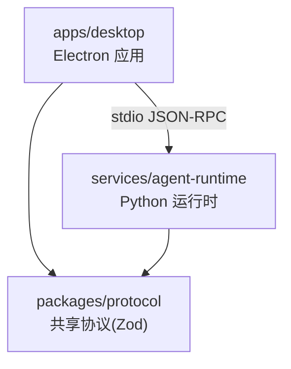
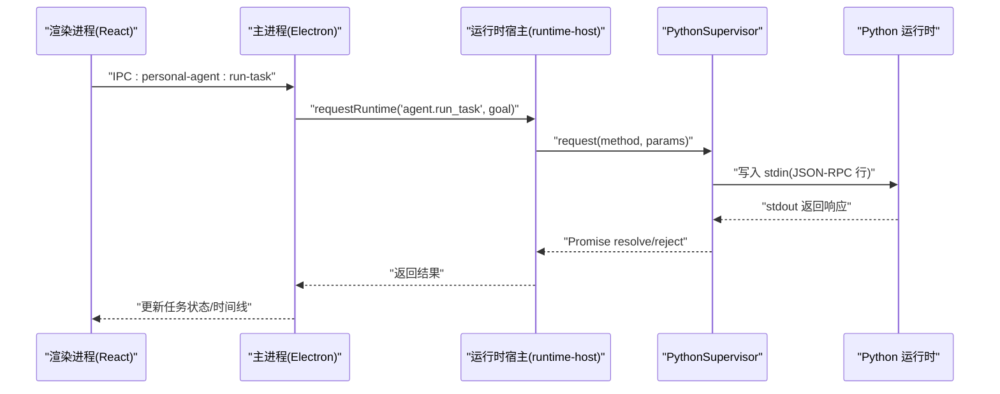
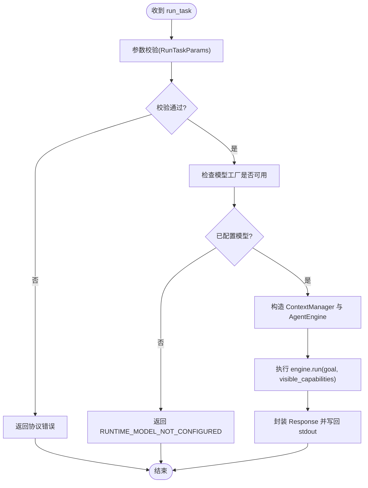
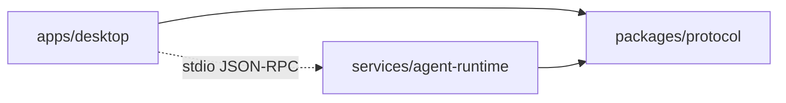

# 快速开始指南

<cite>
**本文引用的文件**
- [package.json](file://package.json)
- [pnpm-workspace.yaml](file://pnpm-workspace.yaml)
- [apps/desktop/package.json](file://apps/desktop/package.json)
- [apps/desktop/README.md](file://apps/desktop/README.md)
- [apps/desktop/electron.vite.config.ts](file://apps/desktop/electron.vite.config.ts)
- [apps/desktop/tsconfig.node.json](file://apps/desktop/tsconfig.node.json)
- [apps/desktop/src/main/index.ts](file://apps/desktop/src/main/index.ts)
- [apps/desktop/src/main/runtime/runtime-host.ts](file://apps/desktop/src/main/runtime/runtime-host.ts)
- [apps/desktop/src/main/runtime/python-supervisor.ts](file://apps/desktop/src/main/runtime/python-supervisor.ts)
- [services/agent-runtime/pyproject.toml](file://services/agent-runtime/pyproject.toml)
- [services/agent-runtime/src/personal_agent/__init__.py](file://services/agent-runtime/src/personal_agent/__init__.py)
- [services/agent-runtime/src/personal_agent/__main__.py](file://services/agent-runtime/src/personal_agent/__main__.py)
- [services/agent-runtime/src/personal_agent/runtime.py](file://services/agent-runtime/src/personal_agent/runtime.py)
- [AGENTS.md](file://AGENTS.md)
</cite>

## 目录
1. [简介](#简介)
2. [项目结构](#项目结构)
3. [核心组件](#核心组件)
4. [架构总览](#架构总览)
5. [详细组件分析](#详细组件分析)
6. [依赖关系分析](#依赖关系分析)
7. [性能与启动优化](#性能与启动优化)
8. [故障排除指南](#故障排除指南)
9. [结论](#结论)
10. [附录：常用命令与调试技巧](#附录常用命令与调试技巧)

## 简介
本指南面向首次接触 Personal Agent 的开发者，目标是在最短时间内完成环境准备、安装依赖、启动开发服务器并体验核心功能。你将学会：
- 准备 Node.js、Python、pnpm 等工具与环境
- 克隆仓库、安装依赖、构建类型检查与测试
- 启动 Electron 主进程与 Python 运行时
- 创建任务、执行文件操作、查看任务历史
- 常见问题的定位与解决
- 调试技巧与开发工具使用

## 项目结构
本项目采用 pnpm workspace 多包管理，包含三个主要部分：
- apps/desktop：Electron + React + TypeScript 桌面应用（主进程、渲染进程、预加载脚本）
- packages/protocol：跨语言协议定义（Zod schema），作为单一事实来源
- services/agent-runtime：Python 运行时（JSON-RPC over stdio），负责任务规划与执行

**图表来源**
- [pnpm-workspace.yaml:1-13](file://pnpm-workspace.yaml#L1-L13)
- [apps/desktop/electron.vite.config.ts:6-23](file://apps/desktop/electron.vite.config.ts#L6-L23)
- [AGENTS.md:76-97](file://AGENTS.md#L76-L97)

**章节来源**
- [pnpm-workspace.yaml:1-13](file://pnpm-workspace.yaml#L1-L13)
- [apps/desktop/electron.vite.config.ts:6-23](file://apps/desktop/electron.vite.config.ts#L6-L23)
- [AGENTS.md:76-97](file://AGENTS.md#L76-L97)

## 核心组件
- 主进程入口：初始化窗口、注册 IPC、启动 Python 运行时、处理任务与权限
- Python 运行时：通过 stdio 接收 JSON-RPC 请求，执行计划与任务
- 协议层：TS 侧 Zod schema 与 Python 侧 Pydantic 镜像保持一致
- 能力与策略：安全五层校验（Scope → Retriever → Binder → Executor → Path-Guard）

**章节来源**
- [apps/desktop/src/main/index.ts:109-341](file://apps/desktop/src/main/index.ts#L109-L341)
- [services/agent-runtime/src/personal_agent/runtime.py:69-184](file://services/agent-runtime/src/personal_agent/runtime.py#L69-L184)
- [AGENTS.md:51-73](file://AGENTS.md#L51-L73)

## 架构总览
下图展示了从用户界面到 Python 运行时的完整调用链，包括握手、任务执行与结果回传。

**图表来源**
- [apps/desktop/src/main/index.ts:268-291](file://apps/desktop/src/main/index.ts#L268-L291)
- [apps/desktop/src/main/runtime/runtime-host.ts:205-214](file://apps/desktop/src/main/runtime/runtime-host.ts#L205-L214)
- [apps/desktop/src/main/runtime/python-supervisor.ts:162-207](file://apps/desktop/src/main/runtime/python-supervisor.ts#L162-L207)
- [services/agent-runtime/src/personal_agent/runtime.py:96-106](file://services/agent-runtime/src/personal_agent/runtime.py#L96-L106)

## 详细组件分析

### 环境准备与版本要求
- Node.js：由 pnpm 工作区驱动，建议使用现代 LTS；pnpm 版本在根配置中声明为 ^11.17.0
- Python：>=3.13（由 Python 工程配置指定）
- 包管理器：pnpm（根脚本通过 pnpm 调度子任务）
- 构建工具：electron-vite、Vite、TypeScript、Ruff、pytest

**章节来源**
- [package.json:28-34](file://package.json#L28-L34)
- [services/agent-runtime/pyproject.toml:1-8](file://services/agent-runtime/pyproject.toml#L1-L8)
- [apps/desktop/package.json:37-59](file://apps/desktop/package.json#L37-L59)

### 克隆与安装依赖
- 克隆仓库后，在项目根目录执行 pnpm install，将安装所有工作区依赖
- Python 虚拟环境位于 services/agent-runtime/.venv（开发布局）；打包版不依赖它——运行时是随包分发的 PyInstaller 冻结产物，位置由 resolveRuntimeLaunch 解析

**章节来源**
- [apps/desktop/README.md:11-21](file://apps/desktop/README.md#L11-L21)
- [apps/desktop/src/main/runtime/runtime-host.ts:24-215](file://apps/desktop/src/main/runtime/runtime-host.ts#L24-L215)

### 启动开发服务器
- 在主仓库根目录执行 pnpm dev，将启动 apps/desktop 的开发模式
- 主进程启动后会尝试启动 Python 运行时，并通过 system.initialize 握手
- 若未找到 .venv 中的 python.exe，主进程会将运行时状态置为崩溃并给出提示

**章节来源**
- [package.json:6-23](file://package.json#L6-L23)
- [apps/desktop/src/main/index.ts:338-341](file://apps/desktop/src/main/index.ts#L338-L341)
- [apps/desktop/src/main/runtime/runtime-host.ts:136-181](file://apps/desktop/src/main/runtime/runtime-host.ts#L136-L181)

### 启动 Python 运行时
- 主进程通过 spawn 启动 Python 模块 personal_agent，工作目录指向 services/agent-runtime
- Python 端通过 stdio 读取 JSON 行，解析为 JSON-RPC 请求并分发处理
- 支持 system.ping、system.initialize、agent.make_plan、agent.run_task 等方法

**章节来源**
- [apps/desktop/src/main/runtime/runtime-host.ts:24-215](file://apps/desktop/src/main/runtime/runtime-host.ts#L24-L215)
- [services/agent-runtime/src/personal_agent/__main__.py:1-5](file://services/agent-runtime/src/personal_agent/__main__.py#L1-L5)
- [services/agent-runtime/src/personal_agent/runtime.py:96-106](file://services/agent-runtime/src/personal_agent/runtime.py#L96-L106)

### 基本使用示例
- 创建第一个任务：在 UI 中输入目标（goal），触发 IPC personal-agent:run-task，主进程调用 runTask 并持久化任务与事件
- 执行文件操作：通过能力层 filesystem.list 列出下载目录内容，结果落库后可在 UI 展示
- 查看任务历史：通过 IPC personal-agent:list-tasks 获取任务列表，personal-agent:get-timeline 获取时间线

**章节来源**
- [apps/desktop/src/main/index.ts:150-233](file://apps/desktop/src/main/index.ts#L150-L233)
- [apps/desktop/src/main/index.ts:246-310](file://apps/desktop/src/main/index.ts#L246-L310)

### 任务执行流程（算法流程图）

**图表来源**
- [services/agent-runtime/src/personal_agent/runtime.py:158-184](file://services/agent-runtime/src/personal_agent/runtime.py#L158-L184)

**章节来源**
- [services/agent-runtime/src/personal_agent/runtime.py:158-184](file://services/agent-runtime/src/personal_agent/runtime.py#L158-L184)

## 依赖关系分析
- 依赖方向严格单向：apps/desktop → packages/protocol ← services/agent-runtime
- TS 侧通过 tsconfig paths alias 引用协议包；Python 侧通过 Pydantic 镜像与 fixture 验证一致性
- 运行时通过 stdio JSON-RPC 通信，不直接互相 import

**图表来源**
- [AGENTS.md:76-97](file://AGENTS.md#L76-L97)
- [apps/desktop/tsconfig.node.json:8-12](file://apps/desktop/tsconfig.node.json#L8-L12)

**章节来源**
- [AGENTS.md:76-97](file://AGENTS.md#L76-L97)
- [apps/desktop/tsconfig.node.json:8-12](file://apps/desktop/tsconfig.node.json#L8-L12)

## 性能与启动优化
- Python 运行时每次任务独立构造上下文与引擎，避免跨任务状态污染
- 请求超时与取消：supervisor 维护 pending 队列与定时器，支持 AbortSignal 取消
- 崩溃恢复：子进程异常退出时记录原因并拒绝后续请求，等待重启或重试
- 日志输出：Python 日志通过 stderr 输出，开发模式下主进程转发便于调试

**章节来源**
- [services/agent-runtime/src/personal_agent/runtime.py:49-62](file://services/agent-runtime/src/personal_agent/runtime.py#L49-L62)
- [apps/desktop/src/main/runtime/python-supervisor.ts:162-207](file://apps/desktop/src/main/runtime/python-supervisor.ts#L162-L207)
- [apps/desktop/src/main/runtime/python-supervisor.ts:339-352](file://apps/desktop/src/main/runtime/python-supervisor.ts#L339-L352)
- [apps/desktop/src/main/runtime/runtime-host.ts:209-213](file://apps/desktop/src/main/runtime/runtime-host.ts#L209-L213)

## 故障排除指南
- 找不到 Python 虚拟环境：主进程会在启动时检测 .venv/Scripts/python.exe，缺失则状态为 crashed，需确保 Python 环境已正确创建
- 握手失败：initialize 参数不符合契约或协议版本不匹配，检查 capabilities 与客户端信息
- 运行时未配置模型：未设置 PERSONAL_AGENT_SCRIPT 环境变量或未提供有效剧本，导致无法执行任务
- 请求超时：默认超时时间可配置，可通过 supervisor.request 的 timeoutMs 调整
- 子进程崩溃：supervisor 会记录 reason 与 detail，并在后续请求中拒绝，需修复 Python 侧问题后重启

**章节来源**
- [apps/desktop/src/main/runtime/runtime-host.ts:141-151](file://apps/desktop/src/main/runtime/runtime-host.ts#L141-L151)
- [apps/desktop/src/main/runtime/python-supervisor.ts:135-160](file://apps/desktop/src/main/runtime/python-supervisor.ts#L135-L160)
- [services/agent-runtime/src/personal_agent/runtime.py:208-235](file://services/agent-runtime/src/personal_agent/runtime.py#L208-L235)
- [apps/desktop/src/main/runtime/python-supervisor.ts:183-191](file://apps/desktop/src/main/runtime/python-supervisor.ts#L183-L191)
- [apps/desktop/src/main/runtime/python-supervisor.ts:348-352](file://apps/desktop/src/main/runtime/python-supervisor.ts#L348-L352)

## 结论
通过本指南，你应能顺利完成环境准备、安装依赖、启动开发服务器并体验 Personal Agent 的核心功能。建议在日常开发中：
- 使用 pnpm verify 进行全量门禁（类型检查、Lint、测试）
- 关注 Python 运行时日志与主进程 stderr 输出，快速定位问题
- 遵循协议双模型同步与安全策略链约定，保证跨语言一致性与安全性

## 附录：常用命令与调试技巧
- 安装依赖：pnpm install
- 启动开发：pnpm dev
- 类型检查：pnpm typecheck
- Lint：pnpm lint:ts、pnpm lint:py
- 测试：pnpm test、pnpm test:pack、pnpm test:ts、pnpm test:py
- 构建：pnpm build
- 全量验证：pnpm verify、pnpm verify:all

调试技巧：
- 启用 Electron DevTools：开发模式下按 F12 打开
- 观察 Python 日志：主进程在开发模式会将 Python stderr 输出到控制台
- 使用 VSCode 调试：配置 Node 与 Python 调试器，分别附加到主进程与 Python 子进程

**章节来源**
- [package.json:6-23](file://package.json#L6-L23)
- [apps/desktop/README.md:17-34](file://apps/desktop/README.md#L17-L34)
- [apps/desktop/src/main/runtime/runtime-host.ts:209-213](file://apps/desktop/src/main/runtime/runtime-host.ts#L209-L213)