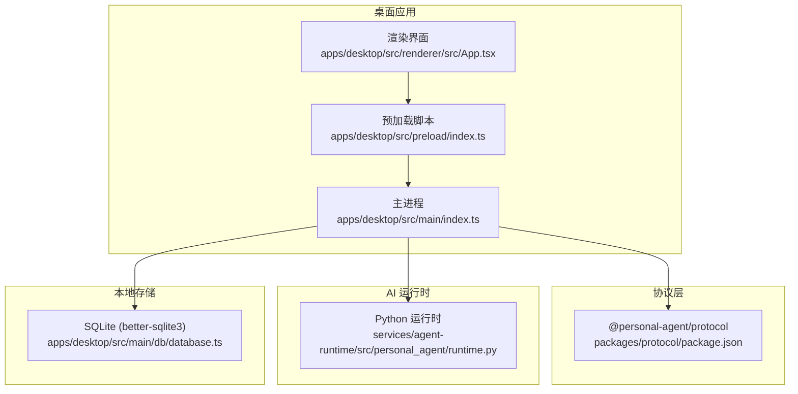
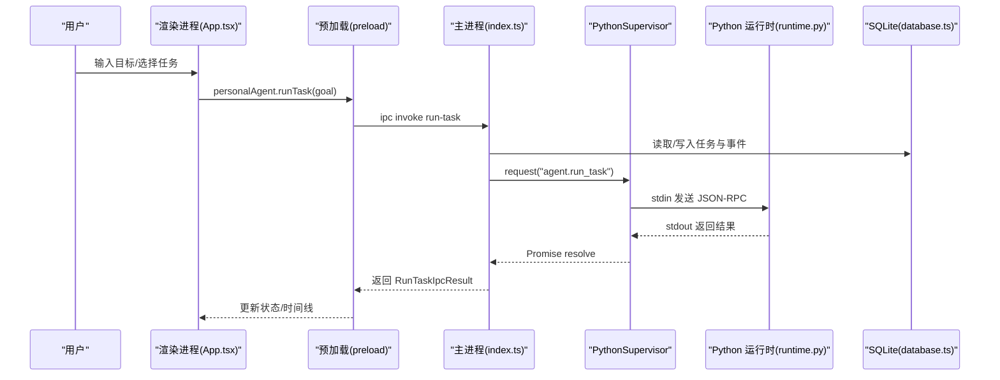
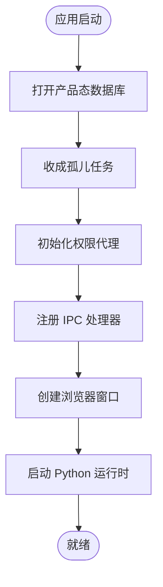
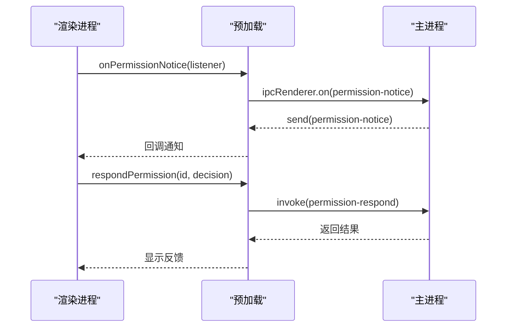
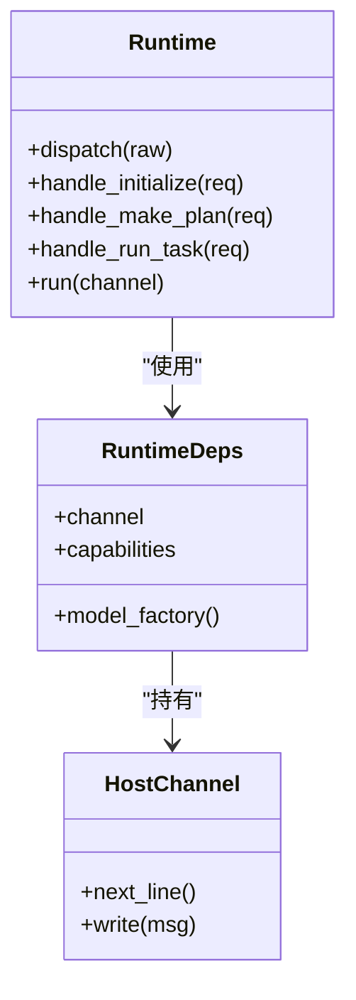
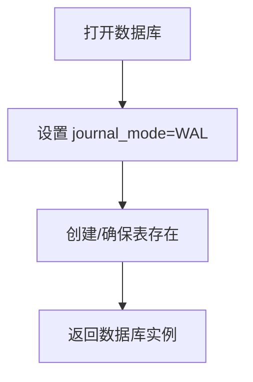
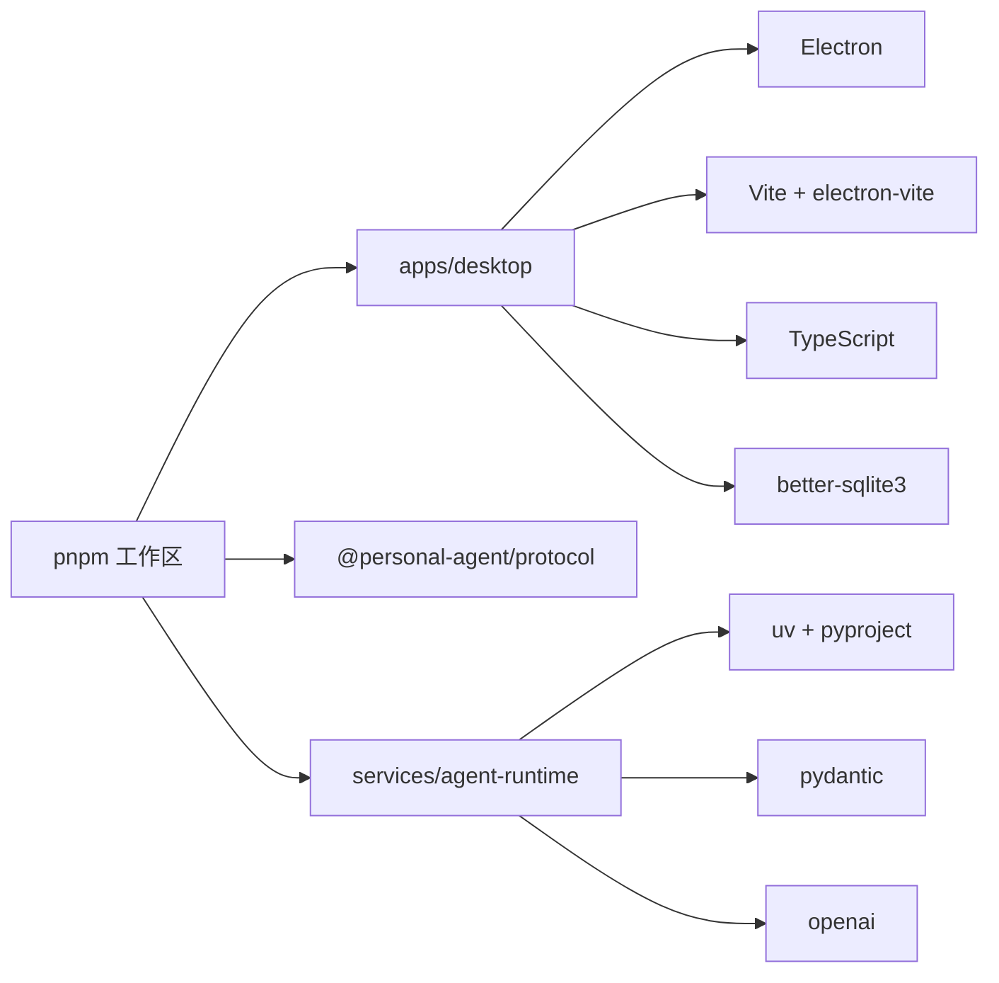

# 技术栈概览

<cite>
**本文引用的文件**
- [package.json](file://package.json)
- [pnpm-workspace.yaml](file://pnpm-workspace.yaml)
- [apps/desktop/package.json](file://apps/desktop/package.json)
- [apps/desktop/electron.vite.config.ts](file://apps/desktop/electron.vite.config.ts)
- [apps/desktop/tsconfig.json](file://apps/desktop/tsconfig.json)
- [apps/desktop/src/main/index.ts](file://apps/desktop/src/main/index.ts)
- [apps/desktop/src/preload/index.ts](file://apps/desktop/src/preload/index.ts)
- [apps/desktop/src/renderer/src/App.tsx](file://apps/desktop/src/renderer/src/App.tsx)
- [apps/desktop/src/shared/domain.ts](file://apps/desktop/src/shared/domain.ts)
- [apps/desktop/src/main/db/database.ts](file://apps/desktop/src/main/db/database.ts)
- [apps/desktop/src/main/runtime/python-supervisor.ts](file://apps/desktop/src/main/runtime/python-supervisor.ts)
- [packages/protocol/package.json](file://packages/protocol/package.json)
- [services/agent-runtime/pyproject.toml](file://services/agent-runtime/pyproject.toml)
- [services/agent-runtime/src/personal_agent/__main__.py](file://services/agent-runtime/src/personal_agent/__main__.py)
- [services/agent-runtime/src/personal_agent/runtime.py](file://services/agent-runtime/src/personal_agent/runtime.py)
</cite>

## 目录
1. [简介](#简介)
2. [项目结构](#项目结构)
3. [核心组件](#核心组件)
4. [架构总览](#架构总览)
5. [详细组件分析](#详细组件分析)
6. [依赖关系分析](#依赖关系分析)
7. [性能考量](#性能考量)
8. [故障排查指南](#故障排查指南)
9. [结论](#结论)
10. [附录](#附录)

## 简介
本技术栈文档面向 Personal Agent 桌面应用，系统性梳理 Electron + React + TypeScript 前端、Python AI 推理运行时、SQLite 本地存储以及 monorepo 工程化方案。重点说明各技术选型的原因、协作方式与数据流转路径，并给出版本兼容性与依赖管理策略，帮助开发者快速理解与扩展系统。

## 项目结构
仓库采用 monorepo 组织：
- apps/desktop：Electron 桌面应用（主进程、预加载脚本、渲染进程 UI）
- packages/protocol：跨语言协议与类型定义（TS），供主进程与 Python 运行时共同遵守
- services/agent-runtime：Python 推理运行时，通过标准输入/输出与主进程通信
- tests/fixtures：测试用例与示例数据

图表来源
- [apps/desktop/src/main/index.ts:1-386](file://apps/desktop/src/main/index.ts#L1-L386)
- [apps/desktop/src/preload/index.ts:1-61](file://apps/desktop/src/preload/index.ts#L1-L61)
- [apps/desktop/src/renderer/src/App.tsx:1-305](file://apps/desktop/src/renderer/src/App.tsx#L1-L305)
- [packages/protocol/package.json:1-16](file://packages/protocol/package.json#L1-L16)
- [services/agent-runtime/src/personal_agent/runtime.py:1-257](file://services/agent-runtime/src/personal_agent/runtime.py#L1-L257)
- [apps/desktop/src/main/db/database.ts:1-58](file://apps/desktop/src/main/db/database.ts#L1-L58)

章节来源
- [package.json:1-37](file://package.json#L1-L37)
- [pnpm-workspace.yaml:1-13](file://pnpm-workspace.yaml#L1-L13)
- [apps/desktop/package.json:1-61](file://apps/desktop/package.json#L1-L61)

## 核心组件
- Electron 主进程：负责窗口生命周期、IPC 路由、子进程管理、权限控制、任务编排与持久化。
- 预加载脚本：在隔离环境下暴露最小 API 给渲染进程，屏蔽原生 IPC 细节。
- 渲染界面（React 19）：用户交互、状态展示、错误反馈与导出能力。
- Python 推理运行时：基于 JSON-RPC 行协议实现 agent.make_plan 与 agent.run_task，并通过 host.execute_tool 反向请求宿主能力。
- SQLite 本地数据库：用于 PDF 索引与产品态（任务、计划、事件、权限）的持久化。
- 共享协议包：以 TS Zod 模型描述两端契约，保证前后端一致性。

章节来源
- [apps/desktop/src/main/index.ts:1-386](file://apps/desktop/src/main/index.ts#L1-L386)
- [apps/desktop/src/preload/index.ts:1-61](file://apps/desktop/src/preload/index.ts#L1-L61)
- [apps/desktop/src/renderer/src/App.tsx:1-305](file://apps/desktop/src/renderer/src/App.tsx#L1-L305)
- [services/agent-runtime/src/personal_agent/runtime.py:1-257](file://services/agent-runtime/src/personal_agent/runtime.py#L1-L257)
- [apps/desktop/src/main/db/database.ts:1-58](file://apps/desktop/src/main/db/database.ts#L1-L58)
- [packages/protocol/package.json:1-16](file://packages/protocol/package.json#L1-L16)

## 架构总览
整体采用“主进程协调 + 渲染界面 + Python 推理”的分层架构。渲染进程通过预加载脚本调用主进程 IPC；主进程负责启动/管理 Python 子进程，使用 JSON-RPC 行协议进行双向通信；所有业务数据落库到 SQLite。

图表来源
- [apps/desktop/src/renderer/src/App.tsx:170-202](file://apps/desktop/src/renderer/src/App.tsx#L170-L202)
- [apps/desktop/src/preload/index.ts:27-29](file://apps/desktop/src/preload/index.ts#L27-L29)
- [apps/desktop/src/main/index.ts:268-291](file://apps/desktop/src/main/index.ts#L268-L291)
- [apps/desktop/src/main/runtime/python-supervisor.ts:136-160](file://apps/desktop/src/main/runtime/python-supervisor.ts#L136-L160)
- [services/agent-runtime/src/personal_agent/runtime.py:158-184](file://services/agent-runtime/src/personal_agent/runtime.py#L158-L184)
- [apps/desktop/src/main/db/database.ts:27-41](file://apps/desktop/src/main/db/database.ts#L27-L41)

## 详细组件分析

### Electron 主进程与 IPC 路由
- 职责：创建窗口、注册 IPC 处理器、启动/停止 Python 运行时、处理权限通知广播、协调任务执行与数据持久化。
- 关键流程：
  - 启动时打开产品态数据库，执行孤儿任务收成，初始化权限代理。
  - 注册 list-pdfs、indexed-pdfs、list-tasks、run-task、get-timeline、permission-respond、list-permissions 等通道。
  - 退出时优雅关闭运行时、释放资源。

图表来源
- [apps/desktop/src/main/index.ts:109-145](file://apps/desktop/src/main/index.ts#L109-L145)
- [apps/desktop/src/main/index.ts:148-337](file://apps/desktop/src/main/index.ts#L148-L337)
- [apps/desktop/src/main/index.ts:353-377](file://apps/desktop/src/main/index.ts#L353-L377)

章节来源
- [apps/desktop/src/main/index.ts:1-386](file://apps/desktop/src/main/index.ts#L1-L386)

### 预加载脚本与渲染进程
- 预加载脚本通过 contextBridge 暴露安全的最小 API，包括运行状态查询、PDF 扫描与索引、任务列表与执行、时间线获取、权限响应与监听。
- 渲染进程 App.tsx 维护任务、时间线、权限弹窗等状态，调用预加载 API 完成交互。

图表来源
- [apps/desktop/src/preload/index.ts:45-55](file://apps/desktop/src/preload/index.ts#L45-L55)
- [apps/desktop/src/renderer/src/App.tsx:117-156](file://apps/desktop/src/renderer/src/App.tsx#L117-L156)
- [apps/desktop/src/main/index.ts:312-337](file://apps/desktop/src/main/index.ts#L312-L337)

章节来源
- [apps/desktop/src/preload/index.ts:1-61](file://apps/desktop/src/preload/index.ts#L1-L61)
- [apps/desktop/src/renderer/src/App.tsx:1-305](file://apps/desktop/src/renderer/src/App.tsx#L1-L305)

### Python 推理运行时
- 通过 JSON-RPC 行协议与主进程通信，支持 system.initialize、system.ping、agent.make_plan、agent.run_task。
- 使用 HostChannel 接收 host.execute_tool 反向请求，由主进程注入 hostHandler 执行具体能力。
- 通过环境变量 PERSONAL_AGENT_SCRIPT 加载剧本，构造 ScriptedModel 作为模型网关。

图表来源
- [services/agent-runtime/src/personal_agent/runtime.py:49-63](file://services/agent-runtime/src/personal_agent/runtime.py#L49-L63)
- [services/agent-runtime/src/personal_agent/runtime.py:69-184](file://services/agent-runtime/src/personal_agent/runtime.py#L69-L184)
- [services/agent-runtime/src/personal_agent/runtime.py:238-257](file://services/agent-runtime/src/personal_agent/runtime.py#L238-L257)

章节来源
- [services/agent-runtime/src/personal_agent/runtime.py:1-257](file://services/agent-runtime/src/personal_agent/runtime.py#L1-L257)
- [services/agent-runtime/src/personal_agent/__main__.py:1-5](file://services/agent-runtime/src/personal_agent/__main__.py#L1-L5)

### SQLite 本地数据库
- 使用 better-sqlite3 提供同步 API，设置 WAL 模式提升并发读写性能。
- 维护 PDF 索引表与产品态（任务、计划、事件、权限）相关表。
- 提供 getDb/closeDb 单例式访问，便于主进程统一管理生命周期。

图表来源
- [apps/desktop/src/main/db/database.ts:10-41](file://apps/desktop/src/main/db/database.ts#L10-L41)

章节来源
- [apps/desktop/src/main/db/database.ts:1-58](file://apps/desktop/src/main/db/database.ts#L1-L58)

### 共享协议与类型系统
- @personal-agent/protocol 使用 Zod 定义请求/响应模型，确保 TS 与 Python 侧契约一致。
- 主进程与 Python 运行时均对参数进行严格校验，失败返回统一错误码。
- 领域模型（任务状态、权限记录、时间线投影）在 shared/domain.ts 中集中定义，供多端复用。

章节来源
- [packages/protocol/package.json:1-16](file://packages/protocol/package.json#L1-L16)
- [apps/desktop/src/shared/domain.ts:1-158](file://apps/desktop/src/shared/domain.ts#L1-L158)

## 依赖关系分析
- Node.js 工具链：
  - pnpm 工作区：统一 apps、packages、services 下的依赖安装与构建。
  - electron-vite：为 Electron 主进程与渲染进程分别配置 Vite 构建与别名。
  - TypeScript：双配置（node/web）保障类型检查。
- Python 工具链：
  - uv 构建系统与 pyproject.toml 声明依赖与脚本入口。
  - pytest/ruff 用于测试与代码质量。
- 运行时依赖：
  - Electron 39.x、React 19.x、Vite 7.x、TypeScript 5.x。
  - better-sqlite3 用于本地数据库。
  - openai、pydantic 用于 Python 运行时。

图表来源
- [pnpm-workspace.yaml:1-13](file://pnpm-workspace.yaml#L1-L13)
- [apps/desktop/electron.vite.config.ts:1-24](file://apps/desktop/electron.vite.config.ts#L1-L24)
- [apps/desktop/package.json:23-59](file://apps/desktop/package.json#L23-L59)
- [services/agent-runtime/pyproject.toml:1-27](file://services/agent-runtime/pyproject.toml#L1-L27)

章节来源
- [package.json:1-37](file://package.json#L1-L37)
- [apps/desktop/package.json:1-61](file://apps/desktop/package.json#L1-L61)
- [services/agent-runtime/pyproject.toml:1-27](file://services/agent-runtime/pyproject.toml#L1-L27)

## 性能考量
- 数据库：启用 WAL 模式减少锁竞争，适合频繁读写的场景。
- 子进程通信：JSON-RPC 行协议简单高效；超时与取消信号避免长时间阻塞。
- 构建与开发：Vite 热更新与分模块打包提升迭代效率；electron-vite 分离主/渲染构建。
- 内存与资源：Python 运行时每次任务可重建上下文，避免跨任务状态污染；主进程在退出时统一释放资源。

[本节为通用指导，不直接分析具体文件]

## 故障排查指南
- 运行时崩溃或退出：
  - 主进程会捕获子进程 error/exit 事件，记录 stderr 并拒绝未决请求。
  - 建议查看控制台 stderr 与运行时日志定位原因。
- 握手失败或协议不匹配：
  - initialize 参数校验失败将返回 HANDSHAKE_FAILED，需检查协议版本与能力清单。
- 权限通道不可用：
  - 若 product-state 数据库未打开，权限相关 IPC 将返回 DB_FAILED。
- 数据库异常：
  - 读写失败统一映射为 RUNTIME_ERROR_CODE.DB_FAILED，检查 WAL 设置与文件路径权限。

章节来源
- [apps/desktop/src/main/runtime/python-supervisor.ts:123-132](file://apps/desktop/src/main/runtime/python-supervisor.ts#L123-L132)
- [apps/desktop/src/main/runtime/python-supervisor.ts:136-160](file://apps/desktop/src/main/runtime/python-supervisor.ts#L136-L160)
- [apps/desktop/src/main/index.ts:136-145](file://apps/desktop/src/main/index.ts#L136-L145)
- [apps/desktop/src/main/index.ts:235-245](file://apps/desktop/src/main/index.ts#L235-L245)

## 结论
Personal Agent 采用成熟的 Electron + React + TypeScript 桌面技术栈，结合 Python 推理运行时与 SQLite 本地存储，形成清晰的分层与职责边界。monorepo 与共享协议包确保了跨语言契约一致性与可维护性。通过严格的类型校验、超时与错误码体系，系统在可用性、可观测性与可扩展性方面具备良好基础。后续可在模型接入、能力扩展与性能调优上持续演进。

## 附录
- 版本与兼容性
  - Node/Electron：Electron 39.x，配套 Vite 7.x、TypeScript 5.x。
  - Python：>=3.13，依赖 openai、pydantic。
  - 数据库：better-sqlite3 同步 API，WAL 模式。
- 依赖管理策略
  - pnpm 工作区统一安装与构建，允许特定构建器（electron/esbuild）。
  - Python 使用 uv 锁定依赖，pytest/ruff 保障质量。
- 替代方案简析
  - 前端框架：Vue/Svelte 亦可，但当前 React 生态与组件库成熟。
  - 运行时：Node 内嵌 LLM 或 WebAssembly 推理，但 Python 生态更丰富。
  - 数据库：IndexedDB 或 LevelDB，但 SQLite 在复杂查询与迁移方面更灵活。

[本节为通用指导，不直接分析具体文件]