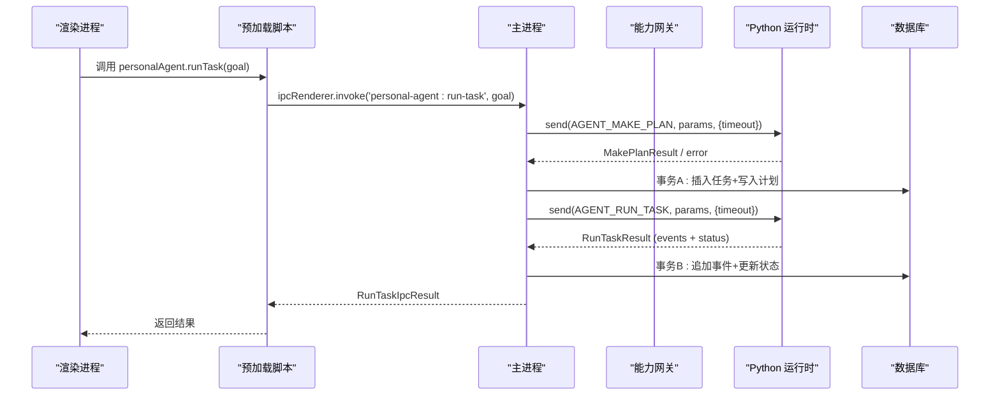
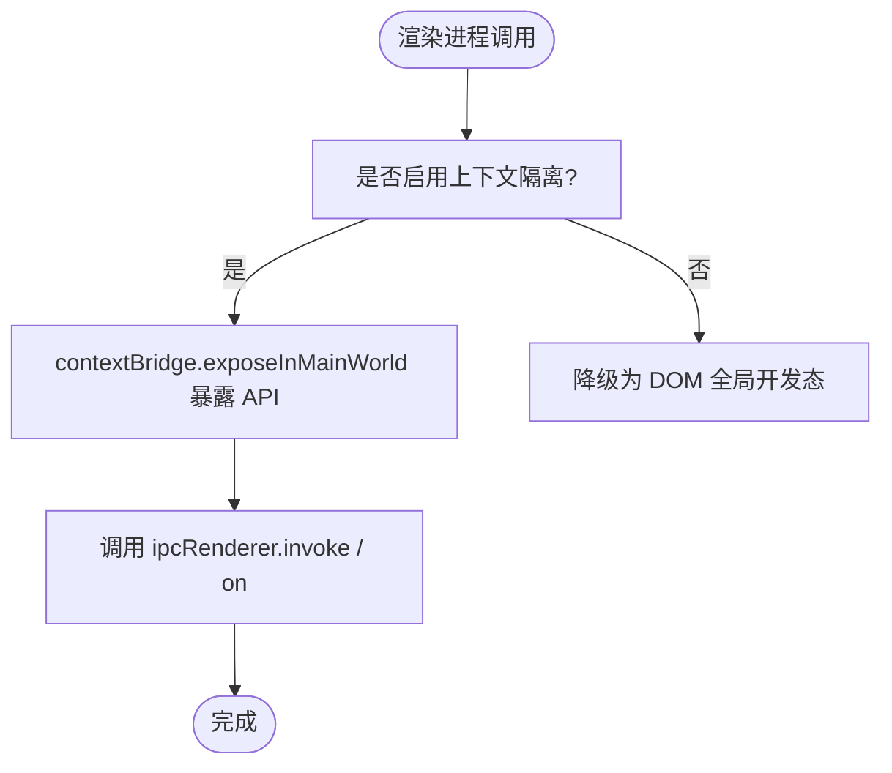
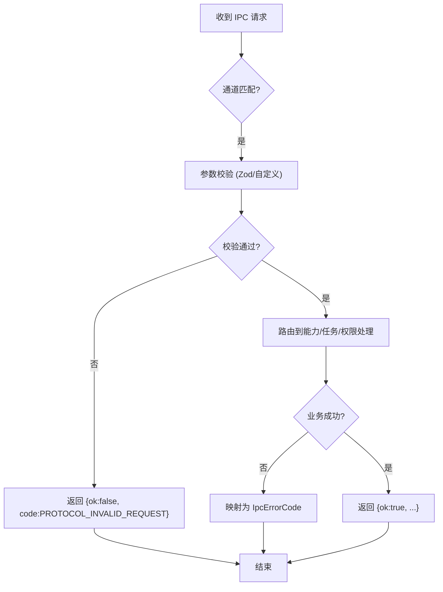
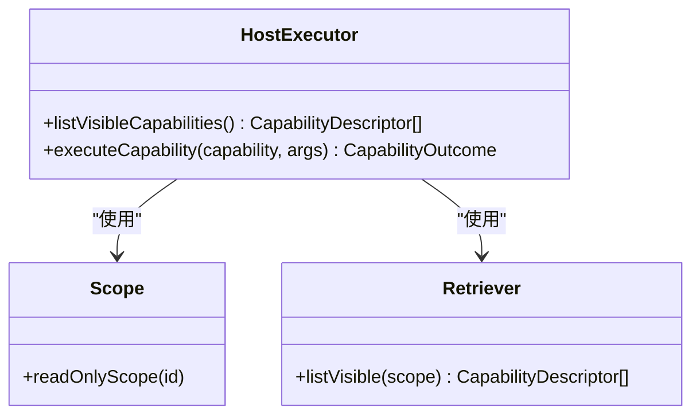
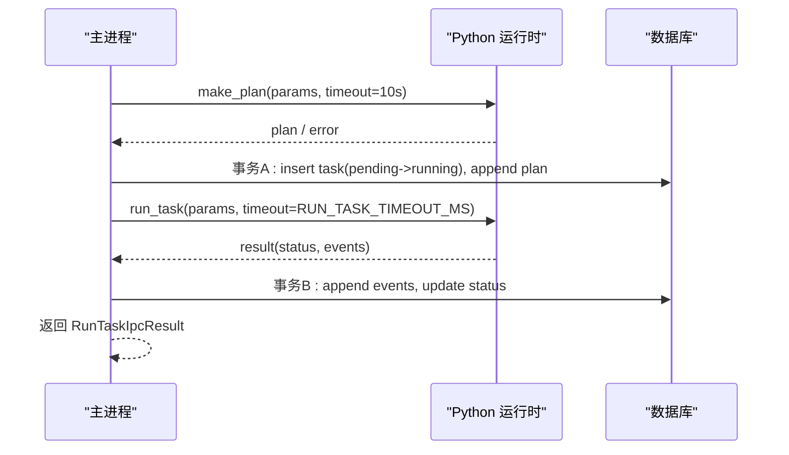
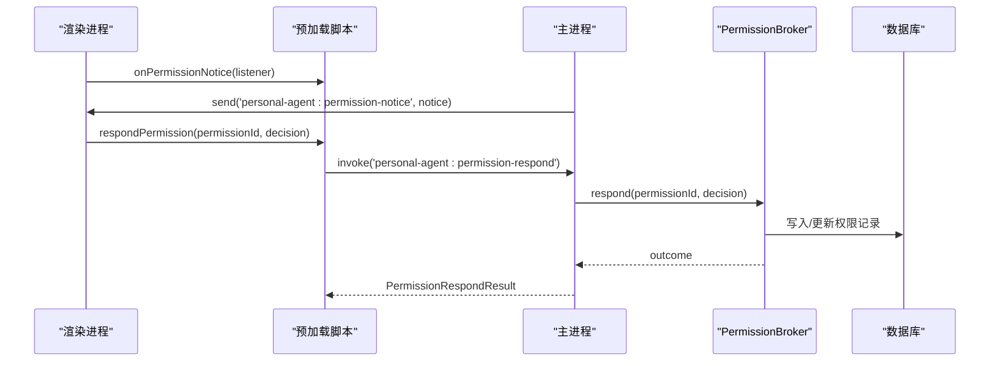
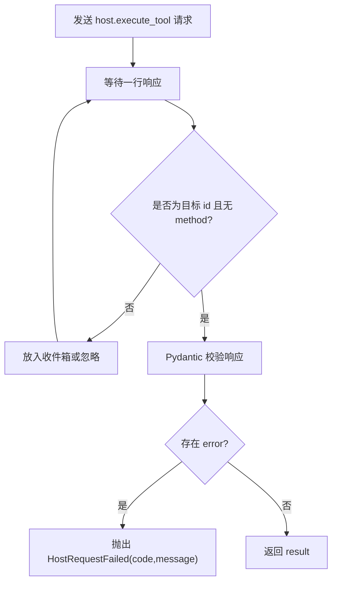
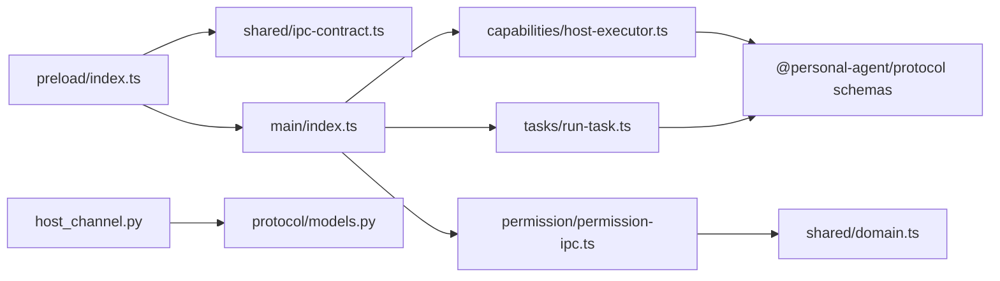

# IPC 通信机制

<cite>
**本文引用的文件**
- [apps/desktop/src/main/index.ts](file://apps/desktop/src/main/index.ts)
- [apps/desktop/src/preload/index.ts](file://apps/desktop/src/preload/index.ts)
- [apps/desktop/src/shared/ipc-contract.ts](file://apps/desktop/src/shared/ipc-contract.ts)
- [apps/desktop/src/shared/domain.ts](file://apps/desktop/src/shared/domain.ts)
- [packages/protocol/schemas/envelope.ts](file://packages/protocol/schemas/envelope.ts)
- [packages/protocol/schemas/host.ts](file://packages/protocol/schemas/host.ts)
- [packages/protocol/schemas/filesystem.ts](file://packages/protocol/schemas/filesystem.ts)
- [packages/protocol/schemas/errors.ts](file://packages/protocol/schemas/errors.ts)
- [services/agent-runtime/src/personal_agent/host_channel.py](file://services/agent-runtime/src/personal_agent/host_channel.py)
- [services/agent-runtime/src/personal_agent/protocol/models.py](file://services/agent-runtime/src/personal_agent/protocol/models.py)
- [apps/desktop/src/main/capabilities/host-executor.ts](file://apps/desktop/src/main/capabilities/host-executor.ts)
- [apps/desktop/src/main/tasks/run-task.ts](file://apps/desktop/src/main/tasks/run-task.ts)
- [apps/desktop/src/main/permission/permission-ipc.ts](file://apps/desktop/src/main/permission/permission-ipc.ts)
</cite>

## 目录
1. [简介](#简介)
2. [项目结构](#项目结构)
3. [核心组件](#核心组件)
4. [架构总览](#架构总览)
5. [详细组件分析](#详细组件分析)
6. [依赖关系分析](#依赖关系分析)
7. [性能考虑](#性能考虑)
8. [故障排查指南](#故障排查指南)
9. [结论](#结论)
10. [附录](#附录)

## 简介
本技术文档围绕 Electron 应用的 IPC 通信机制，系统性阐述主进程与渲染进程的通信模式、消息路由与安全隔离；深入说明 JSON-RPC 协议在主进程与 Python 运行时之间的实现（请求/响应、通知、错误处理与版本兼容）；解释预加载脚本如何暴露 API、封装权限并保证类型安全；介绍协议定义与验证机制（Schema 设计、数据校验、错误映射）；并提供具体使用示例，展示如何定义 IPC 接口、处理异步消息与实现跨进程调用。最后给出通信安全策略、性能优化与调试方法。

## 项目结构
该工程采用多包协作：
- apps/desktop：Electron 桌面应用，包含主进程、预加载脚本、渲染进程与共享契约。
- packages/protocol：TS 侧的协议 Schema 定义（Zod），用于请求/响应/通知的结构化校验。
- services/agent-runtime：Python 运行时，通过 JSON-RPC 与主进程双向通信，执行工具能力。

```mermaid
graph TB
subgraph "渲染进程"
RUI["用户界面"]
end
subgraph "预加载层"
PRE["contextBridge 暴露 API"]
end
subgraph "主进程"
MAIN["main/index.ts<br/>IPC 处理器注册"]
CAP["capabilities/host-executor.ts<br/>能力网关"]
TASKS["tasks/run-task.ts<br/>任务编排"]
PERM["permission/permission-ipc.ts<br/>权限通道"]
DB[("产品状态数据库")]
PDFDB[("PDF 数据库")]
end
subgraph "Python 运行时"
PY["host_channel.py<br/>JSON-RPC 客户端"]
MODELS["protocol/models.py<br/>Pydantic 模型"]
end
RUI --> PRE
PRE --> MAIN
MAIN --> CAP
MAIN --> TASKS
MAIN --> PERM
CAP --> PDFDB
TASKS --> DB
MAIN <- --> PY
PY --> MODELS
```

图表来源
- [apps/desktop/src/main/index.ts:51-85](file://apps/desktop/src/main/index.ts#L51-L85)
- [apps/desktop/src/preload/index.ts:8-46](file://apps/desktop/src/preload/index.ts#L8-L46)
- [apps/desktop/src/main/capabilities/host-executor.ts:17-55](file://apps/desktop/src/main/capabilities/host-executor.ts#L17-L55)
- [apps/desktop/src/main/tasks/run-task.ts:86-143](file://apps/desktop/src/main/tasks/run-task.ts#L86-L143)
- [services/agent-runtime/src/personal_agent/host_channel.py:36-85](file://services/agent-runtime/src/personal_agent/host_channel.py#L36-L85)

章节来源
- [apps/desktop/src/main/index.ts:51-85](file://apps/desktop/src/main/index.ts#L51-L85)
- [apps/desktop/src/preload/index.ts:8-46](file://apps/desktop/src/preload/index.ts#L8-L46)

## 核心组件
- 预加载脚本：通过 contextBridge 仅暴露最小必要 API，屏蔽底层 ipcRenderer 细节，提供强类型调用入口。
- 主进程 IPC 处理器：集中注册 invoke/on 通道，负责参数校验、能力路由、持久化与错误码归一化。
- 能力网关：基于规则的能力检索与执行，区分 agent 与 UI 两条 origin，统一返回 CapabilityOutcome。
- 任务编排：runTask 串联“索要计划 → 建任务 → 写计划 → 调 Python → 落事件 → 更新状态”，保证幂等与可观测性。
- 权限通道：broker 管理授权记录，主进程广播 notice，渲染进程订阅并回传决策。
- 协议与 Schema：TS 侧用 Zod 定义 JSON-RPC envelope 与各领域模型；Python 侧用 Pydantic 严格校验，两端一致。

章节来源
- [apps/desktop/src/preload/index.ts:8-46](file://apps/desktop/src/preload/index.ts#L8-L46)
- [apps/desktop/src/main/index.ts:127-269](file://apps/desktop/src/main/index.ts#L127-L269)
- [apps/desktop/src/main/capabilities/host-executor.ts:17-55](file://apps/desktop/src/main/capabilities/host-executor.ts#L17-L55)
- [apps/desktop/src/main/tasks/run-task.ts:86-143](file://apps/desktop/src/main/tasks/run-task.ts#L86-L143)
- [apps/desktop/src/main/permission/permission-ipc.ts:43-83](file://apps/desktop/src/main/permission/permission-ipc.ts#L43-L83)
- [packages/protocol/schemas/envelope.ts:1-41](file://packages/protocol/schemas/envelope.ts#L1-L41)
- [services/agent-runtime/src/personal_agent/protocol/models.py:8-38](file://services/agent-runtime/src/personal_agent/protocol/models.py#L8-L38)

## 架构总览
下图展示了从渲染进程发起调用到主进程路由、能力执行、Python 运行时交互、结果回传的完整链路。



图表来源
- [apps/desktop/src/preload/index.ts:23-25](file://apps/desktop/src/preload/index.ts#L23-L25)
- [apps/desktop/src/main/index.ts:200-223](file://apps/desktop/src/main/index.ts#L200-L223)
- [apps/desktop/src/main/tasks/run-task.ts:100-143](file://apps/desktop/src/main/tasks/run-task.ts#L100-L143)
- [services/agent-runtime/src/personal_agent/protocol/models.py:264-320](file://services/agent-runtime/src/personal_agent/protocol/models.py#L264-L320)

## 详细组件分析

### 预加载脚本：API 暴露与权限封装
- 仅暴露 minimal API：runtimeStatus、listPdfs、indexedPdfs、listTasks、runTask、getTimeline、respondPermission、listPermissions、onPermissionNotice。
- 唯一的主→渲染推送通道：onPermissionNotice 返回取消函数，确保监听器正确移除。
- 类型安全：入参由 TypeScript 约束，避免非法值进入主进程。



图表来源
- [apps/desktop/src/preload/index.ts:8-46](file://apps/desktop/src/preload/index.ts#L8-L46)

章节来源
- [apps/desktop/src/preload/index.ts:8-46](file://apps/desktop/src/preload/index.ts#L8-L46)

### 主进程 IPC 处理器：路由与错误归一化
- 注册多个 invoke 通道：runtime-status、list-pdfs、indexed-pdfs、list-tasks、run-task、get-timeline、permission-respond、list-permissions。
- 参数校验：对 rootId、taskId、goal 等进行 schema 校验，失败返回 PROTOCOL_INVALID_REQUEST。
- 错误码归一化：将运行时错误映射为 IpcErrorCode，未知错误收敛为 CRASHED/DB_FAILED。
- 资源清理：before-quit 中停止运行时、释放 broker、关闭数据库。



图表来源
- [apps/desktop/src/main/index.ts:127-269](file://apps/desktop/src/main/index.ts#L127-L269)
- [apps/desktop/src/main/tasks/run-task.ts:29-37](file://apps/desktop/src/main/tasks/run-task.ts#L29-L37)
- [apps/desktop/src/main/permission/permission-ipc.ts:25-32](file://apps/desktop/src/main/permission/permission-ipc.ts#L25-L32)

章节来源
- [apps/desktop/src/main/index.ts:127-269](file://apps/desktop/src/main/index.ts#L127-L269)
- [apps/desktop/src/main/tasks/run-task.ts:29-37](file://apps/desktop/src/main/tasks/run-task.ts#L29-L37)
- [apps/desktop/src/main/permission/permission-ipc.ts:25-32](file://apps/desktop/src/main/permission/permission-ipc.ts#L25-L32)

### 能力网关：host-executor
- 两条 origin：agent 需要任务上下文与计划对齐；UI 无需任务上下文，但同样经过注册、Scope、风险、契约、路径五重校验。
- 对外暴露 listVisibleCapabilities 与 executeCapability，统一返回 CapabilityOutcome。
- 入参通过 HostExecuteToolParams 校验，失败返回 INVALID_ARGUMENT。



图表来源
- [apps/desktop/src/main/capabilities/host-executor.ts:17-55](file://apps/desktop/src/main/capabilities/host-executor.ts#L17-L55)

章节来源
- [apps/desktop/src/main/capabilities/host-executor.ts:17-55](file://apps/desktop/src/main/capabilities/host-executor.ts#L17-L55)

### 任务编排：run-task
- 流程：先索要计划（超时更短），再建任务并写入计划，随后调用 Python 运行任务，最后追加事件并更新状态。
- 并发控制：beginTask/endTask 保证单槽执行，避免 ActionAlignment 基准错乱。
- 错误处理：将 Python 返回的错误码映射为 IpcErrorCode，未知错误收敛为 CRASHED；数据库异常统一为 DB_FAILED。



图表来源
- [apps/desktop/src/main/tasks/run-task.ts:86-143](file://apps/desktop/src/main/tasks/run-task.ts#L86-L143)
- [apps/desktop/src/main/tasks/run-task.ts:147-223](file://apps/desktop/src/main/tasks/run-task.ts#L147-L223)

章节来源
- [apps/desktop/src/main/tasks/run-task.ts:86-143](file://apps/desktop/src/main/tasks/run-task.ts#L86-L143)
- [apps/desktop/src/main/tasks/run-task.ts:147-223](file://apps/desktop/src/main/tasks/run-task.ts#L147-L223)

### 权限通道：permission-ipc
- respondToPermission：严格校验 permissionId 与 decision，调用 broker.respond 并映射错误码。
- listTaskPermissions：只读查询，返回带过期状态的投影。
- 主进程广播 notice：所有窗口均能收到权限申请与解决通知。



图表来源
- [apps/desktop/src/preload/index.ts:29-45](file://apps/desktop/src/preload/index.ts#L29-L45)
- [apps/desktop/src/main/index.ts:44-49](file://apps/desktop/src/main/index.ts#L44-L49)
- [apps/desktop/src/main/permission/permission-ipc.ts:43-83](file://apps/desktop/src/main/permission/permission-ipc.ts#L43-L83)

章节来源
- [apps/desktop/src/main/permission/permission-ipc.ts:43-83](file://apps/desktop/src/main/permission/permission-ipc.ts#L43-L83)
- [apps/desktop/src/main/index.ts:44-49](file://apps/desktop/src/main/index.ts#L44-L49)

### JSON-RPC 协议实现（TS ↔ Python）
- 信封模型：jsonrpc 固定为 "2.0"，method 遵循命名规范，id 非空；Response 必须且只能有 result 或 error 之一。
- 能力调用：host.execute_tool 作为反向 RPC，Python 侧以 call-{N} 为 id，TS 侧通过 HostChannel 解析响应。
- 版本兼容：Initialize 携带 protocolVersion，当前为 "0.1"，便于未来升级时做兼容性判断。
- 错误处理：Python 侧 ValidationError 转换为 HostRequestFailed，携带 code/message；TS 侧捕获后映射为 IpcErrorCode。



图表来源
- [services/agent-runtime/src/personal_agent/host_channel.py:45-85](file://services/agent-runtime/src/personal_agent/host_channel.py#L45-L85)
- [services/agent-runtime/src/personal_agent/protocol/models.py:8-38](file://services/agent-runtime/src/personal_agent/protocol/models.py#L8-L38)
- [packages/protocol/schemas/envelope.ts:1-41](file://packages/protocol/schemas/envelope.ts#L1-L41)

章节来源
- [services/agent-runtime/src/personal_agent/host_channel.py:45-85](file://services/agent-runtime/src/personal_agent/host_channel.py#L45-L85)
- [services/agent-runtime/src/personal_agent/protocol/models.py:8-38](file://services/agent-runtime/src/personal_agent/protocol/models.py#L8-L38)
- [packages/protocol/schemas/envelope.ts:1-41](file://packages/protocol/schemas/envelope.ts#L1-L41)

### 协议定义与验证机制
- TS 侧 Schema：envelope 定义 Request/Response/Notification；filesystem、host 等模块定义领域参数与结果；errors 统一定义错误码集合。
- Python 侧模型：Pydantic 模型与 TS 侧保持字段名一致，确保序列化/反序列化一致性；Response 强制 result/error 互斥。
- 数据校验：所有外部输入在入口处进行 schema 校验，失败立即返回 PROTOCOL_INVALID_REQUEST；能力参数经 HostExecuteToolParams 校验。
- 错误映射：将运行时/协议错误映射为 IpcErrorCode，未知错误收敛为 CRASHED/DB_FAILED，保证 UI 可识别。

章节来源
- [packages/protocol/schemas/envelope.ts:1-41](file://packages/protocol/schemas/envelope.ts#L1-L41)
- [packages/protocol/schemas/host.ts:1-76](file://packages/protocol/schemas/host.ts#L1-L76)
- [packages/protocol/schemas/filesystem.ts:1-37](file://packages/protocol/schemas/filesystem.ts#L1-L37)
- [packages/protocol/schemas/errors.ts:1-30](file://packages/protocol/schemas/errors.ts#L1-L30)
- [services/agent-runtime/src/personal_agent/protocol/models.py:8-38](file://services/agent-runtime/src/personal_agent/protocol/models.py#L8-L38)

### 使用示例：定义 IPC 接口与跨进程调用
- 定义 IPC 接口：在 preload 中通过 contextBridge 暴露方法，如 runTask、listPdfs、getTimeline、respondPermission 等。
- 处理异步消息：主进程使用 ipcMain.handle 注册对应通道，执行参数校验、能力路由与持久化，返回统一结果结构。
- 跨进程调用：渲染进程调用 preload 暴露的方法，内部通过 ipcRenderer.invoke 与主进程通信；主→渲染推送通过 ipcRenderer.on 订阅。

章节来源
- [apps/desktop/src/preload/index.ts:10-45](file://apps/desktop/src/preload/index.ts#L10-L45)
- [apps/desktop/src/main/index.ts:127-269](file://apps/desktop/src/main/index.ts#L127-L269)

## 依赖关系分析
- 耦合与内聚：主进程集中注册 IPC 处理器，职责清晰；能力网关与任务编排解耦，通过依赖注入（RunTaskDeps）提高可测试性。
- 直接/间接依赖：preload 依赖 shared 契约；主进程依赖 protocol schemas 与 domain；Python 运行时依赖 Pydantic 模型。
- 循环依赖：未发现明显循环；各模块通过接口/类型解耦。
- 外部集成：SQLite 数据库、Python 子进程、文件系统能力。



图表来源
- [apps/desktop/src/preload/index.ts:1-46](file://apps/desktop/src/preload/index.ts#L1-L46)
- [apps/desktop/src/main/index.ts:1-32](file://apps/desktop/src/main/index.ts#L1-L32)
- [apps/desktop/src/main/capabilities/host-executor.ts:1-55](file://apps/desktop/src/main/capabilities/host-executor.ts#L1-L55)
- [apps/desktop/src/main/tasks/run-task.ts:1-57](file://apps/desktop/src/main/tasks/run-task.ts#L1-L57)
- [apps/desktop/src/main/permission/permission-ipc.ts:1-15](file://apps/desktop/src/main/permission/permission-ipc.ts#L1-L15)
- [services/agent-runtime/src/personal_agent/host_channel.py:1-14](file://services/agent-runtime/src/personal_agent/host_channel.py#L1-L14)
- [services/agent-runtime/src/personal_agent/protocol/models.py:1-38](file://services/agent-runtime/src/personal_agent/protocol/models.py#L1-L38)

章节来源
- [apps/desktop/src/preload/index.ts:1-46](file://apps/desktop/src/preload/index.ts#L1-L46)
- [apps/desktop/src/main/index.ts:1-32](file://apps/desktop/src/main/index.ts#L1-L32)
- [apps/desktop/src/main/capabilities/host-executor.ts:1-55](file://apps/desktop/src/main/capabilities/host-executor.ts#L1-L55)
- [apps/desktop/src/main/tasks/run-task.ts:1-57](file://apps/desktop/src/main/tasks/run-task.ts#L1-L57)
- [apps/desktop/src/main/permission/permission-ipc.ts:1-15](file://apps/desktop/src/main/permission/permission-ipc.ts#L1-L15)
- [services/agent-runtime/src/personal_agent/host_channel.py:1-14](file://services/agent-runtime/src/personal_agent/host_channel.py#L1-L14)
- [services/agent-runtime/src/personal_agent/protocol/models.py:1-38](file://services/agent-runtime/src/personal_agent/protocol/models.py#L1-L38)

## 性能考虑
- 超时控制：make_plan 使用较短超时（10s），避免阻塞 UI；run_task 使用独立超时，防止长时间占用。
- 批量写入：list-pdfs 成功后批量 upsert，减少数据库往返。
- 单槽执行：beginTask/endTask 保证任务串行，避免 ActionAlignment 基准错乱与竞争条件。
- 只读通道：get-timeline 与 list-tasks 走只读路径，不引入事务开销。
- 资源回收：before-quit 顺序停止运行时、释放 broker、关闭数据库，避免僵尸进程与句柄泄漏。

## 故障排查指南
- 常见错误码：
  - 协议层：PROTOCOL_INVALID_JSON、PROTOCOL_INVALID_REQUEST、METHOD_NOT_FOUND、NOT_IMPLEMENTED。
  - 运行时：RUNTIME_NOT_STARTED、RUNTIME_TIMEOUT、RUNTIME_CRASHED、RUNTIME_DB_FAILED、RUNTIME_RESPONSE_INVALID。
  - 权限：PERMISSION_REQUIRED、PERMISSION_DENIED、PERMISSION_EXPIRED、PERMISSION_TAMPERED。
- 定位步骤：
  - 检查预加载是否正确暴露 API，确认 contextIsolation 开启。
  - 查看主进程日志，确认 IPC 通道是否注册成功。
  - 核对传入参数是否符合 Schema，失败会返回 PROTOCOL_INVALID_REQUEST。
  - 若 Python 侧报错，检查 HostChannel 是否收到合法 JSON 与正确 id。
  - 权限相关：确认 broker 已初始化，notice 广播正常，respond 返回值映射正确。
- 调试建议：
  - 使用 DevTools 观察渲染进程网络与 IPC 调用。
  - 在主进程打印关键节点（参数、错误码、耗时）。
  - 对 Python 侧增加日志，记录请求/响应与异常堆栈。

章节来源
- [packages/protocol/schemas/errors.ts:1-30](file://packages/protocol/schemas/errors.ts#L1-L30)
- [apps/desktop/src/main/runtime/error-code.ts:1-18](file://apps/desktop/src/main/runtime/error-code.ts#L1-L18)
- [apps/desktop/src/main/permission/permission-ipc.ts:25-32](file://apps/desktop/src/main/permission/permission-ipc.ts#L25-L32)
- [services/agent-runtime/src/personal_agent/host_channel.py:66-85](file://services/agent-runtime/src/personal_agent/host_channel.py#L66-L85)

## 结论
本项目通过严格的 Schema 校验、清晰的 IPC 路由、安全的预加载层与健壮的 JSON-RPC 实现，构建了稳定可靠的跨进程通信体系。主进程集中治理权限与任务生命周期，Python 运行时专注执行能力，双方通过契约化协议协同工作。结合超时控制、单槽执行与资源回收策略，系统在安全性、可维护性与性能方面达到良好平衡。

## 附录
- 安全策略：
  - 启用 contextIsolation、sandbox，禁用 nodeIntegration。
  - 预加载仅暴露最小 API，禁止直接访问 Electron 内部对象。
  - 能力执行前进行注册、Scope、风险、契约、路径五重校验。
- 调试方法：
  - 渲染进程：DevTools 控制台与网络面板。
  - 主进程：console.log 与错误堆栈。
  - Python 侧：日志输出与异常捕获。
- 扩展建议：
  - 新增能力时，先在 Schema 中定义参数/结果，再在能力网关注册，最后在主进程路由中接入。
  - 新增错误码时，同步登记至 errors.ts 与 RUNTIME_ERROR_CODE，并在映射处覆盖。