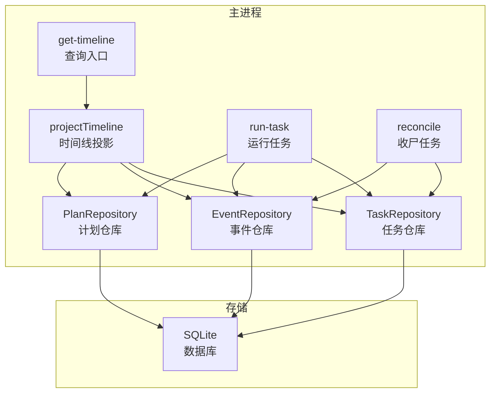
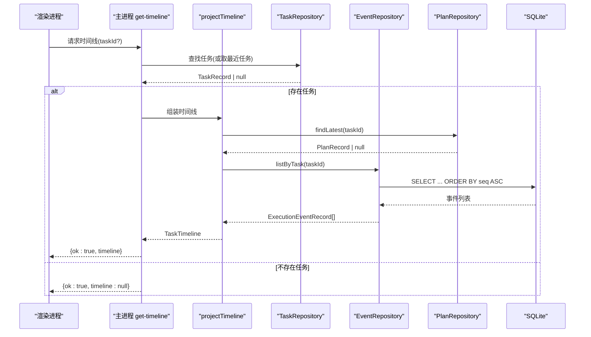
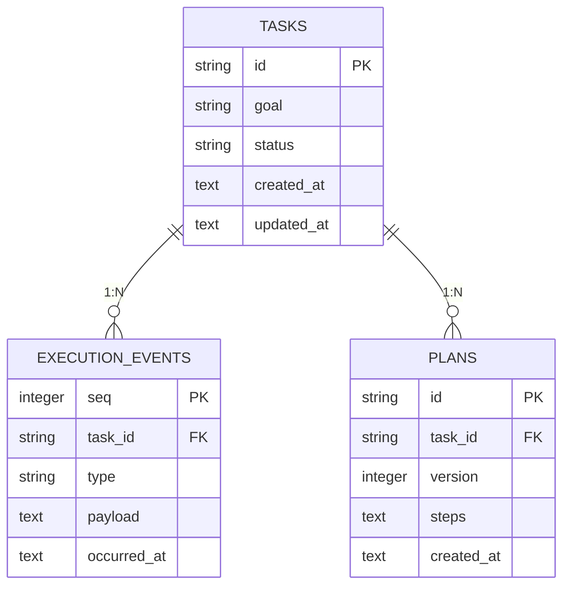
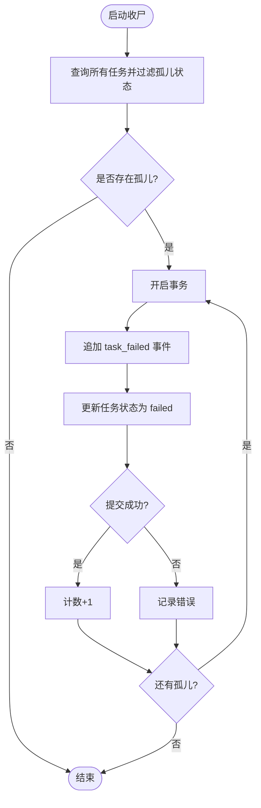
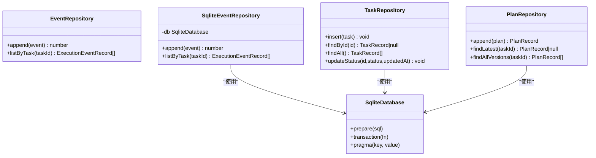
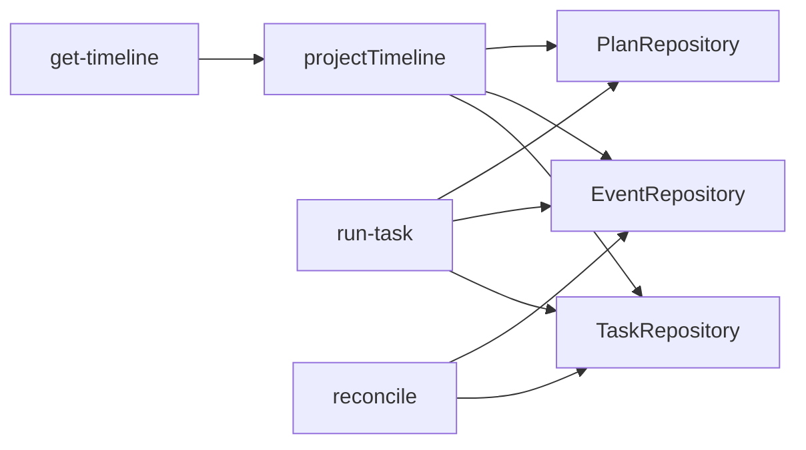

# 任务历史和时间线

<cite>
**本文引用的文件**
- [apps/desktop/src/main/product-state/timeline-projection.ts](file://apps/desktop/src/main/product-state/timeline-projection.ts)
- [apps/desktop/src/main/product-state/event-repository.ts](file://apps/desktop/src/main/product-state/event-repository.ts)
- [apps/desktop/src/main/product-state/task-repository.ts](file://apps/desktop/src/main/product-state/task-repository.ts)
- [apps/desktop/src/main/product-state/plan-repository.ts](file://apps/desktop/src/main/product-state/plan-repository.ts)
- [apps/desktop/src/main/product-state/database.ts](file://apps/desktop/src/main/product-state/database.ts)
- [apps/desktop/src/main/product-state/migrations/index.ts](file://apps/desktop/src/main/product-state/migrations/index.ts)
- [apps/desktop/src/main/product-state/migrations/0003-create-execution-events.ts](file://apps/desktop/src/main/product-state/migrations/0003-create-execution-events.ts)
- [apps/desktop/src/shared/domain.ts](file://apps/desktop/src/shared/domain.ts)
- [apps/desktop/src/shared/ipc-contract.ts](file://apps/desktop/src/shared/ipc-contract.ts)
- [apps/desktop/src/main/tasks/get-timeline.ts](file://apps/desktop/src/main/tasks/get-timeline.ts)
- [apps/desktop/src/main/tasks/reconcile.ts](file://apps/desktop/src/main/tasks/reconcile.ts)
- [apps/desktop/src/main/tasks/run-task.ts](file://apps/desktop/src/main/tasks/run-task.ts)
- [apps/desktop/src/main/product-state/timeline-projection.test.ts](file://apps/desktop/src/main/product-state/timeline-projection.test.ts)
- [apps/desktop/src/main/tasks/get-timeline.test.ts](file://apps/desktop/src/main/tasks/get-timeline.test.ts)
</cite>

## 目录
1. [简介](#简介)
2. [项目结构](#项目结构)
3. [核心组件](#核心组件)
4. [架构总览](#架构总览)
5. [详细组件分析](#详细组件分析)
6. [依赖关系分析](#依赖关系分析)
7. [性能考虑](#性能考虑)
8. [故障排查指南](#故障排查指南)
9. [结论](#结论)
10. [附录：使用示例](#附录使用示例)

## 简介
本技术文档围绕“任务历史和时间线”能力，系统阐述时间线数据模型、事件模型、状态转换与关系映射；说明时间线查询与优化机制（分页加载、过滤排序、性能调优）；介绍任务收尸机制（孤儿任务检测、状态恢复、数据一致性保证）；解释事件仓库的实现（数据存储、事务管理、并发控制）；并提供获取任务时间线、查询特定事件和处理历史数据的实践示例；最后说明时间线投影的计算逻辑与实时更新机制。

## 项目结构
该功能位于桌面端主进程侧的 product-state 层与 tasks 层，通过共享领域类型定义跨层契约，并通过 SQLite 持久化任务、计划与执行事件。关键路径包括：
- 领域与 IPC 契约：shared/domain.ts、shared/ipc-contract.ts
- 数据访问层：task-repository、event-repository、plan-repository、database
- 时间线投影：timeline-projection
- 任务编排与收尸：run-task、reconcile
- 查询入口：get-timeline

图表来源
- [apps/desktop/src/main/tasks/get-timeline.ts:1-53](file://apps/desktop/src/main/tasks/get-timeline.ts#L1-L53)
- [apps/desktop/src/main/product-state/timeline-projection.ts:1-24](file://apps/desktop/src/main/product-state/timeline-projection.ts#L1-L24)
- [apps/desktop/src/main/product-state/task-repository.ts:1-103](file://apps/desktop/src/main/product-state/task-repository.ts#L1-L103)
- [apps/desktop/src/main/product-state/event-repository.ts:1-68](file://apps/desktop/src/main/product-state/event-repository.ts#L1-L68)
- [apps/desktop/src/main/product-state/plan-repository.ts:1-86](file://apps/desktop/src/main/product-state/plan-repository.ts#L1-L86)
- [apps/desktop/src/main/product-state/database.ts:1-101](file://apps/desktop/src/main/product-state/database.ts#L1-L101)

章节来源
- [apps/desktop/src/main/tasks/get-timeline.ts:1-53](file://apps/desktop/src/main/tasks/get-timeline.ts#L1-L53)
- [apps/desktop/src/main/product-state/timeline-projection.ts:1-24](file://apps/desktop/src/main/product-state/timeline-projection.ts#L1-L24)
- [apps/desktop/src/main/product-state/database.ts:1-101](file://apps/desktop/src/main/product-state/database.ts#L1-L101)

## 核心组件
- 领域模型
  - 任务记录 TaskRecord：包含 id、goal、status、createdAt、updatedAt
  - 执行事件 ExecutionEventRecord：包含 seq、taskId、type、payload、occurredAt
  - 计划 PlanRecord/PlanStep：版本化步骤序列
  - 时间线 TaskTimeline：task + plan + events
- 仓库接口
  - TaskRepository：插入、按 ID 查找、全量查询、更新状态（含状态机校验）
  - EventRepository：追加事件、按任务列出事件
  - PlanRepository：追加新版本、取最新版本、全部版本
- 数据库与迁移
  - 统一打开/迁移/关闭 SQLite，设置 WAL 日志模式，迁移事务化并校验外键
- 时间线投影
  - 组合任务、最新计划、按 seq 升序的事件，形成只读视图
- 任务编排与收尸
  - run-task：创建任务、写入计划、调用运行时、落事件、更新状态，失败时写 task_failed 并标记 failed
  - reconcile：启动时扫描 running/waiting_permission 的“孤儿任务”，追加 task_failed 事件并置为 failed

章节来源
- [apps/desktop/src/shared/domain.ts:1-158](file://apps/desktop/src/shared/domain.ts#L1-L158)
- [apps/desktop/src/main/product-state/task-repository.ts:1-103](file://apps/desktop/src/main/product-state/task-repository.ts#L1-L103)
- [apps/desktop/src/main/product-state/event-repository.ts:1-68](file://apps/desktop/src/main/product-state/event-repository.ts#L1-L68)
- [apps/desktop/src/main/product-state/plan-repository.ts:1-86](file://apps/desktop/src/main/product-state/plan-repository.ts#L1-L86)
- [apps/desktop/src/main/product-state/database.ts:1-101](file://apps/desktop/src/main/product-state/database.ts#L1-L101)
- [apps/desktop/src/main/product-state/timeline-projection.ts:1-24](file://apps/desktop/src/main/product-state/timeline-projection.ts#L1-L24)
- [apps/desktop/src/main/tasks/run-task.ts:1-223](file://apps/desktop/src/main/tasks/run-task.ts#L1-L223)
- [apps/desktop/src/main/tasks/reconcile.ts:1-52](file://apps/desktop/src/main/tasks/reconcile.ts#L1-L52)

## 架构总览
时间线由“任务本体 + 最新计划 + 事件序列”组成，读取路径为 get-timeline → projectTimeline → 各仓库 → SQLite；写入路径为 run-task 与 reconcile 通过仓库写入，受数据库事务保护。

图表来源
- [apps/desktop/src/main/tasks/get-timeline.ts:1-53](file://apps/desktop/src/main/tasks/get-timeline.ts#L1-L53)
- [apps/desktop/src/main/product-state/timeline-projection.ts:1-24](file://apps/desktop/src/main/product-state/timeline-projection.ts#L1-L24)
- [apps/desktop/src/main/product-state/event-repository.ts:1-68](file://apps/desktop/src/main/product-state/event-repository.ts#L1-L68)
- [apps/desktop/src/main/product-state/plan-repository.ts:1-86](file://apps/desktop/src/main/product-state/plan-repository.ts#L1-L86)

## 详细组件分析

### 时间线数据结构与事件模型
- 任务状态机
  - 允许转换：pending→running；running→completed/failed/cancelled/waiting_permission；waiting_permission→running/failed；终态 completed/failed/cancelled 不可再变
- 事件模型
  - 事件表 execution_events：seq 自增主键、task_id 外键、type、payload(JSON)、occurred_at
  - 追加唯一性：触发器禁止 UPDATE/DELETE，确保 append-only
- 关系映射
  - 任务 1:N 事件；任务 1:N 计划版本；时间线 = 任务 + 最新计划 + 事件序列

图表来源
- [apps/desktop/src/main/product-state/migrations/0003-create-execution-events.ts:1-39](file://apps/desktop/src/main/product-state/migrations/0003-create-execution-events.ts#L1-L39)
- [apps/desktop/src/main/product-state/task-repository.ts:1-103](file://apps/desktop/src/main/product-state/task-repository.ts#L1-L103)
- [apps/desktop/src/main/product-state/plan-repository.ts:1-86](file://apps/desktop/src/main/product-state/plan-repository.ts#L1-L86)

章节来源
- [apps/desktop/src/shared/domain.ts:1-158](file://apps/desktop/src/shared/domain.ts#L1-L158)
- [apps/desktop/src/main/product-state/migrations/0003-create-execution-events.ts:1-39](file://apps/desktop/src/main/product-state/migrations/0003-create-execution-events.ts#L1-L39)
- [apps/desktop/src/main/product-state/task-repository.ts:1-103](file://apps/desktop/src/main/product-state/task-repository.ts#L1-L103)

### 时间线查询与优化机制
- 查询入口
  - get-timeline 支持指定 taskId 或 null（取最近创建的任务），非法输入返回协议错误
  - 不存在任务返回 ok:true 且 timeline:null，避免 UI 误判为错误
- 投影计算
  - projectTimeline 组合任务、最新计划、按 seq 升序的事件
- 分页加载
  - 当前实现未内置分页；可通过在 EventRepository.listByTask 中增加 LIMIT/OFFSET 参数扩展
- 过滤与排序
  - 默认按 seq 升序；可按 type 过滤、按 occurredAt 范围筛选（需在 SQL 层扩展）
- 性能调优
  - 索引：execution_events(task_id, seq) 已建立，利于按任务快速拉取有序事件
  - WAL 模式：提升并发读性能
  - 建议：对高频查询字段（如 type、occurred_at）可考虑复合索引；大任务事件集建议分页+增量同步

章节来源
- [apps/desktop/src/main/tasks/get-timeline.ts:1-53](file://apps/desktop/src/main/tasks/get-timeline.ts#L1-L53)
- [apps/desktop/src/main/product-state/timeline-projection.ts:1-24](file://apps/desktop/src/main/product-state/timeline-projection.ts#L1-L24)
- [apps/desktop/src/main/product-state/event-repository.ts:1-68](file://apps/desktop/src/main/product-state/event-repository.ts#L1-L68)
- [apps/desktop/src/main/product-state/migrations/0003-create-execution-events.ts:1-39](file://apps/desktop/src/main/product-state/migrations/0003-create-execution-events.ts#L1-L39)
- [apps/desktop/src/main/product-state/database.ts:1-101](file://apps/desktop/src/main/product-state/database.ts#L1-L101)

### 任务收尸机制
- 孤儿任务检测
  - 启动时扫描状态为 running 或 waiting_permission 的任务
- 状态恢复与一致性
  - 在数据库事务内追加 task_failed 事件（携带 ORPHANED 原因）并将任务状态更新为 failed
  - 若任一操作失败，整个事务回滚，保证“事件 + 状态”原子一致
- 消息语义
  - waiting_permission 场景提示：进程重启后挂起批准与过期定时器已随进程消失

图表来源
- [apps/desktop/src/main/tasks/reconcile.ts:1-52](file://apps/desktop/src/main/tasks/reconcile.ts#L1-L52)
- [apps/desktop/src/main/product-state/database.ts:1-101](file://apps/desktop/src/main/product-state/database.ts#L1-L101)

章节来源
- [apps/desktop/src/main/tasks/reconcile.ts:1-52](file://apps/desktop/src/main/tasks/reconcile.ts#L1-L52)
- [apps/desktop/src/main/product-state/database.ts:1-101](file://apps/desktop/src/main/product-state/database.ts#L1-L101)

### 事件仓库实现
- 数据存储
  - 事件以 JSON 字符串存储 payload，读取时解析为对象；非法 JSON 抛出错误
  - 列表查询按 seq 升序，保证时间线顺序稳定
- 事务管理
  - 通过 better-sqlite3 的 transaction 封装批量写入（如 run-task 的事务 A/B、reconcile 的事务）
- 并发控制
  - WAL 模式提升并发读；触发器禁止更新/删除事件，保障不可变性
  - 迁移阶段临时关闭外键检查并在完成后校验，防止迁移期间出现悬空引用

图表来源
- [apps/desktop/src/main/product-state/event-repository.ts:1-68](file://apps/desktop/src/main/product-state/event-repository.ts#L1-L68)
- [apps/desktop/src/main/product-state/task-repository.ts:1-103](file://apps/desktop/src/main/product-state/task-repository.ts#L1-L103)
- [apps/desktop/src/main/product-state/plan-repository.ts:1-86](file://apps/desktop/src/main/product-state/plan-repository.ts#L1-L86)
- [apps/desktop/src/main/product-state/database.ts:1-101](file://apps/desktop/src/main/product-state/database.ts#L1-L101)

章节来源
- [apps/desktop/src/main/product-state/event-repository.ts:1-68](file://apps/desktop/src/main/product-state/event-repository.ts#L1-L68)
- [apps/desktop/src/main/product-state/database.ts:1-101](file://apps/desktop/src/main/product-state/database.ts#L1-L101)

### 时间线投影与实时更新
- 投影逻辑
  - 组合任务、最新计划、事件序列；任务不存在返回 null；无计划返回 null；无事件返回空数组
- 实时更新
  - 每次写入通过数据库事务提交，下一次读取即反映最新状态
  - 测试覆盖：状态推进后再次投影立即更新；追加新计划版本后投影反映最新版本

章节来源
- [apps/desktop/src/main/product-state/timeline-projection.ts:1-24](file://apps/desktop/src/main/product-state/timeline-projection.ts#L1-L24)
- [apps/desktop/src/main/product-state/timeline-projection.test.ts:1-226](file://apps/desktop/src/main/product-state/timeline-projection.test.ts#L1-L226)

## 依赖关系分析
- 模块耦合
  - get-timeline 依赖三个仓库接口，解耦具体实现
  - projectTimeline 仅依赖仓库端口，便于注入内存 fake 进行单元测试
- 外部依赖
  - better-sqlite3 提供事务、WAL、触发器、索引等能力
- 循环依赖
  - 通过 shared 领域类型与 IPC 契约解耦主进程与渲染进程

图表来源
- [apps/desktop/src/main/tasks/get-timeline.ts:1-53](file://apps/desktop/src/main/tasks/get-timeline.ts#L1-L53)
- [apps/desktop/src/main/product-state/timeline-projection.ts:1-24](file://apps/desktop/src/main/product-state/timeline-projection.ts#L1-L24)
- [apps/desktop/src/main/tasks/run-task.ts:1-223](file://apps/desktop/src/main/tasks/run-task.ts#L1-L223)
- [apps/desktop/src/main/tasks/reconcile.ts:1-52](file://apps/desktop/src/main/tasks/reconcile.ts#L1-L52)

章节来源
- [apps/desktop/src/main/tasks/get-timeline.ts:1-53](file://apps/desktop/src/main/tasks/get-timeline.ts#L1-L53)
- [apps/desktop/src/main/product-state/timeline-projection.ts:1-24](file://apps/desktop/src/main/product-state/timeline-projection.ts#L1-L24)
- [apps/desktop/src/main/tasks/run-task.ts:1-223](file://apps/desktop/src/main/tasks/run-task.ts#L1-L223)
- [apps/desktop/src/main/tasks/reconcile.ts:1-52](file://apps/desktop/src/main/tasks/reconcile.ts#L1-L52)

## 性能考虑
- 索引策略
  - 已有 (task_id, seq) 索引，适合按任务拉取有序事件
  - 建议：如需按 type 过滤或按时间范围查询，可添加相应复合索引
- 事务粒度
  - 将“写事件 + 更新状态”放入同一事务，减少中间态与锁竞争
- 并发与 I/O
  - WAL 模式降低读阻塞；避免长事务持有写锁
- 可扩展性
  - 事件列表支持分页（LIMIT/OFFSET）与增量拉取（基于最大 seq）
  - 对超大任务可考虑分片存储或归档旧事件

[本节为通用指导，不直接分析具体文件]

## 故障排查指南
- 常见错误
  - 非法任务状态转换：抛出非法转换异常，检查状态机约束
  - 事件 payload 非合法 JSON：解析失败抛错，检查写入前序列化
  - 数据库锁定/失败：捕获并返回 RUNTIME_ERROR_CODE.DB_FAILED
- 定位方法
  - 查看 get-timeline 的错误码与 message
  - 检查 reconcile 是否已将孤儿任务标记为 failed 并追加事件
  - 确认迁移是否成功、外键检查是否通过

章节来源
- [apps/desktop/src/main/product-state/task-repository.ts:1-103](file://apps/desktop/src/main/product-state/task-repository.ts#L1-L103)
- [apps/desktop/src/main/product-state/event-repository.ts:1-68](file://apps/desktop/src/main/product-state/event-repository.ts#L1-L68)
- [apps/desktop/src/main/tasks/get-timeline.ts:1-53](file://apps/desktop/src/main/tasks/get-timeline.ts#L1-L53)
- [apps/desktop/src/main/tasks/reconcile.ts:1-52](file://apps/desktop/src/main/tasks/reconcile.ts#L1-L52)
- [apps/desktop/src/main/product-state/database.ts:1-101](file://apps/desktop/src/main/product-state/database.ts#L1-L101)

## 结论
时间线功能以“任务 + 计划 + 事件”为核心，通过仓库抽象与数据库事务保证一致性与可观测性；事件追加不可变、按 seq 排序，结合索引与 WAL 获得良好读取性能；收尸机制在进程重启后自动恢复孤儿任务状态，确保系统健壮性；未来可在事件查询层引入分页与过滤以提升大规模场景下的可用性。

[本节为总结，不直接分析具体文件]

## 附录：使用示例
以下示例展示如何获取任务时间线、查询特定事件和处理历史数据。为避免泄露实现细节，仅提供调用思路与预期结果描述。

- 获取某个任务的时间线
  - 调用 get-timeline 传入任务 ID
  - 期望返回 ok:true，timeline 包含任务、最新计划与按 seq 升序的事件
  - 参考用例：指定存在的 taskId 时返回任务与事件序列
- 获取最近一个任务的时间线
  - 调用 get-timeline 传入 null
  - 期望返回最近创建的任务及其事件
  - 参考用例：null 取的是 created_at 末条
- 处理不存在任务的情况
  - 传入不存在的 taskId
  - 期望返回 ok:true，timeline:null，UI 不应将其视为错误
- 查询特定事件
  - 在 EventRepository.listByTask 基础上扩展过滤条件（如 type、occurredAt 范围）
  - 建议在 SQL 层增加 WHERE 子句并按需分页
- 处理历史数据
  - 通过 PlanRepository.findAllVersions 获取计划演进
  - 通过事件序列重建任务执行过程，注意 payload 的结构窄化由读方完成

章节来源
- [apps/desktop/src/main/tasks/get-timeline.test.ts:1-245](file://apps/desktop/src/main/tasks/get-timeline.test.ts#L1-L245)
- [apps/desktop/src/main/product-state/timeline-projection.test.ts:1-226](file://apps/desktop/src/main/product-state/timeline-projection.test.ts#L1-L226)
- [apps/desktop/src/shared/ipc-contract.ts:1-75](file://apps/desktop/src/shared/ipc-contract.ts#L1-L75)