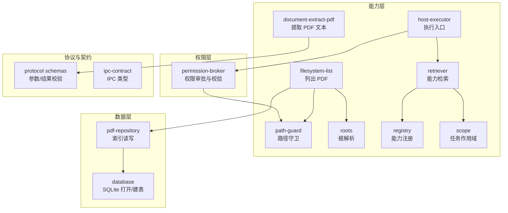
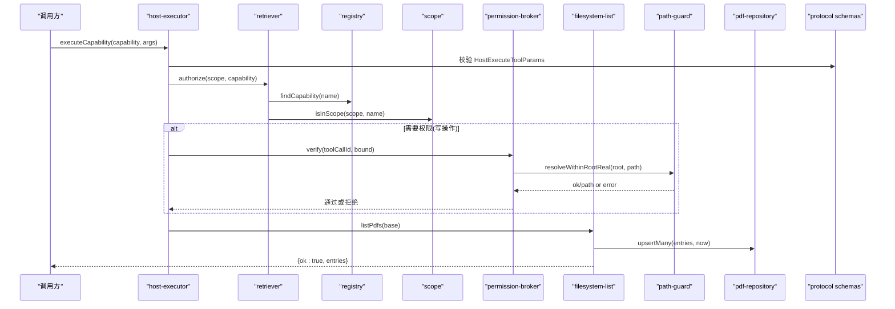
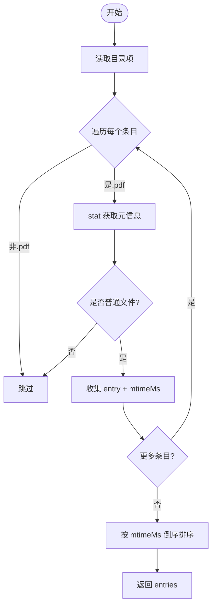
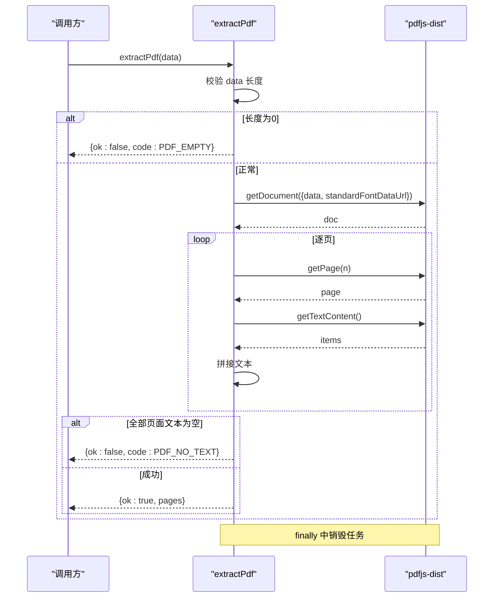
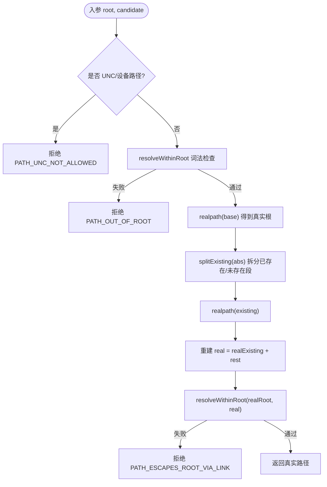
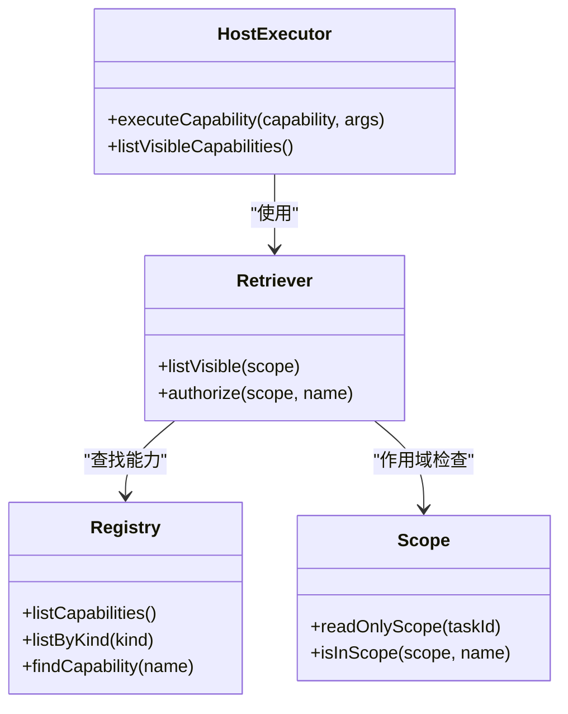
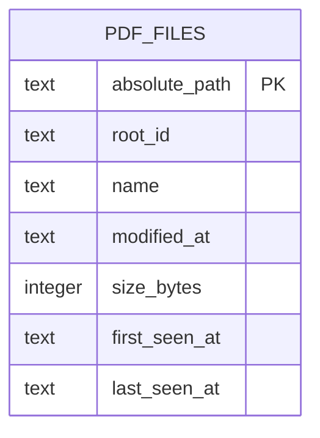
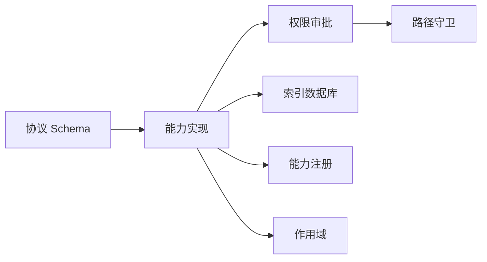

# 文件系统管理

<cite>
**本文引用的文件**
- [apps/desktop/src/main/capabilities/filesystem-list.ts](file://apps/desktop/src/main/capabilities/filesystem-list.ts)
- [apps/desktop/src/main/capabilities/path-guard.ts](file://apps/desktop/src/main/capabilities/path-guard.ts)
- [apps/desktop/src/main/capabilities/roots.ts](file://apps/desktop/src/main/capabilities/roots.ts)
- [apps/desktop/src/main/db/database.ts](file://apps/desktop/src/main/db/database.ts)
- [apps/desktop/src/main/db/pdf-repository.ts](file://apps/desktop/src/main/db/pdf-repository.ts)
- [apps/desktop/src/main/capabilities/document-extract-pdf.ts](file://apps/desktop/src/main/capabilities/document-extract-pdf.ts)
- [apps/desktop/src/main/capabilities/scope.ts](file://apps/desktop/src/main/capabilities/scope.ts)
- [apps/desktop/src/main/capabilities/registry.ts](file://apps/desktop/src/main/capabilities/registry.ts)
- [apps/desktop/src/main/capabilities/host-executor.ts](file://apps/desktop/src/main/capabilities/host-executor.ts)
- [apps/desktop/src/main/capabilities/retriever.ts](file://apps/desktop/src/main/capabilities/retriever.ts)
- [apps/desktop/src/main/permission/permission-broker.ts](file://apps/desktop/src/main/permission/permission-broker.ts)
- [packages/protocol/schemas/filesystem.ts](file://packages/protocol/schemas/filesystem.ts)
- [packages/protocol/schemas/document.ts](file://packages/protocol/schemas/document.ts)
- [apps/desktop/src/shared/ipc-contract.ts](file://apps/desktop/src/shared/ipc-contract.ts)
</cite>

## 目录
1. [简介](#简介)
2. [项目结构](#项目结构)
3. [核心组件](#核心组件)
4. [架构总览](#架构总览)
5. [详细组件分析](#详细组件分析)
6. [依赖关系分析](#依赖关系分析)
7. [性能考虑](#性能考虑)
8. [故障排查指南](#故障排查指南)
9. [结论](#结论)
10. [附录：使用示例与最佳实践](#附录使用示例与最佳实践)

## 简介
本技术文档围绕“文件系统管理”能力，系统性说明以下方面：
- 文件列表获取的实现原理：路径验证、权限检查、结果缓存机制。
- PDF 文档处理能力：文件扫描、索引构建、内容提取。
- 沙箱安全模型：根目录限制、路径守卫、访问控制。
- PDF 索引数据库设计：存储结构、查询优化、同步策略。
- 具体使用示例：列出文件、提取 PDF 内容、处理文件操作权限。
- 错误处理机制与性能优化策略。

## 项目结构
本项目采用分层与按能力组织的方式：
- capabilities：实现具体能力（如文件系统列表、PDF 提取、路径守卫、能力注册与检索）。
- db：SQLite 持久化与仓库层（PDF 索引库）。
- permission：权限审批流与执行前校验。
- shared：跨进程契约与类型定义。
- protocol：协议 Schema（参数与结果校验）。

图表来源
- [apps/desktop/src/main/capabilities/filesystem-list.ts:1-32](file://apps/desktop/src/main/capabilities/filesystem-list.ts#L1-L32)
- [apps/desktop/src/main/capabilities/document-extract-pdf.ts:1-69](file://apps/desktop/src/main/capabilities/document-extract-pdf.ts#L1-L69)
- [apps/desktop/src/main/capabilities/path-guard.ts:1-126](file://apps/desktop/src/main/capabilities/path-guard.ts#L1-L126)
- [apps/desktop/src/main/capabilities/roots.ts:1-27](file://apps/desktop/src/main/capabilities/roots.ts#L1-L27)
- [apps/desktop/src/main/capabilities/registry.ts:1-55](file://apps/desktop/src/main/capabilities/registry.ts#L1-L55)
- [apps/desktop/src/main/capabilities/retriever.ts:1-49](file://apps/desktop/src/main/capabilities/retriever.ts#L1-L49)
- [apps/desktop/src/main/capabilities/scope.ts:1-43](file://apps/desktop/src/main/capabilities/scope.ts#L1-L43)
- [apps/desktop/src/main/capabilities/host-executor.ts:1-118](file://apps/desktop/src/main/capabilities/host-executor.ts#L1-L118)
- [apps/desktop/src/main/permission/permission-broker.ts:1-328](file://apps/desktop/src/main/permission/permission-broker.ts#L1-L328)
- [apps/desktop/src/main/db/database.ts:1-58](file://apps/desktop/src/main/db/database.ts#L1-L58)
- [apps/desktop/src/main/db/pdf-repository.ts:1-67](file://apps/desktop/src/main/db/pdf-repository.ts#L1-L67)
- [packages/protocol/schemas/filesystem.ts:1-37](file://packages/protocol/schemas/filesystem.ts#L1-L37)
- [packages/protocol/schemas/document.ts:1-31](file://packages/protocol/schemas/document.ts#L1-L31)
- [apps/desktop/src/shared/ipc-contract.ts:1-103](file://apps/desktop/src/shared/ipc-contract.ts#L1-L103)

章节来源
- [apps/desktop/src/main/capabilities/filesystem-list.ts:1-32](file://apps/desktop/src/main/capabilities/filesystem-list.ts#L1-L32)
- [apps/desktop/src/main/capabilities/path-guard.ts:1-126](file://apps/desktop/src/main/capabilities/path-guard.ts#L1-L126)
- [apps/desktop/src/main/capabilities/roots.ts:1-27](file://apps/desktop/src/main/capabilities/roots.ts#L1-L27)
- [apps/desktop/src/main/db/database.ts:1-58](file://apps/desktop/src/main/db/database.ts#L1-L58)
- [apps/desktop/src/main/db/pdf-repository.ts:1-67](file://apps/desktop/src/main/db/pdf-repository.ts#L1-L67)
- [apps/desktop/src/main/capabilities/document-extract-pdf.ts:1-69](file://apps/desktop/src/main/capabilities/document-extract-pdf.ts#L1-L69)
- [apps/desktop/src/main/capabilities/scope.ts:1-43](file://apps/desktop/src/main/capabilities/scope.ts#L1-L43)
- [apps/desktop/src/main/capabilities/registry.ts:1-55](file://apps/desktop/src/main/capabilities/registry.ts#L1-L55)
- [apps/desktop/src/main/capabilities/host-executor.ts:1-118](file://apps/desktop/src/main/capabilities/host-executor.ts#L1-L118)
- [apps/desktop/src/main/capabilities/retriever.ts:1-49](file://apps/desktop/src/main/capabilities/retriever.ts#L1-L49)
- [apps/desktop/src/main/permission/permission-broker.ts:1-328](file://apps/desktop/src/main/permission/permission-broker.ts#L1-L328)
- [packages/protocol/schemas/filesystem.ts:1-37](file://packages/protocol/schemas/filesystem.ts#L1-L37)
- [packages/protocol/schemas/document.ts:1-31](file://packages/protocol/schemas/document.ts#L1-L31)
- [apps/desktop/src/shared/ipc-contract.ts:1-103](file://apps/desktop/src/shared/ipc-contract.ts#L1-L103)

## 核心组件
- 文件列表能力：扫描指定根目录下的 PDF 文件，过滤非 PDF、跳过目录、按修改时间倒序返回，并写入索引库用于缓存与后续查询。
- PDF 提取能力：基于 pdfjs-dist 读取二进制数据，逐页提取文本，处理空文件、损坏、加密、无文本等异常分支。
- 路径守卫：在词法层面与真实路径层面双重校验，确保所有访问均在授权根内，且不受符号链接/Junction 逃逸影响。
- 权限审批：对写操作（创建目录、移动）进行请求-审批-校验流程，包含过期、篡改检测与路径复查。
- 能力注册与作用域：集中声明能力清单，按 READ/WRITE 分类，结合任务作用域控制可见与可执行能力。
- 索引数据库：SQLite WAL 模式，统一建表与事务批量 upsert，提供按修改时间排序的查询接口。

章节来源
- [apps/desktop/src/main/capabilities/filesystem-list.ts:1-32](file://apps/desktop/src/main/capabilities/filesystem-list.ts#L1-L32)
- [apps/desktop/src/main/capabilities/document-extract-pdf.ts:1-69](file://apps/desktop/src/main/capabilities/document-extract-pdf.ts#L1-L69)
- [apps/desktop/src/main/capabilities/path-guard.ts:1-126](file://apps/desktop/src/main/capabilities/path-guard.ts#L1-L126)
- [apps/desktop/src/main/permission/permission-broker.ts:1-328](file://apps/desktop/src/main/permission/permission-broker.ts#L1-L328)
- [apps/desktop/src/main/capabilities/registry.ts:1-55](file://apps/desktop/src/main/capabilities/registry.ts#L1-L55)
- [apps/desktop/src/main/capabilities/scope.ts:1-43](file://apps/desktop/src/main/capabilities/scope.ts#L1-L43)
- [apps/desktop/src/main/db/database.ts:1-58](file://apps/desktop/src/main/db/database.ts#L1-L58)
- [apps/desktop/src/main/db/pdf-repository.ts:1-67](file://apps/desktop/src/main/db/pdf-repository.ts#L1-L67)

## 架构总览
下图展示了从调用入口到能力执行、权限校验、路径守卫、数据落库与协议校验的整体流程。

图表来源
- [apps/desktop/src/main/capabilities/host-executor.ts:1-118](file://apps/desktop/src/main/capabilities/host-executor.ts#L1-L118)
- [apps/desktop/src/main/capabilities/retriever.ts:1-49](file://apps/desktop/src/main/capabilities/retriever.ts#L1-L49)
- [apps/desktop/src/main/capabilities/registry.ts:1-55](file://apps/desktop/src/main/capabilities/registry.ts#L1-L55)
- [apps/desktop/src/main/capabilities/scope.ts:1-43](file://apps/desktop/src/main/capabilities/scope.ts#L1-L43)
- [apps/desktop/src/main/permission/permission-broker.ts:1-328](file://apps/desktop/src/main/permission/permission-broker.ts#L1-L328)
- [apps/desktop/src/main/capabilities/filesystem-list.ts:1-32](file://apps/desktop/src/main/capabilities/filesystem-list.ts#L1-L32)
- [apps/desktop/src/main/capabilities/path-guard.ts:1-126](file://apps/desktop/src/main/capabilities/path-guard.ts#L1-L126)
- [apps/desktop/src/main/db/pdf-repository.ts:1-67](file://apps/desktop/src/main/db/pdf-repository.ts#L1-L67)
- [packages/protocol/schemas/filesystem.ts:1-37](file://packages/protocol/schemas/filesystem.ts#L1-L37)

## 详细组件分析

### 文件列表能力（listPdfs）
- 功能要点
  - 仅列举当前目录（不递归），过滤非 .pdf 后缀（大小写不敏感）。
  - 使用 stat 确认是普通文件，避免将同名目录误纳入。
  - 收集 mtimeMs 作为稳定排序键，最终按修改时间倒序返回。
  - 输出字段包括 name、absolutePath（正斜杠绝对路径）、modifiedAt（秒精度 ISO 字符串）、sizeBytes。
- 路径与根
  - 根目录由 roots.resolveRoot 解析，支持环境变量覆盖，默认回退到用户 Downloads。
- 结果缓存
  - 每次列举后通过 pdf-repository.upsertMany 批量写入 SQLite，记录首次/最近出现时间与文件大小，便于后续查询与增量更新。
- 错误处理
  - 单个条目 stat 失败会被忽略，不影响其他条目；根不存在时抛出错误，由上层转换为明确错误码。

图表来源
- [apps/desktop/src/main/capabilities/filesystem-list.ts:1-32](file://apps/desktop/src/main/capabilities/filesystem-list.ts#L1-L32)
- [apps/desktop/src/main/capabilities/roots.ts:1-27](file://apps/desktop/src/main/capabilities/roots.ts#L1-L27)
- [apps/desktop/src/main/db/pdf-repository.ts:1-67](file://apps/desktop/src/main/db/pdf-repository.ts#L1-L67)

章节来源
- [apps/desktop/src/main/capabilities/filesystem-list.ts:1-32](file://apps/desktop/src/main/capabilities/filesystem-list.ts#L1-L32)
- [apps/desktop/src/main/capabilities/roots.ts:1-27](file://apps/desktop/src/main/capabilities/roots.ts#L1-L27)
- [apps/desktop/src/main/db/pdf-repository.ts:1-67](file://apps/desktop/src/main/db/pdf-repository.ts#L1-L67)

### PDF 内容提取（extractPdf）
- 功能要点
  - 输入为 Uint8Array（兼容 Buffer），零字节直接返回 PDF_EMPTY。
  - 使用 pdfjs-dist 加载文档，逐页获取文本内容，组装 PageText 列表。
  - 若所有页面文本为空，返回 PDF_NO_TEXT（可能是扫描件）。
  - 捕获密码保护与损坏异常，分别返回 PDF_ENCRYPTED 与 PDF_CORRUPT。
  - 资源清理：finally 中销毁任务，避免内存泄漏。
- 字体资源
  - 通过标准字体数据 URL 指向 pdfjs-dist 包内的 standard_fonts 目录，保证渲染一致性。

图表来源
- [apps/desktop/src/main/capabilities/document-extract-pdf.ts:1-69](file://apps/desktop/src/main/capabilities/document-extract-pdf.ts#L1-L69)
- [packages/protocol/schemas/document.ts:1-31](file://packages/protocol/schemas/document.ts#L1-L31)

章节来源
- [apps/desktop/src/main/capabilities/document-extract-pdf.ts:1-69](file://apps/desktop/src/main/capabilities/document-extract-pdf.ts#L1-L69)
- [packages/protocol/schemas/document.ts:1-31](file://packages/protocol/schemas/document.ts#L1-L31)

### 路径守卫与沙箱安全模型
- 根目录限制
  - roots.resolveRoot 根据 rootId 解析实际根路径，支持环境变量覆盖，统一为正斜杠绝对路径。
- 路径守卫
  - resolveWithinRoot：纯字符串规范化与边界检查，防止 .. 逃逸、兄弟目录前缀漏洞、相对路径落到 cwd 等。
  - splitExisting：拆分“最近存在的祖先”与“剩余未创建段”，以便在不存在的目标上也能做安全判定。
  - resolveWithinRootReal：先拒绝 UNC/设备路径，再做 realpath 解链接后的二次校验，防止 junction/symlink 逃逸。
- 访问控制
  - 权限审批在执行前进行六步验证：存在性、状态、过期、toolCallId、参数指纹、路径复查。
  - 写操作（创建目录、移动）必须经过 permission-broker 批准，并在 verify 阶段再次用 resolveWithinRootReal 校验源/目标路径。

图表来源
- [apps/desktop/src/main/capabilities/path-guard.ts:1-126](file://apps/desktop/src/main/capabilities/path-guard.ts#L1-L126)
- [apps/desktop/src/main/capabilities/roots.ts:1-27](file://apps/desktop/src/main/capabilities/roots.ts#L1-L27)
- [apps/desktop/src/main/permission/permission-broker.ts:1-328](file://apps/desktop/src/main/permission/permission-broker.ts#L1-L328)

章节来源
- [apps/desktop/src/main/capabilities/path-guard.ts:1-126](file://apps/desktop/src/main/capabilities/path-guard.ts#L1-L126)
- [apps/desktop/src/main/capabilities/roots.ts:1-27](file://apps/desktop/src/main/capabilities/roots.ts#L1-L27)
- [apps/desktop/src/main/permission/permission-broker.ts:1-328](file://apps/desktop/src/main/permission/permission-broker.ts#L1-L328)

### 能力注册、作用域与执行入口
- 能力注册
  - registry 集中声明能力名、种类（READ/WRITE）与描述。
- 作用域
  - scope 提供 readOnlyScope，仅暴露 READ 类能力；isInScope 判断能力是否在任务作用域内。
- 检索器
  - retriever 基于规则实现 listVisible 与 authorize，未注册或越权会返回明确的拒绝原因。
- 执行入口
  - host-executor 维护 agent 与 UI 两套 executor，统一走 createExecutor；executeCapability 负责 IPC 入口的参数校验与转发。

图表来源
- [apps/desktop/src/main/capabilities/registry.ts:1-55](file://apps/desktop/src/main/capabilities/registry.ts#L1-L55)
- [apps/desktop/src/main/capabilities/scope.ts:1-43](file://apps/desktop/src/main/capabilities/scope.ts#L1-L43)
- [apps/desktop/src/main/capabilities/retriever.ts:1-49](file://apps/desktop/src/main/capabilities/retriever.ts#L1-L49)
- [apps/desktop/src/main/capabilities/host-executor.ts:1-118](file://apps/desktop/src/main/capabilities/host-executor.ts#L1-L118)

章节来源
- [apps/desktop/src/main/capabilities/registry.ts:1-55](file://apps/desktop/src/main/capabilities/registry.ts#L1-L55)
- [apps/desktop/src/main/capabilities/scope.ts:1-43](file://apps/desktop/src/main/capabilities/scope.ts#L1-L43)
- [apps/desktop/src/main/capabilities/retriever.ts:1-49](file://apps/desktop/src/main/capabilities/retriever.ts#L1-L49)
- [apps/desktop/src/main/capabilities/host-executor.ts:1-118](file://apps/desktop/src/main/capabilities/host-executor.ts#L1-L118)

### PDF 索引数据库设计
- 存储结构
  - 表 pdf_files 主键 absolute_path，包含 root_id、name、modified_at、size_bytes、first_seen_at、last_seen_at。
- 查询优化
  - 按 modified_at DESC 排序查询，适合“最新优先”的展示需求。
  - WAL 模式提升并发与稳定性。
- 同步策略
  - upsertMany 使用事务批量插入/更新，减少 IO 次数；findAll 返回扩展字段（rootId、首次/最近出现时间）。

图表来源
- [apps/desktop/src/main/db/database.ts:1-58](file://apps/desktop/src/main/db/database.ts#L1-L58)
- [apps/desktop/src/main/db/pdf-repository.ts:1-67](file://apps/desktop/src/main/db/pdf-repository.ts#L1-L67)

章节来源
- [apps/desktop/src/main/db/database.ts:1-58](file://apps/desktop/src/main/db/database.ts#L1-L58)
- [apps/desktop/src/main/db/pdf-repository.ts:1-67](file://apps/desktop/src/main/db/pdf-repository.ts#L1-L67)

## 依赖关系分析
- 能力层依赖协议 Schema 进行参数与结果校验，确保跨进程通信的数据一致性。
- 权限层依赖路径守卫进行执行前路径复查，确保写操作不会越界。
- 数据层通过 better-sqlite3 提供本地持久化，WAL 模式提升性能与可靠性。
- 能力注册与作用域解耦了“能做什么”和“允许谁做”，增强安全性与可维护性。

图表来源
- [packages/protocol/schemas/filesystem.ts:1-37](file://packages/protocol/schemas/filesystem.ts#L1-L37)
- [packages/protocol/schemas/document.ts:1-31](file://packages/protocol/schemas/document.ts#L1-L31)
- [apps/desktop/src/main/capabilities/filesystem-list.ts:1-32](file://apps/desktop/src/main/capabilities/filesystem-list.ts#L1-L32)
- [apps/desktop/src/main/capabilities/document-extract-pdf.ts:1-69](file://apps/desktop/src/main/capabilities/document-extract-pdf.ts#L1-L69)
- [apps/desktop/src/main/permission/permission-broker.ts:1-328](file://apps/desktop/src/main/permission/permission-broker.ts#L1-L328)
- [apps/desktop/src/main/capabilities/path-guard.ts:1-126](file://apps/desktop/src/main/capabilities/path-guard.ts#L1-L126)
- [apps/desktop/src/main/db/pdf-repository.ts:1-67](file://apps/desktop/src/main/db/pdf-repository.ts#L1-L67)
- [apps/desktop/src/main/capabilities/registry.ts:1-55](file://apps/desktop/src/main/capabilities/registry.ts#L1-L55)
- [apps/desktop/src/main/capabilities/scope.ts:1-43](file://apps/desktop/src/main/capabilities/scope.ts#L1-L43)

章节来源
- [packages/protocol/schemas/filesystem.ts:1-37](file://packages/protocol/schemas/filesystem.ts#L1-L37)
- [packages/protocol/schemas/document.ts:1-31](file://packages/protocol/schemas/document.ts#L1-L31)
- [apps/desktop/src/main/capabilities/filesystem-list.ts:1-32](file://apps/desktop/src/main/capabilities/filesystem-list.ts#L1-L32)
- [apps/desktop/src/main/capabilities/document-extract-pdf.ts:1-69](file://apps/desktop/src/main/capabilities/document-extract-pdf.ts#L1-L69)
- [apps/desktop/src/main/permission/permission-broker.ts:1-328](file://apps/desktop/src/main/permission/permission-broker.ts#L1-L328)
- [apps/desktop/src/main/capabilities/path-guard.ts:1-126](file://apps/desktop/src/main/capabilities/path-guard.ts#L1-L126)
- [apps/desktop/src/main/db/pdf-repository.ts:1-67](file://apps/desktop/src/main/db/pdf-repository.ts#L1-L67)
- [apps/desktop/src/main/capabilities/registry.ts:1-55](file://apps/desktop/src/main/capabilities/registry.ts#L1-L55)
- [apps/desktop/src/main/capabilities/scope.ts:1-43](file://apps/desktop/src/main/capabilities/scope.ts#L1-L43)

## 性能考虑
- 文件列举
  - 使用 mtimeMs 作为排序键，避免字符串比较导致的不稳定排序。
  - 仅统计顶层目录，避免递归带来的 I/O 放大。
  - 批量 upsert 写入索引库，减少事务开销。
- PDF 提取
  - 零字节快速失败，避免无效解析。
  - 逐页处理，及时释放资源（finally 销毁任务）。
  - 使用标准字体数据 URL，减少额外下载与解析成本。
- 数据库
  - WAL 模式提高并发写入与崩溃恢复能力。
  - 按 modified_at 排序查询，满足常见“最新优先”场景。
- 权限审批
  - 参数指纹与 toolCallId 防篡改，减少重复审批与无效执行。
  - 过期窗口控制，避免长时间挂起占用资源。

[本节为通用性能建议，不直接分析具体文件]

## 故障排查指南
- 文件列表
  - 根目录不存在：抛出错误，由上层转为 FILESYSTEM_ROOT_UNAVAILABLE；不要静默返回空数组，以免掩盖配置错误。
  - 单个条目 stat 失败：被忽略，不影响其余条目；检查权限或文件有效性。
- PDF 提取
  - PDF_EMPTY：输入为零字节，检查上游读取逻辑。
  - PDF_CORRUPT：结构损坏，检查文件完整性。
  - PDF_ENCRYPTED：加密保护，提示用户提供密码或移除保护。
  - PDF_NO_TEXT：无文本层（可能为扫描件），考虑 OCR 方案。
- 路径守卫
  - PATH_OUT_OF_ROOT：路径不在授权根内，检查传入路径与根配置。
  - PATH_ESCAPES_ROOT_VIA_LINK：符号链接/Junction 逃逸，检查链接目标。
  - PATH_UNC_NOT_ALLOWED：不接受 UNC/设备路径，改用本地路径。
- 权限审批
  - PERMISSION_EXPIRED：超过审批窗口，重新发起请求。
  - PERMISSION_DENIED：用户拒绝或未批准，检查审批流程。
  - PERMISSION_TAMPERED：toolCallId 或参数指纹不一致，检查调用链路与参数绑定。

章节来源
- [apps/desktop/src/main/capabilities/filesystem-list.ts:1-32](file://apps/desktop/src/main/capabilities/filesystem-list.ts#L1-L32)
- [apps/desktop/src/main/capabilities/document-extract-pdf.ts:1-69](file://apps/desktop/src/main/capabilities/document-extract-pdf.ts#L1-L69)
- [apps/desktop/src/main/capabilities/path-guard.ts:1-126](file://apps/desktop/src/main/capabilities/path-guard.ts#L1-L126)
- [apps/desktop/src/main/permission/permission-broker.ts:1-328](file://apps/desktop/src/main/permission/permission-broker.ts#L1-L328)

## 结论
本文件系统管理能力通过“能力注册+作用域+权限审批+路径守卫”的多层防护，确保在受控范围内进行文件操作；通过“列举+索引+提取”的组合，实现对 PDF 文件的发现、缓存与内容利用。整体设计兼顾安全性、可维护性与性能，适用于桌面端自动化与智能体工具调用场景。

[本节为总结性内容，不直接分析具体文件]

## 附录：使用示例与最佳实践
- 列出文件
  - 调用入口：通过 host-executor.executeCapability 触发 filesystem.list。
  - 参数校验：遵循 packages/protocol/schemas/filesystem.ts 定义的 FilesystemListParams。
  - 结果处理：接收 ListPdfsResult，包含 entries 数组；若失败则携带 IpcErrorCode 与 message。
  - 参考契约：apps/desktop/src/shared/ipc-contract.ts 中的 ListPdfsResult。
- 提取 PDF 内容
  - 调用入口：通过 host-executor.executeCapability 触发 document.extract_pdf。
  - 参数校验：遵循 packages/protocol/schemas/document.ts 定义的 DocumentExtractPdfParams。
  - 结果处理：接收 DocumentExtractPdfOutcome，区分成功与失败分支（含 PDF_EMPTY/CORRUPT/ENCRYPTED/NO_TEXT）。
- 处理文件操作权限
  - 写操作（创建目录、移动）需经 permission-broker.request 发起审批，等待 respond 决策。
  - 执行前调用 verify 进行六步验证，包括路径复查（resolveWithinRootReal）。
  - 注意审批过期与参数指纹一致性，避免 PERMISSION_EXPIRED 或 PERMISSION_TAMPERED。

章节来源
- [apps/desktop/src/main/capabilities/host-executor.ts:1-118](file://apps/desktop/src/main/capabilities/host-executor.ts#L1-L118)
- [packages/protocol/schemas/filesystem.ts:1-37](file://packages/protocol/schemas/filesystem.ts#L1-L37)
- [packages/protocol/schemas/document.ts:1-31](file://packages/protocol/schemas/document.ts#L1-L31)
- [apps/desktop/src/shared/ipc-contract.ts:1-103](file://apps/desktop/src/shared/ipc-contract.ts#L1-L103)
- [apps/desktop/src/main/permission/permission-broker.ts:1-328](file://apps/desktop/src/main/permission/permission-broker.ts#L1-L328)