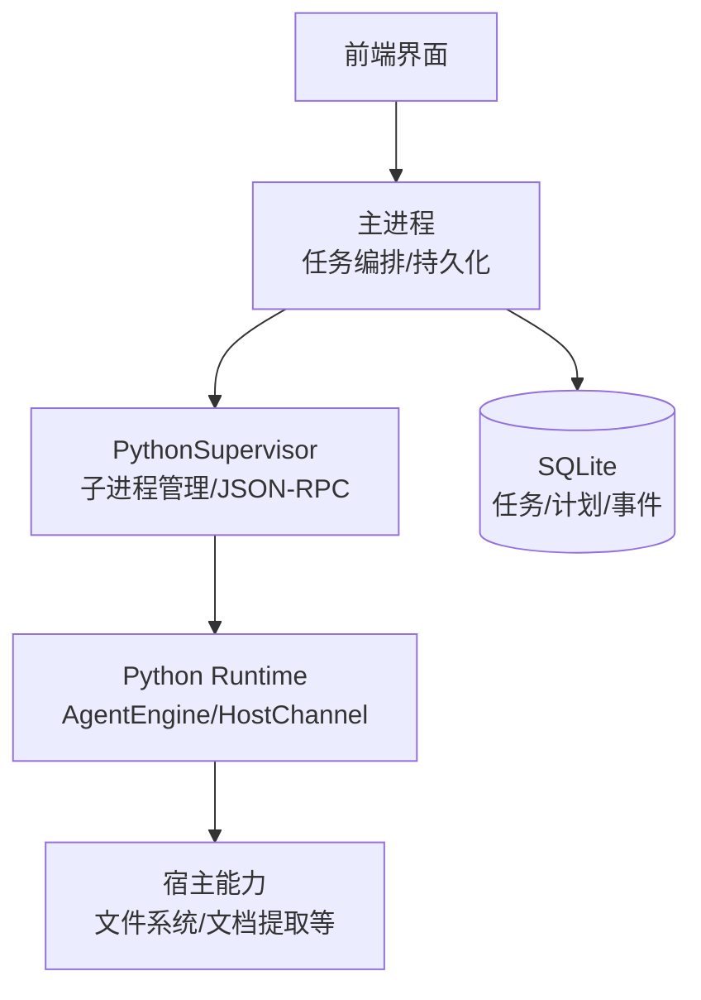
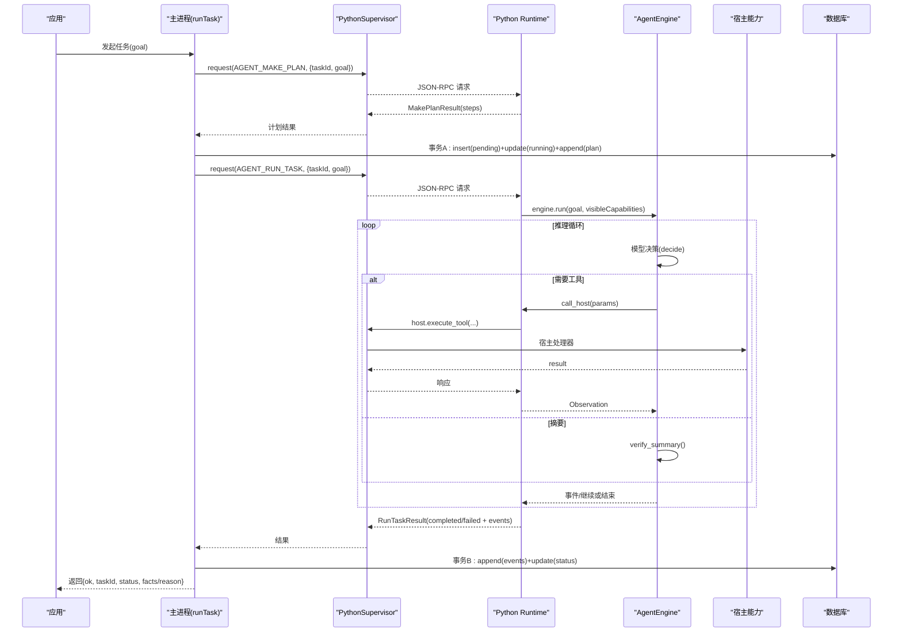
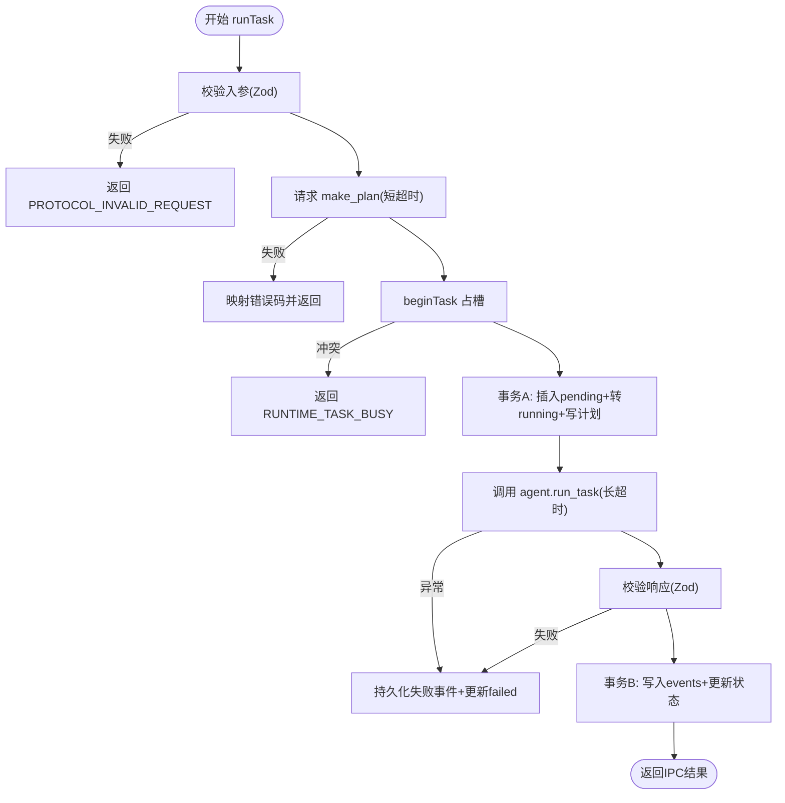
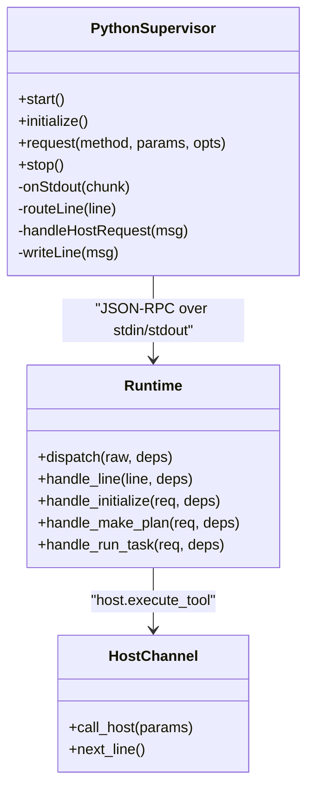
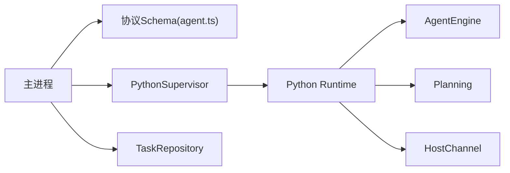

# 智能任务执行引擎

<cite>
**本文引用的文件**
- [run-task.ts](file://apps/desktop/src/main/tasks/run-task.ts)
- [python-supervisor.ts](file://apps/desktop/src/main/runtime/python-supervisor.ts)
- [error-code.ts](file://apps/desktop/src/main/runtime/error-code.ts)
- [task-repository.ts](file://apps/desktop/src/main/product-state/task-repository.ts)
- [runtime.py](file://services/agent-runtime/src/personal_agent/runtime.py)
- [engine.py](file://services/agent-runtime/src/personal_agent/engine.py)
- [host_channel.py](file://services/agent-runtime/src/personal_agent/host_channel.py)
- [planning.py](file://services/agent-runtime/src/personal_agent/planning.py)
- [agent.ts](file://packages/protocol/schemas/agent.ts)
</cite>

## 目录
1. [简介](#简介)
2. [项目结构](#项目结构)
3. [核心组件](#核心组件)
4. [架构总览](#架构总览)
5. [详细组件分析](#详细组件分析)
6. [依赖关系分析](#依赖关系分析)
7. [性能与并发](#性能与并发)
8. [故障排查指南](#故障排查指南)
9. [结论](#结论)
10. [附录：示例与最佳实践](#附录示例与最佳实践)

## 简介
本技术文档面向“智能任务执行引擎”，系统性阐述 AI 推理流程、任务规划算法、工具调用机制与执行策略；深入解析 runTask 函数的实现逻辑（任务状态管理、错误处理、超时控制）；说明 Python 运行时与主进程的通信协议（JSON-RPC 消息格式与错误处理）；覆盖任务生命周期（创建到完成）、重试机制、并发控制与资源管理策略，并提供可操作的示例路径以便快速上手。

## 项目结构
本项目采用前后端分离的桌面应用架构：
- 主进程（Electron Main）负责任务编排、持久化、权限与策略、Python 子进程管理与 JSON-RPC 通信。
- Python 运行时作为独立子进程，提供 Agent 推理循环、计划生成、工具调用桥接。
- 共享协议包定义两端契约（Zod schema），保证 TS 与 Python 之间的类型安全。

图表来源
- [run-task.ts:105-341](file://apps/desktop/src/main/tasks/run-task.ts#L105-L341)
- [python-supervisor.ts:66-356](file://apps/desktop/src/main/runtime/python-supervisor.ts#L66-L356)
- [runtime.py:158-184](file://services/agent-runtime/src/personal_agent/runtime.py#L158-L184)
- [engine.py:91-244](file://services/agent-runtime/src/personal_agent/engine.py#L91-L244)
- [task-repository.ts:81-103](file://apps/desktop/src/main/product-state/task-repository.ts#L81-L103)

章节来源
- [run-task.ts:105-341](file://apps/desktop/src/main/tasks/run-task.ts#L105-L341)
- [python-supervisor.ts:66-356](file://apps/desktop/src/main/runtime/python-supervisor.ts#L66-L356)
- [runtime.py:158-184](file://services/agent-runtime/src/personal_agent/runtime.py#L158-L184)
- [engine.py:91-244](file://services/agent-runtime/src/personal_agent/engine.py#L91-L244)
- [task-repository.ts:81-103](file://apps/desktop/src/main/product-state/task-repository.ts#L81-L103)

## 核心组件
- 任务编排器（runTask）：负责索要计划、建任务、写计划、调用 Python 运行、落库事件并更新状态。
- Python 运行时（runtime.py）：JSON-RPC 分发、握手、计划生成、任务执行入口。
- Agent 引擎（engine.py）：最小 Agent Loop，预算控制、模型决策、工具调用与结果回传。
- 宿主通道（host_channel.py）：封装 host.execute_tool 的请求/响应循环与异常语义。
- 子进程监督器（python-supervisor.ts）：启动/停止 Python 进程、维护请求挂起表、超时与崩溃处理、反向 RPC 路由。
- 数据持久化（task-repository.ts 等）：任务状态机、事务性写入、非法转换保护。

章节来源
- [run-task.ts:105-341](file://apps/desktop/src/main/tasks/run-task.ts#L105-L341)
- [runtime.py:69-184](file://services/agent-runtime/src/personal_agent/runtime.py#L69-L184)
- [engine.py:91-244](file://services/agent-runtime/src/personal_agent/engine.py#L91-L244)
- [host_channel.py:36-91](file://services/agent-runtime/src/personal_agent/host_channel.py#L36-L91)
- [python-supervisor.ts:66-356](file://apps/desktop/src/main/runtime/python-supervisor.ts#L66-L356)
- [task-repository.ts:13-36](file://apps/desktop/src/main/product-state/task-repository.ts#L13-L36)

## 架构总览
端到端执行流：
1) 主进程接收任务目标，调用 runTask。
2) runTask 先向 Python 请求 make_plan（带超时），拿到三步计划后进入占槽（单任务并发限制）。
3) 在事务中插入 pending→running 的任务记录并追加计划。
4) 通过 supervisor.request 调用 agent.run_task（带超时），Python 侧以 AgentEngine 驱动推理循环。
5) 引擎根据模型决策决定摘要或工具调用；工具调用经 HostChannel → 主进程宿主处理器 → 返回结果。
6) 引擎产出事件与最终结果（completed/failed），主进程先落事件（状态仍在 running），再由交付物闸口（TASK-026）判定后翻终态。

图表来源
- [run-task.ts:105-341](file://apps/desktop/src/main/tasks/run-task.ts#L105-L341)
- [python-supervisor.ts:129-200](file://apps/desktop/src/main/runtime/python-supervisor.ts#L129-L200)
- [runtime.py:128-184](file://services/agent-runtime/src/personal_agent/runtime.py#L128-L184)
- [engine.py:104-177](file://services/agent-runtime/src/personal_agent/engine.py#L104-L177)
- [host_channel.py:45-85](file://services/agent-runtime/src/personal_agent/host_channel.py#L45-L85)

## 详细组件分析

### runTask 函数：任务编排与状态管理
- 参数校验：使用 Zod 校验入参，失败直接返回协议级错误。
- 计划先行：先请求 make_plan（短超时），失败则透传 Python 的错误码（如 PLAN_NOT_BUILDABLE）。
- 任务占槽：beginTask 确保同一时刻仅一个任务在执行（单槽设计），冲突时返回 TASK_BUSY。
- 事务 A：插入 pending 任务、转为 running、追加计划步骤。
- 调用 Python：request(AGENT_RUN_TASK)，捕获 RuntimeError 并持久化失败事件。
- 事务 B1/B2：B1 批量写入事件 + verification_started（状态仍是 running）；交付物判定跑完，B2 写校验报告并按 GATE_OUTCOMES 翻 completed/failed——completed 只能由闸口翻转。
- 返回值：统一为 IPC 结果对象，包含 ok、taskId、status、facts/reason。

图表来源
- [run-task.ts:105-341](file://apps/desktop/src/main/tasks/run-task.ts#L105-L341)
- [error-code.ts:1-18](file://apps/desktop/src/main/runtime/error-code.ts#L1-L18)

章节来源
- [run-task.ts:105-341](file://apps/desktop/src/main/tasks/run-task.ts#L105-L341)
- [error-code.ts:1-18](file://apps/desktop/src/main/runtime/error-code.ts#L1-L18)
- [task-repository.ts:13-36](file://apps/desktop/src/main/product-state/task-repository.ts#L13-L36)

### Python 运行时与主进程通信协议
- 传输协议：基于标准输入输出的行式 JSON-RPC 2.0，每行一条消息。
- 握手：system.initialize 交换协议版本与能力清单。
- 方法：
  - agent.make_plan：确定性计划生成，不依赖模型配置。
  - agent.run_task：启动 AgentEngine 执行推理循环。
  - system.ping：健康检查。
- 反向 RPC：host.execute_tool 由 Python 侧发起，主进程通过 supervisor.handleHostRequest 路由到宿主处理器，支持超时与错误响应。
- 错误处理：
  - 请求/响应不符合契约：PROTOCOL_INVALID_REQUEST / PROTOCOL_INVALID_RESPONSE。
  - 未知方法：METHOD_NOT_FOUND。
  - 运行时内部错误：RUNTIME_INTERNAL。
  - 子进程崩溃/超时/取消：由 supervisor 抛出 RuntimeError(code)。

图表来源
- [python-supervisor.ts:66-356](file://apps/desktop/src/main/runtime/python-supervisor.ts#L66-L356)
- [runtime.py:69-184](file://services/agent-runtime/src/personal_agent/runtime.py#L69-L184)
- [host_channel.py:36-91](file://services/agent-runtime/src/personal_agent/host_channel.py#L36-L91)

章节来源
- [python-supervisor.ts:66-356](file://apps/desktop/src/main/runtime/python-supervisor.ts#L66-L356)
- [runtime.py:69-184](file://services/agent-runtime/src/personal_agent/runtime.py#L69-L184)
- [host_channel.py:36-91](file://services/agent-runtime/src/personal_agent/host_channel.py#L36-L91)
- [agent.ts:1-138](file://packages/protocol/schemas/agent.ts#L1-L138)

### 任务规划算法
- 确定性三步计划：列出 PDF → 提取文本 → 生成带页码引用的摘要。
- 能力校验：若可见能力缺失所需能力（如 filesystem.list、document.extract_pdf），抛出 PlanError，主进程将其映射为 PLAN_NOT_BUILDABLE。
- 计划不可变：后续 tool call 必须按此顺序对齐，避免基准漂移。

章节来源
- [planning.py:54-77](file://services/agent-runtime/src/personal_agent/planning.py#L54-L77)
- [runtime.py:128-155](file://services/agent-runtime/src/personal_agent/runtime.py#L128-L155)
- [agent.ts:7-28](file://packages/protocol/schemas/agent.ts#L7-L28)

### 工具调用机制与执行策略
- 模型决策：Engine 通过 ModelGateway.decide 决定下一步是工具调用还是摘要。
- 工具调用：HostChannel.call_host 发送 host.execute_tool，阻塞等待对应 id 的响应；非匹配消息放入 inbox 暂存。
- 宿主处理：supervisor.handleHostRequest 将请求转发给注入的宿主处理器，支持超时与错误包装。
- 结果回传：Engine 将观察结果记录到 ContextManager，用于后续决策与摘要验证。

章节来源
- [engine.py:216-244](file://services/agent-runtime/src/personal_agent/engine.py#L216-L244)
- [host_channel.py:45-85](file://services/agent-runtime/src/personal_agent/host_channel.py#L45-L85)
- [python-supervisor.ts:258-314](file://apps/desktop/src/main/runtime/python-supervisor.ts#L258-L314)

### 任务生命周期管理
- 状态机：pending → running → completed/failed/cancelled/waiting_permission；completed 的唯一触发者是交付物闸口（缺任一必需交付物即拒绝，判不通过落 failed + RUNTIME_VERIFICATION_FAILED）。
- 事务性写入：任务创建与计划写入在同一事务；结果事件与状态更新在同一事务。
- 事件追踪：每次工具调用、结果、预算耗尽、任务完成/失败均产生事件，供时间线回放。

章节来源
- [task-repository.ts:13-36](file://apps/desktop/src/main/product-state/task-repository.ts#L13-L36)
- [run-task.ts:154-223](file://apps/desktop/src/main/tasks/run-task.ts#L154-L223)
- [engine.py:104-177](file://services/agent-runtime/src/personal_agent/engine.py#L104-L177)

### 超时控制与错误处理
- 主进程侧：
  - make_plan 短超时（快速失败，避免卡死）。
  - run_task 长超时（防止子进程无响应）。
  - supervisor.request 支持默认超时与 AbortSignal 取消。
  - 错误码映射：Python 返回的 code 若不在已知集合，降级为 CRASHED，便于 UI 识别。
- Python 侧：
  - 预算控制：maxSteps/maxToolCalls 超限即失败。
  - 通道关闭：stdin EOF 视为 HostChannelClosed。
  - 宿主错误：HostRequestFailed 携带 code/message，Engine 统一转为失败事件。

章节来源
- [run-task.ts:20-37](file://apps/desktop/src/main/tasks/run-task.ts#L20-L37)
- [python-supervisor.ts:156-200](file://apps/desktop/src/main/runtime/python-supervisor.ts#L156-L200)
- [engine.py:82-89](file://services/agent-runtime/src/personal_agent/engine.py#L82-L89)
- [host_channel.py:18-34](file://services/agent-runtime/src/personal_agent/host_channel.py#L18-L34)

### 重试机制、并发控制与资源管理
- 重试机制：当前实现未内置自动重试；可在上层调用方对特定错误码（如 HOST_TIMEOUT）进行有限次重试。
- 并发控制：单槽设计（beginTask/endTask），避免多任务并行导致 ActionAlignment 基准错乱。
- 资源管理：
  - 子进程生命周期：start/stop，EOF 退出，崩溃时 failAllPending。
  - 上下文隔离：每个 run_task 新建 ContextManager，避免跨任务污染。
  - 模型实例工厂：每次任务新建 ScriptedModel，避免脚本游标复用问题。

章节来源
- [run-task.ts:127-143](file://apps/desktop/src/main/tasks/run-task.ts#L127-L143)
- [python-supervisor.ts:203-222](file://apps/desktop/src/main/runtime/python-supervisor.ts#L203-L222)
- [runtime.py:49-63](file://services/agent-runtime/src/personal_agent/runtime.py#L49-L63)
- [runtime.py:208-235](file://services/agent-runtime/src/personal_agent/runtime.py#L208-L235)

## 依赖关系分析
- 主进程依赖：
  - protocol schemas 校验请求/响应。
  - python-supervisor 管理子进程与 JSON-RPC。
  - task-repository 维护任务状态机与持久化。
- Python 运行时依赖：
  - planning 生成固定三步计划。
  - engine 驱动推理循环与预算控制。
  - host_channel 与主进程双向通信。
- 协议层：
  - agent.ts 定义 agent.* 方法与数据结构。
  - 两端严格遵循 exclude_none 与 optional 字段约定，避免 null/undefined 歧义。

图表来源
- [agent.ts:1-138](file://packages/protocol/schemas/agent.ts#L1-L138)
- [python-supervisor.ts:66-356](file://apps/desktop/src/main/runtime/python-supervisor.ts#L66-L356)
- [runtime.py:69-184](file://services/agent-runtime/src/personal_agent/runtime.py#L69-L184)
- [engine.py:91-244](file://services/agent-runtime/src/personal_agent/engine.py#L91-L244)
- [planning.py:54-77](file://services/agent-runtime/src/personal_agent/planning.py#L54-L77)
- [host_channel.py:36-91](file://services/agent-runtime/src/personal_agent/host_channel.py#L36-L91)
- [task-repository.ts:81-103](file://apps/desktop/src/main/product-state/task-repository.ts#L81-L103)

## 性能与并发
- 计划阶段短超时：避免子进程阻塞影响整体体验。
- 单槽并发：简化对齐与状态一致性，降低复杂度。
- 事件批写入：事务内批量 append 事件，减少 IO 次数。
- 建议优化：
  - 对宿主处理器增加限流与缓存（如 PDF 文本缓存）。
  - 对频繁失败的宿主能力增加退避重试。
  - 监控超时与错误率，动态调整预算与超时阈值。

## 故障排查指南
- 常见错误码与定位：
  - RUNTIME_NOT_STARTED：子进程未启动或已崩溃。
  - RUNTIME_TIMEOUT：请求超时，检查宿主处理器耗时。
  - RUNTIME_CANCELLED：客户端主动取消。
  - RUNTIME_CRASHED：子进程异常退出。
  - PLAN_NOT_BUILDABLE：能力清单缺失，检查 initialize 下发的 capabilities。
  - RUNTIME_DB_FAILED：数据库写入失败，检查事务与连接。
  - RUNTIME_TASK_BUSY：并发冲突，确保单槽约束。
- 排查步骤：
  1) 查看 supervisor stderr 输出，确认子进程状态。
  2) 核对协议校验错误（PROTOCOL_INVALID_*），定位字段缺失或类型不符。
  3) 检查宿主处理器是否超时或抛错。
  4) 验证任务状态机转换是否合法。

章节来源
- [error-code.ts:1-18](file://apps/desktop/src/main/runtime/error-code.ts#L1-L18)
- [python-supervisor.ts:156-200](file://apps/desktop/src/main/runtime/python-supervisor.ts#L156-L200)
- [runtime.py:69-93](file://services/agent-runtime/src/personal_agent/runtime.py#L69-L93)
- [task-repository.ts:13-36](file://apps/desktop/src/main/product-state/task-repository.ts#L13-L36)

## 结论
该智能任务执行引擎通过明确的职责划分与严格的协议约束，实现了从任务规划、AI 推理到工具调用的完整闭环。runTask 作为编排中枢，结合单槽并发、事务性持久化与完善的错误/超时处理，保证了系统的稳定性与可观测性。Python 运行时以最小 AgentLoop 实现高效推理，并通过 HostChannel 与主进程解耦。建议在后续迭代中引入自适应重试、宿主能力缓存与更细粒度的并发控制，以提升吞吐与鲁棒性。

## 附录：示例与最佳实践
- 发起任务执行
  - 调用 runTask(goal, deps) 并传入依赖（数据库、仓库、send 网关、now/newId）。
  - 参考路径：[run-task.ts:105-341](file://apps/desktop/src/main/tasks/run-task.ts#L105-L341)
- 处理异步响应
  - 使用 supervisor.request(method, params, { timeoutMs, signal }) 发起请求，支持取消与超时。
  - 参考路径：[python-supervisor.ts:150-194](file://apps/desktop/src/main/runtime/python-supervisor.ts#L150-L194)
- 管理任务状态
  - 通过 TaskRepository.updateStatus 在事务中更新状态，确保状态机合法。
  - 参考路径：[task-repository.ts:81-103](file://apps/desktop/src/main/product-state/task-repository.ts#L81-L103)
- 自定义宿主处理器
  - 注入 HostHandler 实现具体能力（如文件系统、PDF 提取），注意超时与错误包装。
  - 参考路径：[python-supervisor.ts:244-300](file://apps/desktop/src/main/runtime/python-supervisor.ts#L244-L300)
- 调试与日志
  - 启用 PERSONAL_AGENT_LOG_LEVEL 控制 Python 侧日志级别。
  - 参考路径：[runtime.py:191-203](file://services/agent-runtime/src/personal_agent/runtime.py#L191-L203)