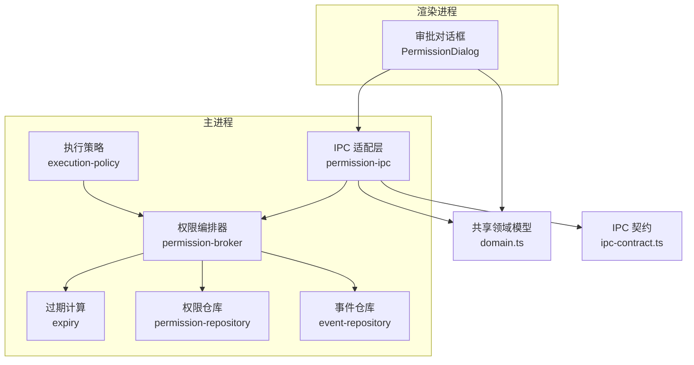
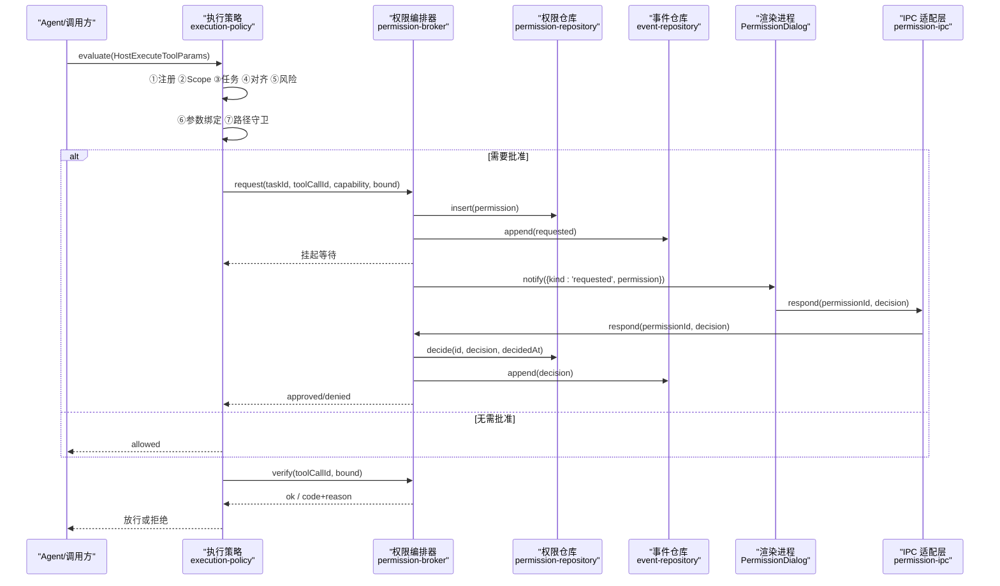
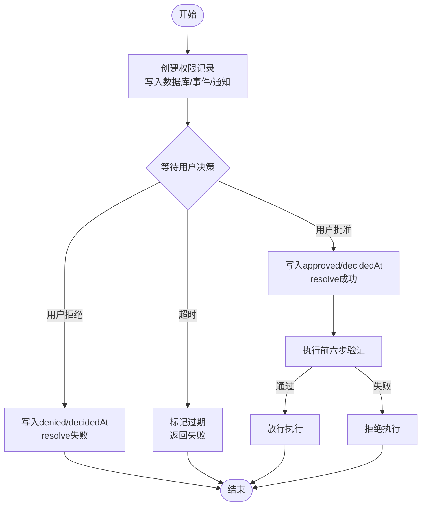
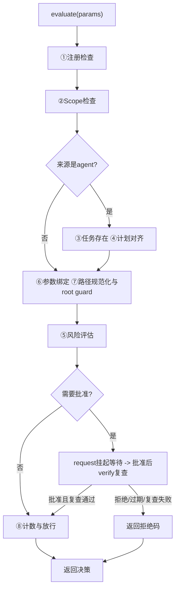
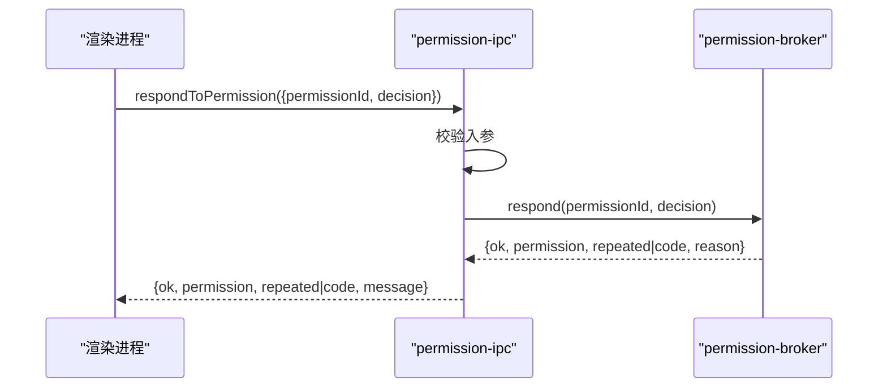
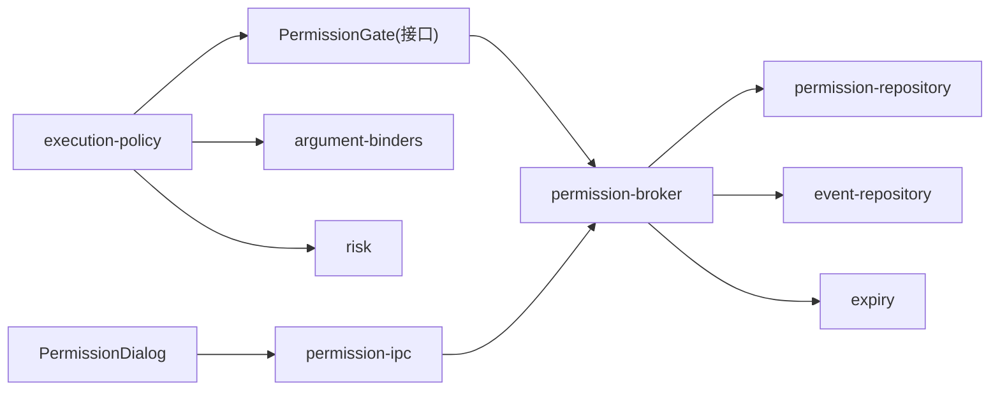

# 权限控制系统

<cite>
**本文引用的文件**
- [apps/desktop/src/main/permission/permission-broker.ts](file://apps/desktop/src/main/permission/permission-broker.ts)
- [apps/desktop/src/main/permission/permission-ipc.ts](file://apps/desktop/src/main/permission/permission-ipc.ts)
- [apps/desktop/src/main/permission/expiry.ts](file://apps/desktop/src/main/permission/expiry.ts)
- [apps/desktop/src/main/policy/execution-policy.ts](file://apps/desktop/src/main/policy/execution-policy.ts)
- [apps/desktop/src/main/policy/risk.ts](file://apps/desktop/src/main/policy/risk.ts)
- [apps/desktop/src/main/policy/argument-binders.ts](file://apps/desktop/src/main/policy/argument-binders.ts)
- [apps/desktop/src/main/product-state/permission-repository.ts](file://apps/desktop/src/main/product-state/permission-repository.ts)
- [apps/desktop/src/main/product-state/migrations/0004-create-permissions.ts](file://apps/desktop/src/main/product-state/migrations/0004-create-permissions.ts)
- [apps/desktop/src/shared/domain.ts](file://apps/desktop/src/shared/domain.ts)
- [apps/desktop/src/shared/ipc-contract.ts](file://apps/desktop/src/shared/ipc-contract.ts)
- [apps/desktop/src/renderer/src/components/PermissionDialog.tsx](file://apps/desktop/src/renderer/src/components/PermissionDialog.tsx)
- [apps/desktop/src/main/index.ts](file://apps/desktop/src/main/index.ts)
- [apps/desktop/src/preload/index.ts](file://apps/desktop/src/preload/index.ts)
- [apps/desktop/src/renderer/src/view-model.ts](file://apps/desktop/src/renderer/src/view-model.ts)
</cite>

## 目录
1. [简介](#简介)
2. [项目结构](#项目结构)
3. [核心组件](#核心组件)
4. [架构总览](#架构总览)
5. [详细组件分析](#详细组件分析)
6. [依赖关系分析](#依赖关系分析)
7. [性能与扩展性](#性能与扩展性)
8. [故障排查指南](#故障排查指南)
9. [结论](#结论)
10. [附录：使用示例与最佳实践](#附录使用示例与最佳实践)

## 简介
本技术文档围绕桌面端权限控制系统，系统性说明权限申请与审批流程、过期管理、执行策略（风险评估、参数绑定、策略匹配）、IPC 通信协议、审计日志与调试方法。目标是帮助开发者理解从“工具调用”到“用户批准”再到“安全执行”的完整链路，并掌握如何正确接入、扩展与维护该子系统。

## 项目结构
权限控制相关代码主要分布在以下模块：
- 主进程权限编排：permission-broker、expiry、permission-ipc
- 执行策略：execution-policy、risk、argument-binders
- 持久化：product-state 下的 permission-repository 及迁移脚本
- 共享领域模型与 IPC 契约：shared/domain.ts、shared/ipc-contract.ts
- 渲染层审批界面：renderer 的 PermissionDialog

图表来源
- [apps/desktop/src/main/policy/execution-policy.ts:82-147](file://apps/desktop/src/main/policy/execution-policy.ts#L82-L147)
- [apps/desktop/src/main/permission/permission-broker.ts:99-257](file://apps/desktop/src/main/permission/permission-broker.ts#L99-L257)
- [apps/desktop/src/main/permission/expiry.ts:1-26](file://apps/desktop/src/main/permission/expiry.ts#L1-L26)
- [apps/desktop/src/main/permission/permission-ipc.ts:44-83](file://apps/desktop/src/main/permission/permission-ipc.ts#L44-L83)
- [apps/desktop/src/main/product-state/permission-repository.ts:92-131](file://apps/desktop/src/main/product-state/permission-repository.ts#L92-L131)
- [apps/desktop/src/shared/domain.ts:52-94](file://apps/desktop/src/shared/domain.ts#L52-L94)
- [apps/desktop/src/shared/ipc-contract.ts:65-74](file://apps/desktop/src/shared/ipc-contract.ts#L65-L74)

章节来源
- [apps/desktop/src/main/policy/execution-policy.ts:82-147](file://apps/desktop/src/main/policy/execution-policy.ts#L82-L147)
- [apps/desktop/src/main/permission/permission-broker.ts:99-257](file://apps/desktop/src/main/permission/permission-broker.ts#L99-L257)
- [apps/desktop/src/main/permission/expiry.ts:1-26](file://apps/desktop/src/main/permission/expiry.ts#L1-L26)
- [apps/desktop/src/main/permission/permission-ipc.ts:44-83](file://apps/desktop/src/main/permission/permission-ipc.ts#L44-L83)
- [apps/desktop/src/main/product-state/permission-repository.ts:92-131](file://apps/desktop/src/main/product-state/permission-repository.ts#L92-L131)
- [apps/desktop/src/shared/domain.ts:52-94](file://apps/desktop/src/shared/domain.ts#L52-L94)
- [apps/desktop/src/shared/ipc-contract.ts:65-74](file://apps/desktop/src/shared/ipc-contract.ts#L65-L74)

## 核心组件
- 执行策略 ExecutionPolicy：负责八级校验管道，包括能力注册与范围检查、计划对齐、参数绑定、风险评估、权限门控与执行前复查、计数记录等。
- 权限编排器 PermissionBroker：负责创建权限记录、生成指纹、推送通知、挂起等待用户决策、处理过期与结算、执行前六步验证。
- 过期管理 Expiry：定义默认 TTL（5 分钟），计算 expiresAt，以及将 pending + 超时投影为 expired 状态。
- IPC 适配层 PermissionIpc：对渲染进程请求一律按不可信先收窄——permissionId 必须是非空字符串、decision 必须属于 PERMISSION_DECISIONS（approved|denied），否则返回 PROTOCOL_INVALID_REQUEST；broker.respond 的失败码只放行 PERMISSION_REQUIRED / PERMISSION_DENIED / PERMISSION_EXPIRED / PERMISSION_TAMPERED 四条白名单，白名单之外一律映射为 DB_FAILED——再调用 broker.respond/listForTask。
- 权限仓库 PermissionRepository：SQLite 持久化权限记录，提供插入、查询、决定（幂等）等方法。
- 参数绑定 ArgumentBinders：按能力解析参数、规范化路径、输出 BoundArgs，供策略与权限系统消费。
- 风险判定 Risk：根据能力类型（READ/WRITE）评估是否需要用户批准。
- 渲染层 PermissionDialog：展示权限详情（能力、影响文件 sourcePaths 数量与列表、目标位置 targetPath、参数摘要 argsCanonical、参数指纹、请求时间、过期时间 expiresAt）、倒计时、批准/拒绝按钮；对 scheduler.create 从 argsCanonical 解析 remindAt/message 展示「提醒时间 / 提醒内容」预览，并通过 IPC 提交决策。

章节来源
- [apps/desktop/src/main/policy/execution-policy.ts:82-147](file://apps/desktop/src/main/policy/execution-policy.ts#L82-L147)
- [apps/desktop/src/main/permission/permission-broker.ts:99-257](file://apps/desktop/src/main/permission/permission-broker.ts#L99-L257)
- [apps/desktop/src/main/permission/expiry.ts:1-26](file://apps/desktop/src/main/permission/expiry.ts#L1-L26)
- [apps/desktop/src/main/permission/permission-ipc.ts:44-83](file://apps/desktop/src/main/permission/permission-ipc.ts#L44-L83)
- [apps/desktop/src/main/product-state/permission-repository.ts:92-131](file://apps/desktop/src/main/product-state/permission-repository.ts#L92-L131)
- [apps/desktop/src/main/policy/argument-binders.ts:162-184](file://apps/desktop/src/main/policy/argument-binders.ts#L162-L184)
- [apps/desktop/src/main/policy/risk.ts:13-21](file://apps/desktop/src/main/policy/risk.ts#L13-L21)
- [apps/desktop/src/renderer/src/components/PermissionDialog.tsx:31-165](file://apps/desktop/src/renderer/src/components/PermissionDialog.tsx#L31-L165)

## 架构总览
下图展示了从工具调用到用户批准的端到端流程，涵盖策略评估、权限门控、UI 交互、持久化与审计事件。

图表来源
- [apps/desktop/src/main/policy/execution-policy.ts:82-147](file://apps/desktop/src/main/policy/execution-policy.ts#L82-L147)
- [apps/desktop/src/main/permission/permission-broker.ts:132-257](file://apps/desktop/src/main/permission/permission-broker.ts#L132-L257)
- [apps/desktop/src/main/permission/permission-ipc.ts:44-83](file://apps/desktop/src/main/permission/permission-ipc.ts#L44-L83)
- [apps/desktop/src/main/product-state/permission-repository.ts:92-131](file://apps/desktop/src/main/product-state/permission-repository.ts#L92-L131)

## 详细组件分析

### 权限申请与审批流程
- 申请入口：执行策略在风险评估后，若需要批准则调用权限编排器的 request，传入 taskId、toolCallId、capability、bound。
- 记录与事件：broker 生成唯一 id、计算 argsCanonical/argsHash、设置 requestedAt/expiresAt、写入权限表，追加 requested 事件，并向渲染进程推送通知。
- 挂起与超时：request 返回 Promise，内部维护 pending Map 与定时器；TTL 到期未响应则标记 expired 并返回失败结果。
- 用户决策：渲染进程通过 IPC 调用 respond，broker 校验权限是否存在、是否仍 pending、是否在窗口期内，然后写入 decidedAt 与 status，追加 decision 事件，并 resolve 挂起的 Promise。
- 执行前复查：策略在最终放行前调用 verify，进行六步验证（存在性、已批准、未过期、toolCallId 一致、参数哈希一致、路径复查）。

图表来源
- [apps/desktop/src/main/permission/permission-broker.ts:132-257](file://apps/desktop/src/main/permission/permission-broker.ts#L132-L257)
- [apps/desktop/src/main/permission/expiry.ts:11-26](file://apps/desktop/src/main/permission/expiry.ts#L11-L26)

章节来源
- [apps/desktop/src/main/permission/permission-broker.ts:132-257](file://apps/desktop/src/main/permission/permission-broker.ts#L132-L257)
- [apps/desktop/src/main/permission/expiry.ts:11-26](file://apps/desktop/src/main/permission/expiry.ts#L11-L26)

### 权限过期管理机制
- TTL 与有效期：默认 5 分钟，可通过依赖注入覆盖；expiresAt = requestedAt + ttlMs。
- 过期判定：expired 不落库，是查询时的投影——permissionState 对 denied 原样返回（终局结论不被过期改写），其余状态在 now > expiresAt 时投影为 expired（批准过但已超过有效期的记录同样投影为 expired，执行前 verify 的第 3 步会拦截），否则返回原 status；UI 据此禁用操作并提示。
- 自动清理：broker 在 dispose 时清除所有挂起定时器，避免内存泄漏；过期时追加 EXPIRED 事件并通知 UI。
- 续期策略：当前实现不直接支持续期；如需续期，应重新发起一次 request（新的 toolCallId），由策略与上游流程触发。

章节来源
- [apps/desktop/src/main/permission/expiry.ts:1-26](file://apps/desktop/src/main/permission/expiry.ts#L1-L26)
- [apps/desktop/src/main/permission/permission-broker.ts:120-179](file://apps/desktop/src/main/permission/permission-broker.ts#L120-L179)
- [apps/desktop/src/main/permission/permission-broker.ts:252-255](file://apps/desktop/src/main/permission/permission-broker.ts#L252-L255)

### 执行策略系统
- 八级检验管道（按 evaluate 的实际执行顺序，编号沿用源码注释）：
  1) ① 能力注册检查
  2) ② Scope 范围检查
  3) ③ 当前任务存在性（仅 agent）
  4) ④ 计划对齐（仅 agent）
  5) ⑥ 参数绑定（契约校验）
  6) ⑦ 路径规范化与路径守卫（root guard）
  7) ⑤ 风险评估与批准门控（WRITE 需批准：request 挂起等待，批准后立即 verify 复查）
  8) ⑧ 计数与放行（被拒的调用不占序号）
- 参数绑定：按能力解析参数，规范化路径，输出 BoundArgs；无绑定器则 NOT_IMPLEMENTED。绑定先于风险评估执行——批准的内容（argsCanonical/argsHash、sourcePaths/targetPath）正是绑定产物，保证「批准的就是执行的」。
- 风险与批准：WRITE 能力进入权限门控；若无权限通道则拒绝。
- 执行前复查：verify 确保 toolCallId、参数哈希、路径均在授权范围内。

图表来源
- [apps/desktop/src/main/policy/execution-policy.ts:82-147](file://apps/desktop/src/main/policy/execution-policy.ts#L82-L147)
- [apps/desktop/src/main/policy/argument-binders.ts:162-184](file://apps/desktop/src/main/policy/argument-binders.ts#L162-L184)
- [apps/desktop/src/main/policy/risk.ts:13-21](file://apps/desktop/src/main/policy/risk.ts#L13-L21)

章节来源
- [apps/desktop/src/main/policy/execution-policy.ts:82-147](file://apps/desktop/src/main/policy/execution-policy.ts#L82-L147)
- [apps/desktop/src/main/policy/argument-binders.ts:162-184](file://apps/desktop/src/main/policy/argument-binders.ts#L162-L184)
- [apps/desktop/src/main/policy/risk.ts:13-21](file://apps/desktop/src/main/policy/risk.ts#L13-L21)

### IPC 权限通信协议
- 通道名（main/index.ts 集中定义）：
  - personal-agent:permission-respond：批准面板的「批准 / 拒绝」。renderer 调 preload 的 respondPermission → main 的 ipcMain.handle → permission-ipc 的 respondToPermission → broker.respond。
  - personal-agent:list-permissions：诊断面板的只读观察区。走 listTaskPermissions → broker.listForTask，返回的 state 是含 expired 的投影值（库里只有 pending/approved/denied 三种 status）。
  - personal-agent:permission-notice：全应用唯一一个 main → renderer 推送通道。broadcastPermissionNotice 向所有窗口广播 PermissionNotice——kind:'requested' 携带完整 PermissionRecord；kind:'resolved' 携带 permissionId 与 PermissionViewState。载荷由 broker 产出、preload 原样转发、renderer 不做二次解析。
- 消息格式：
  - respondToPermission：输入 { permissionId, decision }，输出 { ok, permission?, repeated?, code?, message? }；repeated=true 表示这条早有同样结论，本次点击没产生新副作用，UI 不能当失败处理。
  - listTaskPermissions：输入 taskId（非空字符串，不接受 null），输出 { ok, entries? | code?, message? }。
- 入参校验：严格校验 permissionId 非空字符串、decision 属于白名单（approved|denied）；否则返回 PROTOCOL_INVALID_REQUEST。
- 错误处理：broker 返回的错误码只放行 PERMISSION_REQUIRED / PERMISSION_DENIED / PERMISSION_EXPIRED / PERMISSION_TAMPERED 四条白名单；白名单之外的值说明是库层面意外，一律降级为 DB_FAILED；broker 未构造（product-state 库没打开）时 main 的处理器直接返回 DB_FAILED（“批准通道未就绪”）。
- 安全性：渲染侧不可信输入一律先收窄再调用主进程；主进程只做最小必要校验与落库。

图表来源
- [apps/desktop/src/main/permission/permission-ipc.ts:44-83](file://apps/desktop/src/main/permission/permission-ipc.ts#L44-L83)
- [apps/desktop/src/main/permission/permission-broker.ts:182-233](file://apps/desktop/src/main/permission/permission-broker.ts#L182-L233)

章节来源
- [apps/desktop/src/main/permission/permission-ipc.ts:17-32](file://apps/desktop/src/main/permission/permission-ipc.ts#L17-L32)
- [apps/desktop/src/main/permission/permission-ipc.ts:44-83](file://apps/desktop/src/main/permission/permission-ipc.ts#L44-L83)
- [apps/desktop/src/main/index.ts:35-49](file://apps/desktop/src/main/index.ts#L35-L49)
- [apps/desktop/src/main/index.ts:244-269](file://apps/desktop/src/main/index.ts#L244-L269)
- [apps/desktop/src/preload/index.ts:29-45](file://apps/desktop/src/preload/index.ts#L29-L45)
- [apps/desktop/src/shared/domain.ts:56-94](file://apps/desktop/src/shared/domain.ts#L56-L94)
- [apps/desktop/src/shared/ipc-contract.ts:65-74](file://apps/desktop/src/shared/ipc-contract.ts#L65-L74)

### 权限审计日志与调试
- 事件类型：
  - permission_requested：包含 permissionId、capability、sourcePaths、targetPath、expiresAt
  - permission_decision：包含 permissionId、decision、decidedAt
  - permission_expired：包含 permissionId、expiresAt
- 观察与诊断：
  - 渲染侧可经 personal-agent:list-permissions 通道调用 listTaskPermissions，查看某任务的全部权限及其投影状态（含 expired）
  - 事件仓库可用于回放 timeline，定位拦截原因与时间线
  - 渲染侧时间线对 permission_requested / permission_decision 事件的载荷做类型收窄防御：sourcePaths 非数组按空处理并过滤非字符串项，capability/decision 缺失时退回默认文案，脏数据不会让事件流崩溃或显示 'undefined'/空行
- 调试建议：
  - 使用测试中的 fake timer 与内存数据库快速复现过期与并发场景
  - 关注 events 中 rejected/expired 的原因字段，结合 argsHash 与 source/target 路径定位问题

章节来源
- [apps/desktop/src/main/permission/permission-broker.ts:120-179](file://apps/desktop/src/main/permission/permission-broker.ts#L120-L179)
- [apps/desktop/src/main/permission/permission-ipc.ts:71-83](file://apps/desktop/src/main/permission/permission-ipc.ts#L71-L83)
- [apps/desktop/src/renderer/src/view-model.ts:215-240](file://apps/desktop/src/renderer/src/view-model.ts#L215-L240)
- [apps/desktop/src/shared/domain.ts:21-28](file://apps/desktop/src/shared/domain.ts#L21-L28)

## 依赖关系分析
- 松耦合设计：
  - execution-policy 通过接口 PermissionGate 与 PermissionVerifyOutcome 解耦具体实现
  - permission-broker 通过依赖注入替换 now/newId/ttlMs/root/notify，便于测试与扩展
  - permission-ipc 仅暴露两个函数，屏蔽 broker 细节
- 数据流：
  - 参数绑定产出 BoundArgs，用于权限指纹与后续执行
  - 权限记录包含 argsCanonical/argsHash，确保“批准的内容”与“执行的内容”一致
  - 事件仓库记录全生命周期，便于审计与回溯
- 外部依赖：
  - SQLite 存储权限与事件
  - 文件系统路径通过 path-guard 与 roots 进行 root 限制与规范化

图表来源
- [apps/desktop/src/main/policy/execution-policy.ts:37-77](file://apps/desktop/src/main/policy/execution-policy.ts#L37-L77)
- [apps/desktop/src/main/permission/permission-broker.ts:46-75](file://apps/desktop/src/main/permission/permission-broker.ts#L46-L75)
- [apps/desktop/src/main/permission/permission-ipc.ts:13-15](file://apps/desktop/src/main/permission/permission-ipc.ts#L13-L15)

章节来源
- [apps/desktop/src/main/policy/execution-policy.ts:37-77](file://apps/desktop/src/main/policy/execution-policy.ts#L37-L77)
- [apps/desktop/src/main/permission/permission-broker.ts:46-75](file://apps/desktop/src/main/permission/permission-broker.ts#L46-L75)
- [apps/desktop/src/main/permission/permission-ipc.ts:13-15](file://apps/desktop/src/main/permission/permission-ipc.ts#L13-L15)

## 性能与扩展性
- 性能要点：
  - 参数绑定与路径规范化仅在策略阶段执行一次，避免重复解析
  - 权限验证使用 argsHash 快速比对，减少序列化开销
  - 过期检查基于时间戳比较，O(1)
- 扩展点：
  - 新增能力：在 argument-binders 中添加 binder，并在 splitPaths 中补充 UI 展示逻辑
  - 自定义 TTL：通过依赖注入覆盖 ttlMs
  - 自定义根目录：通过依赖注入覆盖 root()
  - 续期策略：可在上层封装重试机制，生成新 callId 并重新走流程

[本节为通用指导，不直接分析具体文件]

## 故障排查指南
- 常见错误码与含义：
  - PERMISSION_REQUIRED：缺少权限通道或尚未批准
  - PERMISSION_DENIED：用户拒绝或状态不允许变更
  - PERMISSION_EXPIRED：批准窗口关闭或已过期
  - PERMISSION_TAMPERED：toolCallId 或 argsHash 不一致
  - CAPABILITY_NOT_REGISTERED/CAPABILITY_OUT_OF_SCOPE：能力未注册或不在 Scope
  - INVALID_ARGUMENT：参数不符合契约
  - NOT_IMPLEMENTED：执行体未实现对应能力
- 排查步骤：
  1) 查看 events 中 requested/decision/expired 的顺序与时间戳
  2) 核对 argsHash 与 source/target 路径是否与预期一致
  3) 确认 scope 与 plan 是否允许该能力
  4) 检查 UI 是否及时收到 requested 通知并渲染倒计时
  5) 若频繁过期，考虑调整 TTL 或优化审批流程

章节来源
- [apps/desktop/src/main/permission/permission-broker.ts:182-233](file://apps/desktop/src/main/permission/permission-broker.ts#L182-L233)
- [apps/desktop/src/main/permission/permission-ipc.ts:25-32](file://apps/desktop/src/main/permission/permission-ipc.ts#L25-L32)
- [apps/desktop/src/main/policy/argument-binders.ts:33-39](file://apps/desktop/src/main/policy/argument-binders.ts#L33-L39)

## 结论
本权限控制系统以“策略先行、权限门控、严格复查”为核心原则，通过参数绑定与哈希校验确保“批准即执行”，通过过期管理与事件审计保障可观测性与可追溯性。其模块化设计与依赖注入使得扩展与测试便捷，适合在复杂工具调用场景中落地。

[本节为总结性内容，不直接分析具体文件]

## 附录：使用示例与最佳实践

### 示例：申请权限并处理用户决策
- 调用方（Agent/UI）触发工具调用，进入执行策略评估
- 若风险评估为 WRITE，策略调用权限编排器 request，创建权限记录并推送通知
- 渲染进程显示审批对话框，用户点击批准或拒绝
- IPC 层将决策传回主进程，broker 更新状态并 resolve 等待
- 策略执行 verify，通过后放行

章节来源
- [apps/desktop/src/main/policy/execution-policy.ts:113-147](file://apps/desktop/src/main/policy/execution-policy.ts#L113-L147)
- [apps/desktop/src/main/permission/permission-broker.ts:132-233](file://apps/desktop/src/main/permission/permission-broker.ts#L132-L233)
- [apps/desktop/src/renderer/src/components/PermissionDialog.tsx:52-165](file://apps/desktop/src/renderer/src/components/PermissionDialog.tsx#L52-L165)

### 示例：管理权限生命周期
- 创建：request 生成记录与事件，设置 expiresAt
- 观察：listForTask 获取任务全部权限及其投影状态（含 expired）
- 决策：respond 幂等更新状态，重复决策无副作用
- 清理：dispose 清除挂起定时器；过期时追加 EXPIRED 事件

章节来源
- [apps/desktop/src/main/permission/permission-broker.ts:245-257](file://apps/desktop/src/main/permission/permission-broker.ts#L245-L257)
- [apps/desktop/src/main/permission/expiry.ts:11-26](file://apps/desktop/src/main/permission/expiry.ts#L11-L26)

### 最佳实践
- 始终使用 BoundArgs 与 argsHash 作为“批准内容”的唯一标识
- 在 UI 中明确展示 sourcePaths/targetPath，帮助用户理解影响范围
- 合理设置 TTL，避免过长导致安全风险，过短影响用户体验
- 利用事件回放定位问题，结合 argsHash 与路径信息快速定位差异
- 新增能力时同步完善 binder、splitPaths 与 UI 展示

[本节为通用指导，不直接分析具体文件]