# 核心功能特性

<cite>
**本文引用的文件**
- [apps/desktop/src/main/index.ts](file://apps/desktop/src/main/index.ts)
- [apps/desktop/src/main/capabilities/host-executor.ts](file://apps/desktop/src/main/capabilities/host-executor.ts)
- [apps/desktop/src/main/capabilities/executor.ts](file://apps/desktop/src/main/capabilities/executor.ts)
- [apps/desktop/src/main/capabilities/document-extract-pdf.ts](file://apps/desktop/src/main/capabilities/document-extract-pdf.ts)
- [apps/desktop/src/main/capabilities/filesystem-list.ts](file://apps/desktop/src/main/capabilities/filesystem-list.ts)
- [apps/desktop/src/main/capabilities/retriever.ts](file://apps/desktop/src/main/capabilities/retriever.ts)
- [apps/desktop/src/main/capabilities/scope.ts](file://apps/desktop/src/main/capabilities/scope.ts)
- [apps/desktop/src/main/policy/execution-policy.ts](file://apps/desktop/src/main/policy/execution-policy.ts)
- [apps/desktop/src/main/policy/argument-binders.ts](file://apps/desktop/src/main/policy/argument-binders.ts)
- [apps/desktop/src/main/policy/risk.ts](file://apps/desktop/src/main/policy/risk.ts)
- [apps/desktop/src/main/policy/task-context.ts](file://apps/desktop/src/main/policy/task-context.ts)
- [apps/desktop/src/main/permission/permission-broker.ts](file://apps/desktop/src/main/permission/permission-broker.ts)
- [apps/desktop/src/main/permission/permission-ipc.ts](file://apps/desktop/src/main/permission/permission-ipc.ts)
- [apps/desktop/src/main/tasks/run-task.ts](file://apps/desktop/src/main/tasks/run-task.ts)
- [apps/desktop/src/main/tasks/get-timeline.ts](file://apps/desktop/src/main/tasks/get-timeline.ts)
- [apps/desktop/src/main/runtime/python-supervisor.ts](file://apps/desktop/src/main/runtime/python-supervisor.ts)
- [services/agent-runtime/src/personal_agent/runtime.py](file://services/agent-runtime/src/personal_agent/runtime.py)
- [services/agent-runtime/src/personal_agent/engine.py](file://services/agent-runtime/src/personal_agent/engine.py)
- [services/agent-runtime/src/personal_agent/planning.py](file://services/agent-runtime/src/personal_agent/planning.py)
- [services/agent-runtime/src/personal_agent/host_channel.py](file://services/agent-runtime/src/personal_agent/host_channel.py)
- [packages/protocol/schemas/index.ts](file://packages/protocol/schemas/index.ts)
</cite>

## 目录
1. [简介](#简介)
2. [项目结构](#项目结构)
3. [核心组件](#核心组件)
4. [架构总览](#架构总览)
5. [详细组件分析](#详细组件分析)
6. [依赖关系分析](#依赖关系分析)
7. [性能考虑](#性能考虑)
8. [故障排查指南](#故障排查指南)
9. [结论](#结论)

## 简介
本章节面向开发者，系统化说明 Personal Agent 的核心能力：智能任务执行引擎、文件系统安全访问控制、PDF 文档处理、任务历史与时间线追踪、IPC 通信与 JSON-RPC 协议、权限申请与用户确认流程。每个能力均给出使用示例与实现原理，帮助理解系统如何协同工作。

## 项目结构
Personal Agent 采用多进程架构：Electron Main 进程负责 UI 交互、权限审批、持久化与能力编排；Python 子进程作为 Agent Runtime，负责 AI 推理、计划生成与工具调用；两者通过 JSON-RPC over stdio 通信。

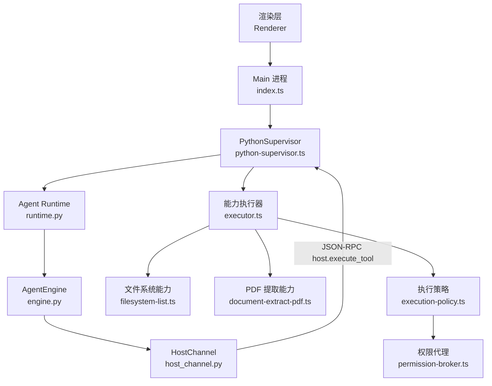

**图表来源**
- [apps/desktop/src/main/index.ts:132-322](file://apps/desktop/src/main/index.ts#L132-L322)
- [apps/desktop/src/main/runtime/python-supervisor.ts:103-153](file://apps/desktop/src/main/runtime/python-supervisor.ts#L103-L153)
- [services/agent-runtime/src/personal_agent/runtime.py:128-184](file://services/agent-runtime/src/personal_agent/runtime.py#L128-L184)
- [services/agent-runtime/src/personal_agent/engine.py:104-172](file://services/agent-runtime/src/personal_agent/engine.py#L104-L172)
- [services/agent-runtime/src/personal_agent/host_channel.py:45-85](file://services/agent-runtime/src/personal_agent/host_channel.py#L45-L85)
- [apps/desktop/src/main/capabilities/executor.ts:73-143](file://apps/desktop/src/main/capabilities/executor.ts#L73-L143)
- [apps/desktop/src/main/capabilities/filesystem-list.ts:1-32](file://apps/desktop/src/main/capabilities/filesystem-list.ts#L1-L32)
- [apps/desktop/src/main/capabilities/document-extract-pdf.ts:31-68](file://apps/desktop/src/main/capabilities/document-extract-pdf.ts#L31-L68)
- [apps/desktop/src/main/policy/execution-policy.ts:88-156](file://apps/desktop/src/main/policy/execution-policy.ts#L88-L156)
- [apps/desktop/src/main/permission/permission-broker.ts:100-257](file://apps/desktop/src/main/permission/permission-broker.ts#L100-L257)

**章节来源**
- [apps/desktop/src/main/index.ts:95-331](file://apps/desktop/src/main/index.ts#L95-L331)
- [services/agent-runtime/src/personal_agent/runtime.py:238-257](file://services/agent-runtime/src/personal_agent/runtime.py#L238-L257)

## 核心组件
- 智能任务执行引擎：Python 侧的 AgentEngine 驱动“决策-执行-观察”循环，带预算控制（步数与工具调用次数），产出事件流与最终事实摘要。
- 能力执行器与策略：Main 侧 executor.ts 将能力注册、Scope 限制、参数绑定、风险判定、路径守卫与权限审批串联为八级管道。
- 文件系统安全访问控制：基于 root 白名单与 realpath 校验，确保只能访问授权根下的真实路径。
- PDF 文档处理：读取二进制数据，逐页提取文本，识别空内容、加密与损坏等错误码。
- 任务历史与时间线：Main 侧持久化任务、计划与事件，并提供投影查询最近任务的时间线。
- IPC 与 JSON-RPC：Electron 与 Python 通过 stdio 行式 JSON-RPC 通信，支持握手、计划、运行任务与反向工具调用。
- 权限申请与用户确认：PermissionBroker 创建待批请求、推送通知、等待用户决定并验证执行时的参数一致性。

**章节来源**
- [services/agent-runtime/src/personal_agent/engine.py:91-244](file://services/agent-runtime/src/personal_agent/engine.py#L91-L244)
- [apps/desktop/src/main/capabilities/executor.ts:73-172](file://apps/desktop/src/main/capabilities/executor.ts#L73-L172)
- [apps/desktop/src/main/capabilities/document-extract-pdf.ts:31-68](file://apps/desktop/src/main/capabilities/document-extract-pdf.ts#L31-L68)
- [apps/desktop/src/main/tasks/get-timeline.ts:17-52](file://apps/desktop/src/main/tasks/get-timeline.ts#L17-L52)
- [apps/desktop/src/main/runtime/python-supervisor.ts:129-153](file://apps/desktop/src/main/runtime/python-supervisor.ts#L129-L153)
- [apps/desktop/src/main/permission/permission-broker.ts:100-257](file://apps/desktop/src/main/permission/permission-broker.ts#L100-L257)

## 架构总览
下图展示从用户输入到结果返回的端到端流程，包括计划生成、AI 推理、工具调用、权限审批与结果落库。

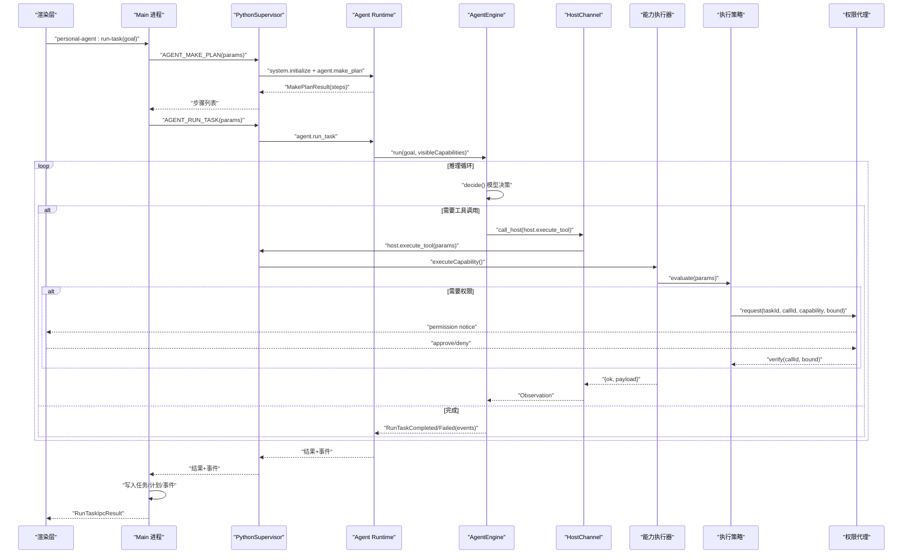

**图表来源**
- [apps/desktop/src/main/tasks/run-task.ts:105-341](file://apps/desktop/src/main/tasks/run-task.ts#L105-L341)
- [services/agent-runtime/src/personal_agent/runtime.py:128-184](file://services/agent-runtime/src/personal_agent/runtime.py#L128-L184)
- [services/agent-runtime/src/personal_agent/engine.py:104-172](file://services/agent-runtime/src/personal_agent/engine.py#L104-L172)
- [services/agent-runtime/src/personal_agent/host_channel.py:45-85](file://services/agent-runtime/src/personal_agent/host_channel.py#L45-L85)
- [apps/desktop/src/main/runtime/python-supervisor.ts:258-314](file://apps/desktop/src/main/runtime/python-supervisor.ts#L258-L314)
- [apps/desktop/src/main/capabilities/executor.ts:73-143](file://apps/desktop/src/main/capabilities/executor.ts#L73-L143)
- [apps/desktop/src/main/policy/execution-policy.ts:88-156](file://apps/desktop/src/main/policy/execution-policy.ts#L88-L156)
- [apps/desktop/src/main/permission/permission-broker.ts:133-180](file://apps/desktop/src/main/permission/permission-broker.ts#L133-L180)

## 详细组件分析

### 智能任务执行引擎（AI 推理流程）
- 工作原理：Engine 维护上下文与预算，循环调用模型决策。若决策为工具调用，则通过 HostChannel 发起 host.execute_tool；若为摘要，则校验事实并完成任务。
- 预算控制：最大步数与最大工具调用次数，超限即失败并记录事件。
- 事件流：每次决策、工具调用、结果与完成/失败都会产生事件，供时间线回放。

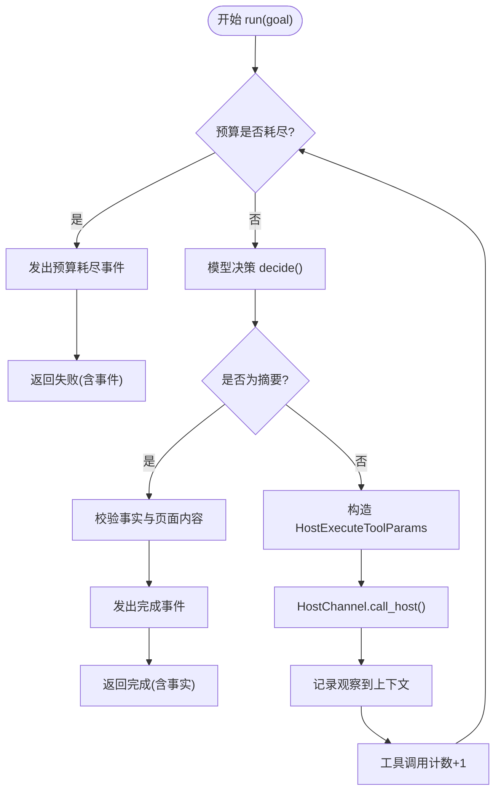

**图表来源**
- [services/agent-runtime/src/personal_agent/engine.py:104-172](file://services/agent-runtime/src/personal_agent/engine.py#L104-L172)
- [services/agent-runtime/src/personal_agent/engine.py:216-242](file://services/agent-runtime/src/personal_agent/engine.py#L216-L242)

**章节来源**
- [services/agent-runtime/src/personal_agent/engine.py:91-244](file://services/agent-runtime/src/personal_agent/engine.py#L91-L244)

### 任务规划与能力可见性
- 计划生成：make_plan 根据目标与可见能力清单生成固定三步计划（列出 PDF、提取 PDF 文本、生成摘要）。
- 能力可见性：由 Main 通过 initialize 下发能力描述，Runtime 保存并在计划阶段校验所需能力是否在清单中。

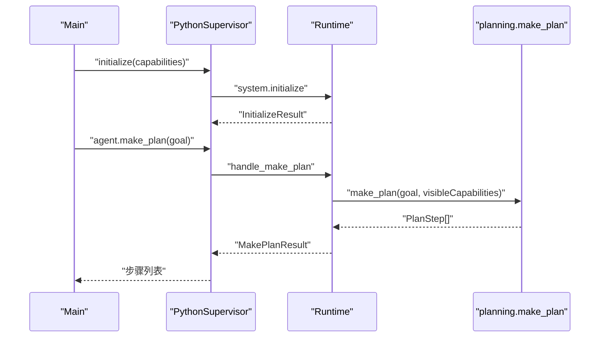

**图表来源**
- [apps/desktop/src/main/runtime/python-supervisor.ts:129-153](file://apps/desktop/src/main/runtime/python-supervisor.ts#L129-L153)
- [services/agent-runtime/src/personal_agent/runtime.py:128-155](file://services/agent-runtime/src/personal_agent/runtime.py#L128-L155)
- [services/agent-runtime/src/personal_agent/planning.py:54-75](file://services/agent-runtime/src/personal_agent/planning.py#L54-L75)

**章节来源**
- [services/agent-runtime/src/personal_agent/planning.py:12-75](file://services/agent-runtime/src/personal_agent/planning.py#L12-L75)
- [services/agent-runtime/src/personal_agent/runtime.py:109-155](file://services/agent-runtime/src/personal_agent/runtime.py#L109-L155)

### 工具调用机制与能力执行
- 能力注册与检索：RuleBasedToolRetriever 提供能力注册与可见性过滤；executor 根据能力名分发到具体实现。
- 参数绑定与契约校验：argument-binders 对入参进行类型与格式校验，并规范化路径。
- 风险与权限：risk 评估能力风险等级，必要时触发 PermissionGate 审批。

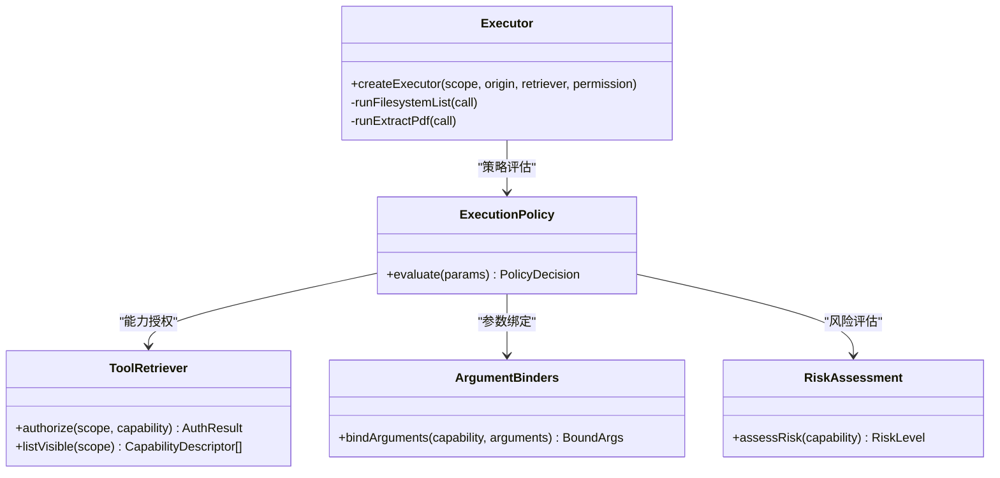

**图表来源**
- [apps/desktop/src/main/capabilities/executor.ts:73-143](file://apps/desktop/src/main/capabilities/executor.ts#L73-L143)
- [apps/desktop/src/main/policy/execution-policy.ts:88-156](file://apps/desktop/src/main/policy/execution-policy.ts#L88-L156)
- [apps/desktop/src/main/policy/argument-binders.ts:1-170](file://apps/desktop/src/main/policy/argument-binders.ts#L1-L170)
- [apps/desktop/src/main/policy/risk.ts:1-22](file://apps/desktop/src/main/policy/risk.ts#L1-L22)

**章节来源**
- [apps/desktop/src/main/capabilities/executor.ts:73-172](file://apps/desktop/src/main/capabilities/executor.ts#L73-L172)
- [apps/desktop/src/main/policy/execution-policy.ts:88-156](file://apps/desktop/src/main/policy/execution-policy.ts#L88-L156)

### 文件系统操作的安全访问控制
- 根目录白名单：roots 解析 rootId 到绝对路径，所有文件操作必须位于该根下。
- 路径守卫：path-guard 对路径进行 realpath 规范化与边界检查，防止越权访问。
- 能力实现：filesystem.list 仅列出授权根下的条目，executor 在捕获异常时返回统一错误码。

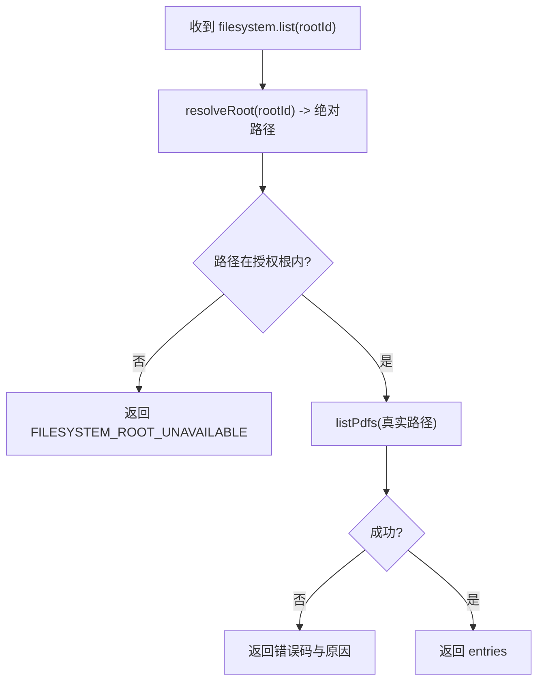

**图表来源**
- [apps/desktop/src/main/capabilities/executor.ts:145-155](file://apps/desktop/src/main/capabilities/executor.ts#L145-L155)
- [apps/desktop/src/main/capabilities/filesystem-list.ts:1-32](file://apps/desktop/src/main/capabilities/filesystem-list.ts#L1-L32)

**章节来源**
- [apps/desktop/src/main/capabilities/executor.ts:145-155](file://apps/desktop/src/main/capabilities/executor.ts#L145-L155)
- [apps/desktop/src/main/capabilities/filesystem-list.ts:1-32](file://apps/desktop/src/main/capabilities/filesystem-list.ts#L1-L32)

### PDF 文档处理能力
- 扫描与索引：Main 通过 list-pdfs 获取 PDF 列表并 upsert 到数据库，indexed-pdfs 查询已索引条目。
- 内容提取：extractPdf 读取二进制数据，逐页提取文本；检测空内容、加密与损坏情况，返回结构化错误码。
- 集成点：executor 将真实路径传入 extractPdf，并将结果回传给上层。

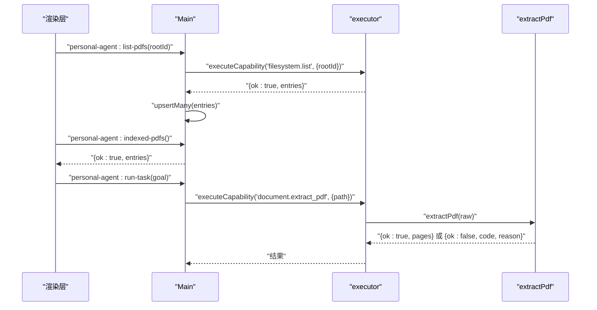

**图表来源**
- [apps/desktop/src/main/index.ts:134-229](file://apps/desktop/src/main/index.ts#L134-L229)
- [apps/desktop/src/main/capabilities/executor.ts:157-172](file://apps/desktop/src/main/capabilities/executor.ts#L157-L172)
- [apps/desktop/src/main/capabilities/document-extract-pdf.ts:31-68](file://apps/desktop/src/main/capabilities/document-extract-pdf.ts#L31-L68)

**章节来源**
- [apps/desktop/src/main/capabilities/document-extract-pdf.ts:31-68](file://apps/desktop/src/main/capabilities/document-extract-pdf.ts#L31-L68)
- [apps/desktop/src/main/index.ts:134-229](file://apps/desktop/src/main/index.ts#L134-L229)

### 任务历史与时间线追踪
- 任务生命周期：run-task 创建任务、写入计划、调用 runtime、持久化事件并更新状态。
- 时间线投影：get-timeline 支持按 taskId 或最近任务查询，组合任务、计划与事件形成可读时间线。
- 孤儿任务回收：启动时 reconcileOrphanTasks 修复异常状态的任务。

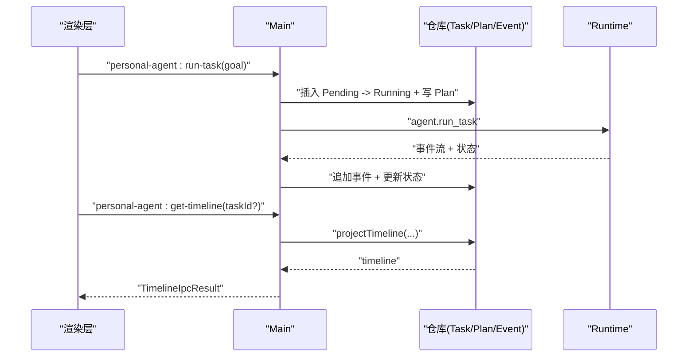

**图表来源**
- [apps/desktop/src/main/tasks/run-task.ts:105-341](file://apps/desktop/src/main/tasks/run-task.ts#L105-L341)
- [apps/desktop/src/main/tasks/get-timeline.ts:17-52](file://apps/desktop/src/main/tasks/get-timeline.ts#L17-L52)

**章节来源**
- [apps/desktop/src/main/tasks/run-task.ts:105-341](file://apps/desktop/src/main/tasks/run-task.ts#L105-L341)
- [apps/desktop/src/main/tasks/get-timeline.ts:17-52](file://apps/desktop/src/main/tasks/get-timeline.ts#L17-L52)

### IPC 通信机制与 JSON-RPC 协议
- 主从通信：PythonSupervisor 启动 Python 子进程，通过 stdin/stdout 行式 JSON-RPC 交换消息。
- 握手与能力：initialize 传递协议版本与能力清单；运行时保存能力用于计划校验。
- 反向 RPC：Runtime 通过 host.execute_tool 请求 Main 执行能力；Supervisor 路由到 hostHandler（executor）。

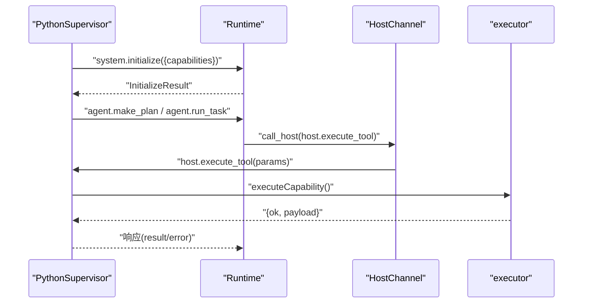

**图表来源**
- [apps/desktop/src/main/runtime/python-supervisor.ts:129-153](file://apps/desktop/src/main/runtime/python-supervisor.ts#L129-L153)
- [apps/desktop/src/main/runtime/python-supervisor.ts:258-314](file://apps/desktop/src/main/runtime/python-supervisor.ts#L258-L314)
- [services/agent-runtime/src/personal_agent/host_channel.py:45-85](file://services/agent-runtime/src/personal_agent/host_channel.py#L45-L85)
- [services/agent-runtime/src/personal_agent/runtime.py:128-184](file://services/agent-runtime/src/personal_agent/runtime.py#L128-L184)

**章节来源**
- [apps/desktop/src/main/runtime/python-supervisor.ts:103-314](file://apps/desktop/src/main/runtime/python-supervisor.ts#L103-L314)
- [services/agent-runtime/src/personal_agent/host_channel.py:36-91](file://services/agent-runtime/src/personal_agent/host_channel.py#L36-L91)
- [services/agent-runtime/src/personal_agent/runtime.py:109-184](file://services/agent-runtime/src/personal_agent/runtime.py#L109-L184)

### 权限申请与用户确认流程
- 权限请求：当能力风险等级为 PERMISSION_REQUIRED 时，ExecutionPolicy 调用 PermissionGate.request，创建待批记录并推送通知。
- 用户确认：UI 通过 permission-ipc 调用 respondToPermission 提交批准或拒绝；Broker 更新状态并唤醒等待者。
- 执行前验证：实际执行前再次 verify，校验 toolCallId、参数指纹与路径范围，防止篡改与越界。

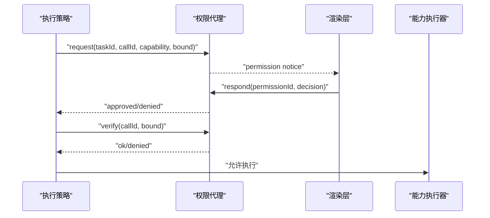

**图表来源**
- [apps/desktop/src/main/policy/execution-policy.ts:119-139](file://apps/desktop/src/main/policy/execution-policy.ts#L119-L139)
- [apps/desktop/src/main/permission/permission-broker.ts:133-180](file://apps/desktop/src/main/permission/permission-broker.ts#L133-L180)
- [apps/desktop/src/main/permission/permission-broker.ts:183-234](file://apps/desktop/src/main/permission/permission-broker.ts#L183-L234)
- [apps/desktop/src/main/permission/permission-broker.ts:236-327](file://apps/desktop/src/main/permission/permission-broker.ts#L236-L327)

**章节来源**
- [apps/desktop/src/main/policy/execution-policy.ts:119-139](file://apps/desktop/src/main/policy/execution-policy.ts#L119-L139)
- [apps/desktop/src/main/permission/permission-broker.ts:100-327](file://apps/desktop/src/main/permission/permission-broker.ts#L100-L327)

## 依赖关系分析
- 模块耦合：executor 依赖 execution-policy、retriever、scope；policy 依赖 argument-binders、risk、task-context；permission-broker 依赖 event/permission repositories 与 path-guard。
- 外部依赖：protocol schemas 定义跨进程契约；pdfjs-dist 用于 PDF 解析；sqlite 用于持久化。
- 潜在循环：各模块通过接口与依赖注入解耦，未见直接循环导入。

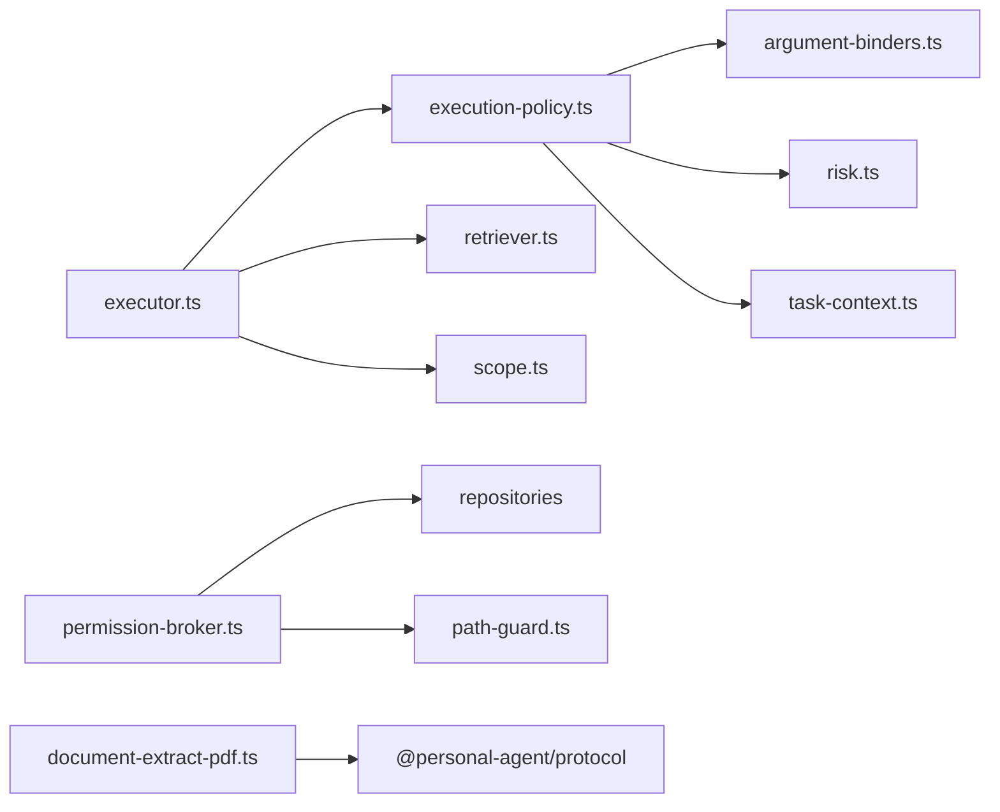

**图表来源**
- [apps/desktop/src/main/capabilities/executor.ts:73-143](file://apps/desktop/src/main/capabilities/executor.ts#L73-L143)
- [apps/desktop/src/main/policy/execution-policy.ts:88-156](file://apps/desktop/src/main/policy/execution-policy.ts#L88-L156)
- [apps/desktop/src/main/permission/permission-broker.ts:100-257](file://apps/desktop/src/main/permission/permission-broker.ts#L100-L257)
- [packages/protocol/schemas/index.ts:1-8](file://packages/protocol/schemas/index.ts#L1-L8)

**章节来源**
- [apps/desktop/src/main/capabilities/executor.ts:73-172](file://apps/desktop/src/main/capabilities/executor.ts#L73-L172)
- [apps/desktop/src/main/policy/execution-policy.ts:88-156](file://apps/desktop/src/main/policy/execution-policy.ts#L88-L156)
- [apps/desktop/src/main/permission/permission-broker.ts:100-257](file://apps/desktop/src/main/permission/permission-broker.ts#L100-L257)
- [packages/protocol/schemas/index.ts:1-8](file://packages/protocol/schemas/index.ts#L1-L8)

## 性能考虑
- 预算控制：Engine 限制步数与工具调用次数，避免无限循环与资源耗尽。
- 超时管理：PythonSupervisor 对请求设置默认超时，host.execute_tool 有独立超时，防止阻塞。
- 批量 I/O：PDF 提取逐页处理，及时释放资源；文件系统操作限定在授权根，减少无效遍历。
- 事务写入：任务与事件写入使用事务，保证一致性与原子性。

[本节提供通用指导，不直接分析具体文件]

## 故障排查指南
- 运行时崩溃：PythonSupervisor 监听 exit/error，记录崩溃信息并拒绝未决请求；上层将未知错误码映射为 CRASHED。
- 协议错误：Protocol 校验失败会返回 PROTOCOL_INVALID_REQUEST/RESPONSE；检查两端 schema 一致性。
- 权限过期：PermissionBroker 在 TTL 内无响应自动过期；检查 UI 通知与用户操作。
- PDF 错误：区分 EMPTY/CORRUPT/ENCRYPTED/NO_TEXT，定位文件问题或加密保护。
- 计划不可构建：PLAN_NOT_BUILDABLE 表示可见能力缺失；检查 initialize 下发的 capabilities。

**章节来源**
- [apps/desktop/src/main/runtime/python-supervisor.ts:116-125](file://apps/desktop/src/main/runtime/python-supervisor.ts#L116-L125)
- [apps/desktop/src/main/runtime/python-supervisor.ts:341-345](file://apps/desktop/src/main/runtime/python-supervisor.ts#L341-L345)
- [services/agent-runtime/src/personal_agent/runtime.py:65-93](file://services/agent-runtime/src/personal_agent/runtime.py#L65-L93)
- [apps/desktop/src/main/capabilities/document-extract-pdf.ts:31-68](file://apps/desktop/src/main/capabilities/document-extract-pdf.ts#L31-L68)
- [services/agent-runtime/src/personal_agent/planning.py:54-75](file://services/agent-runtime/src/personal_agent/planning.py#L54-L75)

## 结论
Personal Agent 通过清晰的职责划分与严格的策略控制，实现了安全的智能任务执行。引擎侧负责推理与预算控制，Main 侧负责能力编排、权限审批与持久化；双方通过 JSON-RPC 稳定通信。文件系统与 PDF 能力具备完善的错误处理与安全边界。时间线与事件流为可观测性与调试提供了坚实基础。开发者可基于此架构扩展新能力与策略，同时保持系统的健壮性与可维护性。