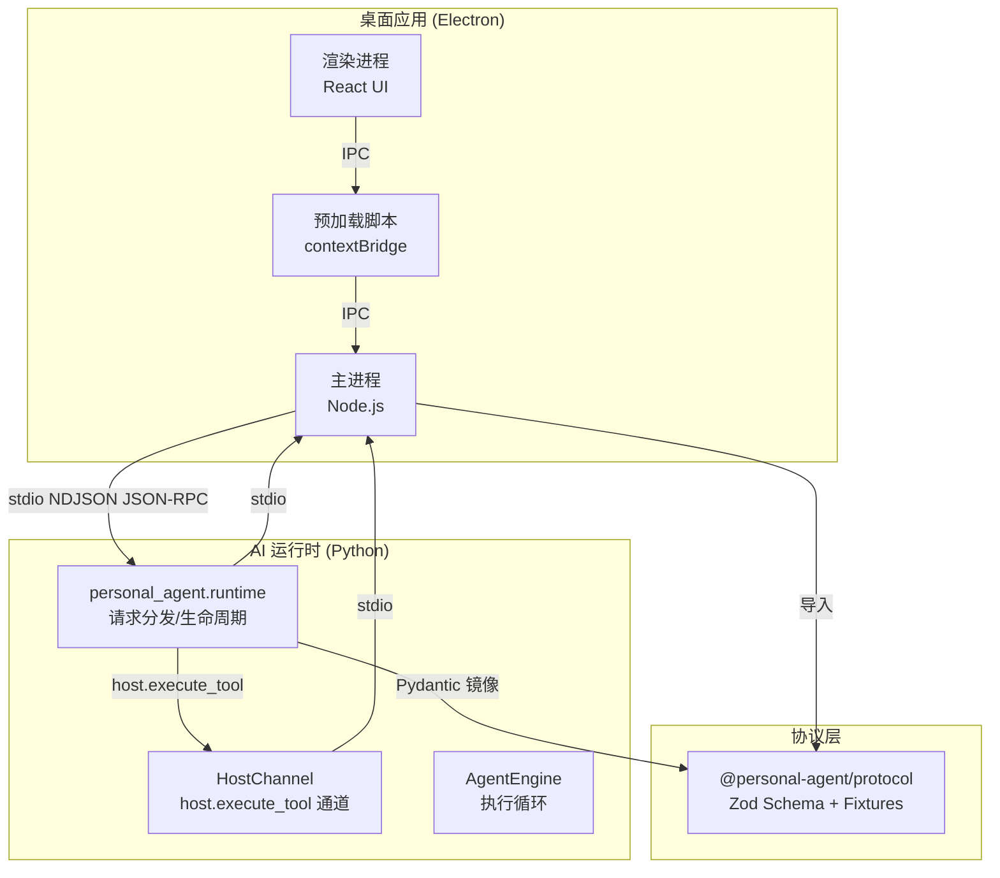
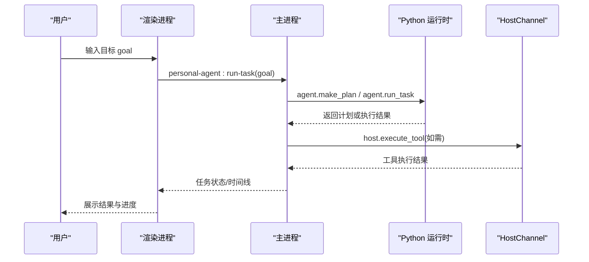
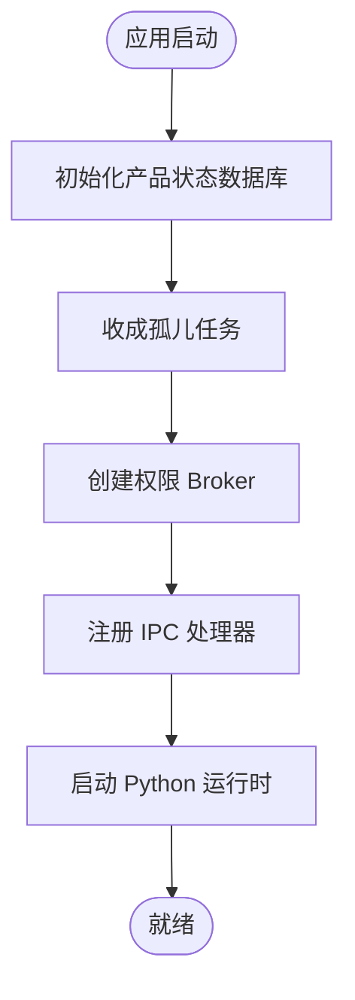
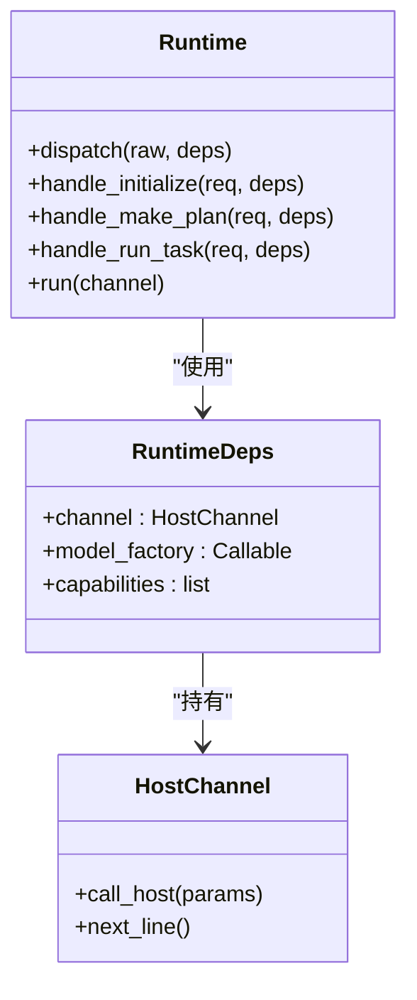
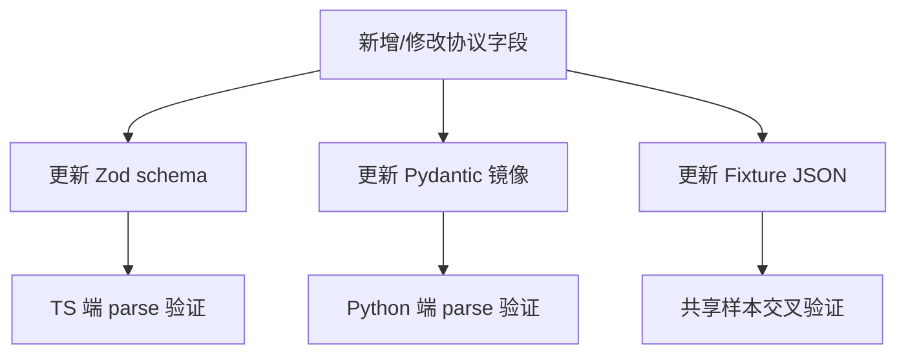
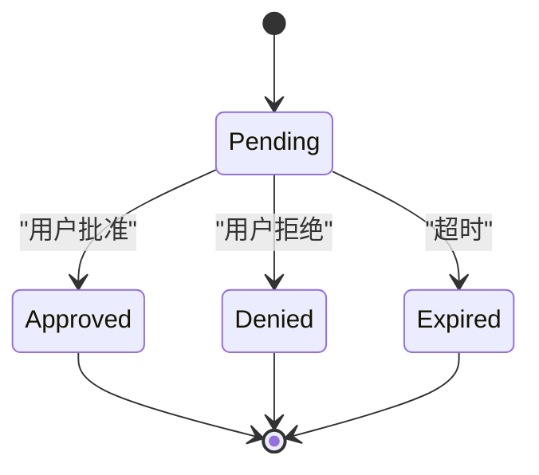
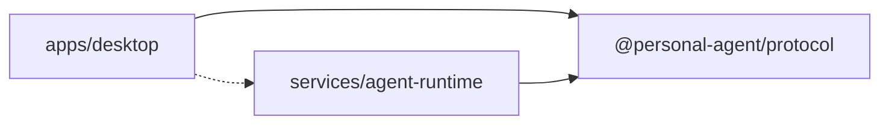

# 项目介绍与目标

<cite>
**本文引用的文件**
- [apps/desktop/README.md](file://apps/desktop/README.md)
- [AGENTS.md](file://AGENTS.md)
- [apps/desktop/package.json](file://apps/desktop/package.json)
- [services/agent-runtime/pyproject.toml](file://services/agent-runtime/pyproject.toml)
- [packages/protocol/package.json](file://packages/protocol/package.json)
- [apps/desktop/src/main/index.ts](file://apps/desktop/src/main/index.ts)
- [apps/desktop/src/main/runtime/runtime-host.ts](file://apps/desktop/src/main/runtime/runtime-host.ts)
- [services/agent-runtime/src/personal_agent/runtime.py](file://services/agent-runtime/src/personal_agent/runtime.py)
- [services/agent-runtime/src/personal_agent/host_channel.py](file://services/agent-runtime/src/personal_agent/host_channel.py)
- [packages/protocol/schemas/envelope.ts](file://packages/protocol/schemas/envelope.ts)
- [packages/protocol/schemas/index.ts](file://packages/protocol/schemas/index.ts)
- [apps/desktop/src/shared/domain.ts](file://apps/desktop/src/shared/domain.ts)
- [apps/desktop/src/renderer/src/App.tsx](file://apps/desktop/src/renderer/src/App.tsx)
</cite>

## 目录
1. [简介](#简介)
2. [项目结构](#项目结构)
3. [核心组件](#核心组件)
4. [架构总览](#架构总览)
5. [关键组件详解](#关键组件详解)
6. [依赖关系分析](#依赖关系分析)
7. [性能考量](#性能考量)
8. [故障排查指南](#故障排查指南)
9. [结论](#结论)
10. [附录](#附录)

## 简介
Personal Agent 是一个面向个人日常任务自动化的桌面应用。它通过“意图驱动”的方式，将用户的自然语言目标转化为可执行的计划，并在严格的安全策略与权限控制下调用本地能力（如文件系统、PDF 索引等），最终输出结果并保留完整执行时间线。其核心价值在于：
- 智能任务执行：将复杂目标拆解为步骤，按需调用工具，形成可追踪的执行过程。
- 文件管理：扫描、索引本地 PDF，支持基于本地文件的问答与检索。
- 权限控制：对敏感操作进行细粒度授权审批，确保用户始终掌控数据边界。
- 可观测性：持久化任务、计划与事件，提供时间线视图便于复盘与审计。

适用场景与用户群体：
- 需要自动化处理重复性任务的办公人员、研究者、内容创作者。
- 希望在本地安全环境下使用 AI 辅助完成文件整理、信息抽取、报告生成等任务的个人用户。
- 对数据安全与隐私有较高要求的团队或个人。

技术组合选择理由：
- Electron + React：提供跨平台桌面体验与丰富的 UI 交互能力，便于构建直观的任务编排与可视化界面。
- Python 运行时：利用生态成熟的 AI/数据处理库，实现模型网关、规划引擎与工具链集成。
- 协议层：以 JSON-RPC 与共享 schema 定义跨进程通信契约，保证 TS 与 Python 两端类型一致性与稳定性。

发展愿景与未来规划：
- 扩展能力集：逐步接入更多系统能力（剪贴板、邮件、日历、浏览器自动化等）。
- 增强规划与记忆：引入长期记忆、上下文压缩与多轮对话优化。
- 强化安全与合规：完善策略评估、最小权限原则与审计日志。
- 提升可维护性：持续完善测试覆盖、CI/CD 与文档体系。

**章节来源**
- [apps/desktop/README.md:1-35](file://apps/desktop/README.md#L1-L35)
- [AGENTS.md:1-228](file://AGENTS.md#L1-L228)

## 项目结构
仓库采用 pnpm workspace monorepo，按职责划分为三个主要部分：
- apps/desktop：Electron 桌面应用，包含主进程、渲染进程与预加载脚本，负责 UI、IPC、数据库与能力调度。
- services/agent-runtime：Python 子进程，实现 AI 运行时、规划引擎、模型网关与工具通道。
- packages/protocol：共享协议包，定义 JSON-RPC 信封、错误码、能力描述与数据结构。

**图表来源**
- [apps/desktop/src/main/index.ts:1-357](file://apps/desktop/src/main/index.ts#L1-L357)
- [services/agent-runtime/src/personal_agent/runtime.py:1-257](file://services/agent-runtime/src/personal_agent/runtime.py#L1-L257)
- [services/agent-runtime/src/personal_agent/host_channel.py:1-91](file://services/agent-runtime/src/personal_agent/host_channel.py#L1-L91)
- [packages/protocol/schemas/index.ts:1-8](file://packages/protocol/schemas/index.ts#L1-L8)

**章节来源**
- [AGENTS.md:76-97](file://AGENTS.md#L76-L97)
- [apps/desktop/package.json:1-61](file://apps/desktop/package.json#L1-L61)
- [services/agent-runtime/pyproject.toml:1-27](file://services/agent-runtime/pyproject.toml#L1-L27)
- [packages/protocol/package.json:1-16](file://packages/protocol/package.json#L1-L16)

## 核心组件
- 桌面应用（Electron）
  - 主进程：启动窗口、初始化数据库、注册 IPC、协调 Python 运行时、执行能力调用、权限审批流。
  - 渲染进程：React 界面，展示任务列表、时间线、权限对话框、诊断面板等。
  - 预加载：暴露安全的 API 给渲染进程，限制直接访问 Node 能力。
- AI 运行时（Python）
  - runtime.py：解析 JSON-RPC 请求，分发到 initialize/make_plan/run_task，管理生命周期与日志。
  - host_channel.py：封装 host.execute_tool 的往返调用，校验响应契约与错误。
  - engine/planning/model_gateway：规划与执行的核心逻辑（由运行时装配）。
- 协议层（packages/protocol）
  - envelope.ts：定义 JSON-RPC 信封（Request/Response/Notification）、方法名模式与约束。
  - schemas/*：能力、文件系统、文档、主机等数据结构；Fixtures 用于双端一致性验证。

**章节来源**
- [apps/desktop/src/main/index.ts:1-357](file://apps/desktop/src/main/index.ts#L1-L357)
- [services/agent-runtime/src/personal_agent/runtime.py:1-257](file://services/agent-runtime/src/personal_agent/runtime.py#L1-L257)
- [services/agent-runtime/src/personal_agent/host_channel.py:1-91](file://services/agent-runtime/src/personal_agent/host_channel.py#L1-L91)
- [packages/protocol/schemas/envelope.ts:1-41](file://packages/protocol/schemas/envelope.ts#L1-L41)
- [packages/protocol/schemas/index.ts:1-8](file://packages/protocol/schemas/index.ts#L1-L8)

## 架构总览
整体架构遵循“桌面应用 + AI 运行时 + 协议层”的分层设计：
- 桌面应用负责用户交互、状态管理与本地资源访问，并通过 IPC 与 Python 子进程通信。
- AI 运行时无头运行，专注于任务规划、模型调用与工具执行，通过标准输入输出传输 JSON-RPC。
- 协议层作为单一事实来源，用 Zod 定义 TS 侧契约，Pydantic 在 Python 侧镜像，Fixture 做交叉验证，避免漂移。

**图表来源**
- [apps/desktop/src/renderer/src/App.tsx:164-196](file://apps/desktop/src/renderer/src/App.tsx#L164-L196)
- [apps/desktop/src/main/index.ts:254-296](file://apps/desktop/src/main/index.ts#L254-L296)
- [services/agent-runtime/src/personal_agent/runtime.py:128-184](file://services/agent-runtime/src/personal_agent/runtime.py#L128-L184)
- [services/agent-runtime/src/personal_agent/host_channel.py:45-85](file://services/agent-runtime/src/personal_agent/host_channel.py#L45-L85)

## 关键组件详解

### 桌面应用主进程（Main）
- 启动流程：创建窗口、恢复孤儿任务、初始化权限 Broker、注册 IPC 处理器、启动 Python 运行时。
- 能力执行：通过 executeCapability 统一入口，结合 Scope/Retriever/Binder/Executor/Path-Guard 五层安全策略。
- 数据持久化：SQLite 存储任务、计划、事件、权限记录，并提供只读查询接口。
- 权限审批：通过 notice/respond/list 三通道与渲染进程协作，支持过期判定与广播。

**图表来源**
- [apps/desktop/src/main/index.ts:95-134](file://apps/desktop/src/main/index.ts#L95-L134)
- [apps/desktop/src/main/index.ts:326-348](file://apps/desktop/src/main/index.ts#L326-L348)

**章节来源**
- [apps/desktop/src/main/index.ts:1-357](file://apps/desktop/src/main/index.ts#L1-L357)
- [AGENTS.md:51-73](file://AGENTS.md#L51-L73)

### AI 运行时（Python）
- 请求分发：解析 JSON-RPC 请求，校验参数，分派到 system.initialize、agent.make_plan、agent.run_task。
- 生命周期：通过 stdin/stdout 行式 NDJSON 通信，EOF 时优雅退出。
- 模型配置：默认使用 ScriptedModel，环境变量 PERSONAL_AGENT_SCRIPT 指定剧本路径；未配置时拒绝 run_task。
- 错误处理：将协议无效、内部异常等映射为结构化错误码与消息。

**图表来源**
- [services/agent-runtime/src/personal_agent/runtime.py:49-63](file://services/agent-runtime/src/personal_agent/runtime.py#L49-L63)
- [services/agent-runtime/src/personal_agent/runtime.py:69-184](file://services/agent-runtime/src/personal_agent/runtime.py#L69-L184)
- [services/agent-runtime/src/personal_agent/host_channel.py:36-91](file://services/agent-runtime/src/personal_agent/host_channel.py#L36-L91)

**章节来源**
- [services/agent-runtime/src/personal_agent/runtime.py:1-257](file://services/agent-runtime/src/personal_agent/runtime.py#L1-L257)
- [services/agent-runtime/pyproject.toml:1-27](file://services/agent-runtime/pyproject.toml#L1-L27)

### 协议层（Protocol）
- 信封定义：强制 jsonrpc 版本、唯一 id、方法名模式，result/error 互斥。
- 双向同步：TS 侧 Zod schema 为单一事实来源，Python 侧 Pydantic 镜像，Fixture JSON 样本交叉验证。
- 扩展性：新增字段需同时更新三方，防止静默丢弃未知字段。

**图表来源**
- [packages/protocol/schemas/envelope.ts:1-41](file://packages/protocol/schemas/envelope.ts#L1-L41)
- [AGENTS.md:26-47](file://AGENTS.md#L26-L47)

**章节来源**
- [packages/protocol/schemas/envelope.ts:1-41](file://packages/protocol/schemas/envelope.ts#L1-L41)
- [packages/protocol/schemas/index.ts:1-8](file://packages/protocol/schemas/index.ts#L1-L8)
- [AGENTS.md:26-47](file://AGENTS.md#L26-L47)

### 权限与安全策略
- 五层纵深：Scope → Retriever → Binder → Executor → Path-Guard，逐层校验能力可见性、参数契约、路径安全。
- 权限审批：pending/approved/denied/expired 状态机，UI 推送通知，用户决策后不可变记录。
- 领域模型：任务状态、计划步骤、执行事件、权限记录等统一在 shared/domain.ts 中定义。

**图表来源**
- [apps/desktop/src/shared/domain.ts:52-95](file://apps/desktop/src/shared/domain.ts#L52-L95)
- [AGENTS.md:51-73](file://AGENTS.md#L51-L73)

**章节来源**
- [apps/desktop/src/shared/domain.ts:1-158](file://apps/desktop/src/shared/domain.ts#L1-L158)
- [AGENTS.md:51-73](file://AGENTS.md#L51-L73)

## 依赖关系分析
- Monorepo 依赖方向严格单向：apps/desktop 与 services/agent-runtime 均依赖 packages/protocol，但彼此不直接 import。
- 跨进程通信仅走 stdio NDJSON JSON-RPC，避免耦合。
- 协议包为纯契约，唯一运行时依赖 zod，确保轻量与稳定。

**图表来源**
- [AGENTS.md:76-97](file://AGENTS.md#L76-L97)
- [packages/protocol/package.json:1-16](file://packages/protocol/package.json#L1-L16)

**章节来源**
- [AGENTS.md:76-97](file://AGENTS.md#L76-L97)
- [packages/protocol/package.json:1-16](file://packages/protocol/package.json#L1-L16)

## 性能考量
- 进程隔离：Python 运行时独立进程，崩溃不影响主进程稳定性；主进程负责重启与状态恢复。
- 序列化开销：NDJSON 行式传输适合流式处理，注意大对象拆分与超时控制。
- 数据库读写：SQLite 用于轻量持久化，避免频繁事务；只读查询尽量无锁。
- 能力调用：executor 组装 policy 后直接调用，减少重复解析；路径规范化与 realpath 校验在 binder/path-guard 完成。

[本节为通用指导，不直接分析具体文件]

## 故障排查指南
- 运行时未启动：检查 Python venv 路径与环境变量，确认 startRuntime 成功且 initialize 握手完成。
- 协议无效请求：核对 Zod/Pydantic 镜像与 Fixture，确保字段与 optional/null 语义一致。
- 工具调用失败：查看 host_channel 的错误码与消息，区分业务失败与系统级故障。
- 权限通道不可用：确认 product-state 数据库已打开，permission broker 构造成功。
- 状态机不一致：检查 DB CHECK 约束与 Repository 转换规则是否同步。

**章节来源**
- [apps/desktop/src/main/runtime/runtime-host.ts:15-161](file://apps/desktop/src/main/runtime/runtime-host.ts#L15-L161)
- [services/agent-runtime/src/personal_agent/host_channel.py:18-34](file://services/agent-runtime/src/personal_agent/host_channel.py#L18-L34)
- [AGENTS.md:101-118](file://AGENTS.md#L101-L118)

## 结论
Personal Agent 通过清晰的三层架构与严格的协议契约，实现了安全可控的个人任务自动化。Electron + React 提供优秀的桌面体验，Python 运行时承载 AI 与工具链，协议层保障跨语言一致性。项目聚焦于智能执行、文件管理与权限控制，适合对个人数据隐私与可观测性有高要求的用户。未来将持续扩展能力集、增强规划与记忆、完善安全合规与工程化体系。

[本节为总结，不直接分析具体文件]

## 附录
- 快速开始：参考 apps/desktop/README.md 的安装与构建命令。
- 验证命令：pnpm verify 包含类型检查、lint、测试全量门禁。
- 架构分层速查：见 AGENTS.md 附注，明确各层职责与通信方式。

**章节来源**
- [apps/desktop/README.md:9-35](file://apps/desktop/README.md#L9-L35)
- [AGENTS.md:122-145](file://AGENTS.md#L122-L145)
- [AGENTS.md:215-228](file://AGENTS.md#L215-L228)