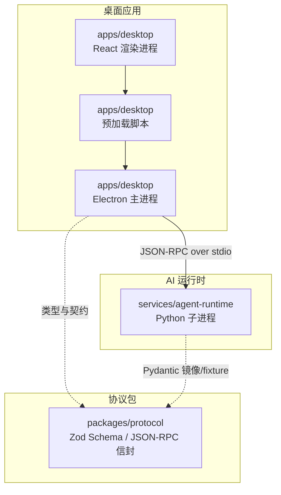
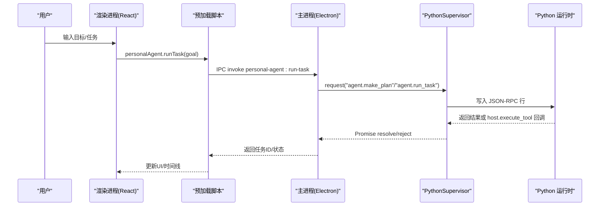
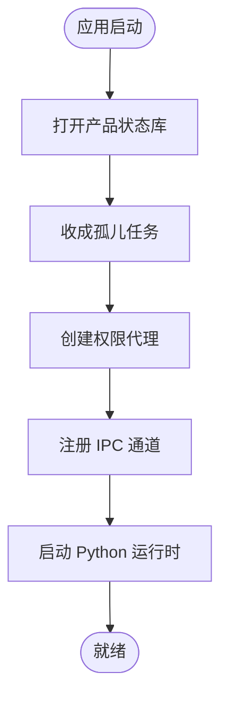
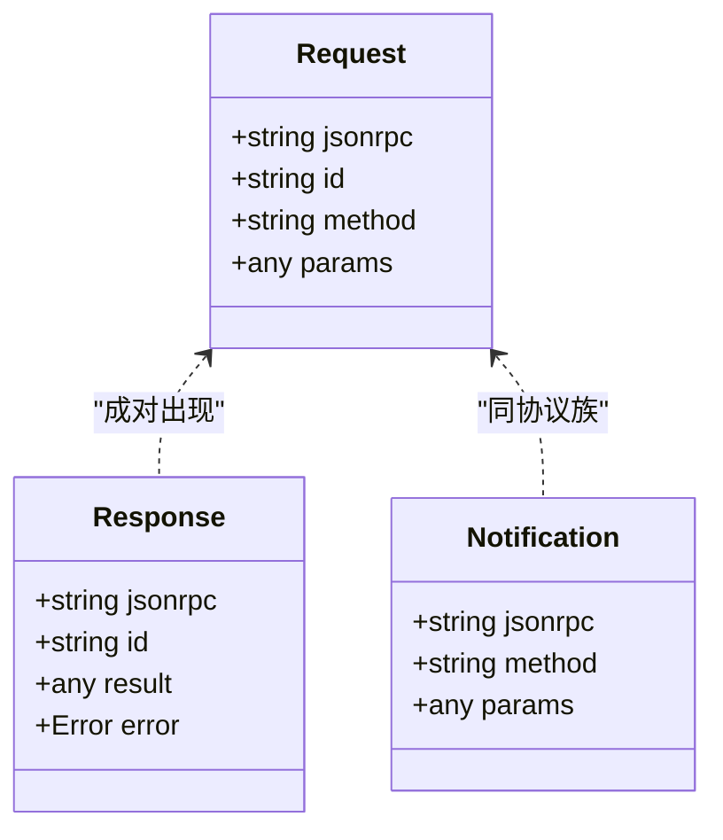
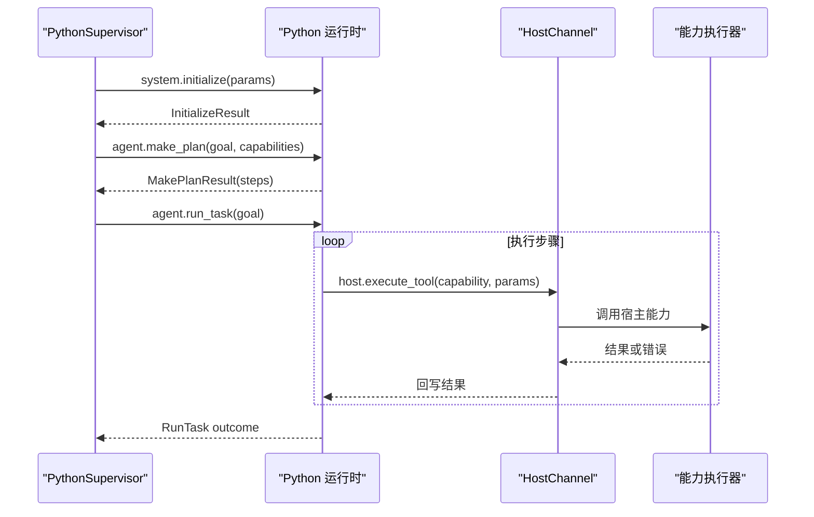
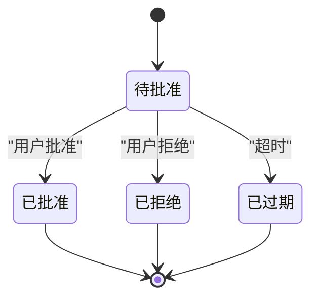

# 项目概述

<cite>
**本文引用的文件**
- [package.json](file://package.json)
- [pnpm-workspace.yaml](file://pnpm-workspace.yaml)
- [apps/desktop/package.json](file://apps/desktop/package.json)
- [services/agent-runtime/pyproject.toml](file://services/agent-runtime/pyproject.toml)
- [packages/protocol/package.json](file://packages/protocol/package.json)
- [AGENTS.md](file://AGENTS.md)
- [apps/desktop/src/main/index.ts](file://apps/desktop/src/main/index.ts)
- [apps/desktop/src/preload/index.ts](file://apps/desktop/src/preload/index.ts)
- [apps/desktop/src/renderer/src/App.tsx](file://apps/desktop/src/renderer/src/App.tsx)
- [apps/desktop/src/shared/domain.ts](file://apps/desktop/src/shared/domain.ts)
- [apps/desktop/src/main/runtime/python-supervisor.ts](file://apps/desktop/src/main/runtime/python-supervisor.ts)
- [services/agent-runtime/src/personal_agent/runtime.py](file://services/agent-runtime/src/personal_agent/runtime.py)
- [services/agent-runtime/src/personal_agent/__main__.py](file://services/agent-runtime/src/personal_agent/__main__.py)
- [packages/protocol/schemas/envelope.ts](file://packages/protocol/schemas/envelope.ts)
- [packages/protocol/schemas/index.ts](file://packages/protocol/schemas/index.ts)
</cite>

## 目录
1. [简介](#简介)
2. [项目结构](#项目结构)
3. [核心组件](#核心组件)
4. [架构总览](#架构总览)
5. [详细组件分析](#详细组件分析)
6. [依赖关系分析](#依赖关系分析)
7. [性能与可靠性](#性能与可靠性)
8. [故障排查指南](#故障排查指南)
9. [结论](#结论)
10. [附录：快速开始](#附录快速开始)

## 简介
Personal Agent 是一个基于 Electron + React + Python 的智能个人代理系统，目标是帮助用户以自然语言完成日常任务自动化。它通过桌面应用提供交互界面，通过独立的 Python AI 运行时执行计划与工具调用，并以严格的协议层保证跨进程通信的可靠与安全。项目采用 monorepo 组织，将“桌面应用”“共享协议”“AI 运行时”解耦，便于独立演进、测试与打包。

对于初学者而言，个人代理系统可以理解为“会读本地文件、会按步骤规划、会在需要时请求你授权”的助手。它把重复性、多步骤的任务（例如整理资料、生成报告、检索信息）拆解为可执行的步骤，并在涉及敏感操作时向你申请权限，从而在安全的前提下提升效率。

**章节来源**
- [AGENTS.md:1-228](file://AGENTS.md#L1-L228)

## 项目结构
仓库采用 pnpm workspace 管理的 monorepo，包含三大根目录：
- apps/desktop：Electron 桌面应用（主进程、预加载脚本、渲染进程 UI）
- packages/protocol：跨语言协议定义（Zod schema、JSON-RPC 信封、错误码等）
- services/agent-runtime：Python 实现的 AI 运行时（子进程，负责计划与执行）



**图表来源**
- [pnpm-workspace.yaml:1-13](file://pnpm-workspace.yaml#L1-L13)
- [packages/protocol/schemas/index.ts:1-8](file://packages/protocol/schemas/index.ts#L1-L8)
- [apps/desktop/src/main/index.ts:1-32](file://apps/desktop/src/main/index.ts#L1-L32)
- [services/agent-runtime/src/personal_agent/runtime.py:1-31](file://services/agent-runtime/src/personal_agent/runtime.py#L1-L31)

**章节来源**
- [pnpm-workspace.yaml:1-13](file://pnpm-workspace.yaml#L1-L13)
- [AGENTS.md:76-97](file://AGENTS.md#L76-L97)

## 核心组件
- 桌面应用（Electron + React）
  - 主进程负责窗口管理、IPC 路由、数据库访问、能力执行编排、Python 子进程生命周期管理。
  - 预加载脚本仅暴露最小 API 给渲染进程，确保上下文隔离。
  - 渲染进程提供对话、任务历史、权限审批、诊断面板等界面。
- 协议层（packages/protocol）
  - 使用 Zod 定义 JSON-RPC 信封、方法名规范、错误码等；作为单一事实来源，供 TS 侧消费。
  - Python 侧通过 Pydantic 模型镜像协议，并共享 fixture 进行交叉验证，避免契约漂移。
- AI 运行时（Python）
  - 通过标准输入输出流接收 JSON-RPC 消息，解析后分派到 initialize/make_plan/run_task 等方法。
  - 支持脚本化模型（ScriptedModel），在未配置真实模型时可用于演示与测试。
  - 通过 HostChannel 反向调用宿主（Electron 主进程）执行文件系统、文档提取等能力。

**章节来源**
- [apps/desktop/src/main/index.ts:1-32](file://apps/desktop/src/main/index.ts#L1-L32)
- [apps/desktop/src/preload/index.ts:1-51](file://apps/desktop/src/preload/index.ts#L1-L51)
- [apps/desktop/src/renderer/src/App.tsx:1-50](file://apps/desktop/src/renderer/src/App.tsx#L1-L50)
- [packages/protocol/schemas/envelope.ts:1-41](file://packages/protocol/schemas/envelope.ts#L1-L41)
- [services/agent-runtime/src/personal_agent/runtime.py:69-184](file://services/agent-runtime/src/personal_agent/runtime.py#L69-L184)

## 架构总览
整体采用“三层职责分离”的设计：
- 桌面应用层：用户交互、状态展示、权限审批、持久化（SQLite）、能力编排。
- 协议层：跨进程通信契约，确保 TypeScript 与 Python 两端数据形状一致。
- AI 运行时层：计划生成与任务执行，按需调用宿主能力，保持无状态会话。



**图表来源**
- [apps/desktop/src/renderer/src/App.tsx:164-196](file://apps/desktop/src/renderer/src/App.tsx#L164-L196)
- [apps/desktop/src/preload/index.ts:23-27](file://apps/desktop/src/preload/index.ts#L23-L27)
- [apps/desktop/src/main/index.ts:254-277](file://apps/desktop/src/main/index.ts#L254-L277)
- [apps/desktop/src/main/runtime/python-supervisor.ts:129-153](file://apps/desktop/src/main/runtime/python-supervisor.ts#L129-L153)
- [services/agent-runtime/src/personal_agent/runtime.py:69-184](file://services/agent-runtime/src/personal_agent/runtime.py#L69-L184)

## 详细组件分析

### 桌面应用（Electron + React）
- 主进程入口负责：
  - 创建窗口、启用沙箱与上下文隔离。
  - 启动产品状态库、权限代理、任务收尸（恢复孤儿任务）。
  - 注册 IPC 通道：运行态查询、PDF 索引、任务列表、运行任务、时间线、权限响应与列表。
  - 启动 Python 运行时并在退出时优雅关闭。
- 预加载脚本仅暴露必要 API，唯一的主→渲染推送通道是权限通知。
- 渲染进程 App 组件负责：
  - 初始化加载任务列表、已索引 PDF 数量、运行时状态。
  - 订阅权限通知，处理用户批准/拒绝。
  - 发送新任务、查看时间线、导出 Markdown、扫描 PDF 索引。



**图表来源**
- [apps/desktop/src/main/index.ts:95-134](file://apps/desktop/src/main/index.ts#L95-L134)
- [apps/desktop/src/main/index.ts:326-348](file://apps/desktop/src/main/index.ts#L326-L348)

**章节来源**
- [apps/desktop/src/main/index.ts:56-90](file://apps/desktop/src/main/index.ts#L56-L90)
- [apps/desktop/src/main/index.ts:134-324](file://apps/desktop/src/main/index.ts#L134-L324)
- [apps/desktop/src/preload/index.ts:1-51](file://apps/desktop/src/preload/index.ts#L1-L51)
- [apps/desktop/src/renderer/src/App.tsx:43-125](file://apps/desktop/src/renderer/src/App.tsx#L43-L125)
- [apps/desktop/src/renderer/src/App.tsx:164-224](file://apps/desktop/src/renderer/src/App.tsx#L164-L224)

### 协议层（packages/protocol）
- 定义 JSON-RPC 信封（Request/Response/Notification）、方法名模式、错误码等。
- 作为 TS 侧的唯一事实来源；Python 侧通过 Pydantic 模型镜像，并使用共享 fixture 做双向校验，防止契约漂移。
- 新增字段必须同步更新 Zod schema、Pydantic 模型与 fixture，并通过双端测试覆盖。



**图表来源**
- [packages/protocol/schemas/envelope.ts:1-41](file://packages/protocol/schemas/envelope.ts#L1-L41)

**章节来源**
- [packages/protocol/schemas/index.ts:1-8](file://packages/protocol/schemas/index.ts#L1-L8)
- [AGENTS.md:26-47](file://AGENTS.md#L26-L47)

### AI 运行时（Python）
- 通过 stdin/stdout 逐行读取 JSON-RPC 消息，解析后分派到对应处理器。
- 支持 initialize、make_plan、run_task 等方法；未配置模型时明确返回错误码，避免空跑。
- 使用 ContextManager 与 AgentEngine 组合，每次 run_task 构造新上下文，避免跨任务状态污染。
- 通过 HostChannel 反向请求宿主执行能力（如文件系统、文档提取），由 Electron 主进程实现具体逻辑。



**图表来源**
- [services/agent-runtime/src/personal_agent/runtime.py:69-184](file://services/agent-runtime/src/personal_agent/runtime.py#L69-L184)
- [apps/desktop/src/main/runtime/python-supervisor.ts:258-314](file://apps/desktop/src/main/runtime/python-supervisor.ts#L258-L314)

**章节来源**
- [services/agent-runtime/src/personal_agent/runtime.py:187-257](file://services/agent-runtime/src/personal_agent/runtime.py#L187-L257)
- [services/agent-runtime/src/personal_agent/__main__.py:1-5](file://services/agent-runtime/src/personal_agent/__main__.py#L1-L5)

### 领域模型与权限
- 任务状态、计划、事件、权限记录等均在 shared/domain.ts 中统一定义，保证类型与数据库约束一致。
- 权限流程：运行时发起 host.execute_tool → 主进程拦截 → 弹出权限对话框 → 用户决定 → 主进程写入决策并继续执行。



**图表来源**
- [apps/desktop/src/shared/domain.ts:52-95](file://apps/desktop/src/shared/domain.ts#L52-L95)

**章节来源**
- [apps/desktop/src/shared/domain.ts:1-158](file://apps/desktop/src/shared/domain.ts#L1-L158)

## 依赖关系分析
- Monorepo 依赖方向严格单向：apps/desktop 与 services/agent-runtime 均依赖 packages/protocol，但彼此不直接 import。
- 协议包仅依赖 zod，保持纯契约属性。
- 桌面应用依赖 better-sqlite3、pdfjs-dist、radix-ui、tailwind 等构建 UI 与本地能力。
- Python 运行时依赖 openai、pydantic，当前阶段使用 ScriptedModel 进行演示与测试。

```mermaid
graph LR
Desktop["apps/desktop"] --> Protocol["@personal-agent/protocol"]
Runtime["services/agent-runtime"] --> Protocol
Desktop -.-> Runtime : "JSON-RPC over stdio"
```

**图表来源**
- [AGENTS.md:76-97](file://AGENTS.md#L76-L97)
- [packages/protocol/package.json:1-16](file://packages/protocol/package.json#L1-L16)
- [apps/desktop/package.json:22-36](file://apps/desktop/package.json#L22-L36)
- [services/agent-runtime/pyproject.toml:1-27](file://services/agent-runtime/pyproject.toml#L1-L27)

**章节来源**
- [AGENTS.md:76-97](file://AGENTS.md#L76-L97)
- [package.json:1-37](file://package.json#L1-L37)

## 性能与可靠性
- 子进程通信：PythonSupervisor 维护 pending 请求映射、超时与取消信号，崩溃时统一失败所有待处理请求，避免悬挂。
- 握手与能力清单：initialize 阶段传递能力描述，运行时据此限制可见能力，减少不必要调用。
- 资源清理：应用退出时先停止运行时，再释放权限代理、数据库连接，确保有序关闭。
- 协议健壮性：JSON-RPC 信封强制校验 result/error 互斥，方法名遵循命名规范，降低误用风险。

**章节来源**
- [apps/desktop/src/main/runtime/python-supervisor.ts:96-126](file://apps/desktop/src/main/runtime/python-supervisor.ts#L96-L126)
- [apps/desktop/src/main/runtime/python-supervisor.ts:155-200](file://apps/desktop/src/main/runtime/python-supervisor.ts#L155-L200)
- [apps/desktop/src/main/runtime/python-supervisor.ts:332-354](file://apps/desktop/src/main/runtime/python-supervisor.ts#L332-L354)
- [apps/desktop/src/main/index.ts:338-348](file://apps/desktop/src/main/index.ts#L338-L348)
- [packages/protocol/schemas/envelope.ts:12-34](file://packages/protocol/schemas/envelope.ts#L12-L34)

## 故障排查指南
- 运行时未配置模型：当未设置脚本路径时，Python 运行时会返回特定错误码，表示无法执行任务。检查环境变量与脚本可用性。
- 握手失败：initialize 参数不符合契约或版本不匹配会导致握手失败。核对协议版本与能力清单。
- 子进程崩溃：supervisor 会记录崩溃原因并拒绝后续请求。查看 stderr 日志定位问题。
- 权限通道不可用：若 product-state 库未打开，权限相关 IPC 将返回失败。确认启动流程是否成功初始化。
- 数据库失败：任务列表、时间线、权限列表等可能因数据库异常返回失败码。检查 SQLite 文件与迁移。

**章节来源**
- [services/agent-runtime/src/personal_agent/runtime.py:158-184](file://services/agent-runtime/src/personal_agent/runtime.py#L158-L184)
- [apps/desktop/src/main/runtime/python-supervisor.ts:129-153](file://apps/desktop/src/main/runtime/python-supervisor.ts#L129-L153)
- [apps/desktop/src/main/runtime/python-supervisor.ts:341-345](file://apps/desktop/src/main/runtime/python-supervisor.ts#L341-L345)
- [apps/desktop/src/main/index.ts:298-323](file://apps/desktop/src/main/index.ts#L298-L323)
- [apps/desktop/src/main/index.ts:232-253](file://apps/desktop/src/main/index.ts#L232-L253)

## 结论
Personal Agent 通过清晰的三层架构与严格的协议约束，实现了桌面交互、AI 执行与宿主能力的解耦协作。monorepo 结构使前端、协议与后端各自独立演进，同时通过共享契约保障一致性。该设计既适合初学者理解个人代理的工作方式，也为后续扩展真实模型、更多能力与更复杂工作流奠定了坚实基础。

## 附录：快速开始
- 环境要求
  - Node.js 与 pnpm（工作区管理器）
  - Python 3.13+（用于 AI 运行时）
  - 可选：OpenAI 或其他模型接入（当前默认使用脚本化模型）
- 安装步骤
  - 在工作区根目录安装依赖并启动开发模式：
    - 使用根 package.json 中的脚本启动桌面应用开发模式
    - Python 运行时通过 uv 管理依赖与测试
- 基本使用方法
  - 启动应用后，可在渲染进程中输入任务目标，系统将尝试生成计划并执行。
  - 遇到需要权限的操作时，会在界面弹出权限对话框，你可选择批准或拒绝。
  - 通过侧边栏查看任务历史与时间线，也可导出 Markdown 以便归档。

**章节来源**
- [package.json:6-23](file://package.json#L6-L23)
- [services/agent-runtime/pyproject.toml:1-27](file://services/agent-runtime/pyproject.toml#L1-L27)
- [apps/desktop/package.json:9-22](file://apps/desktop/package.json#L9-L22)
- [apps/desktop/src/renderer/src/App.tsx:164-224](file://apps/desktop/src/renderer/src/App.tsx#L164-L224)