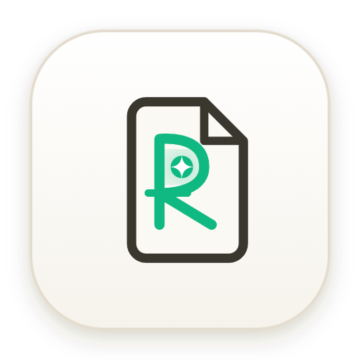
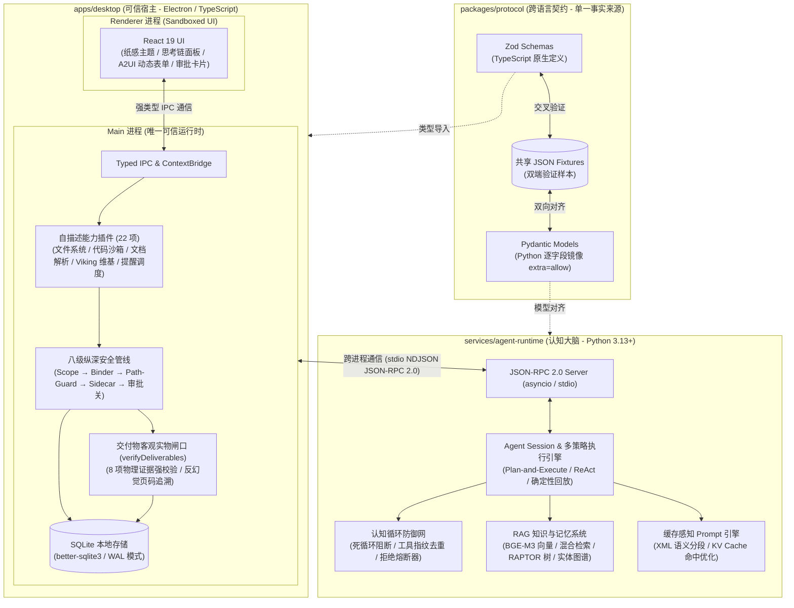
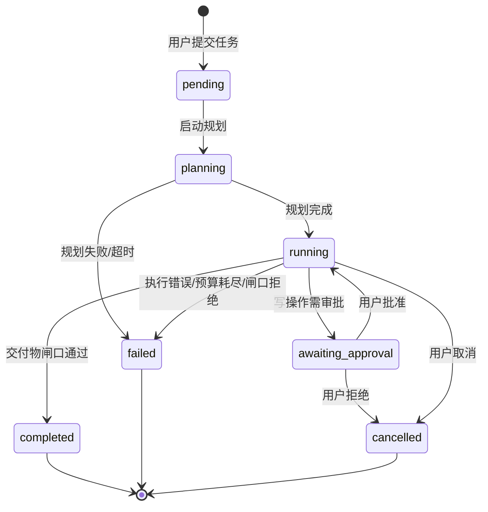

<p align="center">
  
</p>

<h1 align="center">PersonalAgent</h1>

<p align="center">
  <strong>一个具备纵深安全架构的本地优先 AI 个人助理</strong><br/>
  <sub>Electron · TypeScript · Python · LLM Agentic Loop · RAG · 跨语言协议</sub>
</p>

<p align="center">
  
  <a href="https://github.com/Azusa010/personal-agent/actions/workflows/ci.yml"></a>
  
  
  
  
  
  
  
</p>

---

## 项目概述

PersonalAgent 是一款运行在 Windows 桌面端的 **本地优先 AI 个人助理**。它通过自然语言交互驱动一个完整的 Agent 工作流——规划、执行、验证、总结——在用户授权的文件系统范围内自主完成文档处理、文件管理、代码执行、知识检索、日程提醒等任务。

**核心设计：Electron（TypeScript）是唯一可信运行时。** 所有路径校验、权限判定与副作用执行均在 Electron 主进程完成；Python 仅负责 Agent Loop 与模型交互，两者以 stdio NDJSON JSON-RPC 通信。这意味着即使 LLM 产生恶意工具调用，也无法突破 TypeScript 侧的安全边界。

### 亮点

- 🏗️ **双语言 Monorepo 架构** — TypeScript + Python 跨语言协作，Zod ↔ Pydantic 双向镜像协议
- 🛡️ **八层纵深安全管线** — Scope → Retriever → Context → Alignment → Binder/PathGuard → Sidecar → Permission → Idempotency
- 🧠 **RAG 知识系统** — 向量嵌入 + 混合检索 + RAPTOR 树状聚合 + 自动记忆提取
- 📊 **评测框架** — 集成 GAIA、τ-bench 标准基准 + 自建 20 条端到端 eval suite
- 🔌 **自描述插件架构** — 新增能力 = 添加一个文件，零处分发逻辑修改
- 🎨 **Agent-to-UI 渲染** — Agent 可动态生成交互式 UI 组件推送到前端

---

## 快速开始

### 前置要求

| 工具    | 版本       |
| ------- | ---------- |
| Node.js | ≥ 22.13    |
| pnpm    | ^11.17     |
| Python  | ≥ 3.13     |
| uv      | 最新稳定版 |

### 从源码运行

```powershell
# 安装依赖
pnpm install
uv sync --project services/agent-runtime --locked

# 开发模式（热重载）
pnpm --dir apps/desktop dev

# 全量验证（提交前必跑）
pnpm verify
```

### 打包

```powershell
pnpm package:dir   # 免安装版 → apps/desktop/dist/win-unpacked/PersonalAgent.exe
pnpm package:win   # NSIS 安装包
```

### 演示

```powershell
powershell -File scripts/demo/start-demo.ps1   # 备好素材并启动
```

完整演示步骤见 [docs/DEMO.md](docs/DEMO.md)。

---

## 项目结构

```
personal-agent/
├── apps/desktop/                    # Electron 桌面应用
│   ├── src/main/                    # 主进程
│   │   ├── capabilities/            # 能力系统
│   │   │   ├── plugins/             # 22 个自描述能力插件
│   │   │   ├── path-guard.ts        # 6 类路径边界校验
│   │   │   ├── scope.ts             # 动态权限边界
│   │   │   ├── retriever.ts         # 能力检索
│   │   │   └── executor.ts          # 能力执行器
│   │   ├── policy/                  # 安全策略（参数绑定、审批）
│   │   ├── product-state/           # 持久化层（SQLite + migrations）
│   │   ├── runtime/                 # Python 子进程生命周期管理
│   │   ├── scheduler/               # 持久化提醒调度器
│   │   ├── viking/                  # Viking 维基存储引擎
│   │   ├── verification/            # 执行结果取证与验证
│   │   ├── permission/              # 用户审批管理
│   │   └── tasks/                   # 任务状态机 + 会话历史
│   ├── src/renderer/                # 渲染进程（React SPA）
│   │   ├── components/              # UI 组件
│   │   │   ├── a2ui/                # Agent-to-UI 动态渲染组件
│   │   │   └── ui/                  # 基础 UI 组件
│   │   └── thought-chain/           # 思维链可视化
│   ├── src/preload/                 # 安全桥接（contextIsolation）
│   └── tests/                       # TS 测试（单元 + E2E + Eval）
├── services/agent-runtime/          # Python Agent 运行时
│   ├── src/personal_agent/
│   │   ├── conversation/            # 对话管理
│   │   │   ├── compression/         # 上下文压缩
│   │   │   ├── context/             # 上下文组装
│   │   │   ├── instructions/        # 动态系统指令
│   │   │   ├── loop/                # Agent 循环
│   │   │   ├── model/               # LLM 交互
│   │   │   ├── sidecar/             # 旁路处理
│   │   │   ├── status/              # 状态管理
│   │   │   └── verification/        # 摘要验证（反编造）
│   │   ├── knowledge/               # RAG 知识检索系统
│   │   ├── workflow/                # 工作流引擎
│   │   ├── eval/                    # 评测框架
│   │   └── protocol/                # Pydantic 协议镜像
│   └── tests/                       # Python 测试
└── packages/protocol/               # 跨语言协议契约
    ├── schemas/                     # Zod schema 定义
    └── fixtures/                    # JSON 交叉验证样本
```

---

## 系统架构

<p align="center">
  
</p>

<p align="center">
  <sub>🌐 由 <a href="https://github.com/tt-a1i/archify">Archify</a> 自动化验证构建 · 支持暗黑/浅色自适应 · 本地可打开 <a href="docs/architecture.html"><code>docs/architecture.html</code></a> 进行交互式全景探索与节点追踪</sub>
</p>

<details>
<summary><b>查看 Mermaid 源码版本流程图</b></summary>



</details>

### Monorepo 三包结构

| 包                       | 语言                  | 职责                                            |
| ------------------------ | --------------------- | ----------------------------------------------- |
| `apps/desktop`           | TypeScript (Electron) | 可信运行时：安全管线、能力执行、持久化、UI      |
| `services/agent-runtime` | Python 3.13+          | Agent 循环：规划、工具编排、摘要验证、RAG、评测 |
| `packages/protocol`      | TypeScript (Zod)      | 跨语言契约：schema 定义、fixture 交叉验证       |

**依赖方向严格单向：** `apps/desktop` → `packages/protocol` ← `services/agent-runtime`，跨进程通信只走 stdio NDJSON JSON-RPC，禁止直接代码引用。

---

## 能力插件系统

所有 Agent 能力以**自描述插件**（`CapabilityPlugin`）实现，每个插件自包含 schema 定义、参数绑定、风险等级、幂等策略与执行体。新增能力 = 添加一个文件，无需修改任何分发逻辑。

### 当前 22 项内建能力

| 类别           | 能力                                                | 说明                                          |
| -------------- | --------------------------------------------------- | --------------------------------------------- |
| **文件系统**   | `fs.list_directory` `fs.create_directory` `fs.move` | 目录浏览、创建、移动/重命名                   |
| **文件读写**   | `file_read` `file_write` `file_edit` `file_search`  | 全文件 CRUD + 结构化搜索                      |
| **文档处理**   | `document.extract_pdf` `read_document`              | PDF 文本提取、多格式文档阅读                  |
| **代码执行**   | `code_interpreter` `terminal_execute`               | Python 沙箱代码执行、终端命令行（会话级 cwd） |
| **知识检索**   | `knowledge_search` `user_memory_search`             | 向量语义检索 + 关键词全文检索 + 用户记忆      |
| **维基存储**   | `viking_read_l0/l1/l2` `viking_write_l2`            | 三层维基抽象（摘要/概览/全文）读写            |
| **技能系统**   | `skill_search` `skill_read`                         | 内建 + 用户自定义技能检索与加载               |
| **联网**       | `web_search`                                        | Tavily 实时网页检索                           |
| **计划与完成** | `planning.make_plan` `task.complete`                | 结构化计划生成、任务终结信号                  |
| **日程通知**   | `scheduler.create` `notification.send`              | 持久化提醒（重启后补发）、桌面通知            |
| **UI 渲染**    | `a2ui_render`                                       | Agent 动态生成交互式前端组件（A2UI 协议）     |

---

## 纵深安全架构

每次工具调用必须经以下八层逐层校验，任一层拒绝即终止执行：

```
用户请求 → Scope → Retriever → Context → Alignment → Binder+PathGuard → Sidecar → Permission → Idempotency → 执行
             ①        ②          ③          ④              ⑤                ⑥          ⑦            ⑧
```

| 层                        | 模块                                    | 职责                                                                                                                               |
| ------------------------- | --------------------------------------- | ---------------------------------------------------------------------------------------------------------------------------------- |
| ① **Scope**               | `capabilities/scope.ts`                 | 动态派生任务级权限边界，从注册插件自动生成（非静态白名单）                                                                         |
| ② **Retriever**           | `capabilities/retriever.ts`             | 校验能力已注册且在当前 Scope 内                                                                                                    |
| ③ **Task Context**        | `task-context.ts`                       | 确保存在正在运行的有效任务上下文                                                                                                   |
| ④ **Alignment**           | `alignment.ts`                          | 剧本模式下核对步骤顺序；日常模式按 Scope 放宽                                                                                      |
| ⑤ **Binder + Path-Guard** | `argument-binders.ts` + `path-guard.ts` | Zod `safeParse` 参数校验 + 6 类路径安全防御（symlink/junction 逃逸、UNC 路径、Windows 保留设备名、控制字符、盘符逃逸、大小写敏感） |
| ⑥ **Sidecar Safety**      | `sidecar.ts`                            | 正则 + 轻量模型审查 Prompt 注入、凭证窃取、危险命令（`rm -rf /`、反弹 shell 等），低置信度 Fail-Closed                             |
| ⑦ **Permission Gate**     | `permission-broker.ts`                  | 写操作挂起等待用户审批，批准后执行**6 步 Anti-TOCTOU 验证**（权限记录 + 状态 + TTL + callId + 参数哈希 + realpath 复查）           |
| ⑧ **Idempotency**         | `idempotency.ts`                        | 执行前登记 `attempting`，完成后翻为 `succeeded`/`failed`，同参数重试直接返回缓存                                                   |

**设计要点：**

- 安全校验函数入参一律用 `string` 类型，拒绝枚举或 branded type——调用方传入的值不可信
- `resolveWithinRoot` 只做字符串运算；涉及 symlink/junction 必须再经 `resolveWithinRootReal` 做 realpath 二次校验
- Permission Gate 在用户批准后、执行前做**二次 realpath 检查**：防止审批到执行之间底层文件被替换为恶意符号链接
- 模型的完成声明（`task_completed`）不直接翻转状态——主进程独立取证后才决定终态（Fail-Closed）

---

## RAG 知识检索系统

Python 侧实现了一套完整的 RAG（Retrieval-Augmented Generation）管线：

| 模块                   | 职责                             |
| ---------------------- | -------------------------------- |
| `chunker.py`           | 文档分块（支持语义边界感知切分） |
| `embedder.py`          | 向量嵌入（FlagEmbedding）        |
| `indexer.py`           | 向量索引构建与更新（pgvector）   |
| `retriever.py`         | 基础向量检索                     |
| `reranker.py`          | 二阶段重排序                     |
| `raptor.py`            | RAPTOR 树状递归聚合摘要          |
| `agentic_search.py`    | Agent 式多步检索策略             |
| `retrieval_router.py`  | 检索路由（选择最优检索策略）     |
| `cascader.py`          | 级联检索（多来源融合）           |
| `contextualizer.py`    | 上下文化处理                     |
| `memory_extractor.py`  | 用户交互中自动提取长期记忆       |
| `memory_repository.py` | 记忆持久化与检索                 |
| `consolidator.py`      | 知识去重与整合                   |
| `relation_graph.py`    | 知识实体关系图谱                 |
| `source_tagger.py`     | 来源溯源标注                     |

### Viking 维基存储

三层抽象的本地维基系统（L0 摘要 → L1 概览 → L2 全文），带路径隔离的沙箱校验，Agent 可读可写。

---

## Agent 执行流程



### 多策略执行引擎

| 策略                       | 场景                 | 特性                                      |
| -------------------------- | -------------------- | ----------------------------------------- |
| **ClassicStrategy**        | 确定性剧本 / CI      | 按预设步骤序列回放                        |
| **ReActStrategy**          | 无预设计划的自主探索 | 动态推理—行动—观察循环                    |
| **PlanAndExecuteStrategy** | 层次规划执行         | 先规划后逐步推进，支持最多 2 次动态重规划 |

### ReAct 循环防御机制

Agent 循环内置多层健壮性防护，防止失控：

- **QueryLoopDetector** — 阻断知识检索中参数无进展的无限查询死循环
- **ToolFingerprintDetector** — 计算工具调用指纹，发现重复调用相同参数时及时阻断
- **DeathSpiralProtector** — 探测连续失败的死锁螺旋
- **StreamWatchdog** — 监控模型流式输出卡顿超时
- **RejectionCircuitBreaker** — 用户反复拒绝授权时熔断执行
- **Budget Guard** — Token 用量与工具调用次数双重上限

### 交付物实物闸口

Agent 发出的 `task_completed` **仅为声明**，任务状态仍保持 `running`。主进程独立执行表驱动的 8 项物理证据验证：

1. 摘要页码引用真实存在于已读 PDF 页码集合
2. 目标目录已物理创建
3. 目标文件已物理移入且源目录无残留
4. 未授权文件 100% 保持不动
5. 定时提醒已注册且参数正确
6. 所有写操作均有合法批准记录与参数哈希
7. 时间线事件连续完整
8. 工具预算合规

全部通过才翻转为 `completed`；任一失败标记为 `failed`（Fail-Closed）。

### 缓存感知分段式系统提示词

采用 XML 结构化分段（`<preamble>`、`<tools>`、`<rules>`、`<skills>`、`<environment>`），静态指令置顶、动态上下文置底，最大化 LLM Prefix Caching 命中率，仅在环境变化时输出增量 diff。

### 会话管理

- 多轮对话历史窗口化（条数 + 字符双预算），保证 user 消息开头
- 对话上下文压缩（`distiller.py`），保留不变量
- 系统指令动态注入，根据任务类型与可用能力定制

---

## 跨语言协议同步

跨语言契约走**三步同步**，Zod schema → Pydantic 镜像 → JSON Fixture 交叉验证：

```
packages/protocol/schemas/*.ts          ← 单一事实来源 (Zod)
services/agent-runtime/.../models.py    ← 逐字段镜像 (Pydantic, extra="allow")
packages/protocol/fixtures/*.json       ← 共享样本，双端各自 parse 验证一致性
```

覆盖的协议域：`envelope`、`filesystem`、`host`、`document`、`agent`、`systems`、`scheduler`、`errors`、`viking`、`knowledge`、`code-interpreter`、`a2ui` 等。

---

## 评测体系

### 内建 Eval Suite

| 评测集               | 说明                                                                                          |
| -------------------- | --------------------------------------------------------------------------------------------- |
| **Scripted 20-Case** | 确定性剧本：真 Python 子进程 + 真 SQLite + 真安全管线，每条 case 完整走完 Plan→Execute→Verify |
| **GAIA Level 1/2**   | 集成 [GAIA](https://arxiv.org/abs/2311.12983) 基准：多模态通用助理评测                        |
| **τ-bench**          | 集成 τ-bench 基准：工具增强型 Agent 评测                                                      |
| **Knowledge Eval**   | 知识检索质量评测（向量检索 + 重排序准确率）                                                   |
| **Memory Eval**      | 用户记忆提取与召回评测                                                                        |
| **Live Eval**        | 真模型评测（需 API Key），不进 CI                                                             |

### 端到端测试

| 测试                   | 覆盖范围                                                        |
| ---------------------- | --------------------------------------------------------------- |
| **Golden Path**        | 完整 20 轮：真 Python + 真审批 + 真文件操作 + 真提醒 + 通知到点 |
| **Failure Regression** | 坏 PDF / 拒绝审批 / 进程被杀 / 计划外调用 / 预算耗尽 / 通知失败 |
| **Packaged Smoke**     | PyInstaller 冻结产物冒烟测试                                    |

### 指标体系

- Pass@k / Pass^k 评估
- Per-type 分类指标
- Stateful verdict（文件系统终态校验）
- 配对报告比较（`pnpm eval:compare`）

---

## 工程实践

### 验证门禁与测试状态 — `pnpm verify`

所有改动提交前必须通过一条命令跑完全部门禁（三端静态检查 + 2,750+ 自动化测试）：

```
pnpm verify = typecheck + lint:ts + lint:py + test:pack + test:ts + test:py
```

| 门禁项             | 工具 / 框架             | 测试文件 | 用例数            | 状态             | 覆盖范畴                                                                                     |
| ------------------ | ----------------------- | -------- | ----------------- | ---------------- | -------------------------------------------------------------------------------------------- |
| **类型检查**       | TypeScript (node + web) | —        | —                 | ✅ Passing       | 双 tsconfig 全量严格类型检查                                                                 |
| **TS 规范**        | ESLint + Prettier       | —        | —                 | ✅ Passing       | 代码风格与质量门禁                                                                           |
| **Python 规范**    | Ruff                    | —        | —                 | ✅ Passing       | Python 代码风格与 Lint 规则                                                                  |
| **Protocol 契约**  | Vitest                  | 11 个    | 296 Passed        | ✅ 100%          | 跨语言协议 Schema、双向契约与 Fixtures 交叉验证                                              |
| **Desktop 桌面端** | Vitest                  | 117 个   | 1,571 Passed      | ✅ 100%          | 单元测试、八级安全管线、Path-Guard、SQLite 状态机、Golden Path E2E、失败回归集、GAIA/τ-bench |
| **Agent 运行时**   | Pytest                  | 79 个    | 899 Passed        | ✅ 100%          | Agent 认知循环、多策略规划引擎、RAG 向量检索、RAPTOR 树、反幻觉摘要验证、轨迹防御网          |
| **全量门禁汇总**   | **综合门禁**            | **207+** | **2,766+ Passed** | **✅ All Green** | **全栈类型安全、多语言自动化测试全绿通过**                                                   |

### 代码质量

- **死代码检测**：Knip（TS 生产入口扫描） + AST 深度探测未挂载 JSX 组件 + Vulture（Python）
- **孤岛体检**：`pnpm check:islands` 全栈扫描，`--strict` 模式用于发版门禁
- **动态 Schema 生成**：Python 侧 `tool_schema_generator.py` 从能力插件定义动态反射生成 OpenAI Tool Schemas，禁止手写冗余字典

### 打包与分发

```
pnpm package:py   → PyInstaller 冻结 Python runtime (~33 MB)
pnpm package:dir  → electron-builder --dir（免安装版）
pnpm package:win  → NSIS 安装包
```

运行时位置解析：`打包态（随包冻结产物）` > `开发态（仓库 .venv）` > `环境变量覆盖`，找不到时落 `crashed` 并给出可读原因，不静默降级。

---

## 技术栈总览

| 层                 | 技术                                                                    |
| ------------------ | ----------------------------------------------------------------------- |
| **桌面框架**       | Electron 39 + electron-vite                                             |
| **前端**           | React 19、TanStack Query v5、Radix UI、Tailwind CSS 4、Lucide Icons     |
| **后端（主进程）** | Node.js、better-sqlite3 (SQLite)、Zod 4                                 |
| **Agent 运行时**   | Python 3.13+、OpenAI SDK、Pydantic v2、asyncio                          |
| **RAG**            | FlagEmbedding、pgvector、RAPTOR                                         |
| **文档处理**       | pypdf、pdfjs-dist                                                       |
| **搜索**           | Tavily API                                                              |
| **Token 计数**     | tiktoken                                                                |
| **构建**           | pnpm workspace、uv、PyInstaller、electron-builder                       |
| **测试**           | Vitest、Pytest、GAIA、τ-bench                                           |
| **代码质量**       | ESLint、Prettier、Ruff、Knip、Vulture                                   |
| **IPC**            | stdio NDJSON JSON-RPC（跨进程）、Electron IPC + contextBridge（跨渲染） |

---

## 环境变量

| 变量                           | 作用                                             |
| ------------------------------ | ------------------------------------------------ |
| `PERSONAL_AGENT_DOWNLOADS_DIR` | 授权根的实际路径，所有工具路径校验以它为界       |
| `PERSONAL_AGENT_WORKSPACE_DIR` | 工作区根目录（终端执行等能力的工作目录）         |
| `PERSONAL_AGENT_SCRIPT`        | 确定性剧本 JSON 路径（演示与 CI 用，替代真模型） |
| `OPENAI_MODEL`                 | 真模型名称（设了就用 OpenAI Responses API）      |
| `OPENAI_API_KEY`               | API Key（仅被 openai SDK 读取，不进日志）        |
| `PERSONAL_AGENT_RUNTIME`       | 覆盖运行时命令，指向可执行文件（排障用）         |

---

## 数据存储

| 内容                      | 位置                                       |
| ------------------------- | ------------------------------------------ |
| 任务 / 事件 / 权限 / 提醒 | `%APPDATA%\PersonalAgent\product-state.db` |
| Viking 维基               | `%APPDATA%\PersonalAgent\viking/`          |
| Python 日志               | 开发模式转发到终端 stderr                  |

---

## 已知限制

- 仅支持 Windows 10/11
- PDF 限可提取文本（不做 OCR）
- 无自动更新机制

---

## 开源许可

本项目基于 [MIT 许可证](LICENSE) 开源。
